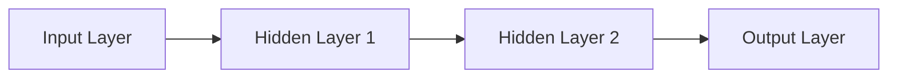
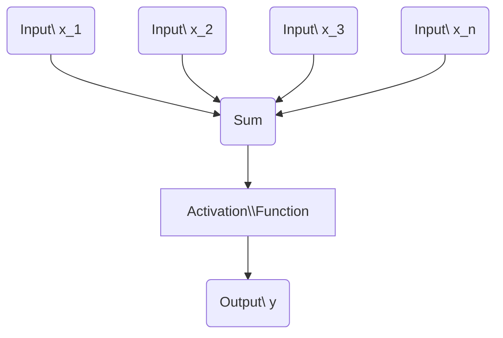
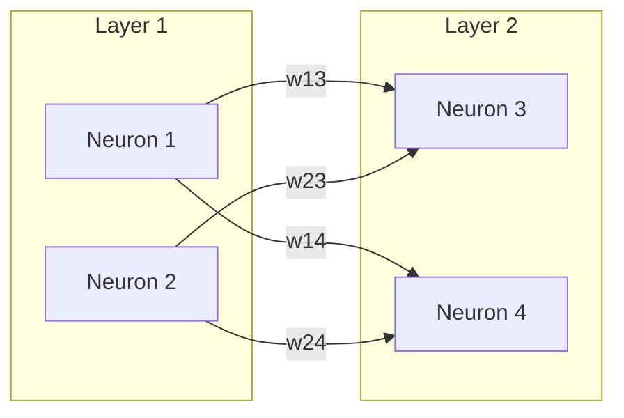
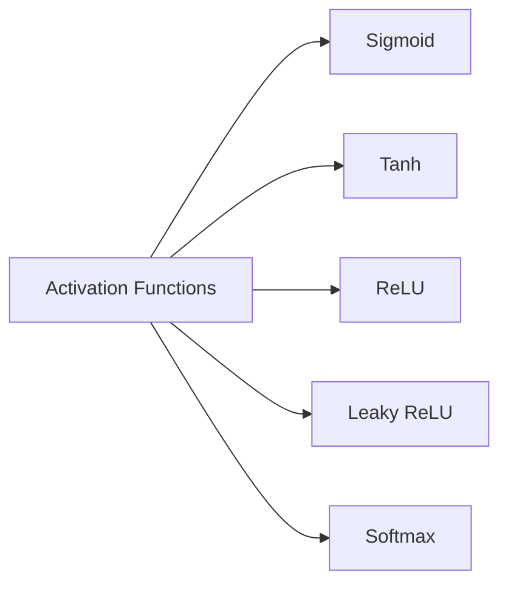
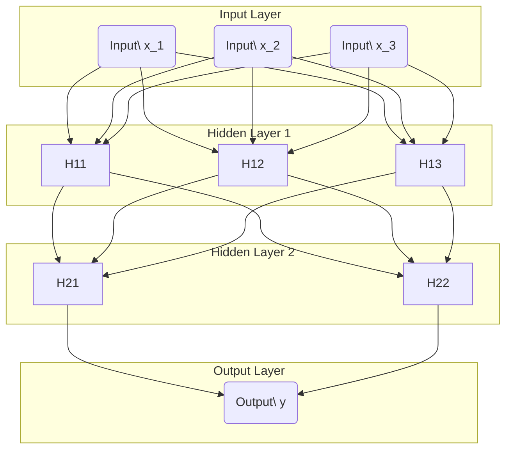
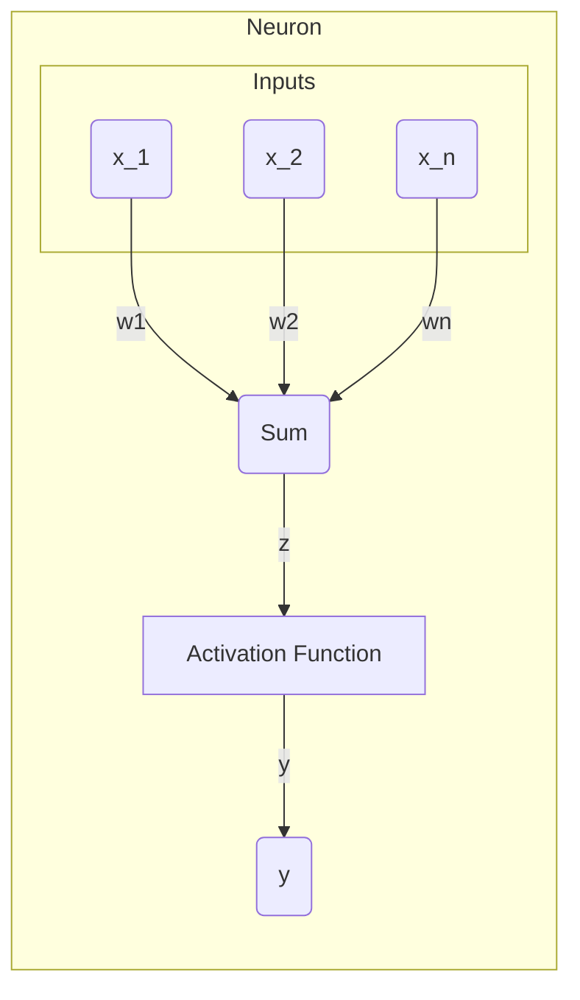

# Feedforward Neural Networks: An In-depth Exploration
> This content is dual-licensed under your choice of the following licenses:
> 1.  **MIT License:** For the code implementations in Swift and Mermaid provided in this document.
> 2.  **Creative Commons Attribution 4.0 International License (CC BY 4.0):** For all other content, including the text, explanations, and the Mermaid diagrams and illustrations.

---

Feedforward Neural Networks (FFNNs), also known as Multilayer Perceptrons (MLPs), are the foundational architecture in deep learning. They consist of layers of neurons that process data in one direction—from the input layer, through hidden layers, and finally to the output layer. They are used extensively in various industries for tasks such as classification, regression, and function approximation.

---

## **Overview of Feedforward Neural Networks**

### **Basic Structure**

An FFNN is composed of:

- **Input Layer**: Receives the initial data.
- **Hidden Layers**: Perform computations and feature extraction.
- **Output Layer**: Produces the final result.

Data flows **forward** from inputs to outputs through weighted connections, without cycles or loops.

---

## **Detailed Architecture**

Each layer consists of neurons (nodes) that apply an **activation function** to the weighted sum of inputs.

### **Neuron Structure**

- **Weighted Sum**: $z = \sum_{i=1}^{n} w_i x_i + b$
- **Activation**: $y = \phi(z)$
    - $w_i$: Weight for input $x_i$
    - $b$: Bias term
    - $\phi$: Activation function

### **Layer Connections**

- **Weights $w_{ij}$** connect neurons from one layer to the next.
- Each neuron in one layer is typically connected to every neuron in the next layer (fully connected).

---

## **Mathematical Formulation**

### **Forward Propagation**

Data passes through the network via forward propagation.

1. **Input Layer**: $\mathbf{x} = [x_1, x_2, \dots, x_n]$
2. **Hidden Layer Output**:
    - **Linear Transformation**: $\mathbf{z}^{(1)} = \mathbf{W}^{(1)} \mathbf{x} + \mathbf{b}^{(1)}$
    - **Activation**: $\mathbf{a}^{(1)} = \phi^{(1)}(\mathbf{z}^{(1)})$
3. **Output Layer Output**:
    - $\mathbf{z}^{(2)} = \mathbf{W}^{(2)} \mathbf{a}^{(1)} + \mathbf{b}^{(2)}$
    - $\mathbf{a}^{(2)} = \phi^{(2)}(\mathbf{z}^{(2)})$

**General Form** for layer $l$:
- $\mathbf{z}^{(l)} = \mathbf{W}^{(l)} \mathbf{a}^{(l-1)} + \mathbf{b}^{(l)}$
- $\mathbf{a}^{(l)} = \phi^{(l)}(\mathbf{z}^{(l)})$

### **Vectorized Implementation**

Efficient computations are performed using matrix operations.

- **Weights Matrix $\mathbf{W}^{(l)}$**: Dimensions $[n_l \times n_{l-1}]$
- **Bias Vector $\mathbf{b}^{(l)}$**: Dimensions $[n_l \times 1]$
- **Activation Function $\phi^{(l)}$** applied element-wise.

---

## **Activation Functions**

Introduce non-linearity, enabling the network to learn complex patterns.

### **Common Activation Functions**

4. **Sigmoid**:
   - $\phi(z) = \frac{1}{1 + e^{-z}}$
   - Range: (0, 1)
   - Used in output layers for binary classification.

5. **Hyperbolic Tangent (Tanh)**:
   - $\phi(z) = \tanh(z) = \frac{e^{z} - e^{-z}}{e^{z} + e^{-z}}$
   - Range: (-1, 1)
   - Zero-centered, useful for hidden layers.

6. **Rectified Linear Unit (ReLU)**:
   - $\phi(z) = \max(0, z)$
   - Range: [0, ∞)
   - Efficient and reduces vanishing gradient problem.

7. **Leaky ReLU**:
   - $\phi(z) = \begin{cases} z & \text{if } z \geq 0 \\ \alpha z & \text{if } z < 0 \end{cases}$
   - Allows a small, non-zero gradient when \( z < 0 \).

8. **Softmax**:
   - $\phi(z_i) = \frac{e^{z_i}}{\sum_{j} e^{z_j}}$
   - Used in output layers for multi-class classification.

### **Comparison of Activation Functions**

- **Choosing Activation Functions**:
    - **Hidden Layers**: ReLU and its variants are most common.
    - **Output Layer**:
        - **Regression**: Linear activation.
        - **Binary Classification**: Sigmoid.
        - **Multiclass Classification**: Softmax.

---

## **Forward Propagation Example**

Assuming a simple network with one hidden layer.

1. **Inputs**: $\mathbf{x} = [x_1, x_2]$

2. **Weights and Biases**:

   - **Hidden Layer**:
     - $\mathbf{W}^{(1)} = \begin{bmatrix} w_{11} & w_{12} \\ w_{21} & w_{22} \end{bmatrix}$
     - $\mathbf{b}^{(1)} = \begin{bmatrix} b_1 \\ b_2 \end{bmatrix}$
   - **Output Layer**:
     - $\mathbf{W}^{(2)} = \begin{bmatrix} w_{31} & w_{32} \end{bmatrix}$
     - $b^{(2)} = b_3$

3. **Calculations**:

   - **Hidden Layer Activation**:
     - $\mathbf{z}^{(1)} = \mathbf{W}^{(1)} \mathbf{x} + \mathbf{b}^{(1)}$
     - $\mathbf{a}^{(1)} = \phi^{(1)}(\mathbf{z}^{(1)})$
   - **Output Layer Activation**:
     - $z^{(2)} = \mathbf{W}^{(2)} \mathbf{a}^{(1)} + b^{(2)}$
     - $a^{(2)} = \phi^{(2)}(z^{(2)})$

---

## **Training Feedforward Neural Networks**

### **Objective**

Learn the optimal weights $\mathbf{W}$ and biases $\mathbf{b}$ that minimize the loss function $\mathcal{L}$ between the predicted outputs and the true outputs.

### **Loss Functions**

- **Mean Squared Error (MSE)**: For regression tasks.
  - $\mathcal{L}(\mathbf{y}, \hat{\mathbf{y}}) = \frac{1}{n} \sum_{i=1}^{n} (y_i - \hat{y}_i)^2$
- **Cross-Entropy Loss**: For classification tasks.
  - **Binary**:
    - $\mathcal{L} = -\frac{1}{n} \sum_{i=1}^{n} [ y_i \log(\hat{y}_i) + (1 - y_i) \log(1 - \hat{y}_i) ]$
  - **Categorical**:
    - $\mathcal{L} = -\sum_{i=1}^{n} \sum_{k=1}^{K} y_{ik} \log(\hat{y}_{ik})$

### **Backpropagation Algorithm**

Used to compute gradients of the loss function with respect to weights and biases for optimization.

1. **Compute Loss**: $\mathcal{L}$
2. **Compute Gradients**:
   - **Output Layer**:
     - $\delta^{(2)} = \frac{\partial \mathcal{L}}{\partial \mathbf{z}^{(2)}}$
   - **Hidden Layer**:
     - $\delta^{(1)} = (\mathbf{W}^{(2)})^T \delta^{(2)} \odot \phi'^{(1)}(\mathbf{z}^{(1)})$
3. **Update Weights and Biases**:
   - **Learning Rate**: $\eta$
   - **Weights**:
     - $\mathbf{W}^{(l)} := \mathbf{W}^{(l)} - \eta \cdot (\delta^{(l)} (\mathbf{a}^{(l-1)})^T)$
   - **Biases**:
     - $\mathbf{b}^{(l)} := \mathbf{b}^{(l)} - \eta \cdot \delta^{(l)}$

### **Optimization Algorithms**

- **Stochastic Gradient Descent (SGD)**
- **Adam**
- **RMSprop**
- **Momentum-based Methods**

---

## **Current Practices in the Industry**

### **Deep Neural Networks**

- **Multiple Hidden Layers**: Allows learning of hierarchical features.
- **Example Architectures**:
  - **Fully Connected Networks**: Used for structured data.
  - **Convolutional Neural Networks (CNNs)**: Specialized for image data.
  - **Recurrent Neural Networks (RNNs)**: For sequential data.

### **Regularization Techniques**

- **Dropout**:
  - Temporarily removes neurons during training to prevent overfitting.
- **Early Stopping**:
  - Stops training when validation performance degrades.
- **L1 and L2 Regularization**:
  - Adds penalty terms to the loss function based on the magnitude of weights.

### **Batch Normalization**

- Normalizes layer inputs to improve training speed and stability.

### **Advanced Activation Functions**

- **ELU (Exponential Linear Unit)**
- **Swish**:
  - $\phi(z) = z \cdot \text{sigmoid}(\beta z)$
- **GELU (Gaussian Error Linear Unit)**

### **Modern Architectures**

- **Residual Networks (ResNets)**:
  - Introduce skip connections to alleviate vanishing gradients.
- **Transformers**:
  - Utilize attention mechanisms for sequence modeling.

---

## **Applications**

- **Classification**:
  - Image recognition, spam detection, diagnostics.
- **Regression**:
  - Stock price prediction, demand forecasting.
- **Function Approximation**:
  - Modeling complex systems in engineering.

### **Industry Examples**

- **Finance**:
  - Credit scoring, fraud detection.
- **Healthcare**:
  - Disease prediction, personalized medicine.
- **Technology**:
  - Recommendation systems, language translation.

---

## **Mermaid Diagram Illustrations**

### **Feedforward Neural Network with Two Hidden Layers**

### **Data Flow through Neurons**

---

## **Conclusion**

Feedforward Neural Networks are integral to modern machine learning applications. Understanding their architecture, mathematical foundations, and current industry practices is essential for building effective models. Advances such as deep architectures, optimized activation functions, and regularization techniques continue to enhance their performance across various domains.

---

## **References**

- **Goodfellow, I., Bengio, Y., & Courville, A.** (2016). *Deep Learning*. MIT Press.
- **LeCun, Y., Bengio, Y., & Hinton, G.** (2015). Deep learning. *Nature*, 521(7553), 436-444.
- **Goodfellow, I.** (2016). *Deep Learning Tutorial*. [deeplearningbook.org](http://www.deeplearningbook.org/)

---

# **Appendix: Detailed Insights**

## **Expressive Power of Feedforward Networks**

- **Universal Approximation Theorem**: A feedforward network with a single hidden layer containing a finite number of neurons can approximate any continuous function on compact subsets of $\mathbb{R}^n$, given appropriate activation functions.

## **Challenges and Considerations**

- **Vanishing/Exploding Gradients**:
  - Issue in deep networks where gradients diminish or explode during backpropagation.
  - Mitigation:
    - Use of ReLU activation functions.
    - Weight initialization strategies.
    - Residual connections in architectures like ResNets.

- **Computational Complexity**:
  - Training deep networks requires significant computational resources.
  - Optimizations:
    - Use GPUs or TPUs for parallel processing.
    - Batch processing of data.
    - Efficient software libraries (e.g., TensorFlow, PyTorch).

---

# **Note on Industry Practices**

- **Frameworks and Tools**:
  - **TensorFlow** (Google)
  - **PyTorch** (Facebook)
  - **Keras** (High-level API for TensorFlow)

- **Model Deployment**:
  - **On-Premise**: For sensitive data or customized hardware.
  - **Cloud Services**:
    - **Amazon SageMaker**
    - **Google Cloud AI Platform**
    - **Azure Machine Learning**

- **Model Optimization**:
  - **Pruning**: Removing redundant weights.
  - **Quantization**: Reducing precision of weights (e.g., from 32-bit to 8-bit).
  - **Knowledge Distillation**: Training smaller models to mimic larger ones.

---

# **Future Trends**

- **AutoML**:
  - Automated machine learning for model selection and hyperparameter tuning.
- **Neuromorphic Computing**:
  - Hardware designed to mimic neural networks for efficiency.
- **Integration with Other Architectures**:
  - Combining FFNNs with CNNs, RNNs, or transformers for specific tasks.

---
**Licenses:**

- **MIT License:**   - Full text in [LICENSE](LICENSE) file.
- **Creative Commons Attribution 4.0 International:**  - Legal details in [LICENSE-CC-BY](LICENSE-CC-BY) and at [Creative Commons official site](http://creativecommons.org/licenses/by/4.0/).

---