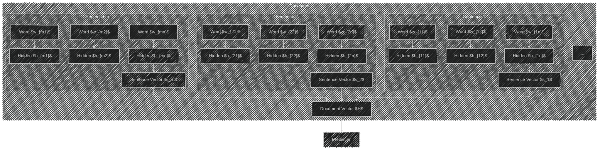
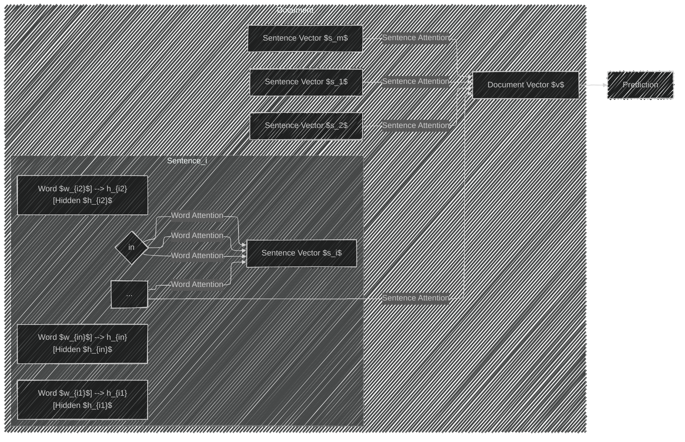
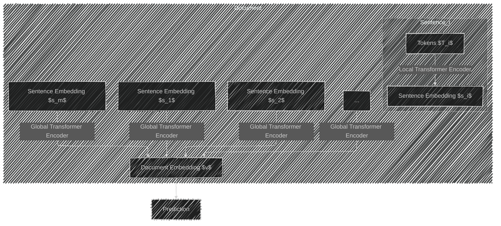

# Hierarchical Encoding in Natural Language Processing (NLP)
> This content is dual-licensed under your choice of the following licenses:
> 1.  **MIT License:** For the code implementations in Swift and Mermaid provided in this document.
> 2.  **Creative Commons Attribution 4.0 International License (CC BY 4.0):** For all other content, including the text, explanations, and the Mermaid diagrams and illustrations.

---

**Hierarchical Encoding** is a strategy in NLP that processes text at multiple levels of granularity—such as characters, words, sentences, and documents—to capture both local and global contextual information. This technique mirrors the hierarchical structure of language itself, enabling models to understand and represent complex linguistic patterns more effectively.

**Main Themes:**

- Understanding the concept and purpose of Hierarchical Encoding.
- Exploring architectures that implement Hierarchical Encoding.
- Delving into technical concepts and complexities.
- Reviewing current industry practices.
- Utilizing Mermaid diagrams to illustrate these concepts.

---

## Table of Contents

1. [Introduction](#introduction)
2. [Motivation for Hierarchical Encoding](#motivation)
3. [Hierarchical Encoding Architectures](#architectures)
   - [Hierarchical Recurrent Neural Networks (HRNN)](#hrnn)
   - [Hierarchical Attention Networks (HAN)](#han)
   - [Hierarchical Transformers](#transformers)
4. [Technical Concepts and Complexities](#technical-concepts)
   - [Encoding at Different Levels](#encoding-levels)
   - [Attention Mechanisms](#attention)
   - [Positional Encoding](#positional-encoding)
   - [Optimizations for Long Sequences](#optimizations)
5. [Current Industry Practices](#industry-practices)
6. [Challenges and Considerations](#challenges)
7. [Conclusion](#conclusion)

---

## 1. Introduction

Language exhibits a natural hierarchy:

- **Characters** form **words**.
- **Words** form **sentences**.
- **Sentences** form **paragraphs**.
- **Paragraphs** form **documents**.

**Hierarchical Encoding** leverages this structure by modeling text data at each level, allowing models to capture nuanced information and dependencies that might be missed when processing text at a single level.

---

## 2. Motivation for Hierarchical Encoding

### **Purpose:**

- **Multi-level Understanding:** To understand and represent text at multiple granularity levels for richer semantic comprehension.
- **Contextual Capture:** To capture both **local** (e.g., within a sentence) and **global** (e.g., across sentences or paragraphs) context.

### **Applications:**

- **Document Classification**
- **Sentiment Analysis**
- **Machine Translation**
- **Summarization**
- **Dialogue Systems**

### **Why Hierarchical Encoding?**

- **Handling Long Sequences:** Traditional models struggle with long texts due to computational limitations and vanishing gradients.
- **Context Preservation:** Hierarchical structures better maintain context over long passages.
- **Efficiency:** Processing smaller units reduces computational overhead.

---

## 3. Hierarchical Encoding Architectures

### A. Hierarchical Recurrent Neural Networks (HRNN)

**Concept:** Stack RNNs to mirror the hierarchical structure of text.

#### **Architecture Diagram:**

#### **Explanation:**

- **Word-Level RNNs** process words within each sentence and produce sentence vectors.
- **Sentence-Level RNN** processes sentence vectors to produce a document representation.
- The final document vector $H$ is used for prediction tasks.

#### **Mathematical Formulation:**

1. **Word-Level Encoding:**

   For each sentence $i$ and word $t$:

   $$
   h_{it}^{(w)} = \text{RNN}_w(h_{i(t-1)}^{(w)}, x_{it})
   $$

   - $h_{it}^{(w)}$: Hidden state at word level.
   - $x_{it}$: Input word embedding.

2. **Sentence Representation:**

   $$
   s_i = h_{iT_i}^{(w)}
   $$

   - $T_i$: Length of sentence $i$.

3. **Sentence-Level Encoding:**

   $$
   h_i^{(s)} = \text{RNN}_s(h_{(i-1)}^{(s)}, s_i)
   $$

   - $h_i^{(s)}$: Hidden state at sentence level.

---

### B. Hierarchical Attention Networks (HAN)

**Concept:** Enhance HRNNs by integrating attention mechanisms at both word and sentence levels.

#### **Architecture Diagram:**

#### **Explanation:**

- **Word-Level Attention:** Aggregates word hidden states into a sentence vector, highlighting important words.
- **Sentence-Level Attention:** Aggregates sentence vectors into a document vector, emphasizing key sentences.

#### **Mathematical Formulation:**

1. **Word-Level Attention:**

   - Hidden states: $h_{it}$
   - Attention mechanism:

     $$
     u_{it} = \tanh(W_w h_{it} + b_w)
     $$

     $$
     \alpha_{it} = \frac{\exp(u_{it}^{\top} u_w)}{\sum_t \exp(u_{it}^{\top} u_w)}
     $$

     $$
     s_i = \sum_t \alpha_{it} h_{it}
     $$

2. **Sentence-Level Attention:**

   - Sentence representations: $s_i$
   - Attention mechanism:

     $$
     u_i = \tanh(W_s s_i + b_s)
     $$

     $$
     \alpha_i = \frac{\exp(u_i^{\top} u_s)}{\sum_i \exp(u_i^{\top} u_s)}
     $$

     $$
     v = \sum_i \alpha_i s_i
     $$

---

### C. Hierarchical Transformers

**Concept:** Adapt the transformer architecture to process text hierarchically, addressing limitations with long sequences.

#### Architecture Diagram

#### **Explanation:**

- **Local Transformer Encoder:** Processes tokens within a sentence to produce sentence embeddings.
- **Global Transformer Encoder:** Processes sentence embeddings to produce a document embedding.

#### **Optimizations:**

- **Reduced Sequence Lengths:** Processing shorter sequences at each level reduces computational demands.
- **Sparse Attention Mechanisms:** Limit attention computations to improve efficiency.

---

## 4. Technical Concepts and Complexities

### A. Encoding at Different Levels

#### **Character-Level Encoding:**

- Captures morphological information.
- Handles misspellings and rare words.

#### **Word-Level Encoding:**

- Captures syntactic and semantic information.
- Utilizes embeddings like Word2Vec or GloVe.

#### **Sentence-Level Encoding:**

- Captures inter-word relationships.
- Represents overall sentence meaning.

#### **Document-Level Encoding:**

- Captures discourse and topic information.
- Represents the document in its entirety.

### B. Attention Mechanisms

#### **Purpose:**

- Focus on the most relevant parts of the input.
- Improve interpretability.

#### **Types:**

- **Self-Attention:** Within the same sequence.
- **Hierarchical Attention:** Applied at multiple levels (words, sentences).

#### **Self-Attention Formula:**

Given queries \( Q \), keys \( K \), and values \( V \):

$$
\text{Attention}(Q, K, V) = \text{softmax}\left( \frac{Q K^\top}{\sqrt{d_k}} \right) V
$$

### C. Positional Encoding

#### **Purpose:**

- Provide sequence order information to models lacking inherent sequential awareness (e.g., Transformers).

#### **Sinusoidal Positional Encoding:**

For position \( pos \) and dimension \( i \):

$$
\text{PE}_{(pos, 2i)} = \sin\left( \frac{pos}{10000^{2i/d_{\text{model}}}} \right)
$$

$$
\text{PE}_{(pos, 2i+1)} = \cos\left( \frac{pos}{10000^{2i/d_{\text{model}}}} \right)
$$

### D. Optimizations for Long Sequences

#### **Sparse Attention:**

- Attend to a subset of tokens to reduce complexity.

#### **Memory Mechanisms:**

- **Transformer-XL:** Introduces recurrence to capture long-term dependencies.
- **Compressive Transformers:** Compress past activations to manage memory.

#### **Segmented Processing:**

- Divide long texts into manageable segments.

---

## 5. Current Industry Practices

### **Use Cases:**

- **Document Classification:** Categorizing emails, news articles.
- **Summarization:** Generating concise summaries.
- **Question Answering:** Understanding context for accurate responses.
- **Dialogue Systems:** Managing conversation over multiple turns.
- **Search Engines:** Enhancing relevance through better understanding of content.

### **Industrial Models:**

- **Google's BERT and Longformer:** Handle longer contexts using hierarchical approaches.
- **OpenAI's GPT Models:** Utilize positional encodings and attention mechanisms.

---

## 6. Challenges and Considerations

### **Computational Complexity:**

- Hierarchical models can be resource-intensive.
- Attention mechanisms increase computation.

### **Data Requirements:**

- Require large datasets for effective training.
- Scarcity of labeled long-text data.

### **Implementation Complexity:**

- More intricate architectures demand careful design.
- Balancing model depth and performance.

### **Sequence Length Limitations:**

- Even hierarchical models have practical limits.
- Need for optimizations in handling extremely long texts.

---

## 7. Conclusion

Hierarchical Encoding is a vital approach in NLP, reflecting the natural structure of language. By processing text at multiple levels, models become capable of capturing complex patterns and dependencies, improving performance across various applications.

**Key Takeaways:**

- **Multi-Level Processing:** Enhances contextual understanding.
- **Attention Mechanisms:** Focus on important elements at each level.
- **Industry Adoption:** Widely used in modern NLP solutions.
- **Ongoing Research:** Continual advancements optimize handling of long sequences.

---

**References:**

- Yang, Zichao, et al. "Hierarchical Attention Networks for Document Classification." *Proceedings of the 2016 Conference of the North American Chapter of the Association for Computational Linguistics: Human Language Technologies*. 2016.
- Vaswani, Ashish, et al. "Attention is All You Need." *Advances in Neural Information Processing Systems*. 2017.
- Dai, Zihang, et al. "Transformer-XL: Attentive Language Models Beyond a Fixed-Length Context." *Proceedings of the 57th Annual Meeting of the Association for Computational Linguistics*. 2019.

---

**Note:** The diagrams provided use Mermaid syntax to visualize complex architectures and workflows, aiding in the comprehension of Hierarchical Encoding's technical concepts.

---
**Licenses:**

- **MIT License:**   - Full text in [LICENSE](LICENSE) file.
- **Creative Commons Attribution 4.0 International:**  - Legal details in [LICENSE-CC-BY](LICENSE-CC-BY) and at [Creative Commons official site](http://creativecommons.org/licenses/by/4.0/).

---