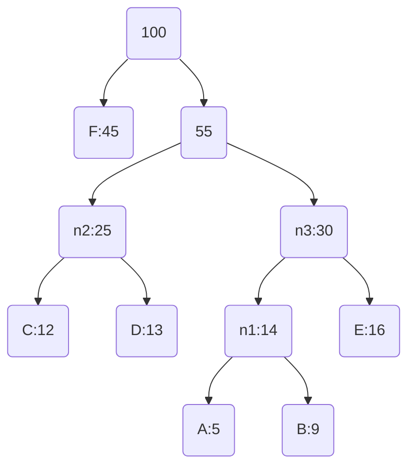
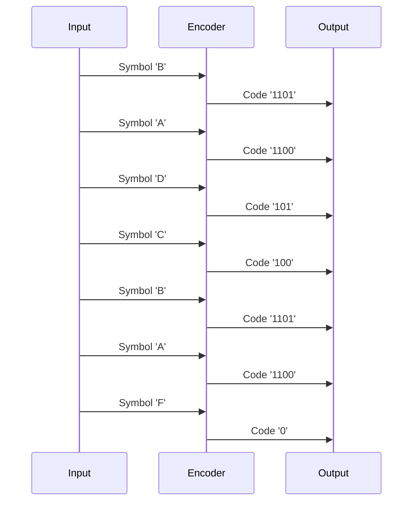
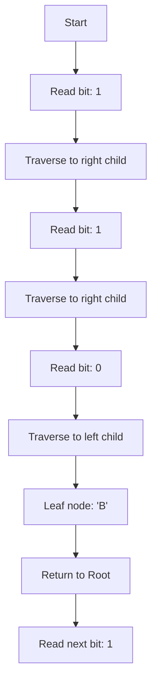

# Huffman Coding: In-Depth Explanation and Industry Practices
> This content is dual-licensed under your choice of the following licenses:
> 1.  **MIT License:** For the code implementations in Swift, Python, Mermaid or other programming langauges provided in this document.
> 2.  **Creative Commons Attribution 4.0 International License (CC BY 4.0):** For all other content, including the text, explanations, and the Mermaid diagrams and illustrations.

---

Huffman Coding is a fundamental algorithm used for lossless data compression. It efficiently reduces the size of data without any loss of information by assigning variable-length codes to input characters, with shorter codes assigned to more frequent characters.


## Overview

- **Purpose**: To compress data by reducing the average code length used to represent the symbols in a data set.
- **Applications**: Widely used in compression formats like JPEG, PNG, MP3, and in protocols for data transmission and storage.

---

## Table of Contents

1. [Theoretical Basis](#theoretical-basis)
2. [Huffman Coding Algorithm](#huffman-coding-algorithm)
   - [Building the Huffman Tree](#building-the-huffman-tree)
   - [Generating Huffman Codes](#generating-huffman-codes)
   - [Encoding Process](#encoding-process)
   - [Decoding Process](#decoding-process)
3. [Mermaid Diagrams and Illustrations](#mermaid-diagrams-and-illustrations)
4. [Complexities and Technical Concepts](#complexities-and-technical-concepts)
   - [Time Complexity](#time-complexity)
   - [Space Complexity](#space-complexity)
   - [Optimality of Huffman Coding](#optimality-of-huffman-coding)
5. [Industry Practices](#industry-practices)
   - [Integration in Compression Formats](#integration-in-compression-formats)
   - [Alternatives and Enhancements](#alternatives-and-enhancements)
6. [Conclusion](#conclusion)
7. [References](#references)

---

## Theoretical Basis

Huffman Coding is based on the principle of using shorter binary codes for more frequent symbols and longer codes for less frequent symbols. This variable-length coding ensures that the average code length is minimized, achieving efficient compression.

The key concepts include:

- **Frequency Analysis**: Determining how often each symbol appears in the data.
- **Prefix Codes**: Codes where no code is a prefix of any other code, ensuring unique decodability.
- **Binary Trees**: The structure used to represent the codes, known as the **Huffman Tree**.

---

## Huffman Coding Algorithm

### Building the Huffman Tree

1. **Frequency Table Creation**: Calculate the frequency of each symbol in the input data.
2. **Priority Queue Initialization**: Insert all symbols into a priority queue (min-heap) based on their frequencies.
3. **Tree Construction**:
   - While there is more than one node in the queue:
     - Remove the two nodes with the lowest frequencies.
     - Create a new internal node with these two nodes as children, and the frequency equal to the sum of their frequencies.
     - Insert the new node back into the queue.
4. **Result**: The remaining node in the queue is the root of the Huffman Tree.

### Generating Huffman Codes

- Traverse the Huffman Tree from the root to each leaf node.
- Assign a binary digit to each edge:
  - **Left Edge**: `0`
  - **Right Edge**: `1`
- The code for each symbol is the sequence of digits on the path from the root to that symbol's leaf node.

### Encoding Process

- Replace each symbol in the input data with its corresponding Huffman code.
- The result is a compressed bitstream.

### Decoding Process

- Use the Huffman Tree to decode the bitstream:
  - Start from the root and follow the path dictated by the bits.
  - When a leaf node is reached, output the corresponding symbol and return to the root.

---

## Mermaid Diagrams and Illustrations

### Example: Huffman Tree Construction

#### Given Data

Suppose we have the following symbols with their frequencies:

| Symbol | Frequency |
|--------|-----------|
| `A`    | 5         |
| `B`    | 9         |
| `C`    | 12        |
| `D`    | 13        |
| `E`    | 16        |
| `F`    | 45        |

#### Step-by-Step Tree Construction

1. **Initial Priority Queue**:

   ```
   [A:5], [B:9], [C:12], [D:13], [E:16], [F:45]
   ```

2. **Combine Nodes with Smallest Frequencies**:

   - Combine `A` and `B`:

   ```
   Create node `n1` with frequency 5 + 9 = 14
   ```

3. **Updated Queue**:

   ```
   [C:12], [D:13], [E:16], [F:45], [n1:14]
   ```

4. **Repeat Process**:

   - Combine `C` and `D`:

   ```
   Create node `n2` with frequency 12 + 13 = 25
   ```
   
   - Updated Queue:

   ```
   [E:16], [F:45], [n1:14], [n2:25]
   ```

   - Combine `n1` and `E`:

```
   Create node `n3` with frequency 14 + 16 = 30
```

   - Updated Queue:

   ```
   [F:45], [n2:25], [n3:30]
   ```

   - Combine `n2` and `n3`:

   ```
   Create node `n4` with frequency 25 + 30 = 55
   ```

   - Updated Queue:

   ```
   [F:45], [n4:55]
   ```

   - Combine `F` and `n4`:

   ```
   Create root node with frequency 45 + 55 = 100
   ```

#### Final Huffman Tree



#### Assigning Codes

- **Traverse the tree**:
  - Left edge: assign `0`
  - Right edge: assign `1`

| Symbol | Code  |
|--------|-------|
| `F`    | `0`   |
| `C`    | `100` |
| `D`    | `101` |
| `A`    | `1100`|
| `B`    | `1101`|
| `E`    | `111` |

---

## Complexities and Technical Concepts

### Time Complexity

- **Building the Huffman Tree**:
  - Using a priority queue: `O(n log n)` where `n` is the number of unique symbols.
- **Encoding/Decoding**:
  - Encoding: `O(L)` where `L` is the total number of symbols in the input data.
  - Decoding: `O(L)` since each bit is traversed once.

### Space Complexity

- **Huffman Tree Storage**:
  - Requires storage for each node: `O(n)`.

### Optimality of Huffman Coding

- **Prefix Codes**: Huffman Coding generates a prefix code, ensuring no code is a prefix of another, which is essential for unique decodability.
- **Optimality**:
  - **Source with Known Probabilities**: Huffman Coding is optimal when symbol probabilities are known and independent.
  - **Limitation**: Not optimal for sources with symbol probabilities that do not conform to exact frequencies or when considering long sequences (contextual probabilities).

---

## Industry Practices

### Integration in Compression Formats

Huffman Coding is a core component in several widely used compression algorithms and formats:

- **JPEG**:
  - Uses Huffman Coding after transforming and quantizing image data.
- **PNG**:
  - Employs Huffman Coding in conjunction with LZ77 compression.
- **MP3**:
  - Applies Huffman Coding to quantized frequency coefficients in audio data.

### Alternatives and Enhancements

- **Adaptive Huffman Coding**:
  - Adjusts the codes dynamically based on changing symbol frequencies.
- **Arithmetic Coding**:
  - Often achieves better compression ratios, especially for sources with symbols having probabilities that are not powers of `1/2`.
- **Canonical Huffman Codes**:
  - Simplifies the storage of Huffman codes by enforcing a canonical order, improving decoding efficiency.
- **Context-Based Models**:
  - Combining Huffman Coding with context modeling (e.g., in DEFLATE algorithm) for better compression.

### Current Trends

- **Integration with Machine Learning**:
  - Using statistical models to predict symbol probabilities.
- **Hardware Acceleration**:
  - Implementing Huffman Coding in hardware for real-time applications (e.g., video compression).
- **Standardized Libraries**:
  - Utilizing well-tested libraries and tools to implement Huffman Coding efficiently.

---

## Conclusion

Huffman Coding remains a vital algorithm in data compression due to its simplicity and effectiveness in reducing data size without loss of information. While newer algorithms may offer better compression under certain conditions, Huffman Coding's balance of efficiency and performance ensures its continued relevance in industry applications.

---

## References

- **David A. Huffman**: Original paper on Huffman Coding (1952).
- **Textbooks**:
  - "Introduction to Algorithms" by Cormen et al.
  - "Data Compression: The Complete Reference" by David Salomon.
- **Standards Documentation**:
  - JPEG (ISO/IEC 10918-1)
  - PNG Specification

---

# Appendices

## Additional Mermaid Diagrams

### Encoding Process Example

Suppose the input data is: `B A D C B A F`

- **Symbols and Codes**:

  | Symbol | Code  |
  |--------|-------|
  | `A`    | `1100`|
  | `B`    | `1101`|
  | `C`    | `100` |
  | `D`    | `101` |
  | `E`    | `111` |
  | `F`    | `0`   |

- **Encoded Bitstream**:

  ```
  1101 1100 101 100 1101 1100 0
  ```

- **Visualization of Encoding**:



### Decoding Process Illustration

- **Bitstream**: `11011100101100110111000`

- **Decoding Steps**:



---

## Technical Considerations

- **Implementation Details**:
  - **Data Structures**: Efficient implementations use priority queues (often min-heaps) to construct the Huffman Tree.
  - **Storage of Codes**: Use of tables or maps to associate symbols with codes for quick encoding and decoding.
- **Compression Ratio**:
  - **Depends on Symbol Distribution**: The more skewed the frequency distribution, the better the compression.
- **Error Handling**:
  - **Resilience to Errors**: Huffman Coding is sensitive to errors; a single bit error can lead to decoding failure.
- **Block vs. Streaming**:
  - **Block Compression**: Requires prior knowledge of symbol frequencies.
  - **Adaptive Compression**: Updates frequencies dynamically, suitable for streaming data.

---

## Advanced Topics

### Optimality and Limitations

- **Shannon-Fano Coding**:
  - Predecessor to Huffman Coding, less efficient.
- **Shannon's Source Coding Theorem**:
  - Establishes the theoretical limit of lossless compression.
- **Huffman Limitations**:
  - Not ideal for sources with symbol dependencies.
  - May be outperformed by arithmetic coding in certain contexts.

### Combining with Other Algorithms

- **DEFLATE Algorithm**:
  - Combines LZ77 (dictionary-based compression) and Huffman Coding.
- **Context-Adaptive Binary Arithmetic Coding (CABAC)**:
  - Used in video codecs like H.264/AVC for better compression efficiency.

---

## Industry Implementations

- **Libraries and Tools**:
  - **zlib**: Open-source library implementing DEFLATE compression with Huffman Coding.
  - **libpng**: Uses Huffman Coding for PNG image compression.
- **Hardware Solutions**:
  - **FPGA/ASIC Implementations**: For high-speed compression in real-time systems.
- **Cloud Services**:
  - **Data Storage**: Cloud storage providers often use compression algorithms incorporating Huffman Coding to reduce storage costs.

---

## Conclusion

Understanding Huffman Coding is essential for professionals working in data compression, software development, and systems design. Its principles underpin many modern compression techniques and remain relevant in optimizing data storage and transmission.


---
**Licenses:**

- **MIT License:**  [](LICENSE) - Full text in [LICENSE](LICENSE) file.
- **Creative Commons Attribution 4.0 International:** [](LICENSE-CC-BY) - Legal details in [LICENSE-CC-BY](LICENSE-CC-BY) and at [Creative Commons official site](http://creativecommons.org/licenses/by/4.0/).

---