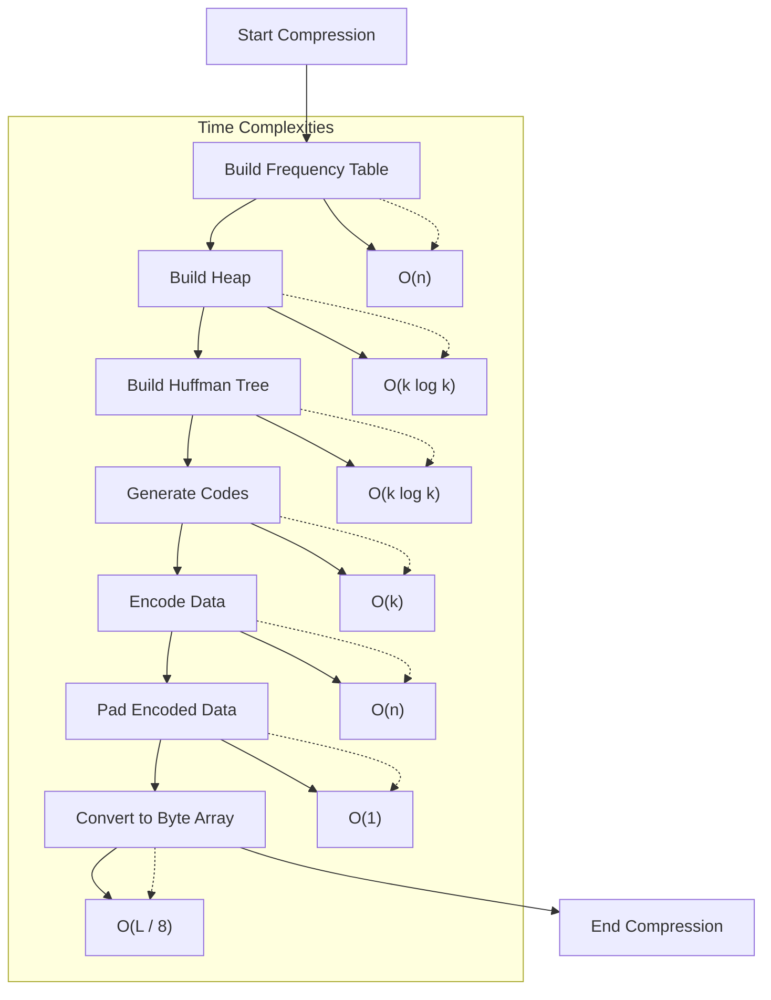
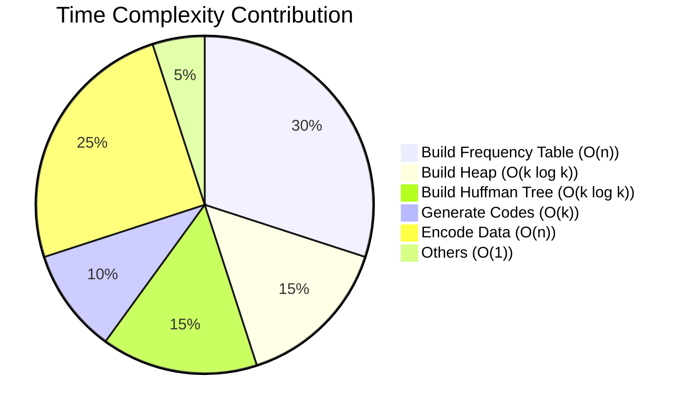
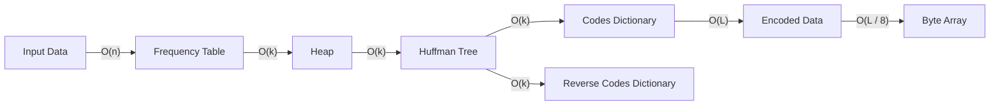
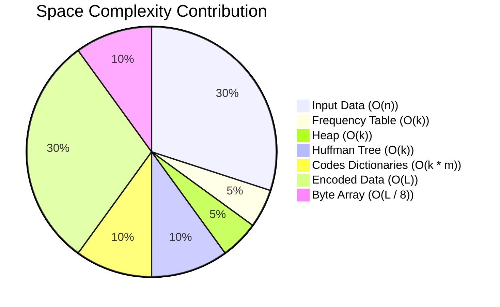
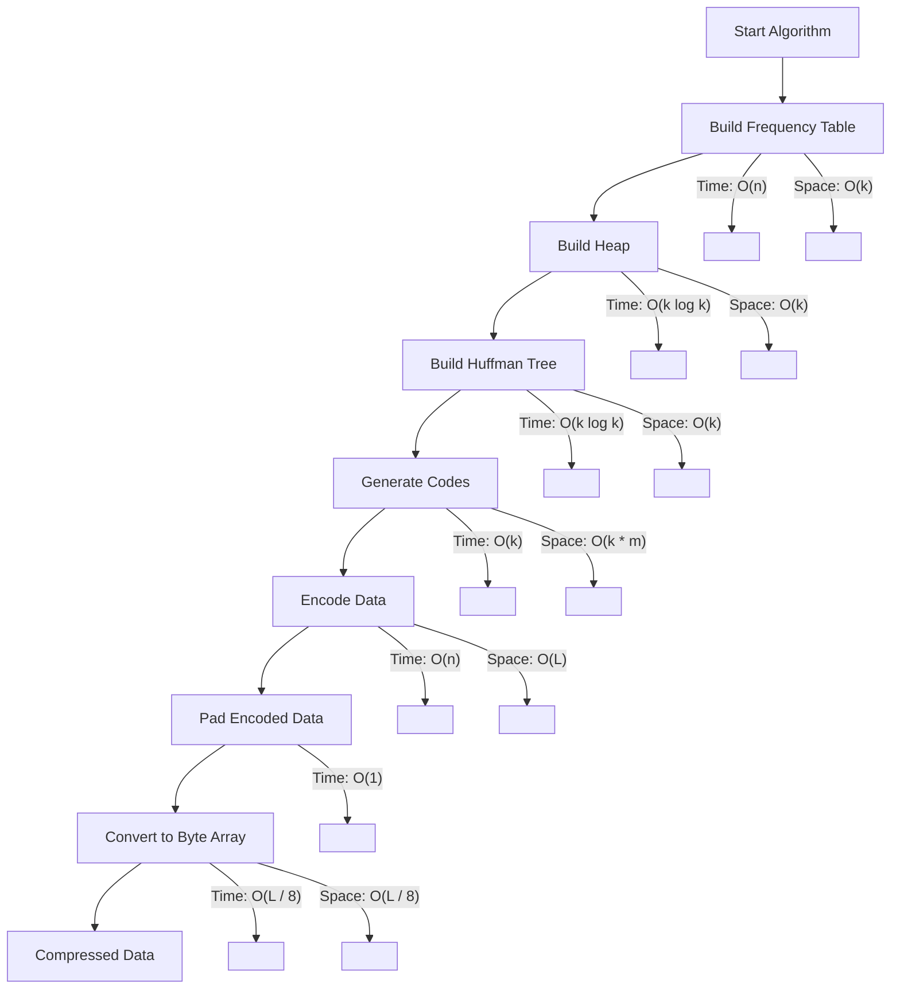
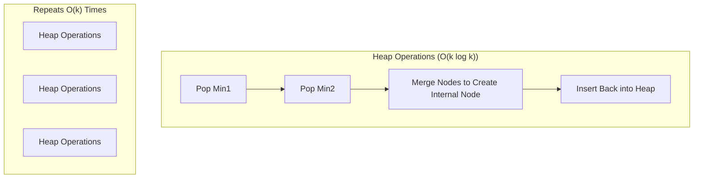
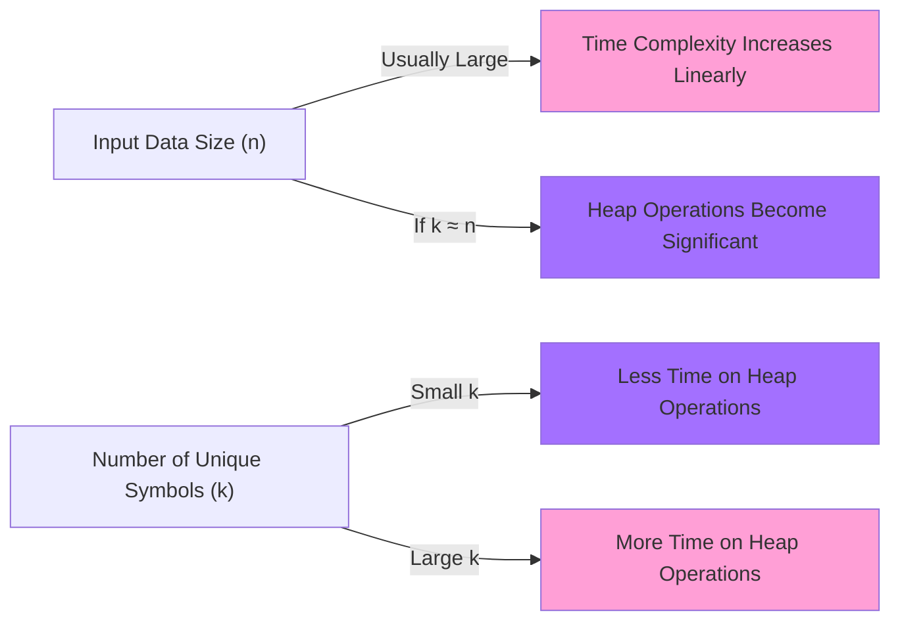
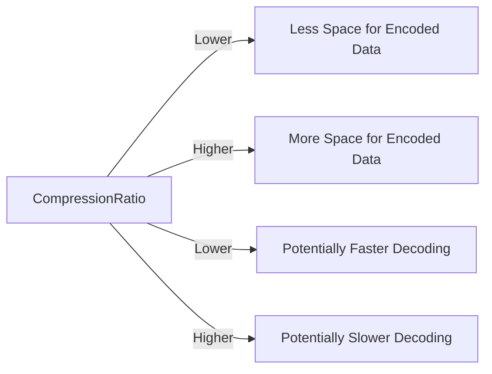

# Huffman Coding - Time complexity and Space complexity
> This content is dual-licensed under your choice of the following licenses:
> 1.  **MIT License:** For the code implementations in Swift and Mermaid provided in this document.
> 2.  **Creative Commons Attribution 4.0 International License (CC BY 4.0):** For all other content, including the text, explanations, and the Mermaid diagrams and illustrations.

---

## Overview of the Algorithm

Before diving into complexities, here's a high-level overview of the steps involved in both **compression** and **decompression**:

1. **Compression**:
   - Build Frequency Table
   - Build Heap (Priority Queue)
   - Build Huffman Tree
   - Generate Codes
   - Encode Data
   - Pad Encoded Data
   - Convert to Byte Array

2. **Decompression**:
   - Convert Byte Array to Bit String
   - Remove Padding
   - Decode Data using Huffman Tree

---

## Time Complexity

### Flowchart of Compression Steps with Time Complexities

### Explanation of Each Step

1. **Build Frequency Table (`O(n)`):**
   - **Process**: Iterate over the input data once to count the frequency of each symbol.
   - **Complexity**: Linear in the length of input data `n`.

2. **Build Heap (`O(k log k)`):**
   - **Process**: Insert all `k` unique symbols into a min-heap based on their frequencies.
   - **Complexity**: Each insertion takes `O(log k)`, total `O(k log k)`.

3. **Build Huffman Tree (`O(k log k)`):**
   - **Process**: Repeatedly combine the two nodes with the smallest frequencies.
   - **Complexity**: Each heap operation (pop and push) takes `O(log k)`, and there are `O(k)` such operations.

4. **Generate Codes (`O(k)`):**
   - **Process**: Traverse the Huffman Tree to assign binary codes to each symbol.
   - **Complexity**: Visits each node once, total `O(k)`.

5. **Encode Data (`O(n)`):**
   - **Process**: Replace each symbol in the input data with its corresponding Huffman code.
   - **Complexity**: Linear in the length of input data `n`.

6. **Pad Encoded Data (`O(1)`):**
   - **Process**: Add padding bits to make the encoded data's length a multiple of 8.
   - **Complexity**: Padding adds at most 8 bits, constant time `O(1)`.

7. **Convert to Byte Array (`O(L / 8)`):**
   - **Process**: Convert the padded bit string into bytes.
   - **Complexity**: Linear in the length of the encoded data `L`, which is `O(n)`.

### Visual Representation of Complexity Contribution

- **Note**: The percentages are illustrative and represent the relative time spent in each step.

### Total Time Complexity

- **Compression**: `O(n + k log k)`
  - Since `k` (number of unique symbols) is typically much smaller than `n`, the dominant term is `O(n)`.
- **Decompression**: `O(L)`
  - Where `L` is the length of the encoded data.

---

## Space Complexity

### Diagram of Data Structures with Space Requirements

### Explanation of Each Data Structure

1. **Input Data (`O(n)`):**
   - The original data of length `n`.

2. **Frequency Table (`O(k)`):**
   - Stores frequencies of `k` unique symbols.
   - **Space**: Proportional to the number of unique symbols.

3. **Heap (`O(k)`):**
   - A priority queue containing nodes for each symbol.
   - **Space**: Holds up to `k` nodes at any time.

4. **Huffman Tree (`O(k)`):**
   - Binary tree constructed from the heap.
   - **Space**: Contains `2k - 1` nodes (including internal nodes), but still `O(k)`.

5. **Codes Dictionary (`O(k * m)`):**
   - Maps each symbol to its binary code.
   - **Space**: Depends on the total length of all codes, where `m` is the maximum code length.

6. **Reverse Codes Dictionary (`O(k * m)`):**
   - Maps each code to its symbol for decoding.
   - **Space**: Similar to the codes dictionary.

7. **Encoded Data (`O(L)`):**
   - The string of bits representing the original data.
   - **Space**: Proportional to the length of encoded data `L`.

8. **Byte Array (`O(L / 8)`):**
   - The final compressed data.
   - **Space**: Encoded data converted into bytes.

### Space Complexity Breakdown

- **Note**: Percentages illustrate the relative memory usage of each component.

### Total Space Complexity

- **Compression**: `O(n + k + L)`
  - **Input Data**: `O(n)`
  - **Data Structures**: `O(k)` each
  - **Encoded Data**: `O(L)`, where `L ∝ n * avg_code_length`

---

## Combining Time and Space Complexities

### Unified Complexity Diagram

- **Time Complexity Annotations**: Indicate the time taken at each step.
- **Space Complexity Annotations**: Indicate the space used at each step.

---

## Interpretation and Insights

1. **Dominant Factors**:
   - **Time Complexity**:
     - The steps that involve processing each element of the input data (`O(n)`) are dominant when `n` is large.
     - Heap operations (`O(k log k)`) become significant when the number of unique symbols `k` is large.
   - **Space Complexity**:
     - Storing the encoded data (`O(L)`) can consume significant memory, especially if the codes are long.
     - For large inputs with few unique symbols, the space for data structures (`O(k)`) is minimal compared to the input and encoded data.

2. **Balancing Time and Space**:
   - The algorithm trades off additional space usage (for data structures like the tree and codes) to achieve efficient time performance.
   - Efficient implementations aim to minimize code lengths (`avg_code_length`) to reduce both `L` and the space required.

---

## Example Visualization of Huffman Tree Construction Time Complexity

### Building the Huffman Tree Step-by-Step

- **Explanation**:
  - Each iteration involves popping two nodes and inserting a merged node, each operation taking `O(log k)`.
  - The process repeats until one node remains.

---

## Summary

- **Time Complexity**:
  - **Compression**: `O(n + k log k)`
    - Dominated by `O(n)` when `n` is much larger than `k`.
  - **Decompression**: `O(L)`
    - Linear in the length of the encoded data.

- **Space Complexity**:
  - **Overall**: `O(n + k + L)`
    - Includes the input data, data structures, and the encoded data.

- **Key Factors**:
  - **Number of Unique Symbols (`k`)**:
    - Affects heap operations and the size of data structures.
  - **Input Data Length (`n`)**:
    - Influences the frequency table and the encoded data length.
  - **Average Code Length (`avg_code_length`)**:
    - Impacts the length of the encoded data `L`.

---

# Conclusion

By visualizing the time and space complexities, we can better understand how each component of the Huffman Coding algorithm contributes to its overall efficiency. The algorithm efficiently compresses data by leveraging extra space for data structures and performing operations whose time complexities are acceptable for practical use cases. Optimizations often focus on minimizing the number of unique symbols and the average code length to improve both time and space performance.

---

# Additional Notes

- **Edge Cases**:
  - For data with a very small number of unique symbols, `k` approaches a constant, and complexities related to `k` become negligible.
  - For extremely large datasets, the linear terms dominate, and optimizing those parts of the algorithm becomes crucial.

- **Practical Implications**:
  - Understanding these complexities helps in optimizing Huffman Coding for specific applications, such as real-time systems or memory-constrained environments.

---

# Appendices

## Relation Between Input Size and Number of Unique Symbols

### Graphical Representation

- **Interpretation**:
  - When `k` is small relative to `n`, heap operations are less significant.
  - When `k` is large and approaches `n`, heap operations (`O(k log k)`) have a greater impact.

## Space Complexity vs. Compression Ratio

- **Compression Ratio**: The size of the compressed data divided by the size of the original data.

- **Observation**:
  - A better compression ratio (smaller `L`) reduces space complexity.
  - Trade-offs may exist between the time spent to optimize code lengths and the space saved.

### Chart: Compression Ratio Impact

---
**Licenses:**

- **MIT License:**   - Full text in [LICENSE](LICENSE) file.
- **Creative Commons Attribution 4.0 International:**  - Legal details in [LICENSE-CC-BY](LICENSE-CC-BY) and at [Creative Commons official site](http://creativecommons.org/licenses/by/4.0/).

---