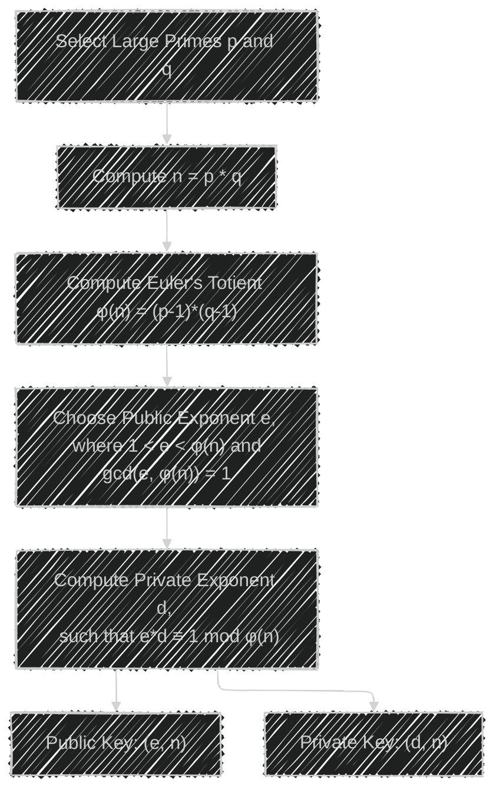
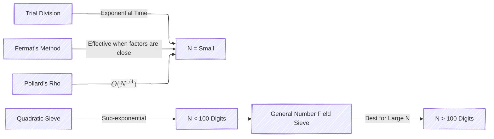
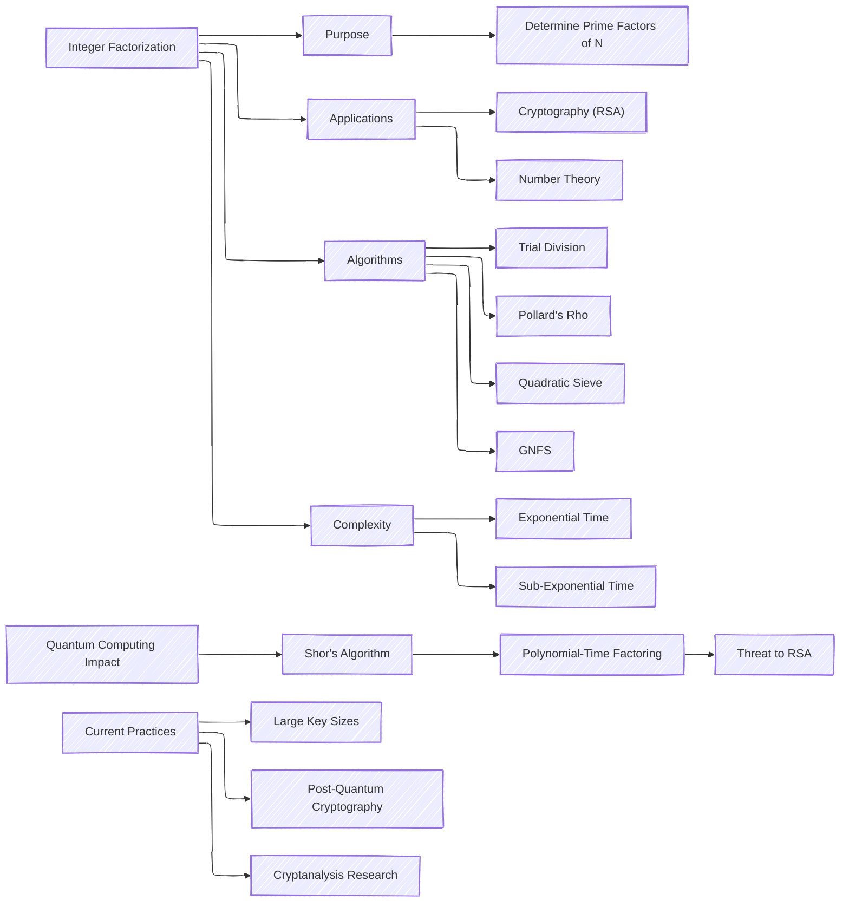

# Integer Factorization: Purpose, Techniques, Complexities, and Cryptographic Applications
> This content is dual-licensed under your choice of the following licenses:
> 1.  **MIT License:** For the code implementations in Swift and Mermaid provided in this document.
> 2.  **Creative Commons Attribution 4.0 International License (CC BY 4.0):** For all other content, including the text, explanations, and the Mermaid diagrams and illustrations.

---

Integer factorization is a fundamental problem in number theory and cryptography. It involves decomposing a composite number into a product of smaller integers, specifically prime numbers. This process is critical in various fields, especially in cryptography, where the security of algorithms like RSA relies on the difficulty of factoring large integers.

---

## **Purpose of Integer Factorization**

**Integer Factorization** is the process of determining the prime numbers that multiply together to yield a given composite integer \( N \).

- **Mathematical Definition**:
  - Given a composite number \( N \), find primes \( p_1, p_2, \dots, p_k \) such that:
    $$
    N = p_1^{e_1} \times p_2^{e_2} \times \dots \times p_k^{e_k}
    $$
    Where \( e_i \) are positive integers denoting the exponents of the prime factors.

**Importance in Cryptography**:

- **RSA Algorithm**: The RSA cryptosystem's security is based on the practical difficulty of factoring the product of two large prime numbers.
- **Discrete Logarithm Problem**: Similar computational hardness assumptions are used in other cryptographic algorithms.

---

## **Applications in Cryptography**

### **RSA Cryptosystem Overview**

The RSA algorithm uses integer factorization as the foundation for its security.

- **Key Generation Steps**:
  1. **Select Two Large Primes**: $p$ and $q$.
  2. **Compute** $n$ : $n = p \times q$ ; $n$ becomes part of both public and private keys.
  3. **Compute Euler's Totient Function** $φ(n)$ : $φ(n) = (p - 1)(q - 1)$.
  4. **Choose Public Exponent** $e$ : $e$ such that $1 < e < φ(n)$ and $\gcd(e, φ(n)) = 1$.
  5. **Compute Private Exponent** $d$ : $d$ such that $e \times d \equiv 1 \mod φ(n)$.
  6. **Public Key**: $(e, n)$.
  7. **Private Key**: $(d, n)$.

- **Encryption and Decryption**:
  - **Encryption**: $c = m^e \mod n$
  - **Decryption**: $m = c^d \mod n$
  - Where $m$ is the plaintext and $c$ is the ciphertext.

**Security Basis**:

- **Trapdoor Function**: Multiplying two large primes is computationally easy, but factoring their product is hard.
- **Integer Factorization Problem (IFP)**: The infeasibility of factoring \( n \) to retrieve \( p \) and \( q \) ensures the security of RSA.

---

## **Integer Factorization Algorithms and Complexities**

### **1. Trial Division**

**Description**: Divides $N$ by all prime numbers less than or equal to $\sqrt{N}$.

- **Complexity**: $O\left( \sqrt{N} \right)$, exponential time.
- **Impractical** for large $N$.

### **2. Fermat's Factorization Method**

**Description**: Based on representing $N$ as the difference of two squares: $N = x^2 - y^2$.

- **Algorithm Steps**:
  1. Find $x$ such that $x = \lceil \sqrt{N} \rceil$.
  2. Compute $y = \sqrt{x^2 - N}$.
  3. If $y$ is an integer, factors are $(x - y)$ and $(x + y)$.

- **Complexity**: Efficient when factors are close to each other.

### **3. Pollard's Rho Algorithm**

**Description**: A probabilistic algorithm suitable for factoring large numbers.

- **Complexity**: $O(N^{1/4})$, faster than trial division.

### **4. Quadratic Sieve (QS)**

**Description**: An advanced algorithm effective for numbers up to 100 digits.

- **Algorithm Overview**:
  - Finds a sequence of numbers $x_i$ such that $x_i^2 \mod N$ can be factored over a small factor base.
  - Uses linear algebra to find a subset of these numbers whose product is a square modulo $N$.
  - Then, similar to Fermat's method, computes $\gcd(a - b, N)$ to find factors.

- **Complexity**: Sub-exponential time:
  $$
  O\left( \exp\left( \left( \sqrt{\ln N \ln \ln N} \right) \right) \right)
  $$

### **5. General Number Field Sieve (GNFS)**

**Description**: The most efficient classical algorithm for factoring large integers (>100 digits).

- **Algorithm Steps**:
  1. **Polynomial Selection**: Choose polynomials that have a common root modulo $N$.
  2. **Sieving Step**: Find relations (pairs of integers) that satisfy certain congruences.
  3. **Linear Algebra Step**: Solve a large sparse linear system modulo 2.
  4. **Square Root Step**: Compute square roots of large numbers modulo $N$.
  5. **Final Computation**: Use the results to find a factor of $N$.

- **Complexity**: Sub-exponential time:
  $$
  O\left( \exp\left( \left( \left( \frac{64}{9} \right)^{1/3} (\ln N)^{1/3} (\ln \ln N)^{2/3} \right) \right) \right)
  $$

**Comparison of Algorithm Complexities**:

Note: we can properly render the math equation using the latest Mermaid syntax version.

---

## **Complexity and Computational Hardness**

- **Exponential vs. Sub-Exponential Time**:
  - **Exponential Time Algorithms**: Time complexity grows exponentially with the size of the input (number of digits in $N$).
  - **Sub-Exponential Time Algorithms**: Faster than exponential but still not polynomial time.

- **No Known Polynomial-Time Classical Algorithm**:
  - As of now, there is no classical algorithm that factors large integers in polynomial time.

---

## **Impact of Quantum Computing**

### **Shor's Algorithm**

[[Step 2 - Detail explanations - Build from the previous response - Shor's Algorithm  - By o1-preview]]

- **Description**: Quantum algorithm that can factor integers in polynomial time.

- **Complexity**: $O((\log N)^3)$, which is polynomial.

- **Implications**:
  - **Threat to RSA**: Can break RSA encryption by efficiently factoring \( n \) to find \( p \) and \( q \).
  - **Cryptographic Response**: Development of post-quantum cryptography algorithms that are secure against quantum attacks.

### **Current Industry Practices**

- **Key Sizes**:
  - Increasing key sizes (e.g., 2048-bit, 3072-bit) to enhance security.
  - Larger keys increase computational effort required for factoring.

- **Transition to Post-Quantum Cryptography**:
  - Research and standardization efforts by NIST to develop quantum-resistant algorithms.
  - Adoption of lattice-based, hash-based, and code-based cryptographic schemes.

---

## **Mermaid Diagram: RSA Encryption and Potential Quantum Threat**

```mermaid
---
config:
  layout: elk
  look: handDrawn
  theme: default
---
graph LR
    A[Classical RSA Encryption] --> B["Public Key (e, n)"]
    B --> C["Encryption: <br> c = m^e mod n"]
    C --> D[Transmitted Ciphertext c]
    D --> E["Private Key (d, n)"]
    E --> F[Decryption: <br> m = c^d mod n]
    
    subgraph Quantum_Computing_Threat
        style Quantum_Computing_Threat fill:#7a12,stroke:#00838f,stroke-width:2px
        G[Shor's Algorithm]
        G --> H[Polynomial-Time Integer Factorization]
        H --> I[Recover p and q from n]
        I --> J["Compute φ(n) and find d"]
        J --> K[Decrypt Message without Private Key]
    end
    
    F -. Possible if n is factored .-> I
    
```

---

## **Technical Concepts and Current Practices**

### **Key Generation and Size**

- **Key Length**:
  - **RSA-2048**: Standard for current secure communications.
  - **RSA-4096**: Used for enhanced security requirements.

- **Prime Number Generation**:
  - **Probabilistic Primality Tests**: Algorithms like Miller-Rabin are used to generate large primes efficiently.

### **Cryptographic Protocols and Standards**

- **TLS/SSL**:
  - **Transport Layer Security**: Uses RSA for key exchange and digital signatures.
  - **Moving Towards Elliptic Curve Cryptography (ECC)**: Offers similar security with smaller key sizes.

- **PKI (Public Key Infrastructure)**:
  - **Certificates and Digital Signatures**: Reliant on RSA and integer factorization hardness.

### **Cryptanalysis Efforts**

- **Ongoing Research**:
  - **Improving Factorization Algorithms**: Efforts to find more efficient classical algorithms continue.
  - **Cryptanalysis Competitions**: RSA Factoring Challenge (now defunct) encouraged factorization research.

### **Post-Quantum Cryptography**

- **NIST Standardization Process**:
  - **Purpose**: Develop standards for quantum-resistant cryptographic algorithms.
  - **Algorithms Under Consideration**:
    - **Lattice-Based Cryptography**: E.g., CRYSTALS-Kyber, CRYSTALS-Dilithium.
    - **Hash-Based Signatures**: E.g., SPHINCS+.
    - **Code-Based Cryptography**: E.g., Classic McEliece.

---

## **Conclusion**

Integer factorization plays a pivotal role in modern cryptography, underpinning the security of widely used algorithms like RSA. The computational hardness of factoring large integers ensures the confidentiality and integrity of digital communications. As computational capabilities advance, especially with the potential of quantum computing, the cryptographic community is actively developing new algorithms and standards to safeguard against emerging threats.

Understanding the complexities and technical concepts of integer factorization is essential for professionals in cybersecurity and cryptography. It not only informs the implementation of current secure systems but also guides the evolution of future technologies to protect information in an increasingly digital world.

---

# **Appendix: Technical Details of Factorization Algorithms**

### **Mathematical Expressions**

[[Step 2 - Detail explanations - Build from the previous response - Euler's Totient Function - By o1-preview]]

1. **Euler's Totient Function $φ(n)$**:
   $$
   φ(n) = (p - 1)(q - 1)
   $$

2. **Modular Inverse for Private Exponent $d$**:
   $$
   d \equiv e^{-1} \mod φ(n)
   $$

3. **Complexity of GNFS**:
   $$
   \exp\left( \left( \left( \frac{64}{9} \right)^{1/3} + o(1) \right) (\ln N)^{1/3} (\ln \ln N)^{2/3} \right)
   $$

4. **Shor's Algorithm Complexity**:
   $$
   O\left( (\log N)^3 \right)
   $$

---

# **References for Further Reading**

- **Books**:
  - "Introduction to Algorithms" by Cormen, Leiserson, Rivest, and Stein.
  - "Cryptography and Network Security" by William Stallings.

- **Research Papers**:
  - Peter Shor, "Polynomial-Time Algorithms for Prime Factorization and Discrete Logarithms on a Quantum Computer".

- **Standards and Publications**:
  - NIST, "Post-Quantum Cryptography Standardization".

- **Online Resources**:
  - [RSA Laboratories](https://www.rsa.com/en-us)
  - [Cryptographic algorithms on Wikipedia](https://en.wikipedia.org/wiki/Cryptographic_algorithm)
  - [Number Field Sieve explanation](https://mathworld.wolfram.com/NumberFieldSieve.html)

---

# **Glossary**

- **Composite Number**: An integer greater than one that is not a prime number.
- **Prime Number**: An integer greater than one with no positive divisors other than 1 and itself.
- **GCD**: Greatest Common Divisor, the largest positive integer that divides two integers without leaving a remainder.
- **Modular Arithmetic**: A system of arithmetic for integers where numbers wrap around upon reaching a certain value, the modulus.
- **Sub-Exponential Time**: An algorithm whose time complexity grows faster than polynomial time but slower than exponential time with respect to the input size.
- **Polynomial Time**: Computational complexity that can be expressed as a polynomial function of the size of the input data.

---

# **Visual Summary**

---
**Licenses:**

- **MIT License:**   - Full text in [LICENSE](LICENSE) file.
- **Creative Commons Attribution 4.0 International:**  - Legal details in [LICENSE-CC-BY](LICENSE-CC-BY) and at [Creative Commons official site](http://creativecommons.org/licenses/by/4.0/).

---