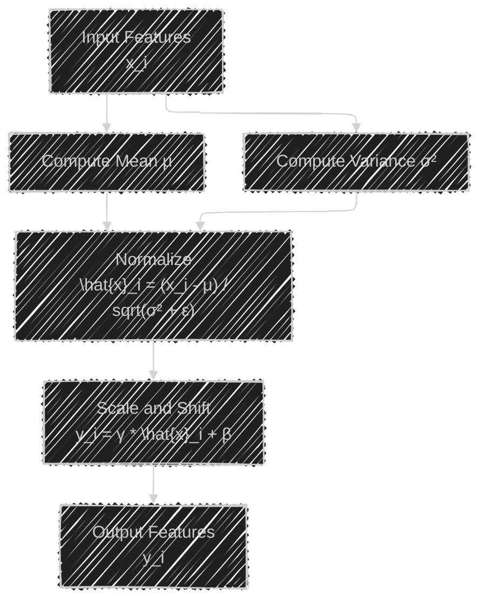
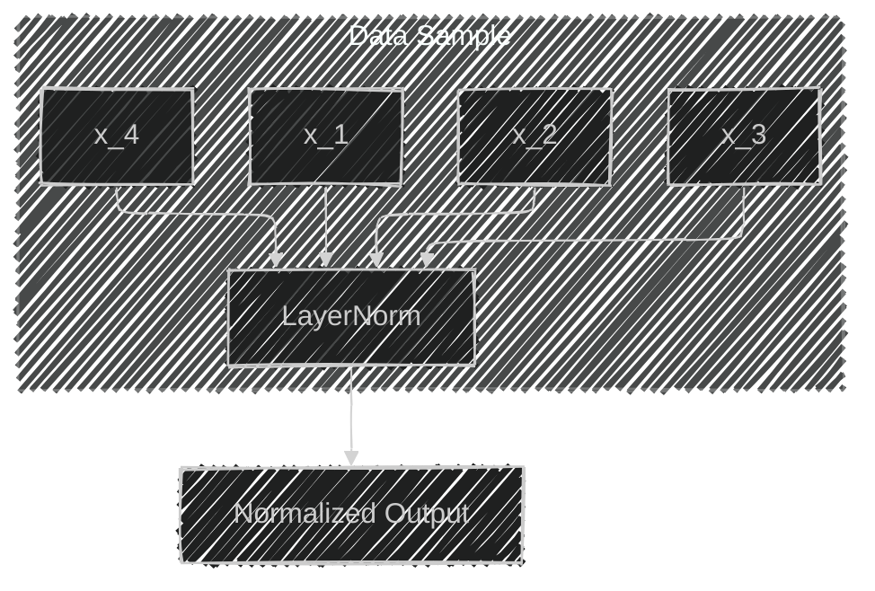
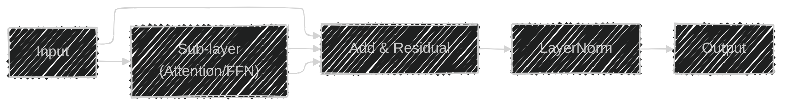
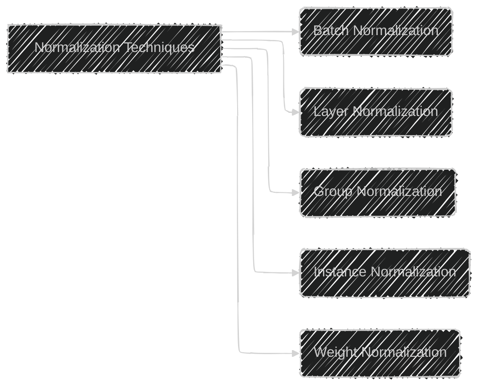
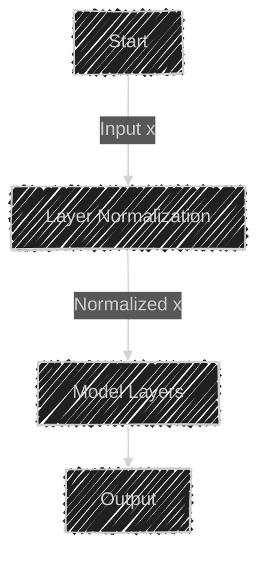

# Layer Normalization in Deep Learning
> This content is dual-licensed under your choice of the following licenses:
> 1.  **MIT License:** For the code implementations in Swift and Mermaid provided in this document.
> 2.  **Creative Commons Attribution 4.0 International License (CC BY 4.0):** For all other content, including the text, explanations, and the Mermaid diagrams and illustrations.

---


Layer Normalization is a technique designed to improve the training of deep neural networks by stabilizing the activations within each layer. It addresses the problem of internal covariate shift and makes the training process more efficient and faster.

---

## Overview

### Purpose

- **Stabilize Activations**: By normalizing the inputs across the features for each data sample, Layer Normalization ensures that the distribution of inputs to each layer remains consistent during training.
- **Accelerate Training**: Reduces the need for careful parameter initialization and allows for higher learning rates.

### Applications

- **Deep Neural Networks**: Particularly effective in Recurrent Neural Networks (RNNs) and Transformers where the batch size is small or varies.
- **Language Models**: Used extensively in models like GPT and BERT.

---

## Understanding Normalization in Neural Networks

### Internal Covariate Shift

- **Definition**: The phenomenon where the distribution of inputs to a layer changes during training, as the parameters of the previous layers change.
- **Impact**: Causes training to be inefficient due to the need for the network to continuously adapt to new input distributions.

### Normalization Techniques

- **Batch Normalization (BatchNorm)**
  - **Normalizes**: Across the batch dimension.
  - **Limitation**: Depends on batch statistics; less effective with small or varying batch sizes.
- **Layer Normalization (LayerNorm)**
  - **Normalizes**: Across the feature dimension for each data point.
  - **Advantage**: Independent of batch size; works well with RNNs and Transformers.

---

## Mathematical Formulation of Layer Normalization

For a given layer with inputs $x \in \mathbb{R}^d$, Layer Normalization operates as follows:

### Computation Steps

#### 1. Compute Mean and Variance
   For each data sample:

   $$
   \mu = \frac{1}{d} \sum_{i=1}^{d} x_i
   $$

   $$
   \sigma^2 = \frac{1}{d} \sum_{i=1}^{d} (x_i - \mu)^2
   $$

#### 2. Normalize

   $$
   \hat{x}_i = \frac{x_i - \mu}{\sqrt{\sigma^2 + \epsilon}}
   $$

   Where $\epsilon$ is a small constant to avoid division by zero.

#### 3. Scale and Shift

$$
y_i = \gamma \hat{x}_i + \beta
$$

   - $\gamma$ and $\beta$ are learnable parameters (scale and shift vectors) of the same dimension as $x$.

### Illustration



---

## Layer Normalization vs. Batch Normalization

### Batch Normalization

- **Normalization Axis**: Across the batch dimension.
- **Batch Dependency**: Relies on batch statistics; behavior changes with batch size.
- **Use Case**: Primarily used in Convolutional Neural Networks (CNNs) with large batch sizes.

### Layer Normalization

- **Normalization Axis**: Across the feature dimension.
- **Batch Independence**: Statistics computed per data sample; consistent behavior regardless of batch size.
- **Use Case**: Effective in RNNs, Transformers, and any network where batch size is small or dynamic.

### Comparison Table

| **Aspect**            | **Batch Normalization**          | **Layer Normalization**           |
|-----------------------|----------------------------------|-----------------------------------|
| **Normalization Axis**| Batch Dimension                  | Feature Dimension                 |
| **Batch Dependency**  | Yes                              | No                                |
| **Use Case**          | CNNs with large batches          | RNNs, Transformers, small batches |
| **Computation**       | Statistics across batch          | Statistics per sample             |
| **Implementation**    | Different during training/inference | Same behavior during training/inference |

---

## Benefits of Layer Normalization

1. **Independence from Batch Size**

   - Works consistently even with batch size of one.
   - Ideal for online learning and models with varying batch sizes.

2. **Stabilizes Hidden Layer Dynamics**

   - Reduces the internal covariate shift.
   - Leads to faster convergence during training.

3. **Simplifies Training**

   - Less sensitive to initialization.
   - Allows for higher learning rates without divergence.

---

## **Implementation Details**

### **In Practice**

- Applied to the inputs of each layer (commonly after the affine transformation and before the non-linearity).
- Incorporated as a layer in deep learning frameworks (e.g., `LayerNorm` in PyTorch, TensorFlow).

### **Pseudocode**

```python
def layer_norm(x, gamma, beta, epsilon=1e-5):
    mean = x.mean(dim=-1, keepdim=True)
    variance = x.var(dim=-1, keepdim=True, unbiased=False)
    x_normalized = (x - mean) / torch.sqrt(variance + epsilon)
    y = gamma * x_normalized + beta
    return y
```

- **Parameters**:
  - `x`: Input tensor with shape `[batch_size, ..., features]`
  - `gamma`: Learnable scale parameter (initialized to ones)
  - `beta`: Learnable shift parameter (initialized to zeros)

### **Visualization of Operation**



- All features \( x_i \) in a single data sample are normalized together.

---

## **Layer Normalization in Transformer Models**

Layer Normalization is a critical component in Transformer architectures, such as:

- **BERT (Bidirectional Encoder Representations from Transformers)**
- **GPT (Generative Pre-trained Transformer)**
- **Transformer-XL**

### **Position in the Architecture**

- Applied after the self-attention and feed-forward sub-layers.
- Helps in stabilizing the residual connections by normalizing their outputs.

### **Modified Variants**

- **Pre-Layer Normalization**

  Applied before the sub-layer:


- **Post-Layer Normalization**

  Applied after the sub-layer:




- **Differences**:
  - **Pre-LN**: Better training stability, especially in very deep networks.
  - **Post-LN**: Original implementation in the Transformer paper.

---

## **Current Practices and Industry Usage**

- **Standardization**: Layer Normalization is standard in NLP models due to its effectiveness with sequence data.
- **Framework Support**: Widely supported in deep learning libraries (PyTorch, TensorFlow, JAX).
- **Research and Development**: Continual improvements and variants (e.g., **RMS Layer Normalization**, **Power Normalization**).

---

## **Advantages Over Other Normalization Techniques**

- **Input Sequence Length Variability**

  Ideal for models processing sequences of varying lengths.

- **Consistency Between Training and Inference**

  Since normalization is independent of batch statistics, behavior remains the same during inference.

- **Compatibility with RNNs**

  BatchNorm is less effective with RNNs due to varying sequence lengths and dependence on batch statistics.

---

## **Extensions and Variants**

### **Layer Normalization Variants**

- **RMS Layer Normalization**

  Normalizes using only the variance (root mean square):

  $$
  \hat{x}_i = \frac{x_i}{\sqrt{\sigma^2 + \epsilon}}
  $$

- **Instance Normalization**

  Used in style transfer applications.

- **Group Normalization**

  Divides channels into groups and normalizes within each group.

### **Normalization Landscape**



---

## **Challenges and Considerations**

- **Computational Overhead**

  Slightly higher per-sample computation compared to BatchNorm due to the need to compute statistics for each sample.

- **Less Effective in CNNs**

  In convolutional layers, BatchNorm tends to perform better due to the exploitation of batch statistics.

---

## Practical Tips

- **Initialization**

  - Initialize $\gamma$ to ones and $\beta$ to zeros.
  - Helps maintain the initial identity mapping for residual connections.

- **Combining with Dropout**

  - LayerNorm can be used in conjunction with Dropout for regularization.

- **Hyperparameters**

  - Typically, the small constant $\epsilon$ is set to $1e-5$ or $1e-12$.
  - No moving averages or momentum terms are needed.

---

## Conclusion

Layer Normalization is a vital technique in modern deep learning architectures, especially in NLP and sequence-to-sequence models. By normalizing across the features for each data point, it overcomes the limitations of batch-dependent normalization methods, leading to more stable and efficient training.

---

## **References**

- **Original Paper**: Jimmy Lei Ba, Jamie Ryan Kiros, Geoffrey E. Hinton. *Layer Normalization*. arXiv preprint [arXiv:1607.06450](https://arxiv.org/pdf/1607.06450), 2016.
- **Transformer Model**: Ashish Vaswani et al. *Attention is All You Need*. Advances in Neural Information Processing Systems, 2017.

---

# Appendix: Mathematical Derivation

## Derivation of Normalization Step

Given the input vector $x \in \mathbb{R}^d$:

### 1. Compute Mean


   $$
   \mu = \frac{1}{d} \sum_{i=1}^{d} x_i
   $$
### 2. Compute Variance

   $$
   \sigma^2 = \frac{1}{d} \sum_{i=1}^{d} (x_i - \mu)^2
   $$

### 3. Normalize Each Feature

   $$
   \hat{x}_i = \frac{x_i - \mu}{\sqrt{\sigma^2 + \epsilon}}
   $$

### 4. Scale and Shift

   $$
   y_i = \gamma_i \hat{x}_i + \beta_i
   $$

   - $\gamma_i$ and $\beta_i$ are learnable parameters for each feature.

### Gradient Flow and Backpropagation

- Layer Normalization maintains the representational ability of the network.
- During backpropagation, gradients are computed with respect to $\gamma$ and $\beta$, as well as the inputs $x$.

---

# Common Misconceptions

- **Layer Normalization Does Not Use Batch Statistics**

  It operates on individual samples, making it suitable for any batch size.

- **Not a Replacement for All Normalization**

  While effective in certain contexts, especially in sequence models, BatchNorm may still outperform LayerNorm in CNNs with large batches.

---

# Visual Summary



- **Layer Normalization** is applied early in the processing pipeline to stabilize inputs to subsequent layers.


---
**Licenses:**

- **MIT License:**  [](LICENSE) - Full text in [LICENSE](LICENSE) file.
- **Creative Commons Attribution 4.0 International:** [](LICENSE-CC-BY) - Legal details in [LICENSE-CC-BY](LICENSE-CC-BY) and at [Creative Commons official site](http://creativecommons.org/licenses/by/4.0/).

---