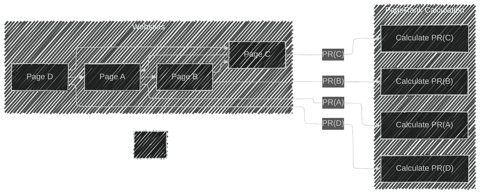

# Link Analysis: The Foundation of Search Engines and Social Networks
> This content is dual-licensed under your choice of the following licenses:
> 1.  **MIT License:** For the code implementations in Swift and Mermaid provided in this document.
> 2.  **Creative Commons Attribution 4.0 International License (CC BY 4.0):** For all other content, including the text, explanations, and the Mermaid diagrams and illustrations.

---

**Purpose**: Link analysis is a technique used to evaluate the relationships (links) between nodes (web pages, social media profiles, etc.) in a network. It forms the basis of search engines and social networks by assessing the structure of links to determine the importance, relevance, and influence of nodes within the network.

---

## **Overview of Link Analysis**

Link analysis involves examining the connections between nodes in a graph to extract meaningful patterns, measure importance, and understand the structure of the network. It is essential in:

- **Search Engines**: To rank web pages based on their relevance and authority.
- **Social Networks**: To identify influential users, communities, and the flow of information.

---

## **Key Concepts in Link Analysis**

1. **Graphs and Networks**
2. **Centrality Measures**
3. **PageRank Algorithm**
4. **HITS Algorithm**
5. **Community Detection**
6. **Current Industry Practices**

We'll explore each concept in detail with associated diagrams.

---

## **1. Graphs and Networks**

In link analysis, data is represented as a graph where:

- **Nodes (Vertices)**: Represent entities like web pages or users.
- **Edges (Links)**: Represent relationships or connections between entities.

### **Directed vs. Undirected Graphs**

- **Directed Graphs**: Edges have a direction, indicating a one-way relationship.
- **Undirected Graphs**: Edges have no direction, indicating a mutual relationship.

---

## **2. Centrality Measures**

Centrality measures help identify the most important nodes in a network.

### **Types of Centrality**

- **Degree Centrality**: Number of direct connections a node has.
- **Betweenness Centrality**: Frequency at which a node appears on the shortest path between other nodes.
- **Closeness Centrality**: Average length of the shortest path from the node to all other nodes.
- **Eigenvector Centrality**: Measures influence by considering the importance of connected nodes (basis for PageRank).

---

## **3. PageRank Algorithm**

Developed by Larry Page and Sergey Brin, PageRank calculates the importance of web pages based on incoming links.

### **Algorithm Overview**

- **Concept**: A page is important if it is linked to by other important pages.
- **Random Surfer Model**: Simulates a user randomly clicking links, with a probability of jumping to a random page.

### **Mathematical Formulation**

The PageRank of a page \( u \) is given by:

$$
PR(u) = \frac{1 - d}{N} + d \sum_{v \in B_u} \frac{PR(v)}{L(v)}
$$

Where:

- $PR(u)$: PageRank of page $u$.
- $d$: Damping factor (typically set to 0.85).
- $N$: Total number of pages.
- $B_u$: Set of pages linking to $u$.
- $L(v)$: Number of outbound links from page $v$.

### **PageRank Calculation Example**

- **Iteration 1**: Assign initial PageRank $PR = \frac{1}{4} = 0.25$ to each page.
- **Iteration 2**: Recalculate $PR$ using the formula until convergence.

### **Convergence Illustration**

---

## **4. HITS Algorithm (Hyperlink-Induced Topic Search)**

Proposed by Jon Kleinberg, HITS identifies two values for each page:

- **Authority Score**: Indicates the value of content.
- **Hub Score**: Indicates the value of links to other pages.

### **Algorithm Overview**

- **Authorities** are pages linked by good hubs.
- **Hubs** are pages that link to good authorities.

### **Mathematical Formulation**

Let:

- $a_i$: Authority score of page $i$.
- $h_i$: Hub score of page $i$.

Update rules:

$$
a_i = \sum_{j \text{ s.t. } (j, i) \in E} h_j
$$
$$
h_i = \sum_{k \text{ s.t. } (i, k) \in E} a_k
$$

- **Normalize** $a_i$ and $h_i$ after each iteration.

### **HITS Calculation Example**

- **Initialization**: Set all $a_i = h_i = 1$.
- **Iteration**: Update $a_i$ and $h_i$ using the rules until convergence.

---

## **5. Community Detection**

Identifying groups (communities) within the network where nodes are more densely connected internally.

### **Modularity Maximization**

Quantifies the quality of a division of a network into communities.

$$
Q = \frac{1}{2m} \sum_{i,j} \left[ A_{ij} - \frac{k_i k_j}{2m} \right] \delta(c_i, c_j)
$$

Where:

- $A_{ij}$: Adjacency matrix.
- $k_i$: Degree of node $i$.
- $m$: Total number of edges.
- $c_i$: Community of node $i$.
- $\delta(c_i, c_j)$: Kronecker delta (1 if $c_i = c_j$, else 0).

### **Community Detection Example**

- **Observation**: Dense connections within communities, sparse between them.

---

## **6. Application in Search Engines**

### **Web Page Ranking**

- **Crawling**: Search engines crawl web pages and extract links.
- **Indexing**: Content and links are indexed.
- **Ranking**: Pages are ranked based on link analysis algorithms (PageRank).

### **Importance of PageRank**

- **Relevance**: Higher PageRank indicates more authoritative pages.
- **Spam Resistance**: Difficult to manipulate compared to content keywords.

---

## **7. Application in Social Networks**

### **Influence Maximization**

- **Identifying Influencers**: Users with high centrality metrics are more influential.
- **Information Spread**: Modeling how information propagates through the network.

### **Social Network Analysis**

- **Community Detection**: Finding groups of users with common interests.
- **Recommendation Systems**: Suggesting friends or content based on link structures.

---

## **8. Current Industry Practices**

### **Search Engines**

- **Google's Evolving Algorithms**: Incorporating machine learning, semantic analysis.
- **RankBrain**: Google's AI system to process search queries.
- **Beyond PageRank**: Combining link analysis with user behavior metrics (click-through rates).

### **Social Media Platforms**

- **Graph Databases**: Efficiently storing and querying connections (e.g., Facebook's TAO).
- **Real-Time Analytics**: Monitoring network dynamics for trends and insights.
- **Privacy Considerations**: Balancing data analysis with user privacy.

---

## **9. Advanced Link Analysis Techniques**

### **Semantic Link Analysis**

- **Contextual Understanding**: Analyzing the context of links (anchor text, surrounding content).
- **Knowledge Graphs**: Mapping entities and their relationships.

### **Temporal Network Analysis**

- **Dynamic Networks**: Considering changes over time.
- **Event Detection**: Identifying significant shifts in network structure.

### **Machine Learning Integration**

- **Graph Neural Networks (GNNs)**: Learning representations of nodes and edges for predictive tasks.
- **DeepWalk and Node2Vec**: Algorithms for embedding nodes in continuous vector spaces.

---

## **10. Challenges and Considerations**

### **Scalability**

- **Large Networks**: Handling billions of nodes and edges requires efficient algorithms.

### **Spam and Manipulation**

- **Link Farms**: Artificially inflating importance.
- **Countermeasures**: Algorithms must detect and mitigate manipulation.

### **Privacy and Ethics**

- **Data Usage**: Ethical considerations in analyzing personal data.
- **Regulations**: Compliance with laws like GDPR.

---

## **Conclusion**

Link analysis is a critical component in the functioning of search engines and social networks. By understanding the structure and relationships within networks, organizations can:

- **Improve Search Results**: Deliver more relevant and authoritative content.
- **Enhance Social Connectivity**: Foster meaningful interactions among users.
- **Gain Insights**: Identify trends, influencers, and communities.

As technology evolves, link analysis continues to integrate advanced techniques like machine learning to further enhance its efficacy.

---

# **Appendix: Additional Diagrams and Illustrations**

## **PageRank Flow Diagram**

## **HITS Algorithm Interaction**

---

# **References**

- **PageRank**: Page, L., Brin, S., Motwani, R., & Winograd, T. (1999). *The PageRank Citation Ranking: Bringing Order to the Web.*
- **HITS Algorithm**: Kleinberg, J. M. (1999). *Authoritative sources in a hyperlinked environment.*
- **Graph Theory**: Diestel, R. (2005). *Graph Theory (Graduate Texts in Mathematics).*

---
**Licenses:**

- **MIT License:**   - Full text in [LICENSE](LICENSE) file.
- **Creative Commons Attribution 4.0 International:**  - Legal details in [LICENSE-CC-BY](LICENSE-CC-BY) and at [Creative Commons official site](http://creativecommons.org/licenses/by/4.0/).

---