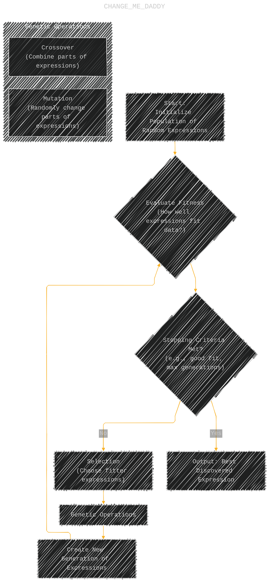
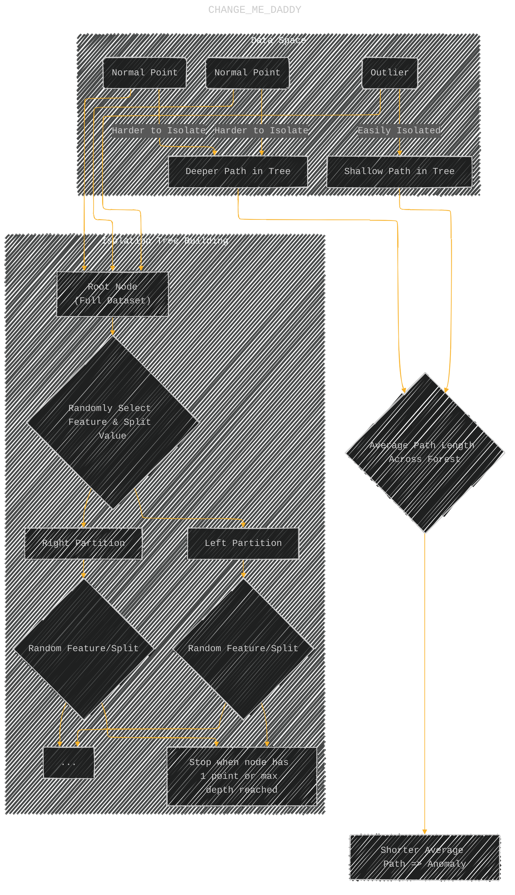
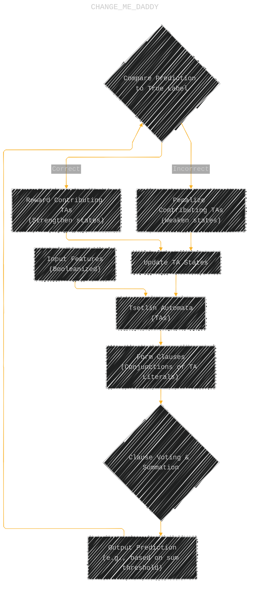
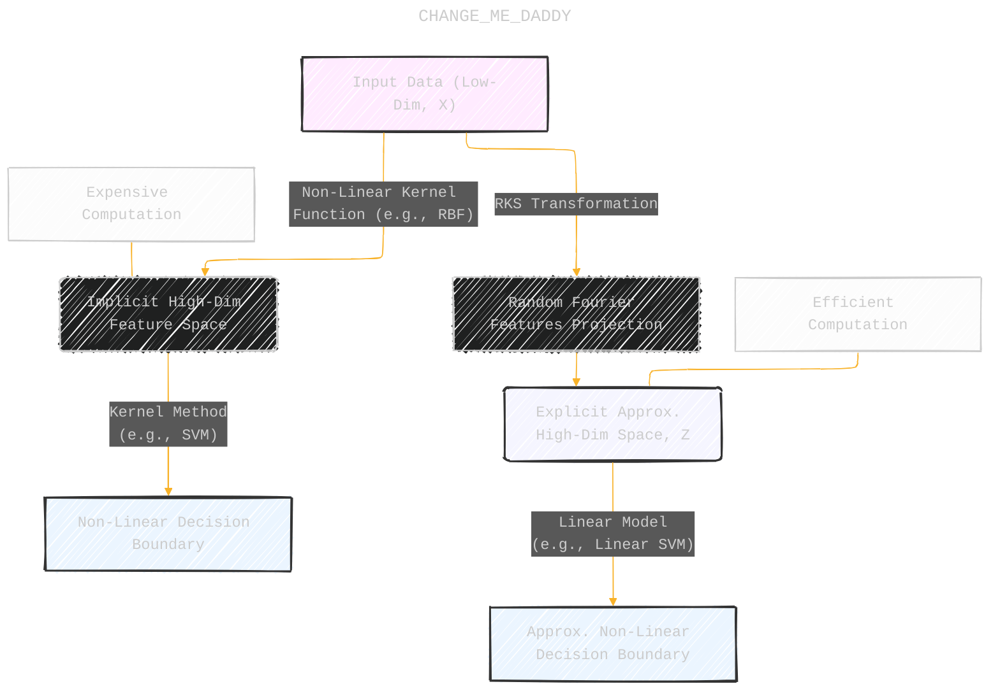
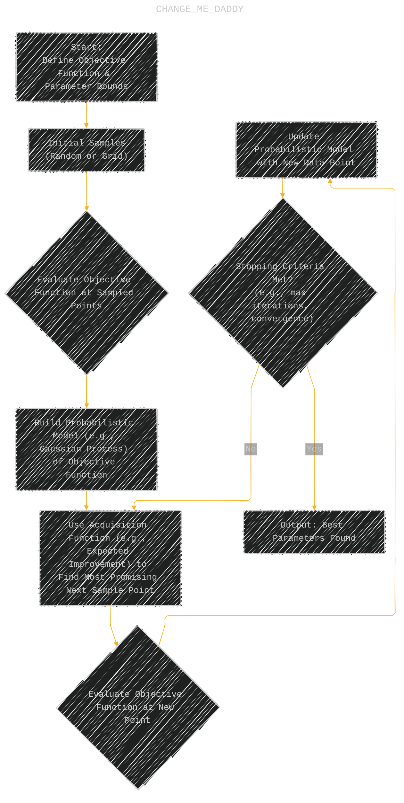
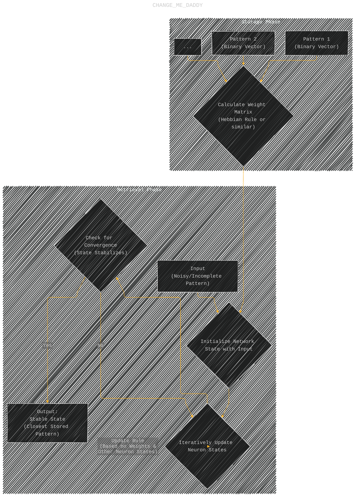
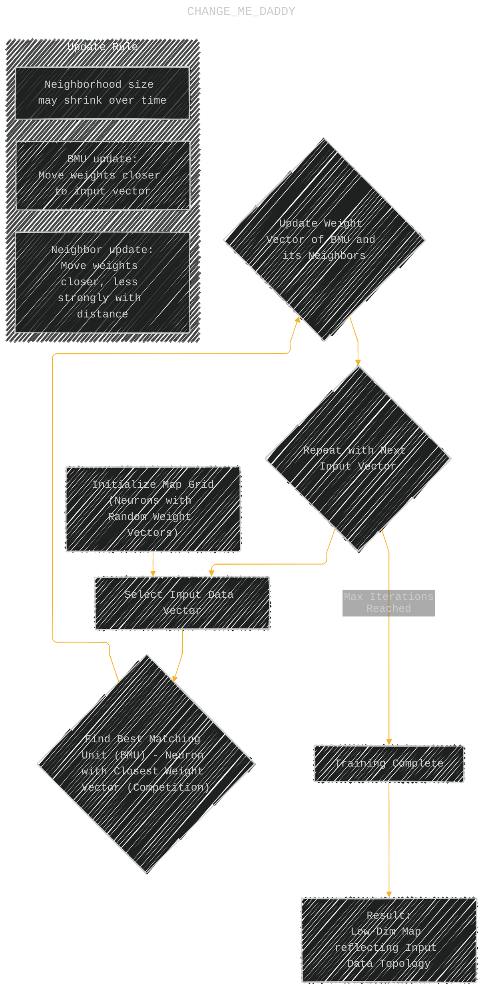
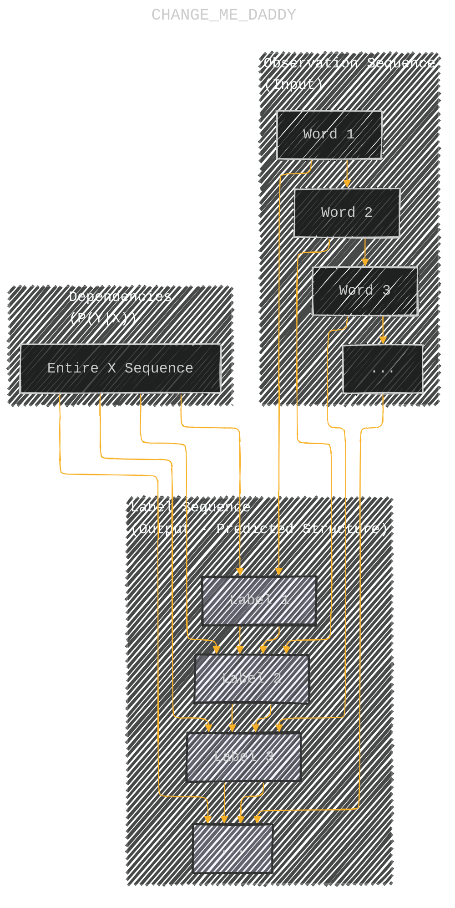
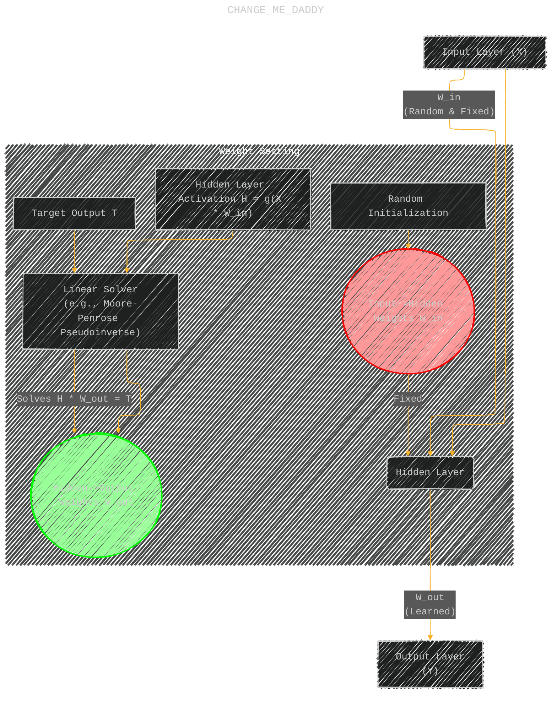
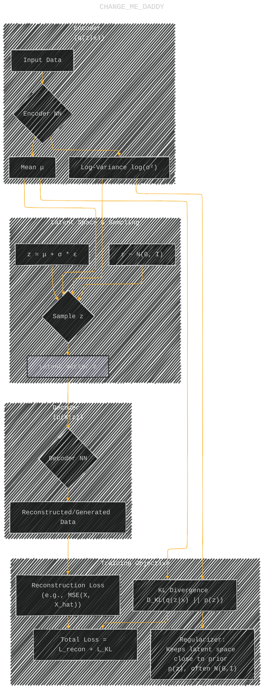

# Machine Learning Algorithms You Never Knew Existed, But Are Quite Useful
> This content is dual-licensed under your choice of the following licenses:
> 1.  **MIT License:** For the code implementations in Swift and Mermaid provided in this document.
> 2.  **Creative Commons Attribution 4.0 International License (CC BY 4.0):** For all other content, including the text, explanations, and the Mermaid diagrams and illustrations.

---


The diagrams below aim to provide clearer visual intuition for the core ideas behind each algorithm discussed in the article.


---

## 1. Symbolic Regression (Genetic Programming Core)

Symbolic Regression uses genetic programming to *discover* the underlying mathematical expression. This diagram illustrates the iterative evolutionary process.



**Explanation:** The algorithm starts with random mathematical expressions. It iteratively evaluates them, selects the best ones, and applies genetic operations (like combining parts of different expressions or randomly changing them) to create a new generation, mimicking natural selection until a satisfactory expression is found.

-----

## 2. Isolation Forest (Anomaly Detection Mechanism)

Isolation Forests identify outliers by how easily they can be separated from the rest of the data. Outliers require fewer random partitions to be isolated.



**Explanation:** The algorithm builds multiple trees. In each tree, data is randomly partitioned. Outliers, being far from dense regions, tend to be isolated in fewer steps (shallower paths). Averaging path lengths across many trees identifies anomalies.

----

## 3. Tsetlin Machine (Conceptual Learning Loop)

Tsetlin Machines use Tsetlin Automata (TA) and propositional logic. They learn through a reward/penalty system applied to the states of the TAs based on the correctness of their contribution to the overall prediction.



**Explanation:** Boolean inputs activate Tsetlin Automata. These form logical clauses that vote on the output. Based on whether the prediction is correct or incorrect, the states within the TAs that formed the active clauses are reinforced or weakened, refining the logical patterns over time.

----

## 4. Random Kitchen Sinks (Kernel Approximation)

RKS approximates complex kernel functions (like those in SVMs) by mapping data to a higher-dimensional space using random Fourier features, allowing a *linear* model in that new space to mimic the *non-linear* behavior of the kernel.




**Explanation:** Instead of the computationally expensive step of working implicitly in a high-dimensional space via a kernel function (A->B->C), RKS explicitly maps the data to a (different but related) high-dimensional space using random functions (A->D->E). A simple linear model in this new space (E->F) can then approximate the original non-linear decision boundary, but much more efficiently.

----

## 5. Bayesian Optimization (Iterative Search Process)

Bayesian Optimization intelligently searches for the best parameters of an expensive function by building a probabilistic model of it and using an acquisition function to decide where to sample next.



**Explanation:** The process starts with a few initial guesses. It builds a statistical model (surrogate) of the function being optimized. An acquisition function then uses this model to balance exploring uncertain regions and exploiting promising regions, guiding the selection of the next point to evaluate. This cycle repeats until a stopping condition is met.

----

## 6. Hopfield Networks (Pattern Storage and Retrieval)

Hopfield Networks act as associative memory, storing patterns and retrieving the closest stored pattern when presented with a noisy or incomplete version.



**Explanation:** During storage, patterns are encoded into the network's weight matrix. During retrieval, an input pattern sets the initial state. Neurons then update their states based on the weights and the states of other neurons asynchronously or synchronously until the network converges to a stable state, which ideally corresponds to one of the stored patterns.

----

## 7. Self-Organizing Maps (SOM) (Competitive Learning & Topology Preservation)

SOMs map high-dimensional data onto a low-dimensional grid, preserving the topological relationships of the input data through competitive learning and neighborhood updates.



**Explanation:** For each input data point, the neuron on the map grid whose weights are most similar (the BMU) is found. The BMU's weights are adjusted to be even closer to the input. Crucially, the weights of neurons *near* the BMU on the grid are also adjusted similarly (but less strongly), ensuring that similar inputs map to nearby locations on the grid, thus preserving the data's structure.

----

## 8. Field-Aware Factorization Machines (FFM) vs. Factorization Machines (FM)

FFMs extend FMs by making the latent vectors used for feature interactions *field-aware*, allowing for more nuanced modeling, especially with categorical data grouped into fields.

```mermaid
graph TD
    subgraph FM["Factorization Machine"]
        direction LR
        F1["Feature i<br/>(e.g., User U1)"] --> V_i[("Latent Vector V_i")]
        F2["Feature j<br/>(e.g., Item I1)"] --> V_j[("Latent Vector V_j")]
        Interaction_FM(("Interaction i, j")) ~~~ V_i
        Interaction_FM ~~~ V_j
        Calc_FM["Calculate: <V_i, V_j>"]
        Interaction_FM --> Calc_FM
    end

    subgraph FFM["Field-Aware Factorization Machine"]
        direction LR
        FF1["Feature i<br/>(User U1, Field: User)"] --> V_i_fItem[("Latent Vector V_i for Field Item")]
        FF2["Feature j<br/>(Item I1, Field: Item")] --> V_j_fUser[("Latent Vector V_j for Field User")]
        Interaction_FFM(("Interaction i, j")) ~~~ V_i_fItem
        Interaction_FFM ~~~ V_j_fUser
        Calc_FFM["Calculate: <V_i_fItem, V_j_fUser>"]
        Interaction_FFM --> Calc_FFM
    end

    %% Note1["Feature 'i' has ONE vector V_i used for interactions with ALL other features j."]:::fmNote -- F1
    %% Note2["Feature 'i' has MULTIPLE vectors, one for interacting with each field (e.g., V_i_fItem for interacting with Item field features)."]:::ffmNote -- FF1

    %% classDef fmNote fill:#fdd3,stroke:#f00
    %% classDef ffmNote fill:#dfd3,stroke:#0f0
    
```


**Explanation:** In FMs, each feature has *one* latent vector used for all its interactions. In FFMs, features are grouped into 'fields' (e.g., User, Item, Publisher). A feature `i` has *multiple* latent vectors, one specific to interacting with features from each other field `f`. When feature `i` (from field `f_i`) interacts with feature `j` (from field `f_j`), FFM uses `i`'s vector specific to field `f_j` and `j`'s vector specific to field `f_i`.

----

## 9. Conditional Random Fields (CRF) (Structured Prediction for Sequences)

CRFs model the probability of a label sequence given an observation sequence, explicitly considering dependencies between adjacent labels, making them strong for tasks like Named Entity Recognition or Part-of-Speech tagging.



**Explanation:** Unlike models predicting each label independently, CRFs model the probability of the entire label sequence `Y` given the input sequence `X`. The prediction for label `Y_i` considers not only the corresponding input `X_i` (and potentially the whole input sequence) but also the *previously predicted label* `Y_{i-1}`, capturing the sequential structure.

---

## 10. Extreme Learning Machines (ELM) (Training Process)

ELMs simplify feedforward neural network training by fixing the input-to-hidden layer weights randomly and only learning the hidden-to-output layer weights, typically via a fast linear solver.




**Explanation:** Data flows from input to hidden layer using randomly assigned and then *fixed* weights (`W_in`). The activations of the hidden layer (`H`) are calculated. The only part that is "learned" are the weights from the hidden layer to the output layer (`W_out`). This is often solved directly using linear algebra (finding `W_out` such that `H * W_out` approximates the target `T`), avoiding iterative backpropagation.

----

## Bonus: Variational Autoencoder (VAE) (Generative Process)

VAEs learn a probabilistic latent space. The encoder maps input data to parameters (mean μ, variance σ) of a distribution, and the decoder generates data from samples drawn from this distribution.




**Explanation:** An input `X` is encoded not to a single point, but to the parameters (mean `μ`, log-variance `log(σ²)`) of a probability distribution in the latent space. A latent vector `z` is then *sampled* from this distribution (specifically, from N(μ, σ²)). This sampled `z` is fed into the decoder network to generate an output `X_hat`. The training optimizes both reconstructing the input (Reconstruction Loss) and keeping the learned distributions close to a standard normal distribution (KL Divergence). This probabilistic sampling allows VAEs to generate novel data similar to the training set.


---
**Licenses:**

- **MIT License:**  [](LICENSE) - Full text in [LICENSE](LICENSE) file.
- **Creative Commons Attribution 4.0 International:** [](LICENSE-CC-BY) - Legal details in [LICENSE-CC-BY](LICENSE-CC-BY) and at [Creative Commons official site](http://creativecommons.org/licenses/by/4.0/).

---