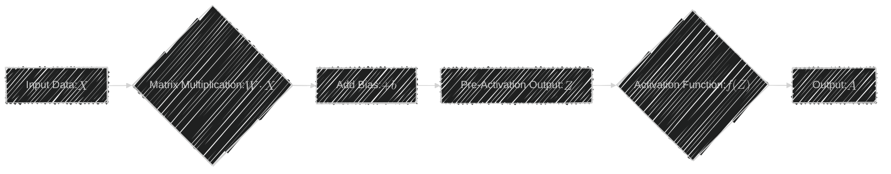
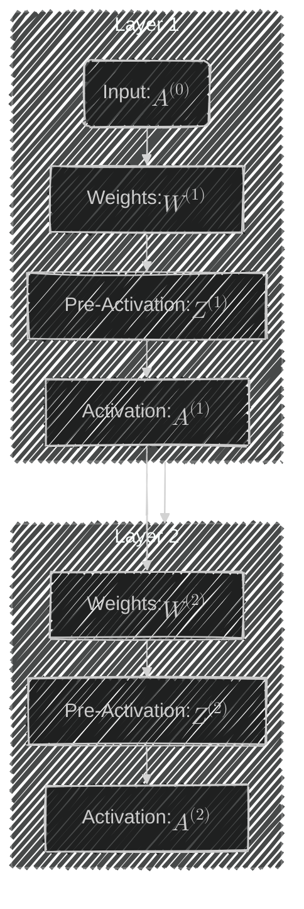

# Matrix Multiplications and Linear Algebra Operations in Neural Networks
> This content is dual-licensed under your choice of the following licenses:
> 1.  **MIT License:** For the code implementations in Swift and Mermaid provided in this document.
> 2.  **Creative Commons Attribution 4.0 International License (CC BY 4.0):** For all other content, including the text, explanations, and the Mermaid diagrams and illustrations.

---

Matrix multiplications and linear algebra operations are the foundational mathematical tools that enable neural networks to process and learn from data. They are crucial in both the **forward pass** (the process of computing the output of a neural network) and **backpropagation** (the process of computing gradients to update the network's weights).

In this explanation, we'll delve into how these operations underpin neural network computations, covering technical concepts and complexities, and illustrate them using Mermaid diagrams.

---

## Overview of Neural Networks

A neural network consists of layers of interconnected neurons (nodes) that process input data to produce an output. Each neuron performs computations using input data, weights, biases, and activation functions.

### Simple Neural Network Structure

---

## Forward Pass and Matrix Multiplication

During the forward pass, the neural network computes the output by performing a series of matrix multiplications and applying activation functions.

### Computations in a Single Layer

For a single layer, the computation is:

$$
\mathbf{Z} = \mathbf{W} \cdot \mathbf{X} + \mathbf{b}
$$

- $\mathbf{X}$: Input vector (size $n$)
- $\mathbf{W}$: Weight matrix (size $m \times n$)
- $\mathbf{b}$: Bias vector (size $m$)
- $\mathbf{Z}$: Pre-activation output (size $m$)

After applying an activation function $f$:

$$
\mathbf{A} = f(\mathbf{Z})
$$

- $\mathbf{A}$: Activated output (size $m$)

### **Forward Pass Flowchart**

---

## Matrix Multiplication in the Forward Pass

### **Why Matrix Multiplication?**

Matrix multiplication allows simultaneous computation of weighted sums for multiple neurons in a layer efficiently using linear algebra operations.

- **Efficient Computation**: Takes advantage of optimized numerical libraries and hardware acceleration.
- **Parallelism**: Enables parallel processing of data, essential for handling large datasets.

### **Mathematical Representation**

For a batch of inputs $\mathbf{X}$ (size $n \times B$, where $B$ is the batch size):

$$
\mathbf{Z} = \mathbf{W} \cdot \mathbf{X} + \mathbf{b}
$$

- $\mathbf{W}$: Weight matrix (size $m \times n$)
- $\mathbf{b}$: Bias vector broadcasted to match dimensions.

---

## Example: Forward Pass Computation

**Suppose**:

- **Input Vector** $\mathbf{X}$: $\begin{bmatrix} x_1 \\ x_2 \end{bmatrix}$
- **Weights** $\mathbf{W}$: $\begin{bmatrix} w_{11} & w_{12} \\ w_{21} & w_{22} \end{bmatrix}$
- **Biases** $\mathbf{b}$: $\begin{bmatrix} b_1 \\ b_2 \end{bmatrix}$

**Compute Pre-Activation Output**:

$$
\mathbf{Z} = \begin{bmatrix} w_{11} & w_{12} \\ w_{21} & w_{22} \end{bmatrix} \cdot \begin{bmatrix} x_1 \\ x_2 \end{bmatrix} + \begin{bmatrix} b_1 \\ b_2 \end{bmatrix} = \begin{bmatrix} z_1 \\ z_2 \end{bmatrix}
$$

**Apply Activation Function $f$**:

$$
\mathbf{A} = f(\mathbf{Z}) = \begin{bmatrix} f(z_1) \\ f(z_2) \end{bmatrix}
$$

---

## Backpropagation and Matrix Multiplication

Backpropagation involves computing the gradient of the loss function with respect to the weights and biases to update them during training.

### Computations Involved in Backpropagation

#### 1. Compute Error at Output Layer

   $$
   \delta^{(L)} = \nabla_{\mathbf{A}^{(L)}} \mathcal{L} \odot f'(\mathbf{Z}^{(L)})
   $$

   - $\delta^{(L)}$: Error term at layer $L$
   - $\mathcal{L}$: Loss function
   - $f'$: Derivative of the activation function
   - $\odot$: Element-wise multiplication

#### 2. Propagate Error Backwards

   For layer $l$:

   $$
   \delta^{(l)} = (\mathbf{W}^{(l+1)T} \cdot \delta^{(l+1)}) \odot f'(\mathbf{Z}^{(l)})
   $$

#### 3. Compute Gradients

   - **Weights Gradient**:

     $$
     \frac{\partial \mathcal{L}}{\partial \mathbf{W}^{(l)}} = \delta^{(l)} \cdot \mathbf{A}^{(l-1)T}
     $$

   - **Biases Gradient**:

     $$
     \frac{\partial \mathcal{L}}{\partial \mathbf{b}^{(l)}} = \delta^{(l)}
     $$

### **Backpropagation Flowchart**

---

## Matrix Multiplication in Backpropagation

### **Role in Gradient Computations**

- **Error Propagation**: Multiplying the transposed weight matrix by the error term propagates the error backward through the network.
  
  $$
  \delta^{(l)} = (\mathbf{W}^{(l+1)T} \cdot \delta^{(l+1)}) \odot f'(\mathbf{Z}^{(l)})
  $$

- **Gradient Calculation**: Computing the outer product of the error term and the activations from the previous layer yields the gradient with respect to the weights.
  
  $$
  \frac{\partial \mathcal{L}}{\partial \mathbf{W}^{(l)}} = \delta^{(l)} \cdot \mathbf{A}^{(l-1)T}
  $$

### **Example: Backpropagation Computation**

**Given**:

- **Error at Layer $l+1$**: $\delta^{(l+1)}$
- **Weights $\mathbf{W}^{(l+1)}$**

**Compute Error at Layer $l$**:

$$
\delta^{(l)} = (\mathbf{W}^{(l+1)T} \cdot \delta^{(l+1)}) \odot f'(\mathbf{Z}^{(l)})
$$

**Compute Gradients**:

- **Weights**:

  $$
  \frac{\partial \mathcal{L}}{\partial \mathbf{W}^{(l)}} = \delta^{(l)} \cdot \mathbf{A}^{(l-1)T}
  $$

- **Biases**:

  $$
  \frac{\partial \mathcal{L}}{\partial \mathbf{b}^{(l)}} = \delta^{(l)}
  $$

---

## Integration of Matrix Operations in Neural Networks

### **Layer-wise Computations**

In deep neural networks, these matrix operations are performed layer by layer, enabling the network to learn complex patterns and representations.

### **Computational Graph**

The neural network computations can be represented as a computational graph, where nodes represent operations, and edges represent the flow of data.

---

## Efficient Computation with Linear Algebra Libraries

Modern deep learning frameworks (e.g., TensorFlow, PyTorch) leverage optimized linear algebra libraries and hardware accelerators (GPUs, TPUs) to perform these operations efficiently.

### **Batch Processing**

- **Mini-batches**: Processing multiple inputs simultaneously by stacking them into matrices.
- **Benefits**: Improves computational efficiency and allows parallel computation.

### **Hardware Acceleration**

- **GPUs**: Designed for parallel processing of large matrices.
- **Optimized Libraries**: Use BLAS (Basic Linear Algebra Subprograms) libraries like cuBLAS for GPU computations.

---

## Complexities and Technical Concepts

### **Dimensionality Considerations**

- **Matching Dimensions**: Matrix multiplication requires that the number of columns in the first matrix matches the number of rows in the second matrix.
- **Shape Management**: Ensuring correct tensor shapes is essential to prevent computational errors.

### **Computational Complexity**

- **Matrix Multiplication Cost**: For matrices of size $m \times n$ and $n \times p$, the time complexity is $O(mnp)$.
- **Scalability**: Efficient implementations are necessary to handle high-dimensional data and large networks.

### **Activation Functions and Derivatives**

- **Common Activation Functions**:
  - **Sigmoid**: $f(z) = \frac{1}{1 + e^{-z}}$
  - **ReLU**: $f(z) = \max(0, z)$
  - **Tanh**: $f(z) = \tanh(z)$
- **Derivative Computations**: Required for backpropagation to compute $f'(z)$.

### **Chain Rule in Backpropagation**

Backpropagation relies on the chain rule from calculus to compute gradients through the layers.

- **Gradient of Loss with Respect to Weights**:

  $$
  \frac{\partial \mathcal{L}}{\partial \mathbf{W}^{(l)}} = \frac{\partial \mathcal{L}}{\partial \mathbf{A}^{(L)}} \cdot \prod_{k=l}^{L} \frac{\partial \mathbf{A}^{(k)}}{\partial \mathbf{Z}^{(k)}} \cdot \frac{\partial \mathbf{Z}^{(k)}}{\partial \mathbf{W}^{(k)}}
  $$

---

## Illustrative Example: End-to-End Computation

### Forward Pass and Backpropagation

Consider a simple neural network with one input layer, one hidden layer, and one output layer.

#### Forward Pass Equations

  1. **Hidden Layer**:

     $$
     z^{(1)} = w^{(1)} x + b^{(1)}
     $$

     $$
     a^{(1)} = f(z^{(1)})
     $$

  2. **Output Layer**:

     $$
     z^{(2)} = w^{(2)} a^{(1)} + b^{(2)}
     $$

     $$
     \hat{y} = f(z^{(2)})
     $$

- **Loss Function**:

  $$
  \mathcal{L} = \frac{1}{2} (\hat{y} - y)^2
  $$

#### Backpropagation Steps

  1. **Compute Output Error**:

     $$
     \delta^{(2)} = (\hat{y} - y) \cdot f'(z^{(2)})
     $$

  2. **Compute Gradient w.r.t. Weights \( w^{(2)} \)**:

     $$
     \frac{\partial \mathcal{L}}{\partial w^{(2)}} = \delta^{(2)} \cdot a^{(1)}
     $$

  3. **Backpropagate Error to Hidden Layer**:

     $$
     \delta^{(1)} = w^{(2)} \delta^{(2)} \cdot f'(z^{(1)})
     $$

  4. **Compute Gradient w.r.t. Weights \( w^{(1)} \)**:

     $$
     \frac{\partial \mathcal{L}}{\partial w^{(1)}} = \delta^{(1)} \cdot x
     $$

---

## Conclusion

Matrix multiplications and linear algebra operations are integral to the functioning of neural networks. They enable efficient computation of neuron activations during the forward pass and facilitate the calculation of gradients during backpropagation.

Understanding these operations is crucial for:

- **Designing Neural Network Architectures**: Knowing how data flows through layers.
- **Optimizing Computations**: Leveraging efficient algorithms and hardware.
- **Implementing Custom Models**: Tailoring models to specific applications.

---

## **Additional Resources**

- **Understanding Matrix Multiplication**:

- **Deep Learning Frameworks**:

  - **TensorFlow**: Provides tools for defining and running computations involving tensors.
  - **PyTorch**: Offers dynamic computation graphs and easy-to-use APIs for tensor operations.

---
**Licenses:**

- **MIT License:**   - Full text in [LICENSE](LICENSE) file.
- **Creative Commons Attribution 4.0 International:**  - Legal details in [LICENSE-CC-BY](LICENSE-CC-BY) and at [Creative Commons official site](http://creativecommons.org/licenses/by/4.0/).

---