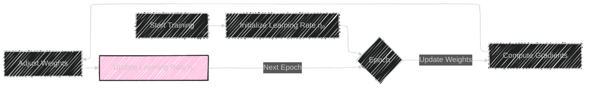
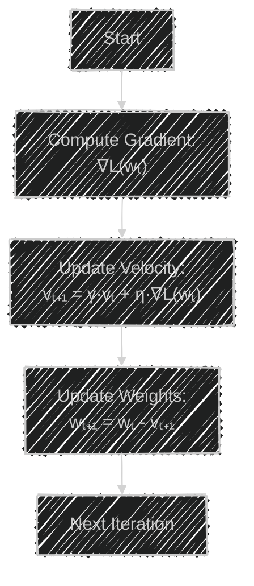
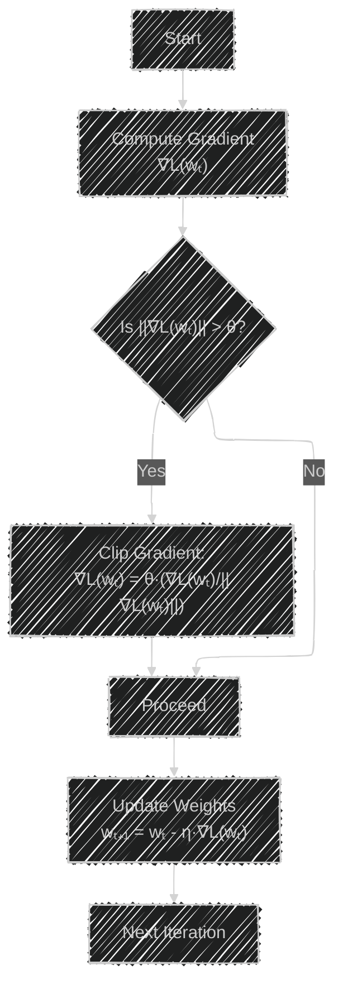
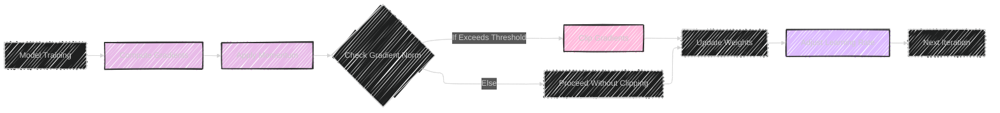
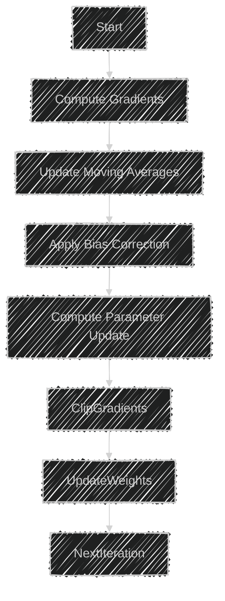
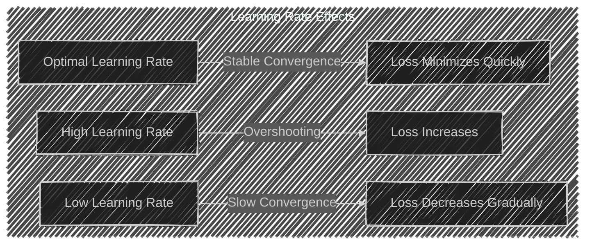
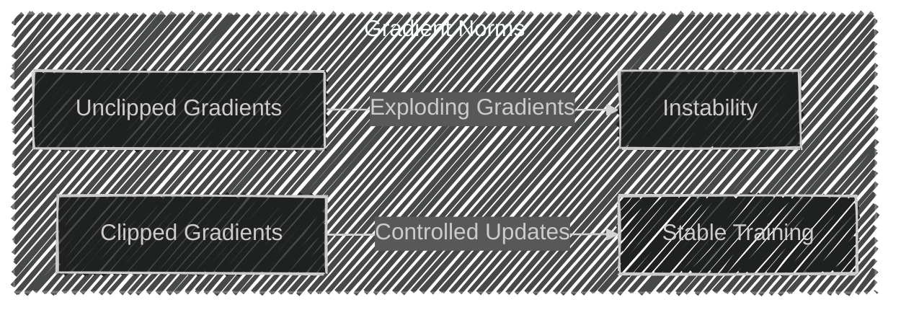

# Optimization Techniques in Machine Learning
> This content is dual-licensed under your choice of the following licenses:
> 1.  **MIT License:** For the code implementations in Swift and Mermaid provided in this document.
> 2.  **Creative Commons Attribution 4.0 International License (CC BY 4.0):** For all other content, including the text, explanations, and the Mermaid diagrams and illustrations.

---

Optimization techniques are crucial in training machine learning models effectively and efficiently. They enhance training efficiency, ensure convergence, and improve both the stability and speed of model training. In this discussion, we'll delve deeper into three key optimization techniques:

- **Learning Rate Schedules**
- **Momentum**
- **Gradient Clipping**

---

## 1. Learning Rate Schedules

### **Purpose**

Adjust the learning rate during training to balance convergence speed and stability.

### **Explanation**

The **learning rate** (denoted as $\eta$ or $\alpha$) determines the size of the steps taken during optimization. A well-chosen learning rate can significantly accelerate training, while a poorly chosen one can hinder convergence or cause instability.

**Learning Rate Schedules** adjust the learning rate over time according to a pre-defined schedule or adaptively based on training progress.

### Common Learning Rate Schedules

#### 1. Time-Based Decay

$$
   \eta_t = \frac{\eta_0}{1 + kt}
$$
#### 2. Step Decay

   Reduce $\eta$ by a factor every few epochs.

#### 3. Exponential Decay

$$
   \eta_t = \eta_0 \cdot e^{-kt}
$$
#### 4. Cosine Annealing
$$
   \eta_t = \eta_{\text{min}} + \frac{1}{2} (\eta_{\text{max}} - \eta_{\text{min}}) \left(1 + \cos\left(\frac{T_{\text{cur}}}{T_{\text{max}}}\pi\right)\right)
$$

#### 5. Adaptive Learning Rates

   Algorithms like **ADAM**, **RMSprop** adjust $\eta$ based on gradient statistics.

### Illustration

### **Key Concepts**

- **Balance Between Speed and Stability**: High $\eta$ may speed up learning but cause overshooting; low $\eta$ ensures stability but slows convergence.
- **Adaptive Methods**: Adjust  $\eta$ per parameter; useful for sparse data or parameters with different sensitivities.

### **Practical Considerations**

- **Warm Restarts**: Resetting $\eta$ to a higher value periodically can help escape local minima.
- **Learning Rate Range Test**: Finding an optimal $\eta$ by testing over an exponential range.
- **Cyclical Learning Rates**: Vary $\eta$ between bounds to potentially achieve better performance.

---

## **2. Momentum**

### **Purpose**

Accelerate convergence by smoothing out oscillations and accumulating gradients.

### **Explanation**

**Momentum** adds a fraction of the previous weight update to the current update, effectively smoothing the optimization path and helping to navigate ravines in the loss landscape.

### **Mathematical Formulation**

Standard Gradient Descent Update:

$$
w_{t+1} = w_t - \eta \nabla L(w_t)
$$

With Momentum:

$$
v_{t+1} = \gamma v_t + \eta \nabla L(w_t)
$$

$$
w_{t+1} = w_t - v_{t+1}
$$

Where:

- $v_t$ is the velocity (accumulated gradient).
- $\gamma$ is the momentum coefficient (typically 0.9).

### **Illustration**

### **Key Concepts**

- **Acceleration in Relevant Directions**: Helps move faster along shallow gradients.
- **Dampening Oscillations**: Reduces fluctuations perpendicular to the path of steepest descent.

### **Variants of Momentum**

- **Nesterov Accelerated Gradient (NAG)**: Looks ahead by computing gradient at the approximate future position.
$$
v_{t+1} = \gamma v_t + \eta \nabla L(w_t - \gamma v_t)
$$

---

## **3. Gradient Clipping**

### **Purpose**

Prevent exploding gradients by capping them at a maximum threshold.

### **Explanation**

**Exploding gradients** occur when large error gradients accumulate during training, particularly in recurrent neural networks (RNNs). **Gradient Clipping** mitigates this by scaling down gradients exceeding a certain norm.

### **Mathematical Formulation**

Given a threshold $\theta$:

- **Global Norm Clipping**:

  If $\|\nabla L(w_t)\|_2 > \theta$, scale gradients:
$$
\nabla L(w_t) = \theta \frac{\nabla L(w_t)}{\|\nabla L(w_t)\|_2}
$$

### **Illustration**

### **Key Concepts**

- **Norm Types**:

  - **$L_2$ Norm (Euclidean)**: Commonly used for gradient clipping.
  - **$L_\infty$ Norm (Max Absolute Value)**: Clips gradients based on the maximum element.

- **Applications in RNNs**: Especially important due to their depth in time.

### **Benefits**

- **Stabilizes Training**: Prevents severe weight updates that could destabilize learning.
- **Improves Convergence**: Maintains consistent gradient magnitudes.

---

# Integrated View of Optimization Techniques

These techniques often work best when combined, each addressing different aspects of the optimization process.

- **Compute Gradients**: Obtain $\nabla L(w_t)$ based on the loss function.
- **Apply Momentum**: Adjust gradients using past accumulation.
- **Check Gradient Norm**: Determine if clipping is necessary.
- **Update Weights**: Modify model parameters.
- **Adjust Learning Rate**: Modify $\eta$ according to the schedule.

---

# Applications and Industry Practices

### **Improving Stability and Speed**

- **Adaptive Optimization Algorithms**: Combine momentum and adaptive learning rates (e.g., **Adam**, **AdaGrad**).

- **Learning Rate Warmup**: Start with a low $\eta$ and gradually increase, preventing initial instability.

- **Gradient Noise Addition**: Sometimes adding noise to gradients can escape local minima (Stochastic Gradient Langevin Dynamics).

### **Current Industry Trends**

- **Optimization Libraries**: Use of libraries like **TensorFlow's** `tf.optimizers` or **PyTorch's** `torch.optim` that implement these techniques out of the box.

- **Hyperparameter Tuning**: Automated tools and frameworks (e.g., **Optuna**, **Ray Tune**) to find optimal settings.

- **Mixed Precision Training**: Utilizing lower-precision arithmetic (e.g., FP16) to speed up training while using techniques like gradient scaling.

### **Case Studies**

- **Deep Learning Models**: In training large models like **GPT-3**, careful scheduling of learning rates and momentum is crucial for convergence.

- **Recurrent Neural Networks**: **Gradient Clipping** is essential to prevent exploding gradients due to the sequential nature of data.

---

# **Additional Concepts**

## **1. Adaptive Optimization Algorithms**

Combine several optimization techniques:

- **Adam (Adaptive Moment Estimation)**: Incorporates adaptive learning rates with estimates of first and second moments of gradients.

$$
m_t = \beta_1 m_{t-1} + (1 - \beta_1) \nabla L(w_t)
$$
$$
v_t = \beta_2 v_{t-1} + (1 - \beta_2) \nabla L(w_t)^2
$$
$$
\hat{m}_t = \frac{m_t}{1 - \beta_1^t}
$$
$$
\hat{v}_t = \frac{v_t}{1 - \beta_2^t}
$$
$$
w_{t+1} = w_t - \eta \frac{\hat{m}_t}{\sqrt{\hat{v}_t} + \epsilon}
$$

## 2. Second-Order Optimization

Utilizes second derivatives (Hessian) for optimization:

- **Newton's Method**

- **L-BFGS (Limited-memory Broyden–Fletcher–Goldfarb–Shanno)**

---

# **Conclusion**

Optimization techniques are fundamental in training deep learning models effectively. By:

- **Adjusting Learning Rates**: We ensure that our models converge efficiently without overshooting minima.

- **Applying Momentum**: We accelerate training and navigate complex loss landscapes.

- **Clipping Gradients**: We maintain numerical stability and prevent catastrophic updates.

Understanding and implementing these techniques is essential for any practitioner aiming to build performant and robust machine learning models.

---

# **References**

- **Goodfellow, I., Bengio, Y., & Courville, A.** (2016). *Deep Learning*. MIT Press.
- **Kingma, D. P., & Ba, J.** (2015). Adam: A Method for Stochastic Optimization.
- **Pascanu, R., Mikolov, T., & Bengio, Y.** (2013). On the difficulty of training recurrent neural networks.

---

# **Appendix: Combining Techniques in Modern Optimizers**

Modern optimizers like **Adam** and **RMSprop with Momentum** integrate multiple optimization techniques.

- **Update Moving Averages**: Compute exponentially weighted averages of gradients and their squares.
- **Apply Bias Correction**: Adjust for initialization bias in moving averages.
- **Compute Parameter Update**: Combine momentum and adaptive learning rates.
- **Clip Gradients**: Ensure gradients remain within reasonable bounds.
- **Update Weights**: Apply the computed updates to model parameters.

---

# Visualizing the Impact of Optimization Techniques

## Effect of Learning Rate on Loss

## Momentum in Optimization Paths

## Gradient Clipping Impact

---

---
**Licenses:**

- **MIT License:**   - Full text in [LICENSE](LICENSE) file.
- **Creative Commons Attribution 4.0 International:**  - Legal details in [LICENSE-CC-BY](LICENSE-CC-BY) and at [Creative Commons official site](http://creativecommons.org/licenses/by/4.0/).

---