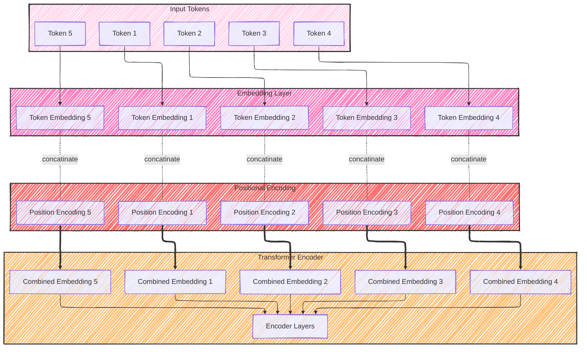
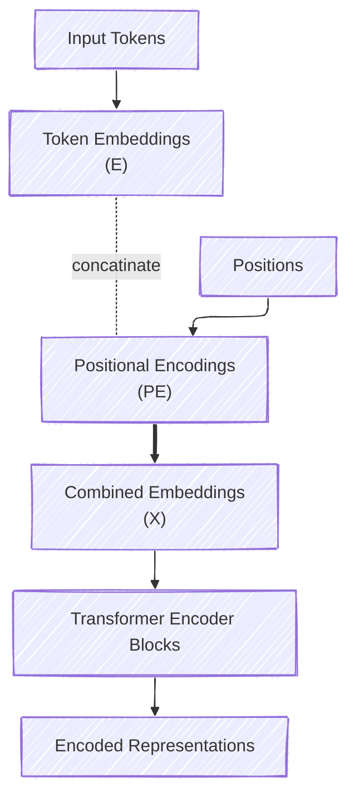
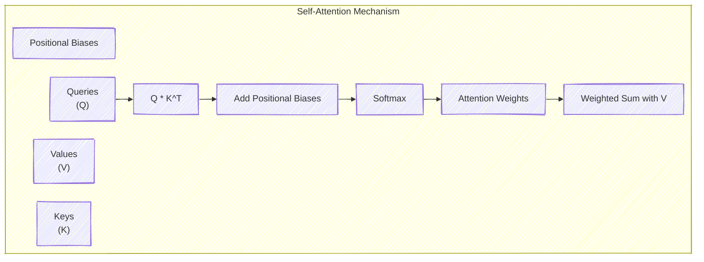

# Positional Encoding
> This content is dual-licensed under your choice of the following licenses:
> 1.  **MIT License:** For the code implementations in Swift and Mermaid provided in this document.
> 2.  **Creative Commons Attribution 4.0 International License (CC BY 4.0):** For all other content, including the text, explanations, and the Mermaid diagrams and illustrations.

---

## 1. Overview of Transformers and the Need for Positional Encoding

Transformers are a type of neural network architecture that rely entirely on **attention mechanisms** to process sequential input data. Introduced in the seminal paper ["Attention is All You Need" (Vaswani et al., 2017)](https://arxiv.org/abs/1706.03762), transformers have become foundational in natural language processing (NLP) and other fields.

### **Why Positional Encoding?**

- **Parallel Processing**: Unlike recurrent neural networks (RNNs), transformers process all tokens in a sequence simultaneously, without inherent sequence order information.
- **Lack of Positional Awareness**: The self-attention mechanism in transformers computes relationships between tokens based solely on their content embeddings, ignoring their positions.
- **Need for Order Information**: Language and sequential data often depend on the order of elements for meaning (e.g., "the cat sat on the mat" vs. "on the mat sat the cat").

**Solution**: **Positional Encoding** provides a way to inject information about the position of each token into the model.

---

## **2. How Positional Encoding Works**

### **High-Level Concept**

- **Token Embeddings**: Numerical representations of tokens capturing their semantic meaning.
- **Positional Encodings**: Additional vectors that encode the position of each token in the sequence.
- **Combined Embeddings**: The sum of token embeddings and positional encodings, incorporating both content and position information.

### **Visualization of Input Processing**

---

## **3. Types of Positional Encodings**

There are two primary approaches:

1. **Fixed (Sinusoidal) Positional Encoding**
2. **Learned Positional Encoding**

### **3.1 Fixed (Sinusoidal) Positional Encoding**

**Concept**: Use mathematical functions (sine and cosine) to generate positional encodings that can generalize to sequences longer than those seen during training.

#### **Mathematical Formulation**

For each position \( pos \) and embedding dimension \( i \):

$$
\begin{align*}
PE_{(pos, 2i)} &= \sin\left(\frac{pos}{10000^{\frac{2i}{d_{\text{model}}}}}\right) \\
PE_{(pos, 2i+1)} &= \cos\left(\frac{pos}{10000^{\frac{2i}{d_{\text{model}}}}}\right)
\end{align*}
$$

- \( PE \): Positional Encoding matrix.
- \( pos \): Position index in the sequence.
- \( i \): Dimension index.
- \( d_{\text{model}} \): Total dimension of the embeddings.

#### **Properties**

- **Deterministic**: Same for every model; no training involved.
- **Allows Extrapolation**: Can generalize to longer sequences.
- **Captures Relative Positions**: Enables the model to infer relative distances between tokens.

#### **Visualization**

Consider plotting \( PE_{(pos, :)} \) across positions and dimensions to see the sinusoidal patterns.

---

### **3.2 Learned Positional Encoding**

**Concept**: Treat positional encodings as trainable parameters, learned during model training.

#### **Implementation**

- Initialize positional encoding matrix \( PE \) of shape \( (N, d_{\text{model}}) \), where \( N \) is the maximum sequence length.
- **Trainable**: \( PE \) is updated through backpropagation.

#### **Properties**

- **Flexible**: Model can learn task-specific positional representations.
- **Limited Extrapolation**: May not generalize well to sequence lengths beyond training data.

---

## **4. Incorporating Positional Encoding into the Transformer**

The transformer model incorporates positional encoding as follows:

1. **Embeddings**: Obtain token embeddings \( E \) and positional encodings \( PE \).
2. **Combination**: Compute combined embeddings \( X \):

$$
   X = E + PE
$$

3. **Input to Transformer**: Feed \( X \) into the transformer layers.

### **Model Architecture Diagram**

---

## **5. The Mathematics Behind Positional Encoding**

### **5.1 Sinusoidal Positional Encoding**

#### **Frequency and Wavelength**

- The denominator $10000^{\frac{2i}{d_{\text{model}}}}$ determines the wavelength of the sine and cosine functions.
- Different dimensions correspond to different frequencies, capturing both short-range and long-range positional relationships.

#### Derivation of the Formulas

The choice of \( 10000 \) is arbitrary but sets a broad range of frequencies.

#### **Properties for Model Learning**

- **Derivative Property**:

$$
  \text{For any position } pos, \quad \frac{d}{dpos} PE_{(pos, :)} \text{ is a linear function of } PE_{(pos, :)}
$$

- This helps the model learn relative positions efficiently.

### **5.2 Why Add Instead of Concatenate?**

- **Addition** allows the model to combine content and positional information at every dimension.
- **Concatenation** would double the embedding size, increasing computational complexity.

---

## **6. Relative Positional Encoding**

### **6.1 Concept**

- Instead of encoding absolute positions, encode the relative distance between tokens.
- Captures relative ordering and distances, which can be more beneficial for certain tasks.

### **6.2 Implementation**

One approach is to modify the attention mechanism:

$$
\text{Attention}(Q, K, V) = \text{softmax}\left(\frac{Q K^\top + Q R^\top}{\sqrt{d_k}}\right)V
$$

- \( R \): Relative positional embeddings.
- Modifies the attention score computations to include relative positions.

### **6.3 Benefits**

- **Improved Generalization**: Better performance on longer sequences.
- **Relative Awareness**: Directly models the distance between tokens.

---

## **7. Industry Practices and Current Trends**

### **7.1 Positional Encoding Variations**

- **Rotary Position Embedding (RoPE)**:

  - Rotates embeddings in the complex plane to encode positions.
  - Better extrapolation to longer sequences.
  - Used in models like GPT-NeoX.

- **ALiBi (Attention with Linear Biases)**:

  - Adds linear biases to attention scores based on relative positions.
  - Efficient and shows improved performance.

### **7.2 Application in Popular Models**

- **BERT**:

  - Uses learned positional embeddings.
  - Max sequence length defined during training.

- **GPT Models**:

  - Also use learned positional embeddings.
  - Implement techniques to handle longer sequences.

- **Transformer-XL**:

  - Uses segment-level recurrence and relative positional encodings to capture longer dependencies.

### **7.3 Emerging Approaches**

- **Sparse Attention**:

  - Focuses on a subset of positions to reduce computation.
  - Requires position-aware mechanisms to function effectively.

- **Neural Architecture Search (NAS) for Positional Encoding**:

  - Automatically searching for optimal positional encoding schemes.

---

## **8. Practical Example**

Let's see how positional encoding affects the attention mechanism.

### **Without Positional Encoding**

- The model can't distinguish between sequences with the same tokens in different orders.
- For example, "apple eats monkey" vs. "monkey eats apple" would be processed similarly.

### **With Positional Encoding**

- Positional information allows the model to assign different attention weights based on token positions.
- Word order is considered, leading to correct interpretation.

---

## **9. Detailed Flow of Positional Encoding in Transformers**

---

## **10. Challenges and Considerations**

### **10.1 Sequence Length Generalization**

- **Fixed Encodings**:

  - Generalize to longer sequences due to the mathematical nature of sine and cosine functions.
  - However, model capacity to handle longer sequences depends on training.

- **Learned Encodings**:

  - Limited to the maximum sequence length seen during training.
  - Extrapolation to longer sequences may result in degraded performance.

### **10.2 Computational Efficiency**

- **Memory Consumption**:

  - Longer sequences require more memory due to the quadratic complexity of self-attention.
  - Efficient positional encoding methods are essential for scaling.

### **10.3 Incorporating Position in Attention Scores**

- Modifying the attention mechanism to directly incorporate relative positional information can improve performance but adds complexity.

---

## **11. Alternative Positional Encoding Techniques**

### **11.1 Learned Absolute Position Embeddings**

- Similar to token embeddings but for positions.
- Simpler to implement.

### **11.2 Convolutional Positional Encodings**

- Use convolutional layers to derive positional information.
- Capture local positional relationships.

### **11.3 Learned Relative Position Representations**

- Model learns to represent relative positions between tokens.
- Can be incorporated into attention calculations.

---

## **12. Conclusion**

**Positional Encoding** is a fundamental component in transformer architectures, enabling models to understand the sequential nature of input data. By encoding position information and combining it with token embeddings, transformers can effectively model sequences despite the lack of inherent order processing.

Understanding the different types of positional encodings and their applications helps practitioners choose the appropriate method for their specific tasks and informs ongoing research into more efficient and effective encoding techniques.

---

## **13. Additional Visualizations**

### **13.1 Sinusoidal Positional Encodings Heatmap**

Imagine a heatmap where:

- **X-Axis**: Position in the sequence (e.g., positions 1 to 100).
- **Y-Axis**: Embedding dimensions (e.g., dimensions 1 to 512).
- **Color Intensity**: Value of the positional encoding at each position and dimension.

This visualization shows how sinusoidal functions of varying frequencies encode positions.

---

### **13.2 Positional Encoding Impact on Attention**

**Explanation**:

- Positional biases are added to the dot product of queries and keys, influencing the attention weights based on positional relationships.

---

## **14. References**

- [Vaswani et al., "Attention is All You Need", 2017](https://arxiv.org/abs/1706.03762)
- [Shaw et al., "Self-Attention with Relative Position Representations", 2018](https://arxiv.org/abs/1803.02155)
- [Su et al., "RoFormer: Enhanced Transformer with Rotary Position Embedding", 2021](https://arxiv.org/abs/2104.09864)
- [Press et al., "ALiBi: Training Longer Transformers", 2021](https://arxiv.org/abs/2108.12409)

---
**Licenses:**

- **MIT License:**   - Full text in [LICENSE](LICENSE) file.
- **Creative Commons Attribution 4.0 International:**  - Legal details in [LICENSE-CC-BY](LICENSE-CC-BY) and at [Creative Commons official site](http://creativecommons.org/licenses/by/4.0/).

---