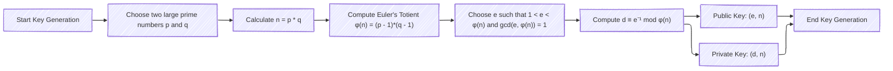
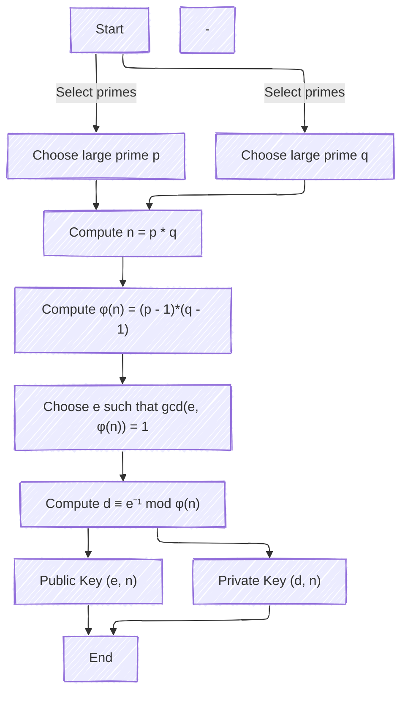

# RSA Algorithm Detailed Explanation
> This content is dual-licensed under your choice of the following licenses:
> 1.  **MIT License:** For the code implementations in Swift and Mermaid provided in this document.
> 2.  **Creative Commons Attribution 4.0 International License (CC BY 4.0):** For all other content, including the text, explanations, and the Mermaid diagrams and illustrations.

---

The **RSA algorithm** is one of the first public-key cryptosystems and is widely used for secure data transmission. It is named after its inventors **Rivest, Shamir, and Adleman** who first publicly described it in 1977.

---

## Overview

- **Purpose**: RSA is an **asymmetric cryptographic algorithm** used for secure data transmission. It involves two different keys:
  - **Public Key**: Used for encryption.
  - **Private Key**: Used for decryption.
- **Applications**: Ensures **internet communication security**, including secure web browsing (HTTPS), email encryption, VPNs, and secure shell (SSH).

---

## Fundamental Concepts

Before diving into RSA, it's essential to understand some fundamental mathematical concepts:

- **Prime Numbers**: Numbers greater than 1 that have no positive divisors other than 1 and themselves.
- **Modular Arithmetic**: A system of arithmetic for integers where numbers "wrap around" upon reaching a certain value—the modulus.
- **Euler's Totient Function (\(\phi(n)\))**: Counts the positive integers up to a given integer \(n\) that are relatively prime to \(n\).
- **Greatest Common Divisor (GCD)**: The largest positive integer that divides two numbers without leaving a remainder.

---

## RSA Algorithm Components

Let's break down the RSA algorithm into its core components:

1. **Key Generation**
2. **Encryption**
3. **Decryption**

We'll explore each component in detail.

---

## 1. Key Generation Process

The key generation involves creating a public and a private key.

### Step-by-Step Key Generation

### Detailed Explanation

1. **Choose two distinct large prime numbers** \( p \) and \( q \).

2. **Compute \( n \)**
$$
   n = p \times q
$$

3. **Compute Euler's Totient Function \( \phi(n) \)**
$$

   \phi(n) = (p - 1) \times (q - 1)
$$

4. **Choose an integer \( e \)**
   - Condition: \( 1 < e < \phi(n) \)
   - \( e \) and \( \phi(n) \) are **coprime** (their GCD is 1).

5. **Compute \( d \)**
   - \( d \) is the modular multiplicative inverse of \( e \) modulo \( \phi(n) \).
   - Find \( d \) such that:
$$
     d \times e \equiv 1 \mod \phi(n)
$$
     Or:
$$
     d = e^{-1} \mod \phi(n)
$$

1. **Public Key**: Consists of $(e, n)$.
2. **Private Key**: Consists of $(d, n)$.

---

## 2. Encryption Process

Once keys are generated, encryption can proceed.

### Encryption Steps

### Mathematical Representation

Given message \( m \) and Receiver's public key \( (e, n) \):

3. **Encrypt the message**
$$
   c = m^e \mod n
$$

---

## 3. Decryption Process

Receiver uses the private key to decrypt the message.

### Decryption Steps

### Mathematical Representation

Given ciphertext \( c \) and private key \( (d, n) \):

4. **Decrypt the message**
$$
   m = c^d \mod n
$$

---

## Mathematical Underpinnings

### Why Does RSA Work?

The correctness of RSA decryption relies on the properties of modular arithmetic and Euler's theorem.

#### Euler's Theorem

For any integer \( m \) that is coprime to \( n \):

$$
m^{\phi(n)} \equiv 1 \mod n
$$

#### Proof Sketch

Since \( d \) is the modular inverse of \( e \):

$$
d \times e \equiv 1 \mod \phi(n)
$$

Therefore, there exists an integer \( k \) such that:

$$
d \times e = 1 + k \times \phi(n)
$$

When decrypting:

$$
\begin{align*}
m &= c^d \mod n \\
  &= (m^e)^d \mod n \\
  &= m^{e \times d} \mod n \\
  &= m^{1 + k \times \phi(n)} \mod n \\
  &= m \times \left( m^{\phi(n)} \right)^k \mod n \\
\end{align*}
$$

Using Euler's theorem:

$$
m^{\phi(n)} \equiv 1 \mod n
$$

Therefore:

$$
m \times (1)^k \equiv m \mod n
$$

Thus, the original message \( m \) is recovered.

---

## Security Considerations

### Key Sizes

- **Large Primes**: To ensure security, \( p \) and \( q \) must be large (typically 2048 bits or more).
- **Key Length**: Common key lengths are 2048, 3072, or 4096 bits.

### Prime Number Generation

- **Randomness**: Primes must be generated using secure random number generators to prevent predictability.
- **Primality Testing**: Use probabilistic tests like Miller-Rabin for efficiency.

### Potential Vulnerabilities

- **Factorization Attack**: If an attacker factors \( n \) into \( p \) and \( q \), they can compute \( \phi(n) \) and derive the private key \( d \).
- **Quantum Computing Threat**: Shor's algorithm can factor large numbers efficiently on a quantum computer. RSA is not quantum-resistant.

### Padding Schemes

To prevent attacks on raw RSA encryption, padding schemes are used:

- **PKCS#1 v1.5**
- **OAEP (Optimal Asymmetric Encryption Padding)**

---

## Applications in Internet Communication Security

RSA is integral to various security protocols:

### TLS/SSL (Transport Layer Security / Secure Sockets Layer)

- **Secure Web Browsing (HTTPS)**
- RSA is used in key exchange for establishing a secure session.

### Digital Signatures

- **Authentication**: Verifying the sender's identity.
- **Integrity**: Ensuring the message has not been altered.

### VPNs (Virtual Private Networks)

- Secure communication tunnels over public networks.

### SSH (Secure Shell)

- Secure remote login and command execution.

---

## Current Practices in the Industry

### Transition to Elliptic Curve Cryptography (ECC)

Due to efficiency and smaller key sizes offering equivalent security, ECC is gaining popularity.

- **ECDSA (Elliptic Curve Digital Signature Algorithm)**
- **ECDH (Elliptic Curve Diffie-Hellman)**

### Hybrid Encryption Systems

Combining RSA with symmetric encryption algorithms:

- **RSA for Key Exchange**
- **Symmetric Algorithms (e.g., AES) for Data Encryption**

### Security Recommendations

- **Use Strong, Random Keys**: Ensure keys are generated securely.
- **Use Adequate Key Lengths**: Minimum 2048 bits for RSA.
- **Implement Proper Padding Schemes**: Use OAEP to prevent padding oracle attacks.
- **Regularly Update Cryptographic Libraries**: Keep up with security patches.

### Quantum-Resistant Algorithms

Research into post-quantum cryptography is ongoing to prepare for the advent of quantum computing capabilities.

---

## Diagrammatic Summary

### RSA Key Generation

### RSA Encryption and Decryption Flow

---

## Mathematical Formulas Summary

### Key Generation

- \( n = p \times q \)
- \( \phi(n) = (p - 1) \times (q - 1) \)
- \( \text{Find } e \text{ such that } 1 < e < \phi(n), \text{ gcd}(e, \phi(n)) = 1 \)
- \( d \equiv e^{-1} \mod \phi(n) \)

### Encryption

- Ciphertext \( c \):
$$
  c = m^e \mod n
$$

### Decryption

- Message \( m \):
$$
  m = c^d \mod n
$$

---

## Conclusion

The RSA algorithm is a cornerstone of modern cryptography, enabling secure communication over insecure channels. Its security is based on the computational difficulty of factoring large composite numbers.

**Key Takeaways**:

- RSA uses a **public-private key pair** for encryption and decryption.
- **Security relies on key size**: Larger keys provide greater security.
- **Proper implementation** is crucial to prevent vulnerabilities.
- **Quantum computing** poses a future threat; transitioning to **quantum-resistant algorithms** is a proactive measure.
- RSA remains widely used but is often combined with other cryptographic techniques for enhanced security and performance.

---

## References

- **RSA Original Paper**: [A Method for Obtaining Digital Signatures and Public-Key Cryptosystems](https://people.csail.mit.edu/rivest/Rsapaper.pdf)
- **NIST Guidelines**: [Recommendation for Key Management](https://nvlpubs.nist.gov/nistpubs/SpecialPublications/NIST.SP.800-57pt1r5.pdf)
- **Cryptography Standards**: [PKCS #1: RSA Cryptography Specifications](https://tools.ietf.org/html/rfc8017)

---

# Chinese language section

---

# 技术要点中文概述

**RSA 算法**是以 Rivest、Shamir 和 Adleman 的姓氏命名的，他们在 1977 年首次公开描述了该算法。它是一种 **非对称加密算法**，广泛用于安全数据传输。

---

## 核心概念

- **目的**：使用公钥和私钥对数据进行加密和解密，确保消息的机密性和真实性。
- **应用**：广泛用于 **互联网通信安全**，如 HTTPS、VPN、电子邮件加密和 SSH。

---

## 核心步骤

5. **密钥生成**：创建一对公钥和私钥。
6. **加密**：使用接收者的公钥对消息进行加密。
7. **解密**：接收者使用自己的私钥对收到的密文进行解密。

---

## 数学基础

- **大素数**：选择两个大的素数 \( p \) 和 \( q \)。
- **模运算**：对计算结果取模 \( n = p \times q \)。
- **欧拉函数**：计算 \( \phi(n) = (p - 1)(q - 1) \)。
- **选择公钥指数 \( e \)**：满足 \( 1 < e < \phi(n) \) 且与 \( \phi(n) \) 互质。
- **计算私钥指数 \( d \)**：使得 \( d \equiv e^{-1} \mod \phi(n) \)。

---

## 安全性

- **根据当前实践，推荐使用** 2048 位或更长的密钥。
- **潜在威胁**：量子计算的发展可能削弱 RSA 的安全性，正在研究抗量子计算的加密算法。

---

## 结论

RSA 算法在确保数字通信的机密性和完整性方面发挥着关键作用。理解其工作原理对实现安全的通信至关重要。

---

-----

# English translated version

Certainly! Here is the translation of the Chinese section from my previous response:

---

## Technical Key Points Summary

The **RSA algorithm** is named after Rivest, Shamir, and Adleman, who first publicly described it in 1977. It is an **asymmetric encryption algorithm** widely used for secure data transmission.

---

## Core Concepts

- **Purpose**: Utilize public and private keys to encrypt and decrypt data, ensuring the confidentiality and authenticity of messages.
- **Applications**: Widely used in **internet communication security**, such as HTTPS, VPNs, email encryption, and SSH.

---

## Core Steps

8. **Key Generation**: Create a pair of public and private keys.
9. **Encryption**: Use the receiver's public key to encrypt the message.
10. **Decryption**: The receiver uses their private key to decrypt the received ciphertext.

---

## Mathematical Foundations

- **Large Prime Numbers**: Choose two large prime numbers \( p \) and \( q \).
- **Modular Arithmetic**: Compute \( n = p \times q \), using modulus operations in calculations.
- **Euler's Totient Function**: Calculate \( \phi(n) = (p - 1)(q - 1) \).
- **Select Public Exponent \( e \)**: Must satisfy \( 1 < e < \phi(n) \) and \( e \) is coprime with \( \phi(n) \).
- **Compute Private Exponent \( d \)**: Find \( d \) such that \( d \equiv e^{-1} \mod \phi(n) \).

---

## Security

- **Recommended Key Length**: According to current practices, it is advised to use keys of **2048 bits** or longer.
- **Potential Threats**: The development of quantum computing may weaken the security of RSA; research into quantum-resistant encryption algorithms is ongoing.

---

---
**Licenses:**

- **MIT License:**   - Full text in [LICENSE](LICENSE) file.
- **Creative Commons Attribution 4.0 International:**  - Legal details in [LICENSE-CC-BY](LICENSE-CC-BY) and at [Creative Commons official site](http://creativecommons.org/licenses/by/4.0/).

---