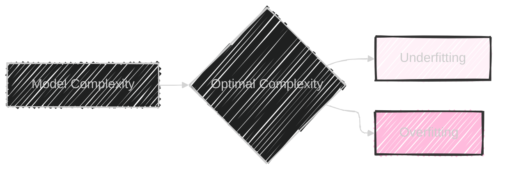
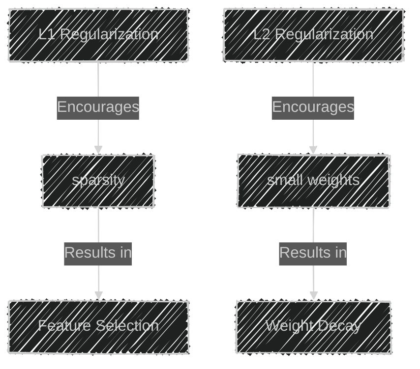
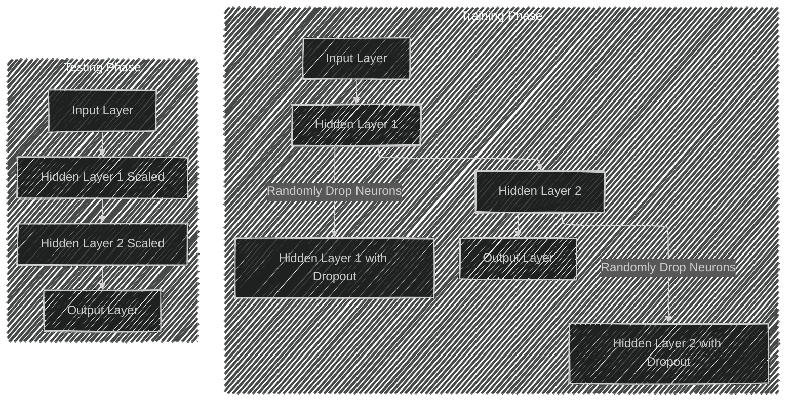
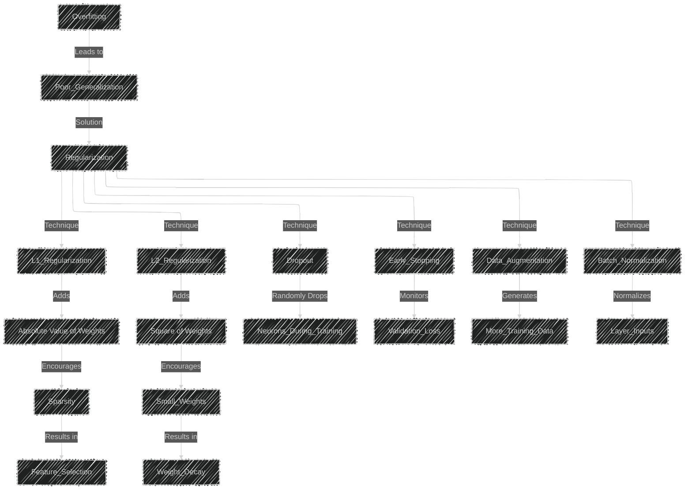
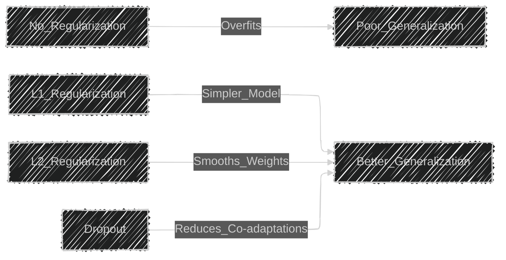

# Regularization Techniques in Machine Learning
> This content is dual-licensed under your choice of the following licenses:
> 1.  **MIT License:** For the code implementations in Swift and Mermaid provided in this document.
> 2.  **Creative Commons Attribution 4.0 International License (CC BY 4.0):** For all other content, including the text, explanations, and the Mermaid diagrams and illustrations.

---


Regularization techniques are essential in machine learning to prevent overfitting, improve model generalization, and enhance performance on unseen data. This detailed explanation covers the complexities and technical concepts of regularization, focusing on L1, L2 regularization, and Dropout, which are widely used in the industry today.

---

## Overview of Overfitting

**Overfitting** occurs when a machine learning model learns the training data too well, including the noise and outliers, which negatively impacts its performance on new, unseen data. The model captures the random fluctuations in the training data rather than the underlying data distribution.

### Illustration of Overfitting vs. Underfitting



---

## Need for Regularization

Regularization introduces additional information to prevent overfitting by discouraging the model from fitting the noise in the training data. It adds a penalty term to the loss function, controlling the complexity of the model.

---

## Types of Regularization Techniques

### 1. L1 Regularization (Lasso Regression)

**L1 Regularization** adds a penalty equal to the absolute value of the magnitude of coefficients.

- **Purpose**: Encourages sparsity in the model parameters (i.e., it drives some weights to zero).
- **Effect**: Performs feature selection by eliminating less important features.

#### Mathematical Formulation

Given a loss function \( J(\theta) \):

$$
J_{L1}(\theta) = J(\theta) + \lambda \sum_{i=1}^{n} |\theta_i|
$$

- \( \lambda \) is the regularization parameter controlling the strength of the penalty.
- \( \theta_i \) represents the model parameters (weights).

### 2. L2 Regularization (Ridge Regression)

**L2 Regularization** adds a penalty equal to the square of the magnitude of coefficients.

- **Purpose**: Prevents large weights by penalizing their squares.
- **Effect**: Produces a model with smaller, more evenly distributed weights.

#### Mathematical Formulation

$$
J_{L2}(\theta) = J(\theta) + \lambda \sum_{i=1}^{n} \theta_i^2
$$

### Comparison of L1 and L2 Regularization



### 3. Dropout

**Dropout** is a regularization technique that randomly sets a fraction of input units to zero during training, preventing units from co-adapting too much.

- **Purpose**: Reduces overfitting by preventing complex co-adaptations on training data.
- **Effect**: Forces the network to learn more robust features.

#### Dropout Process



---

## How Regularization Techniques Prevent Overfitting

### L1 and L2 Regularization

By adding a penalty to the loss function:

- **L1 Regularization** promotes sparsity, effectively performing feature selection by driving less important feature weights to zero.
- **L2 Regularization** discourages large weights, distributing the impact more evenly across all features.

#### Impact on Loss Function


### Dropout

By randomly dropping neurons during training:

- Prevents neurons from relying on specific other neurons.
- Encourages the network to learn redundant representations.
- Leads to a form of model averaging, as each dropout configuration can be thought of as a different model.

---

## Mathematical Foundations

### L1 Regularization (Lasso)

- **Penalty Term**: $\lambda \sum_{i=1}^{n} |\theta_i|$
- **Optimization Effect**: Encourages sparsity, many $\theta_i$ become zero.

### L2 Regularization (Ridge)

- **Penalty Term**: $\lambda \sum_{i=1}^{n} \theta_i^2$
- **Optimization Effect**: Penalizes large weights, all $\theta_i $ are reduced but none are eliminated.

### Gradient Descent Update Rules

#### For L2 Regularization

$$
\theta_i := \theta_i - \alpha \left( \frac{\partial J(\theta)}{\partial \theta_i} + 2\lambda \theta_i \right)
$$

#### For L1 Regularization

$$
\theta_i := \theta_i - \alpha \left( \frac{\partial J(\theta)}{\partial \theta_i} + \lambda \cdot \text{sign}(\theta_i) \right)
$$

- $\alpha$ is the learning rate.
- $\text{sign}(\theta_i)$ is the sign of $\theta_i$: +1 or -1.

---

## Current Practices in the Industry

### Regularization in Deep Learning Frameworks

- **TensorFlow and Keras**: Provide built-in support for L1 and L2 regularization and Dropout layers.
- **PyTorch**: Supports regularization through weight decay and dropout modules.

### Typical Usage

- **Dropout Rates**: Commonly set between 0.2 and 0.5.
- **Regularization Parameter \( \lambda \)**: Selected via hyperparameter tuning, often using cross-validation.

### Advanced Regularization Techniques

- **Early Stopping**: Monitor validation loss during training and stop when it starts to increase.
- **Batch Normalization**: Normalizes inputs to layers, reducing internal covariate shift.
- **Data Augmentation**: Increases the diversity of training data without collecting new data.

---

## Comprehensive Diagram of Regularization Techniques



---

## Applications of Regularization Techniques

1. **Computer Vision**:

   - **Dropout** is widely used in convolutional neural networks (CNNs) for image recognition tasks to prevent overfitting on training images.

2. **Natural Language Processing**:

   - **L2 Regularization** helps in regularizing models like RNNs and Transformers to generalize better on unseen text data.

3. **Financial Modeling**:

   - **L1 Regularization** aids in feature selection, identifying the most significant predictors among a vast number of financial indicators.

4. **Bioinformatics**:

   - **Regularization** techniques help in handling high-dimensional genomic data where the number of features exceeds the number of samples.

---

## Example Implementation in Python using Keras

```python
from tensorflow.keras.models import Sequential
from tensorflow.keras.layers import Dense, Dropout
from tensorflow.keras.regularizers import l1, l2

# Define the model
model = Sequential()
model.add(Dense(64, input_dim=100, activation='relu', kernel_regularizer=l2(0.001)))
model.add(Dropout(0.5))
model.add(Dense(64, activation='relu', kernel_regularizer=l2(0.001)))
model.add(Dropout(0.5))
model.add(Dense(10, activation='softmax'))

# Compile the model
model.compile(optimizer='adam', loss='categorical_crossentropy', metrics=['accuracy'])
```

---

## Conclusion

Regularization techniques are critical for developing robust machine learning models that generalize well to new data. By incorporating methods like L1 and L2 regularization and dropout, we can mitigate overfitting, improve model performance, and ensure reliability in real-world applications.

---

# Additional Details and Advanced Concepts

## Elastic Net Regularization

Combines both L1 and L2 regularization:

$$
J_{ElasticNet}(\theta) = J(\theta) + \lambda_1 \sum_{i=1}^{n} |\theta_i| + \lambda_2 \sum_{i=1}^{n} \theta_i^2
$$

- **Purpose**: Leverages the benefits of both L1 and L2 regularization.
- **Use Case**: Useful when there are correlated input features.

## Regularization in Neural Networks

### Weight Regularization

Adding regularization terms directly to the weights of the network layers.

- **In Practice**: Specify regularizers when defining layers.

### Activity Regularization

Adding regularization terms to the output of a layer.

- **Purpose**: Penalize large activations, promoting sparsity in activations.

## Advanced Regularization Techniques

### 1. Data Augmentation

- **Purpose**: Increases the size and diversity of the training dataset.
- **Methods**: Rotation, scaling, flipping for images; synonym replacement, noise addition for text.

### 2. Early Stopping

- **Process**:

  1. Split data into training and validation sets.
  2. Train the model while monitoring validation loss.
  3. Stop training when validation loss starts to increase.

- **Benefit**: Prevents the model from overfitting the training data.

### 3. Batch Normalization

- **Purpose**: Normalize inputs to each layer to stabilize learning.
- **Effect**: Allows for higher learning rates and reduces sensitivity to initialization.

## Visual Comparison of Regularization Effects



---

## Industry Trends and Best Practices

- **Hyperparameter Tuning**: Systematic search (grid search, random search) or Bayesian optimization to find optimal regularization parameters.
- **Combination of Techniques**: Often, multiple regularization methods are combined (e.g., L2 regularization with dropout and early stopping).
- **Regularization in Transfer Learning**: Fine-tuning pre-trained models with regularization to adapt them to new tasks without overfitting.

---

## Mathematical Intuition Behind Regularization

- **Bias-Variance Tradeoff**:

  - **High Bias**: Model is too simple, underfits data.
  - **High Variance**: Model is too complex, overfits data.
  - **Regularization** reduces variance by adding bias, finding a balance.

- **Geometric Interpretation**:

  - **L1 Regularization** constrains the solution to lie within a diamond-shaped area, leading to sparse solutions.
  - **L2 Regularization** constrains the solution within a circle, leading to small but non-zero coefficients.

---

## Further Reading and Resources

- **Books**:

  - "Deep Learning" by Ian Goodfellow, Yoshua Bengio, and Aaron Courville.
  - "Pattern Recognition and Machine Learning" by Christopher M. Bishop.

- **Research Papers**:

  - "Dropout: A Simple Way to Prevent Neural Networks from Overfitting" by Srivastava et al.
  - "Understanding the Difficulty of Training Deep Feedforward Neural Networks" by Glorot and Bengio.

- **Online Courses**:

  - Coursera: "Deep Learning Specialization" by Andrew Ng.

---

# Summary Diagram of Regularization Techniques


---
**Licenses:**

- **MIT License:**  [](LICENSE) - Full text in [LICENSE](LICENSE) file.
- **Creative Commons Attribution 4.0 International:** [](LICENSE-CC-BY) - Legal details in [LICENSE-CC-BY](LICENSE-CC-BY) and at [Creative Commons official site](http://creativecommons.org/licenses/by/4.0/).

---