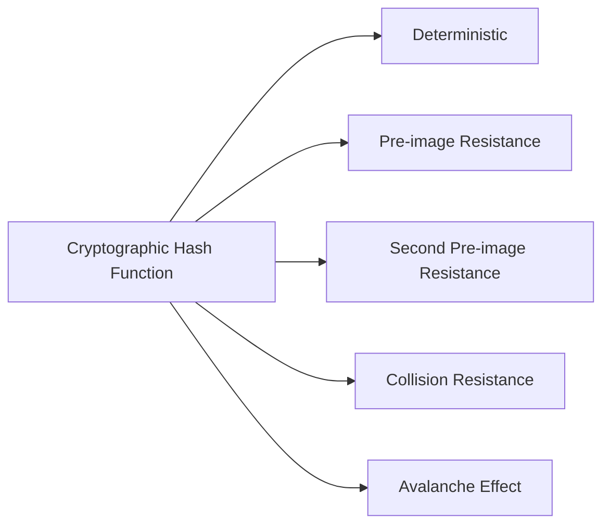
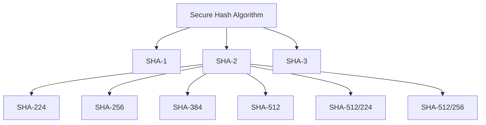
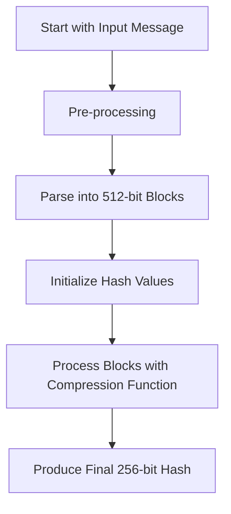
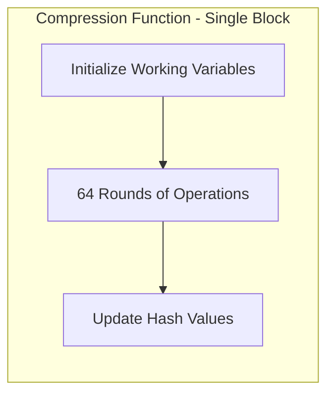
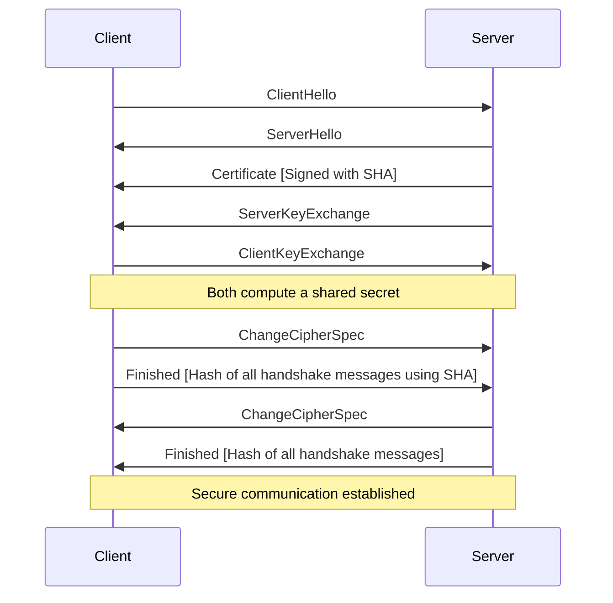
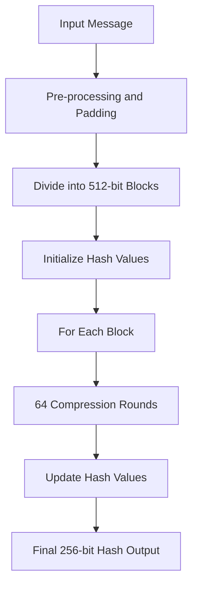

# Secure Hash Algorithm (SHA): An In-Depth Exploration
> This content is dual-licensed under your choice of the following licenses:
> 1.  **MIT License:** For the code implementations in Swift and Mermaid provided in this document.
> 2.  **Creative Commons Attribution 4.0 International License (CC BY 4.0):** For all other content, including the text, explanations, and the Mermaid diagrams and illustrations.

---


The **Secure Hash Algorithm (SHA)** is a family of cryptographic hash functions essential for ensuring data integrity and security in the digital world. SHA algorithms are widely used in various security applications and protocols, including **SSH** (Secure Shell) and **SSL/TLS** (Secure Sockets Layer/Transport Layer Security).

---

### **Purpose of SHA**

- **Data Integrity**: Generates a unique, fixed-size hash value from input data of any size, enabling verification that the data has not been altered.
- **Security**: Provides cryptographic properties making it computationally infeasible to reverse-engineer the original input or find two inputs producing the same hash.
- **Authentication**: Assists in authenticating data sources and verifying identities when combined with other cryptographic algorithms.

---

### **Cryptographic Hash Function Properties**

Cryptographic hash functions like SHA possess several critical properties:



- **Deterministic**: The same input always produces the same hash output.
- **Pre-image Resistance**: Given a hash output, it's infeasible to determine the original input.
- **Second Pre-image Resistance**: Given an input and its hash, it's infeasible to find a different input with the same hash.
- **Collision Resistance**: Infeasible to find two distinct inputs that produce the same hash output.
- **Avalanche Effect**: A small change in input results in a significantly different hash output.

---

### **The SHA Family**

The SHA family includes multiple algorithms, each improving upon the previous in terms of security and hash size.



#### **SHA-1**

- **Hash Size**: 160 bits
- **Status**: Deprecated due to collision vulnerabilities.

#### **SHA-2 Family**

- **Hash Sizes**: 224, 256, 384, 512 bits
- **Usage**: Widely adopted in security protocols and applications.

#### **SHA-3**

- **Based on**: Keccak algorithm
- **Features**: Different internal structure, resistance to certain attack vectors affecting SHA-2.

---

### **Technical Concepts: SHA-256 Algorithm**

#### **High-Level Workflow**



#### **Steps Explained**

1. **Pre-processing**:
   - **Padding**: Extend the message so its length is a multiple of 512 bits minus 64 bits, followed by appending the original message length as a 64-bit integer.
2. **Parsing**:
   - **Divide**: Split the message into 512-bit blocks.
3. **Initialization**:
   - **Hash Values**: Use eight 32-bit words as initial hash values (H0 to H7), predefined by the algorithm.
4. **Compression Function**:
   - **Iterations**: For each block, perform 64 rounds involving logical functions, constants, and message schedules.
5. **Finalization**:
   - **Hash Output**: Concatenate the final hash values to produce a 256-bit digest.

#### **Compression Function Detailed**



##### **Round Operations**

In each round, the algorithm updates eight working variables (a, b, c, d, e, f, g, h) using specific logical functions and constants.

---

### **Logical Functions in SHA-256**

1. **Choose Function (Ch)**
$$
   \text{Ch}(E,F,G) = (E \land F) \oplus (\lnot E \land G)
$$

2. **Majority Function (Maj)**
$$
   \text{Maj}(A,B,C) = (A \land B) \oplus (A \land C) \oplus (B \land C)
$$

3. **Sigma Functions**
   - **Uppercase Sigma**
$$
     \Sigma_0(A) = \text{ROTR}^2(A) \oplus \text{ROTR}^{13}(A) \oplus \text{ROTR}^{22}(A)
$$
$$
     \Sigma_1(E) = \text{ROTR}^6(E) \oplus \text{ROTR}^{11}(E) \oplus \text{ROTR}^{25}(E)
$$
   - **Lowercase Sigma**
$$
     \sigma_0(W_t) = \text{ROTR}^7(W_t) \oplus \text{ROTR}^{18}(W_t) \oplus (W_t \gg 3)
$$
$$
     \sigma_1(W_t) = \text{ROTR}^{17}(W_t) \oplus \text{ROTR}^{19}(W_t) \oplus (W_t \gg 10)
$$

4. **Constants** $K_t$
   - 64 constants derived from the fractional parts of the cube roots of the first 64 prime numbers.

---

### **Applications in Security Protocols**

#### **SSH (Secure Shell)**

- **Purpose**: Secure remote login and other network services over an unsecured network.
- **Use of SHA**:
  - **Integrity Verification**: SSH uses HMACs (Hash-based Message Authentication Codes) with SHA to ensure that data has not been altered during transmission.
  - **Key Generation and Exchange**: SHA is used in generating and verifying keys during the authentication process.

#### **SSL/TLS (Secure Sockets Layer/Transport Layer Security)**

- **Purpose**: Secure communication over a computer network.
- **Use of SHA**:
  - **Certificate Signing**: SHA algorithms hash the contents of digital certificates. Certificate Authorities (CAs) sign the hash with their private key, allowing clients to verify the certificate's authenticity.
  - **Handshake Process**: SHA is used to verify the integrity of messages exchanged during the SSL/TLS handshake.

##### **SSL/TLS Handshake Diagram**



---

### **Security Considerations**

#### **Collision Attacks**

- **Definition**: Two different inputs producing the same hash output.
- **Impact on SHA-1**: Practical collision attacks have been demonstrated.
- **Mitigation**: Use SHA-256 or higher to prevent collision vulnerabilities.

#### **Length Extension Attacks**

- **Vulnerability**: In algorithms like SHA-1 and SHA-256, given `hash(message)` and the length of `message`, an attacker can compute `hash(message || padding || additional_data)`.
- **Defenses**:
  - **Use HMAC**: Hash-based Message Authentication Codes prevent length extension attacks.
  - **Switch to SHA-3**: SHA-3 is resistant to length extension attacks due to its different construction (sponge function).

---

### **Modern Practices in the Industry**

#### **Transition to SHA-2 and SHA-3**

- **Deprecation of SHA-1**: Due to vulnerabilities, SHA-1 is no longer recommended for cryptographic security.
- **Adoption of SHA-256 and SHA-3**: Organizations are moving to more secure hash functions.

#### **Password Hashing Best Practices**

- **Avoid Using SHA Directly**: Due to its fast computation speed, SHA is not ideal for password hashing.
- **Use Key Derivation Functions (KDFs)**:
  - **bcrypt**
  - **scrypt**
  - **Argon2**
- **Features of KDFs**:
  - **Salting**: Adds a unique value to each password hash to prevent rainbow table attacks.
  - **Work Factor**: Computationally intensive to slow down brute-force attacks.

---

### **Future Directions**

#### **SHA-3 Adoption**

- **Advantages**:
  - **Different Structure**: Based on the sponge construction (Keccak), resistant to certain attacks.
  - **Enhanced Security**: Provides an alternative in case of weaknesses found in SHA-2.

#### **Post-Quantum Cryptography**

- **Quantum Threat**: Quantum computers could potentially break current cryptographic algorithms.
- **Hash Functions in PQC**:
  - **Hash-Based Signatures**: Remain secure against quantum attacks.
  - **Research**: Ongoing in developing quantum-resistant hash functions and protocols.

---

### **Illustration: Hash Function Process**

#### **SHA-256 Hash Computation Overview**



---

### **Practical Example: Data Integrity Verification**

#### **Scenario**

- **Downloading Software**: You download an executable file from an official source.
- **Objective**: Verify that the file has not been tampered with.

#### **Steps**

1. **Obtain Official Hash**: The software provider publishes the SHA-256 hash of the file.

   ```
   Official SHA-256 Hash: 3a7bd3e2360a3b6d9245057f53495273c4f4b0588e7b68c9e6ed4fda8588bbf2
   ```

2. **Compute Hash Locally**:

   ```bash
   sha256sum downloaded_file.exe
   ```

   ```
   Computed Hash: 3a7bd3e2360a3b6d9245057f53495273c4f4b0588e7b68c9e6ed4fda8588bbf2
   ```

3. **Compare Hashes**:

   - **Match**: If the computed hash matches the official hash, the file is verified.
   - **Mismatch**: If not, the file may be corrupted or tampered with.

---

### **Conclusion**

The Secure Hash Algorithm plays a pivotal role in securing data and communications in the modern digital landscape. By understanding its properties, mechanisms, and applications, professionals can leverage SHA effectively in various security protocols to ensure data integrity and authentication.

---

### **Summary of Key Points**

- **Purpose of SHA**: Ensure data integrity and security.
- **Cryptographic Properties**: Determinism, resistance to pre-image attacks, collision resistance, and avalanche effect.
- **SHA Family**: SHA-1 (deprecated), SHA-2 (widely used), SHA-3 (emerging).
- **Applications**:
  - **SSH**: Secure remote access.
  - **SSL/TLS**: Secure web communications.
  - **Digital Signatures**: Verify authenticity.
- **Security Considerations**:
  - **Avoid SHA-1**: Due to vulnerabilities.
  - **Use HMACs**: For message authentication.
  - **Implement KDFs**: For password storage.
- **Future Directions**:
  - **SHA-3 Adoption**: For enhanced security.
  - **Post-Quantum Cryptography**: Preparing for quantum threats.

---


---
**Licenses:**

- **MIT License:**  [](LICENSE) - Full text in [LICENSE](LICENSE) file.
- **Creative Commons Attribution 4.0 International:** [](LICENSE-CC-BY) - Legal details in [LICENSE-CC-BY](LICENSE-CC-BY) and at [Creative Commons official site](http://creativecommons.org/licenses/by/4.0/).

---