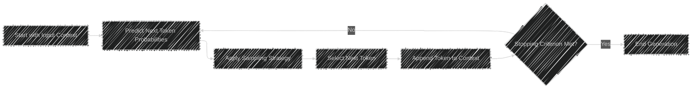
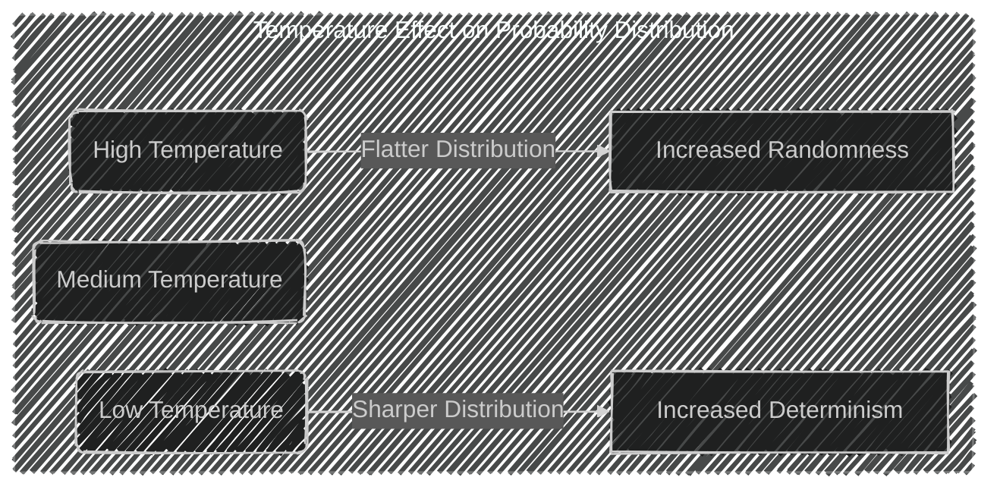
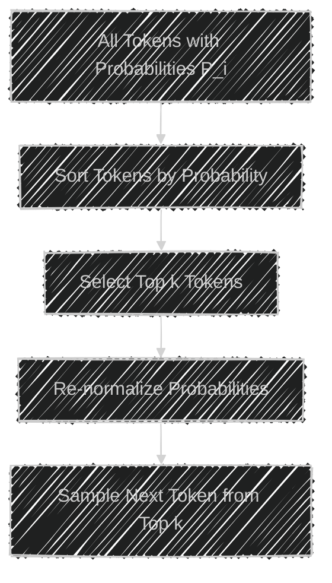
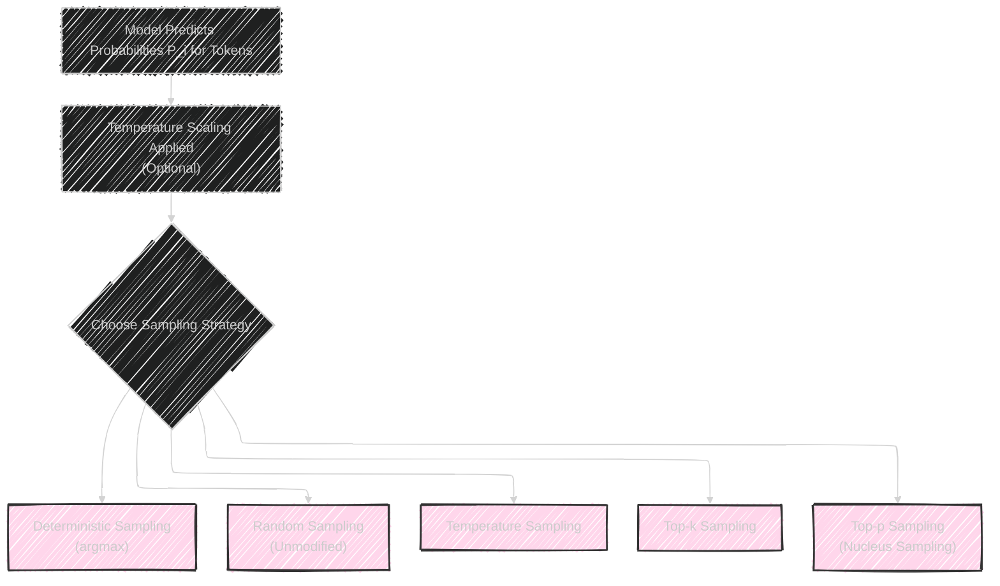

# Sampling Strategies in Natural Language Generation
> This content is dual-licensed under your choice of the following licenses:
> 1.  **MIT License:** For the code implementations in Swift and Mermaid provided in this document.
> 2.  **Creative Commons Attribution 4.0 International License (CC BY 4.0):** For all other content, including the text, explanations, and the Mermaid diagrams and illustrations.

---

In natural language generation (NLG), sampling strategies play a crucial role in controlling the randomness and creativity of the generated text. They determine how the model selects the next token (word or subword) based on the predicted probability distribution over the vocabulary. The main goal is to balance **coherence** and **diversity** in the output.

Key sampling strategies include:

1. **Temperature Sampling**
2. **Top-\( k \) Sampling**
3. **Nucleus (Top-\( p \)) Sampling**

---

## Overview of Text Generation Process

Before diving into the sampling strategies, let's understand the general process of text generation in language models.

1. **Input Context**: The model receives an initial sequence of tokens (the context).
2. **Probability Distribution**: It predicts the probability distribution over the possible next tokens.
3. **Sampling**: A sampling strategy is applied to select the next token based on this distribution.
4. **Iterative Generation**: Steps 1-3 are repeated to generate subsequent tokens until a stopping criterion is met (e.g., end-of-sentence token, maximum length).

### Simplified Flowchart of Text Generation

---

## 1. Temperature Sampling

### Purpose

Adjusts the probability distribution to control the level of randomness and creativity in the generated text.

### Mechanics

The temperature parameter \( T \) modifies the probabilities \( P_i \) of each token \( i \) in the distribution.

- **High Temperature (\( T > 1 \))**: Flattens the distribution, increasing randomness.
- **Low Temperature (\( 0 < T < 1 \))**: Sharpens the distribution, making it more deterministic.

### Mathematical Formulation

Given the original logits (unnormalized probabilities) \( z_i \):

1. **Adjust Logits with Temperature**:

$$
   z'_i = \frac{z_i}{T}
$$

2. **Compute Adjusted Probabilities**:

$$
   P_i = \frac{e^{z'_i}}{\sum_{j} e^{z'_j}}
$$

### Effect on Probability Distribution

- At **$T = 1$**: The distribution remains unchanged.
- As **$T \rightarrow \infty$**: The distribution approaches a uniform distribution.
- As **$T \rightarrow 0^+$**: The distribution becomes a one-hot vector, concentrating all probability mass on the highest-probability token.

### Visualization

### Examples

- **Creative Writing**: Using \( T > 1 \) to generate more unexpected continuations.
- **Technical Writing**: Using \( T < 1 \) to maintain accuracy and coherence.

---

## 2. Top-\( k \) Sampling

### Purpose

Limits the sampling to the top \( k \) most probable tokens, ensuring that only the most likely options are considered.

### Mechanics

1. **Sort Tokens by Probability**.
2. **Select Top \( k \) Tokens**.
3. **Re-normalize Probabilities among Top \( k \) Tokens**.
4. **Sample Next Token from this Restricted Set**.

### Mathematical Formulation

Given probabilities $P_i$:
#### 1. Define Set $V_{k}$
$$
V_{k} = \text{Top } k \text{ tokens with highest } P_i
$$
#### 2. Set Probabilities of Other Tokens to Zero

$$
   P_i' = \begin{cases}
   P_i & \text{if } i \in V_{k} \\
   0 & \text{otherwise}
   \end{cases}
$$
#### 3. Re-normalize

$$
P_i'' = \frac{P_i'}{\sum_{j \in V_{k}} P_j'}
$$

### Visualization

### Effect of \( k \)

- **Small \( k \)**: More deterministic, limits diversity.
- **Large \( k \)**: More randomness, increased diversity.

### Examples

- **Chatbots**: Using smaller \( k \) to maintain relevance in responses.
- **Story Generation**: Using larger \( k \) to introduce creativity.

---

## 3. Nucleus (Top-\( p \)) Sampling

### Purpose

Adapts the size of the sampling pool dynamically by including tokens with cumulative probability up to threshold \( p \).

### Mechanics

1. **Sort Tokens by Probability**.
2. **Compute Cumulative Probabilities**.
3. **Select Tokens until Cumulative Probability Exceeds \( p \)**.
4. **Re-normalize Probabilities among Selected Tokens**.
5. **Sample Next Token from this Nucleus**.

### Mathematical Formulation

Given sorted probabilities $P_i$ in descending order:

#### 1. Compute Cumulative Probabilities
$$
   C_i = \sum_{j = 1}^{i} P_j
$$

#### 2. Define Set $V_{p}$

$$
 V_{p} = \{ i : C_i \leq p \}
$$

#### 3. Re-normalize Probabilities within $V_{p}$

$$
P_i'' = \frac{P_i}{\sum_{j \in V_{p}} P_j}
$$

### Visualization

```mermaid
---
config:
  layout: elk
  look: handDrawn
  theme: dark
---
flowchart TD
    A[All Tokens with Probabilities P_i] --> B[Sort Tokens Descending]
    B --> C[Compute Cumulative Probabilities]
    C --> D{Cumulative Probability ≤ p?}
    D -- Yes --> E[Include Token in V_p]
    D -- No --> F[Exclude Token]
    E & F --> G[Re-normalize Probabilities in V_p]
    G --> H[Sample Next Token from V_p]
```

### Effect of \( p \)

- **Small \( p \)**: Highly probable tokens only, more deterministic.
- **Large \( p \)**: Includes less probable tokens, increasing diversity.

### Examples

- **Balanced Text Generation**: Using \( p = 0.9 \) to capture most likely options while allowing for creativity.
- **Controlled Creativity**: Adjusting \( p \) to fine-tune the trade-off between coherence and diversity.

---

## Comparative Illustration of Sampling Strategies

---

## Applications and Current Industry Practices

### Balancing Coherence and Diversity

- **Coherence**: Ensuring the generated text follows logically from the context.
- **Diversity**: Introducing variability and creativity in the responses.

By adjusting sampling strategies, developers can fine-tune the model's output to suit specific applications.

### Practical Use Cases

1. **Conversational AI (Chatbots)**:
   - **Goal**: Provide relevant and contextually appropriate responses.
   - **Strategy**: Use lower temperatures and smaller \( k \) or \( p \) values to maintain focus.

2. **Creative Writing Assistance**:
   - **Goal**: Generate novel ideas and unexpected continuations.
   - **Strategy**: Use higher temperatures and larger \( k \) or \( p \) values to encourage creativity.

3. **Machine Translation**:
   - **Goal**: Produce accurate translations.
   - **Strategy**: Use deterministic sampling (argmax or low temperature) to prioritize correctness.

4. **Content Generation**:
   - **Goal**: Generate articles, summaries, or paraphrases.
   - **Strategy**: Balance temperature and sampling thresholds to maintain readability and originality.

### Adjusting Parameters in Practice

- **Hyperparameter Tuning**: Experimenting with different values of \( T \), \( k \), and \( p \) to achieve desired outcomes.
- **Dynamic Adjustment**: Modifying sampling parameters based on context or during generation.
- **Combination Strategies**: Using a combination of sampling methods (e.g., Temperature Scaling followed by Top-\( k \)).

---

## Advantages and Trade-offs

### Temperature Sampling

**Advantages**:

- Fine-grained control over randomness.
- Simple to implement.

**Trade-offs**:

- Extreme temperatures can lead to incoherent or overly deterministic outputs.
- Does not restrict the sampling pool, may still select low-probability tokens.

### Top-\( k \) Sampling

**Advantages**:

- Explicit control over the size of the sampling pool.
- Prevents selection of improbable tokens.

**Trade-offs**:

- Fixed \( k \) may not adapt well to changing distributions.
- May exclude relevant tokens if \( k \) is too small.

### Nucleus (Top-\( p \)) Sampling

**Advantages**:

- Adapts the size of the sampling pool dynamically.
- Balances between including high-probability tokens and allowing diversity.

**Trade-offs**:

- Requires cumulative probability computation.
- Selecting \( p \) can be less intuitive than \( k \).

---

## Current Trends and Best Practices

### Industry Adoption

- **OpenAI GPT Models**: Utilize a combination of temperature and nucleus sampling to generate coherent and contextually appropriate text.
- **Google's Language Models**: Employ advanced sampling techniques to improve conversational AI.

### Fine-tuning and Customization

- Models are often fine-tuned on specific datasets to align with the desired style and tone.
- Sampling strategies are adjusted based on user feedback and application requirements.

### Ethical Considerations

- **Bias Mitigation**: Sampling strategies can influence the prevalence of biased or inappropriate content.
- **Safety Measures**: Implementing filters and adjusting sampling to prevent harmful outputs.

---

## Mathematical Deep Dive

### Temperature Sampling Formulas

#### 1. Adjusted Logits

$$
 z'_i = \frac{z_i}{T}
$$

#### 2. Probability Distribution

$$
 P_i = \frac{e^{z'_i}}{\sum_{j} e^{z'_j}}
$$

### Softmax Function with Temperature

The softmax function is sensitive to the scale of logits. Temperature scaling modifies this sensitivity.

- **Standard Softmax (\( T = 1 \))**:

$$
P_i = \frac{e^{z_i}}{\sum_{j} e^{z_j}}
$$

- **Temperature Adjusted Softmax**:

$$
 P_i = \frac{e^{z_i / T}}{\sum_{j} e^{z_j / T}}
$$

### Impact on Entropy

- **Entropy Increases with Higher \( T \)**: Distribution becomes more uniform.
- **Entropy Decreases with Lower \( T \)**: Distribution becomes more peaked.

---

## Practical Example of Nucleus Sampling

Suppose we have the following token probabilities:

| Token | Probability (\( P_i \)) | Cumulative Probability (\( C_i \)) |
|-------|-------------------------|------------------------------------|
| A     | 0.40                    | 0.40                               |
| B     | 0.20                    | 0.60                               |
| C     | 0.15                    | 0.75                               |
| D     | 0.10                    | 0.85                               |
| E     | 0.05                    | 0.90                               |
| F     | 0.04                    | 0.94                               |
| G     | 0.03                    | 0.97                               |
| H     | 0.02                    | 0.99                               |
| I     | 0.01                    | 1.00                               |

### Applying Nucleus Sampling with \( p = 0.85 \)

- **Tokens Included**: A, B, C, D
- **Excluded Tokens**: E, F, G, H, I

**Re-normalized Probabilities**:

$$
P_i'' = \frac{P_i}{\sum_{j \in V_p} P_j} = \frac{P_i}{0.85}
$$

| Token | Original $P_i$ | Re-normalized $P_i''$              |
| ----- | -------------- | ---------------------------------- |
| A     | 0.40           | $\frac{0.40}{0.85} \approx 0.4706$ |
| B     | 0.20           | $\frac{0.20}{0.85} \approx 0.2353$ |
| C     | 0.15           | $\frac{0.15}{0.85} \approx 0.1765$ |
| D     | 0.10           | $\frac{0.10}{0.85} \approx 0.1176$ |

---

## Summary

Sampling strategies are vital tools in controlling the output of language generation models. By selecting appropriate methods and tuning parameters, developers can optimize the model's performance for various applications, balancing the trade-off between coherence and creativity.

---

# Key Takeaways

- **Temperature Sampling**: Adjusts randomness by scaling logits; higher temperatures increase diversity.
- **Top-\( k \) Sampling**: Restricts choices to the top \( k \) tokens; controls diversity by limiting the sampling pool.
- **Nucleus (Top-\( p \)) Sampling**: Dynamically adjusts the sampling pool based on cumulative probability; offers a balance between determinism and randomness.
- **Practical Application**: Selection of sampling strategy depends on the desired output characteristics; often, strategies are combined for optimal results.
- **Current Industry Practices**: Widely adopted in conversational AI, content generation, and other NLP applications; continuous advancements improve model performance and safety.

---

**Note**: The choice of sampling strategy and parameter values requires careful consideration of the specific use case, desired output quality, and computational resources.

---
**Licenses:**

- **MIT License:**   - Full text in [LICENSE](LICENSE) file.
- **Creative Commons Attribution 4.0 International:**  - Legal details in [LICENSE-CC-BY](LICENSE-CC-BY) and at [Creative Commons official site](http://creativecommons.org/licenses/by/4.0/).

---