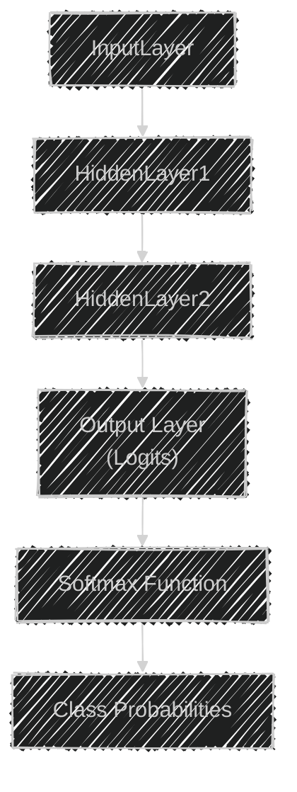
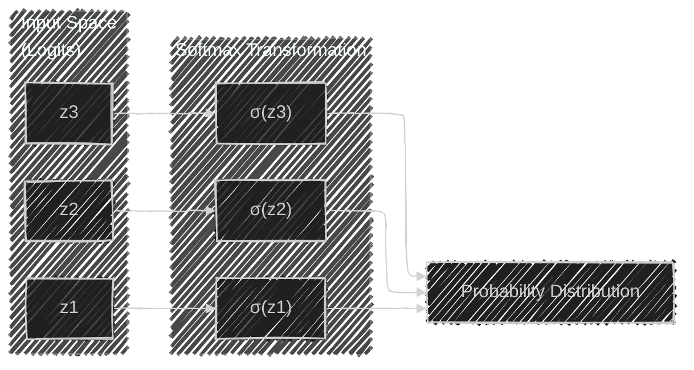
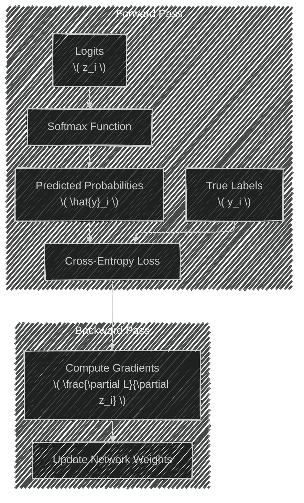
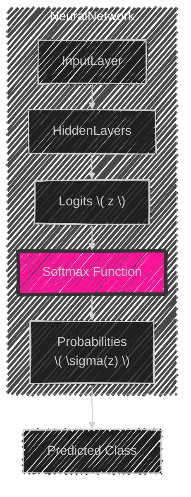

# Understanding the Softmax Function in Machine Learning
> This content is dual-licensed under your choice of the following licenses:
> 1.  **MIT License:** For the code implementations in Swift and Mermaid provided in this document.
> 2.  **Creative Commons Attribution 4.0 International License (CC BY 4.0):** For all other content, including the text, explanations, and the Mermaid diagrams and illustrations.

---

The **Softmax function** is a fundamental component in machine learning, particularly in neural networks used for classification tasks. It transforms raw output scores (logits) from a neural network into probabilities that sum up to one. This enables the network to output a probability distribution over classes, which is essential for multi-class classification problems.

In this explanation, we'll delve into:

1. **Mathematical Definition of the Softmax Function**
2. **Properties and Characteristics**
3. **Usage in Neural Networks**
4. **Computational Considerations (e.g., Numerical Stability)**
5. **Backpropagation and Gradient Computation**
6. **Visualization of the Softmax Function**
7. **Mermaid Diagrams Illustrating the Concepts**

---

## 1. Mathematical Definition

The Softmax function takes a vector of \( K \) real numbers and transforms it into a probability distribution consisting of \( K \) probabilities proportional to the exponentials of the input numbers.

### Formula

For a vector $\mathbf{z} = [z_1, z_2, \dots, z_K]$, the Softmax function $\sigma(\mathbf{z})$ is defined as:

$$
\sigma(z_i) = \frac{e^{z_i}}{\sum_{j=1}^{K} e^{z_j}} \quad \text{for } i = 1, \dots, K
$$

- $e^{z_i}$: Exponential function applied to the $i$-th element.
- $\sum_{j=1}^{K} e^{z_j}$: Sum of exponentials of all elements in the input vector.

---

## 2. Properties and Characteristics

- **Probability Distribution**: The output of the Softmax function is a probability distribution over \( K \) classes.

$$
  \sum_{i=1}^{K} \sigma(z_i) = 1
$$

- **Positive Outputs**: All components $\sigma(z_i)$ are positive since exponentials are always positive.

- **Exponentially Scaled**: The exponentials amplify differences in the input values, making the largest input have a higher probability.

- **Order Invariance**: Adding the same constant to all inputs doesn't change the output:

$$
  \sigma(z_i + c) = \sigma(z_i)
$$

---

## 3. Usage in Neural Networks

In neural networks, particularly in the **output layer** for classification tasks, the Softmax function converts the raw outputs (logits) into probabilities.

### Multi-Class Classification

- **Logits**: The raw outputs from the neural network before activation.
- **Softmax Layer**: Applies the Softmax function to the logits to obtain class probabilities.
- **Prediction**: The class with the highest probability is chosen as the predicted class.

### Example Architecture

---

## 4. Computational Considerations

### Numerical Stability

Computing exponentials of large numbers can lead to numerical overflow. To address this, we can subtract the maximum of the input vector from each input value.

#### Stable Softmax Implementation

$$
\sigma(z_i) = \frac{e^{z_i - z_{\text{max}}}}{\sum_{j=1}^{K} e^{z_j - z_{\text{max}}}}
$$

- $z_{\text{max}} = \max_{j}(z_j)$

By subtracting $z_{\text{max}}$, we ensure that the largest exponent is zero, preventing overflow.

---

## 5. Backpropagation and Gradient Computation

The Softmax function is often used in conjunction with the **Cross-Entropy Loss** for training neural networks. Understanding its derivative is essential for gradient-based optimization algorithms.

### Cross-Entropy Loss

For a single training example with true class $y$ and predicted probabilities $\sigma(z)$:

$$
L = -\ln(\sigma(z_y))
$$

### Gradient of the Loss with Respect to Inputs

$$
\frac{\partial L}{\partial z_i} = \sigma(z_i) - y_i
$$

- $y_i = 1$ if $i = y$ (correct class), else $y_i = 0$

This simplification arises from combining the derivatives of the Softmax function and the Cross-Entropy Loss.

---

## 6. Visualization of the Softmax Function

### Softmax Function Behavior

In this diagram, the logits $z_i$ are transformed by the Softmax function into probabilities $\sigma(z_i)$, which together form a probability distribution over classes.

---

## 7. Mermaid Diagrams Illustrating the Concepts

### Neural Network with Softmax Output Layer

### Computational Graph for Softmax and Cross-Entropy Loss

---

## 8. Detailed Explanation with Examples

### Example Calculation

Suppose we have logits $z = [2.0, 1.0, 0.1]$.

#### 1. Compute Exponentials

$$
   e^{z} = [e^{2.0}, e^{1.0}, e^{0.1}] \approx [7.389, 2.718, 1.105]
$$

#### 2. Sum of Exponentials

$$
S = 7.389 + 2.718 + 1.105 \approx 11.212
$$

#### 3. Compute Softmax Probabilities

$$
   \sigma(z_1) = \frac{7.389}{11.212} \approx 0.659 \\
   \sigma(z_2) = \frac{2.718}{11.212} \approx 0.243 \\
   \sigma(z_3) = \frac{1.105}{11.212} \approx 0.098
$$

#### 4. Interpretation

   - The model predicts class 1 with probability ~65.9%.
   - Class probabilities sum to 1.

### Numerical Stability Adjustment

Subtract $z_{\text{max}} = 2.0$:

$$
z' = [0.0, -1.0, -1.9]
$$

Compute exponentials of adjusted logits:

$$
e^{z'} = [1.0, e^{-1.0}, e^{-1.9}] \approx [1.0, 0.368, 0.150]
$$

Sum and compute probabilities as before.

---

## 9. Applications in Industry

- **Natural Language Processing (NLP)**: Language models predict the next word in a sentence using Softmax to produce probabilities over a vocabulary.
- **Computer Vision**: Image classification models output probabilities for each class label.
- **Recommender Systems**: Predict probabilities of user interactions with items.

---

## 10. Conclusion

The Softmax function is crucial for transforming model outputs into interpretable probabilities, enabling the assignment of confidence levels to predictions. Its mathematical properties ensure that outputs are positive and sum to one, which aligns with the requirements of probability distributions. Understanding the Softmax function's role, implementation, and computational considerations is essential for developing effective neural network models for classification tasks.

---

# Additional Technical Concepts

## Softmax Function Derivative

Understanding the derivative of the Softmax function is essential for implementing backpropagation in neural networks.

### Derivative with Respect to Input $z_k$

For $i = k$:

$$
\frac{\partial \sigma(z_i)}{\partial z_k} = \sigma(z_i)(1 - \sigma(z_i))
$$

For $i \neq k$:

$$
\frac{\partial \sigma(z_i)}{\partial z_k} = -\sigma(z_i)\sigma(z_k)
$$

### Jacobian Matrix

The Jacobian matrix \( J \) of the Softmax function is:

$$
J_{ij} = \frac{\partial \sigma(z_i)}{\partial z_j} = \sigma(z_i)(\delta_{ij} - \sigma(z_j))
$$

- $\delta_{ij}$ is the Kronecker delta, $\delta_{ij} = 1$ if $i = j$, else $0$.

---

## Using Log-Softmax for Numerical Stability

An alternative to computing the Softmax function directly is to compute the log-probabilities using the **Log-Softmax** function.

### Definition

$$
\log \sigma(z_i) = z_i - \log\left( \sum_{j=1}^{K} e^{z_j} \right)
$$

This formulation improves numerical stability, especially when dealing with very large or small values of $z_i$

---

## Relation to Cross-Entropy Loss

When using the Softmax function in combination with the Cross-Entropy Loss, the loss function simplifies, leading to efficient computation.

### Combined Loss Function

For a single sample with true class \( y \):

$$
L = -\ln(\sigma(z_y)) = -z_y + \log\left( \sum_{j=1}^{K} e^{z_j} \right)
$$

This combination avoids explicitly computing the probabilities, enhancing numerical stability and computational efficiency.

---

## Practical Implementation Tips

- **Avoid Overflow/Underflow**: Always implement the Softmax function with numerical stability techniques.
- **Use Built-in Functions**: Utilize optimized libraries and frameworks (e.g., TensorFlow, PyTorch) that handle these computations efficiently.
- **Batch Processing**: Compute Softmax over batches to leverage vectorized operations.

---

# Summary Mermaid Diagram

- **InputLayer**: Receives input data.
- **HiddenLayers**: Processes data through transformations.
- **Logits**: Raw output scores from the network.
- **SoftmaxFunction**: Converts logits into probabilities.
- **Probabilities**: Output probabilities for each class.
- **PredictedClass**: Class with the highest probability.

---

# Final Thoughts

The Softmax function bridges the gap between raw model outputs and interpretable probabilities required for decision-making in classification tasks. Its proper implementation and understanding are vital for any practitioner working with neural networks in fields like machine learning and artificial intelligence.

---
**Licenses:**

- **MIT License:**   - Full text in [LICENSE](LICENSE) file.
- **Creative Commons Attribution 4.0 International:**  - Legal details in [LICENSE-CC-BY](LICENSE-CC-BY) and at [Creative Commons official site](http://creativecommons.org/licenses/by/4.0/).

---