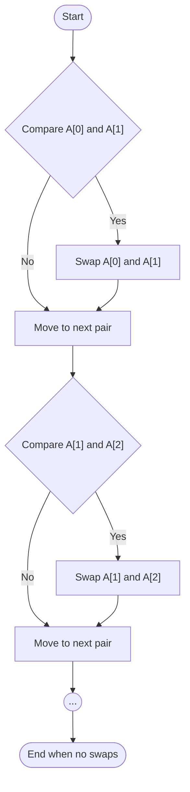
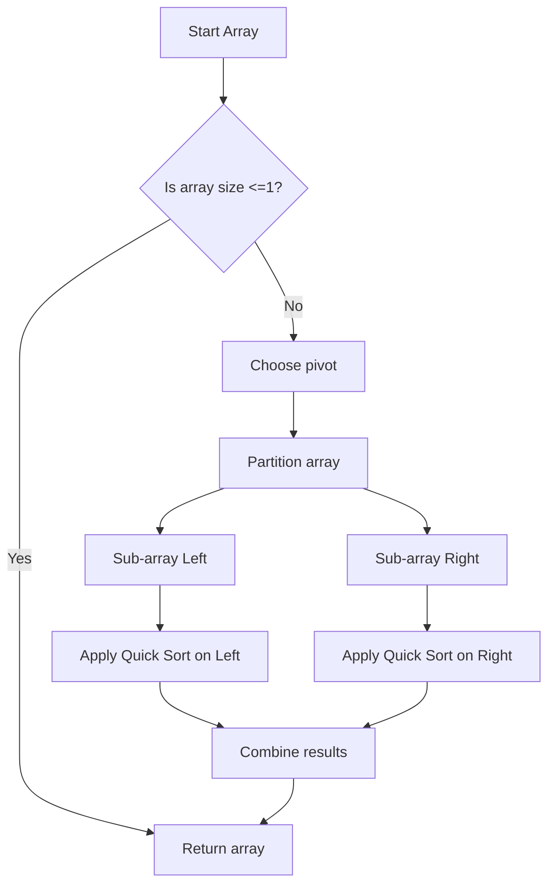
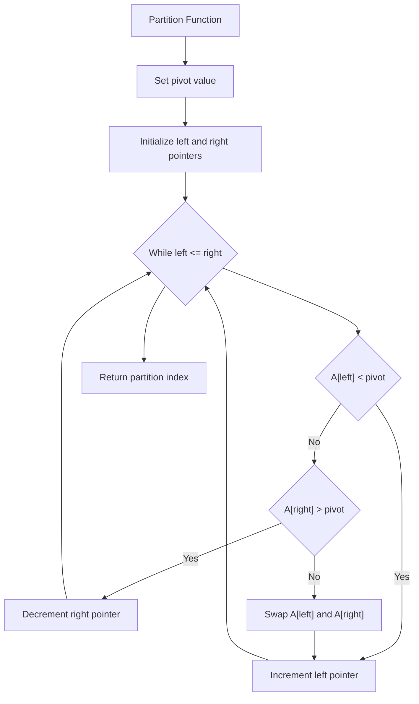
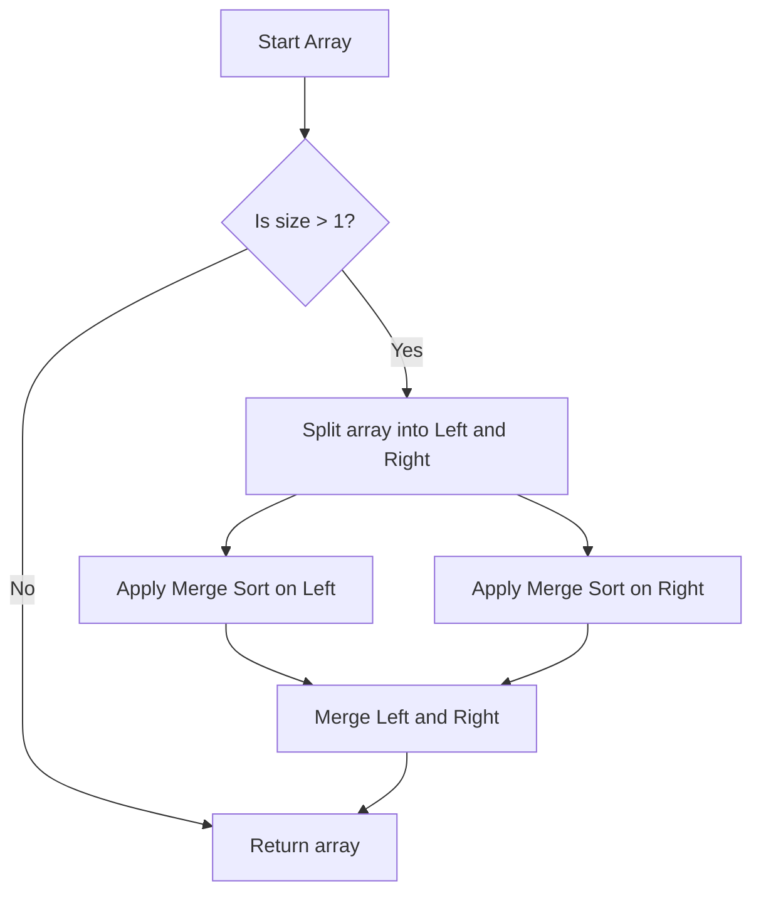
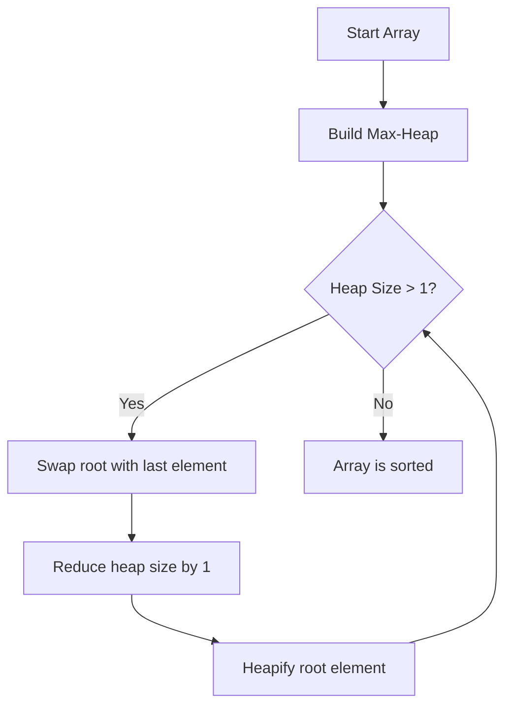
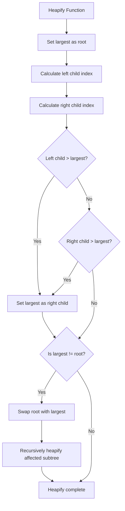

# Sorting Algorithms: An In-Depth Exploration
> This content is dual-licensed under your choice of the following licenses:
> 1.  **MIT License:** For the code implementations in Swift and Mermaid provided in this document.
> 2.  **Creative Commons Attribution 4.0 International License (CC BY 4.0):** For all other content, including the text, explanations, and the Mermaid diagrams and illustrations.

---

Sorting algorithms are fundamental to computer science and play a crucial role in organizing data for efficient processing. By arranging data in a particular order (ascending or descending), we can improve the performance of other algorithms that require sorted data, such as search algorithms and merge operations. This detailed examination will cover four key sorting algorithms: **Bubble Sort**, **Quick Sort**, **Merge Sort**, and **Heap Sort**, including their complexities, technical concepts, and current industry practices.

## Table of Contents

1. [Purpose of Sorting Algorithms](#purpose)
2. [Bubble Sort](#bubble-sort)
   - [Algorithm Explanation](#bubble-explanation)
   - [Complexity Analysis](#bubble-complexity)
   - [Mermaid Diagram](#bubble-mermaid)
3. [Quick Sort](#quick-sort)
   - [Algorithm Explanation](#quick-explanation)
   - [Complexity Analysis](#quick-complexity)
   - [Mermaid Diagrams](#quick-mermaid)
4. [Merge Sort](#merge-sort)
   - [Algorithm Explanation](#merge-explanation)
   - [Complexity Analysis](#merge-complexity)
   - [Mermaid Diagram](#merge-mermaid)
5. [Heap Sort](#heap-sort)
   - [Algorithm Explanation](#heap-explanation)
   - [Complexity Analysis](#heap-complexity)
   - [Mermaid Diagrams](#heap-mermaid)
6. [Applications in Industry](#applications)
7. [Comparative Summary](#summary)

---

## 1. Purpose of Sorting Algorithms

Sorting algorithms are designed to rearrange elements in a list or array to achieve a specific order. The primary purposes include:

- **Efficiency in Data Retrieval**: Sorted data allows for faster search operations, especially with algorithms like binary search.
- **Data Organization**: Helps in organizing data for better readability and analysis.
- **Optimization**: Enhances performance of other algorithms that require sorted input, such as algorithms for finding median values or performing merge operations.

---

## 2. Bubble Sort

### Algorithm Explanation

**Bubble Sort** is one of the simplest sorting algorithms. It works by repeatedly swapping adjacent elements if they are in the wrong order. This process continues until the entire list is sorted.

### Steps:

1. Compare each pair of adjacent items.
2. Swap them if they are in the wrong order.
3. Repeat step 1 and 2 for all elements until no swaps are needed.

### Complexity Analysis

- **Best Case Time Complexity**: \( O(n) \) (Already sorted)
- **Average Case Time Complexity**: \( O(n^2) \)
- **Worst Case Time Complexity**: \( O(n^2) \) (Reverse order)
- **Space Complexity**: \( O(1) \) (In-place sorting)
- **Stability**: Stable (Does not change the relative order of equal elements)

### Mermaid Diagram

*Note: The diagram represents the comparison and swapping of adjacent elements.*

---

## 3. Quick Sort

### Algorithm Explanation

**Quick Sort** is a divide-and-conquer algorithm that selects a 'pivot' element and partitions the array into sub-arrays according to whether they are less than or greater than the pivot.

### Steps:

1. **Choose a Pivot**: Select an element as the pivot (various methods: first element, random element, median).
2. **Partitioning**:
   - Rearrange elements so that all elements less than the pivot come before it, and all greater elements come after.
3. **Recursion**:
   - Recursively apply the above steps to the sub-array of elements with smaller values and separately to the sub-array of elements with greater values.

### Complexity Analysis

- **Best Case Time Complexity**: $O(n \log n)$
- **Average Case Time Complexity**: $O(n \log n)$
- **Worst Case Time Complexity**: $O(n^2)$ (When the smallest or largest element is always chosen as pivot)
- **Space Complexity**: $O(\log n)$ (Due to recursion stack)
- **Stability**: Not stable

### Mermaid Diagrams

#### Quick Sort Process

#### Partitioning Step

---

## 4. Merge Sort

### Algorithm Explanation

**Merge Sort** is another divide-and-conquer algorithm that divides the array into halves, sorts each half, and then merges the sorted halves back together.

### Steps:

1. **Divide**: Split the array into two halves.
2. **Conquer**: Recursively sort both halves.
3. **Merge**: Merge the two sorted halves into a single sorted array.

### Complexity Analysis

- **Best Case Time Complexity**: $O(n \log n)$
- **Average Case Time Complexity**: $O(n \log n)$
- **Worst Case Time Complexity**: $O(n \log n)$
- **Space Complexity**: $O(n)$ (Needs extra space for the temporary arrays)
- **Stability**: Stable

### Mermaid Diagram

*Note: The diagram illustrates the recursive splitting and merging process.*

---

## 5. Heap Sort

### Algorithm Explanation

**Heap Sort** utilizes a binary heap data structure to sort elements. A heap is a complete binary tree where each parent node is greater than or equal to its child nodes (max-heap) or less than or equal to its child nodes (min-heap).

### Steps:

1. **Build a Max-Heap** from the input data.
2. **Swap** the root of the heap (largest value) with the last item of the heap.
3. **Reduce** the size of the heap by one and **heapify** the root element to maintain the max-heap property.
4. **Repeat** steps 2 and 3 until the heap size is greater than 1.

### Complexity Analysis

- **Best Case Time Complexity**: $O(n \log n)$
- **Average Case Time Complexity**: $O(n \log n)$
- **Worst Case Time Complexity**: $O(n \log n)$
- **Space Complexity**: $O(1)$ (In-place sorting)
- **Stability**: Not stable

### Mermaid Diagrams

#### Heap Sort Process

#### Heapify Function

---

## 6. Applications in Industry

Sorting algorithms are integral to many systems and applications across various industries:

- **Database Systems**: Efficient querying often relies on sorted data for indexing and quick retrieval.
- **Search Engines**: Ranking and sorting search results based on relevance.
- **E-commerce Platforms**: Sorting products based on price, ratings, or popularity.
- **Operating Systems**: Managing processes and tasks in scheduling algorithms.
- **Telecommunications**: Organizing packets and signal processing tasks.
- **Computer Graphics**: Sorting polygons for rendering in correct order.
- **Finance**: Sorting transaction data for reporting and analysis.

### Current Practices:

- **Hybrid Algorithms**: Modern programming languages and libraries often use hybrid sorting algorithms that combine the strengths of multiple algorithms (e.g., TimSort in Python and Java combines Merge Sort and Insertion Sort).
- **Parallel Sorting**: Utilizing multi-threading and distributed systems to sort large datasets efficiently (e.g., using MapReduce in Hadoop).
- **External Sorting**: Handling sorting of data that does not fit into memory by using disk storage efficiently.
- **Custom Comparators**: Defining custom sorting criteria by implementing comparators to sort complex data structures.

---

## 7. Comparative Summary

| **Algorithm** | **Time Complexity (Average)** | **Space Complexity** | **Stable** | **In-place** |
|---------------|-------------------------------|----------------------|------------|--------------|
| Bubble Sort   | $O(n^2)$                      | $O(1)$               | Yes        | Yes          |
| Quick Sort    | $O(n \log n)$                 | $O(\log n)$          | No         | Yes          |
| Merge Sort    | $O(n \log n)$                 | $O(n)$               | Yes        | No           |
| Heap Sort     | $O(n \log n)$                 | $O(1)$               | No         | Yes          |

---

**Conclusion**:

Understanding sorting algorithms is essential for efficient data processing and optimization in software development. Each algorithm offers different advantages:

- **Bubble Sort** is useful for small datasets or when simplicity is required.
- **Quick Sort** is generally faster but requires careful implementation to avoid worst-case scenarios.
- **Merge Sort** guarantees $O(n \log n)$ time complexity and is stable, making it suitable for linked lists and external sorting.
- **Heap Sort** is a reliable $O(n \log n)$ algorithm that sorts in place but is not stable.

In industry, the choice of sorting algorithm depends on the data characteristics and specific requirements such as stability, memory constraints, and performance needs. Modern applications often use optimized and hybrid sorting techniques to leverage the strengths of multiple algorithms.

---

# Additional Notes:

- **Algorithm Stability**: A stable sorting algorithm maintains the relative order of records with equal keys (i.e., values). This is important when sorting complex data structures where secondary sorting criteria may exist.
- **In-place Sorting**: An in-place algorithm requires only a constant amount $O(1)$ of additional memory space.

---
**Licenses:**

- **MIT License:**   - Full text in [LICENSE](LICENSE) file.
- **Creative Commons Attribution 4.0 International:**  - Legal details in [LICENSE-CC-BY](LICENSE-CC-BY) and at [Creative Commons official site](http://creativecommons.org/licenses/by/4.0/).

---