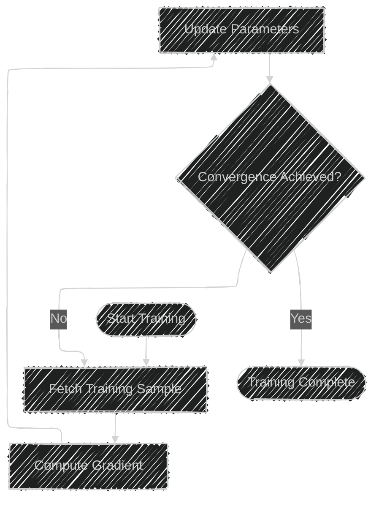
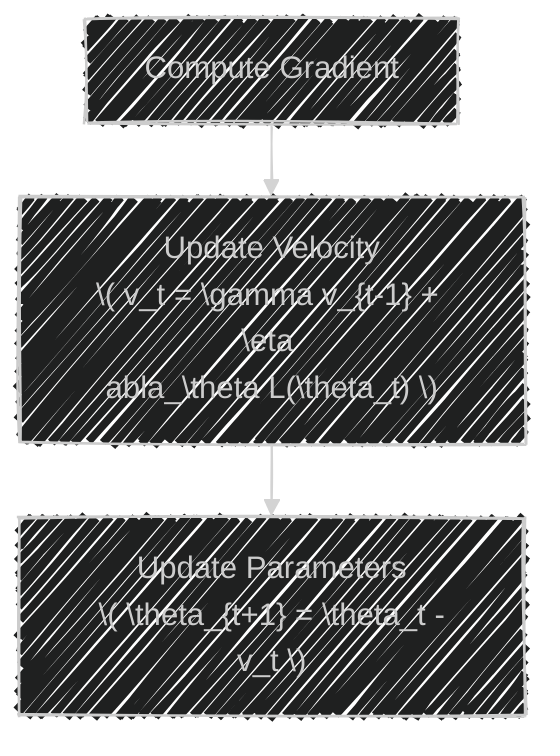
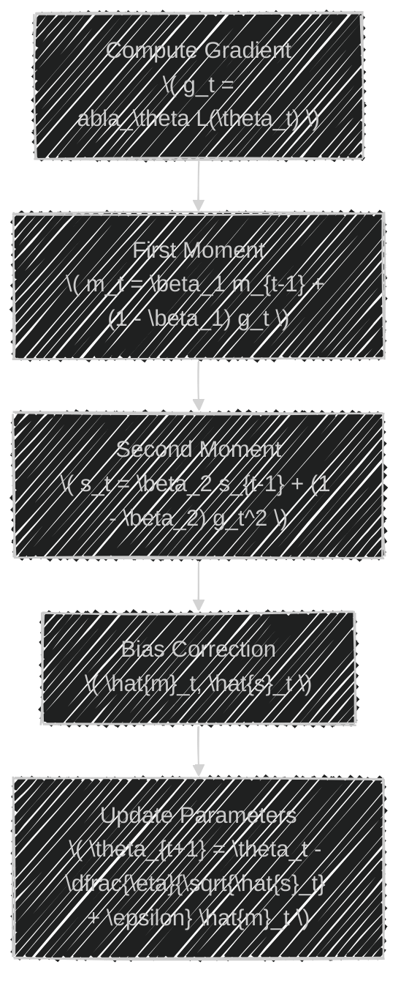
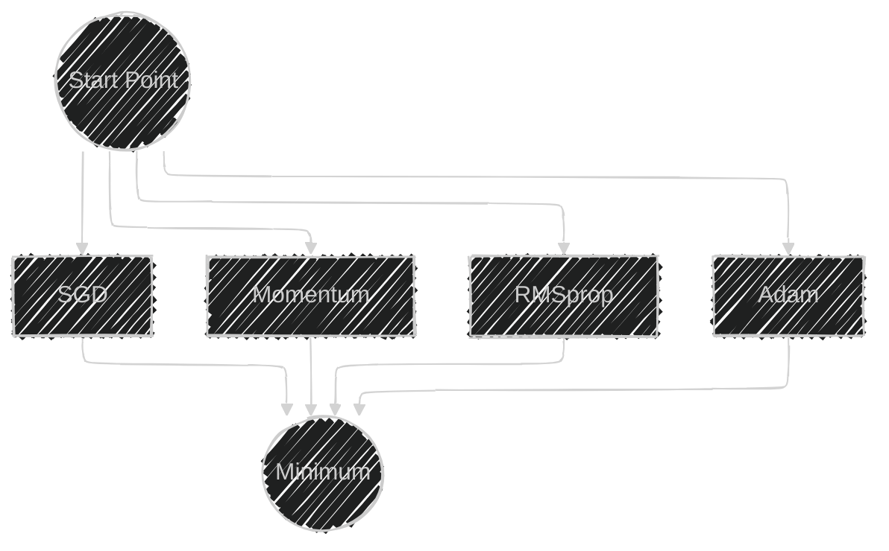

# Stochastic Gradient Descent (SGD) and Optimization Algorithms
> This content is dual-licensed under your choice of the following licenses:
> 1.  **MIT License:** For the code implementations in Swift and Mermaid provided in this document.
> 2.  **Creative Commons Attribution 4.0 International License (CC BY 4.0):** For all other content, including the text, explanations, and the Mermaid diagrams and illustrations.

---

Optimization algorithms are the backbone of training neural networks. They adjust the weights and biases of the network to minimize the loss function, improving the model's predictions. **Stochastic Gradient Descent (SGD)** is one of the fundamental optimization algorithms used for this purpose. Over time, several advanced optimization algorithms like **Adam** and **RMSprop** have been developed to enhance training efficiency and convergence.

In this explanation, we'll delve into:

- The fundamental concepts of SGD.
- Challenges associated with SGD.
- Advanced optimization algorithms (Adam, RMSprop).
- Mathematical formulations.
- Industry practices.
- Visual illustrations using Mermaid diagrams.

---

## **1. Fundamental Concepts of Stochastic Gradient Descent**

### **Gradient Descent**

**Gradient Descent** is an iterative optimization algorithm used to find the minimum of a function. In the context of neural networks, it aims to minimize the loss function $L(\theta)$ with respect to the model's parameters $\theta$.

The update rule for gradient descent is:

$$
\theta_{t+1} = \theta_t - \eta \nabla_\theta L(\theta_t)
$$

- $ \theta_t$: Parameters at iteration $t$.
- $\eta$: Learning rate (step size).
- $\nabla_\theta L(\theta_t)$: Gradient of the loss function with respect to $\theta_t$.

### **Stochastic Gradient Descent (SGD)**

**Stochastic Gradient Descent** is a variant of gradient descent that updates the model parameters using the gradient calculated from a single sample or a small batch of samples.

#### **Why Stochastic?**

- **Stochastic** means random. SGD introduces randomness by selecting a random subset of data to compute the gradient at each iteration.
- This random selection helps the algorithm to escape local minima and saddle points.

#### **SGD Update Rule**

For each training example $(x_i, y_i)$:

$$
\theta_{t+1} = \theta_t - \eta \nabla_\theta L(\theta_t; x_i, y_i)
$$

#### **Mermaid Diagram: SGD Workflow**

---

## **2. Challenges with SGD**

While SGD is simple and widely used, it has several challenges:

### **2.1 Learning Rate Selection**

- A small learning rate ($\eta$) leads to slow convergence.
- A large learning rate may cause the algorithm to overshoot minima or diverge.

### **2.2 Noisy Updates**

- Updating parameters based on a single sample introduces high variance in the gradient estimation.
- This can lead to fluctuating loss values and instability during training.

### **2.3 Getting Stuck in Local Minima or Saddle Points**

- The randomness can sometimes cause the algorithm to get stuck in regions where progress is slow.

---

## **3. Advanced Optimization Algorithms**

To address the limitations of SGD, several optimization algorithms have been developed.

### **3.1 Momentum**

Momentum accelerates SGD by adding a fraction $\gamma$ of the update vector of the past time step to the current update.

#### **Update Rule**

$$
v_t = \gamma v_{t-1} + \eta \nabla_\theta L(\theta_t)
$$
$$
\theta_{t+1} = \theta_t - v_t
$$

- $v_t$: Velocity (accumulated gradient).
- $\gamma$: Momentum coefficient (typically around 0.9).

#### **Mermaid Diagram: Momentum**

### **3.2 RMSprop**

RMSprop (Root Mean Square Propagation) adapts the learning rate for each parameter individually.

#### **Update Rule**

$$
s_t = \beta s_{t-1} + (1 - \beta) (\nabla_\theta L(\theta_t))^2
$$
$$
\theta_{t+1} = \theta_t - \dfrac{\eta}{\sqrt{s_t + \epsilon}} \nabla_\theta L(\theta_t)
$$

- $s_t$: Exponentially weighted average of squared gradients.
- $\beta$: Decay rate (typically around 0.9).
- $\epsilon$: Small constant to prevent division by zero.

### **3.3 Adam (Adaptive Moment Estimation)**

Adam combines ideas from Momentum and RMSprop.

#### **Update Rules**

1. **First Moment Estimate (Mean):**

$$
m_t = \beta_1 m_{t-1} + (1 - \beta_1) \nabla_\theta L(\theta_t)
$$

2. **Second Moment Estimate (Variance):**

$$
 s_t = \beta_2 s_{t-1} + (1 - \beta_2) (\nabla_\theta L(\theta_t))^2
$$

3. **Bias Correction:**

$$
  \hat{m}_t = \dfrac{m_t}{1 - \beta_1^t}, \quad \hat{s}_t = \dfrac{s_t}{1 - \beta_2^t}
$$

4. **Parameter Update:**

$$
 \theta_{t+1} = \theta_t - \dfrac{\eta}{\sqrt{\hat{s}_t} + \epsilon} \hat{m}_t
$$

- $m_t$: First moment (mean) estimate.
- $s_t$: Second moment (variance) estimate.
- $\beta_1, \beta_2$: Decay rates (typical values are 0.9 and 0.999).
- $\epsilon$: Small constant (e.g., $10^{-8}$).

### Mermaid Diagram: Adam Optimizer

---

## **4. Mathematical Formulations**

### **4.1 Momentum**

- **Objective**: Accelerate updates in relevant directions, dampen oscillations.

Update rules:

$$
\text{Velocity: } v_t = \gamma v_{t-1} + \eta \nabla_\theta L(\theta_t)
$$
$$
\text{Parameter Update: } \theta_{t+1} = \theta_t - v_t
$$

### **4.2 RMSprop**

- **Objective**: Adjust learning rates adaptively for each parameter.

Update rules:

$$
\text{Accumulate Squared Gradients: } s_t = \beta s_{t-1} + (1 - \beta) (\nabla_\theta L(\theta_t))^2
$$
$$
\text{Parameter Update: } \theta_{t+1} = \theta_t - \dfrac{\eta}{\sqrt{s_t + \epsilon}} \nabla_\theta L(\theta_t)
$$

### **4.3 Adam**

- **Objective**: Combine benefits of Momentum and RMSprop.

Update rules:

$$
\text{First Moment Estimate: } m_t = \beta_1 m_{t-1} + (1 - \beta_1) \nabla_\theta L(\theta_t)
$$
$$
\text{Second Moment Estimate: } s_t = \beta_2 s_{t-1} + (1 - \beta_2) (\nabla_\theta L(\theta_t))^2
$$
$$
\text{Bias-Corrected Moments: } \hat{m}_t = \dfrac{m_t}{1 - \beta_1^t}, \quad \hat{s}_t = \dfrac{s_t}{1 - \beta_2^t}
$$
$$
\text{Parameter Update: } \theta_{t+1} = \theta_t - \dfrac{\eta}{\sqrt{\hat{s}_t} + \epsilon} \hat{m}_t
$$

---

## **5. Industry Practices**

### **5.1 Preference for Advanced Optimizers**

- **Adam** is widely used due to its ability to handle sparse gradients and adapt learning rates.
- **RMSprop** is popular in training recurrent neural networks.
- These optimizers require less manual tuning of hyperparameters.

### **5.2 Default Parameters**

- Standard values (e.g., $\beta_1 = 0.9$, $\beta_2 = 0.999$, $\epsilon = 10^{-8}$) often work well.
- Allows for faster experimentation and development cycles.

### **5.3 Regularization and Generalization**

- Optimizers are used alongside techniques like weight decay, dropout, and batch normalization to improve generalization.

### **5.4 Learning Rate Scheduling**

- Learning rate schedules (e.g., exponential decay, cosine annealing) are applied to adjust \( \eta \) during training for better convergence.

---

## **6. Visualizing Optimization Algorithms**

### **6.1 Comparing Trajectories**

The following diagrams illustrate how different optimizers navigate the loss landscape.

#### **Mermaid Diagram: Optimization Trajectories**

In practice, **Adam** and **Momentum** can reach the minimum faster and with smoother trajectories compared to vanilla SGD.

### **6.2 Parameter Updates**

---

## **7. Practical Tips**

- **Learning Rate ($\eta$)**: Often, smaller learning rates are used with optimizers like Adam.
- **Batch Size**: Larger batches can improve gradient estimation but require more memory.
- **Hyperparameter Tuning**: While default values work, tuning $\beta_1$, $\beta_2$, and $\eta$ can yield better performance.
- **Combine with Regularization**: Use weight decay (L2 regularization) to prevent overfitting.

---

## **8. Conclusion**

Optimization algorithms are crucial for effective neural network training. **SGD** forms the foundation, but modern practices favor advanced optimizers like **Adam** and **RMSprop** due to their adaptive learning rates and efficient convergence.

By understanding these algorithms' inner workings and their practical implications, practitioners can train deep learning models more effectively, leading to better performance and faster development cycles.

---

# **Appendix: Key Mathematical Concepts**

## **A. Loss Function**

A loss function $L(\theta)$ measures the discrepancy between the predicted output and the true output.

- Common loss functions:
  - Mean Squared Error (MSE)
  - Cross-Entropy Loss

## **B. Gradient**

The gradient $\nabla_\theta L(\theta)$ represents the direction and rate of fastest increase of the loss function.

- Calculated using backpropagation in neural networks.

## **C. Learning Rate ($\eta$)**

Determines the size of the steps taken during the update.

- Needs careful tuning to balance convergence speed and stability.

---

# **References**

- [Kingma, D. P., & Ba, J. (2015). Adam: A Method for Stochastic Optimization](https://arxiv.org/abs/1412.6980)
- [Hinton, G. (2012). Lecture on RMSprop](http://www.cs.toronto.edu/~tijmen/csc321/slides/lecture_slides_lec6.pdf)
- [Goodfellow, I., Bengio, Y., & Courville, A. (2016). Deep Learning. MIT Press.](https://www.deeplearningbook.org/)

---

---
**Licenses:**

- **MIT License:**   - Full text in [LICENSE](LICENSE) file.
- **Creative Commons Attribution 4.0 International:**  - Legal details in [LICENSE-CC-BY](LICENSE-CC-BY) and at [Creative Commons official site](http://creativecommons.org/licenses/by/4.0/).

---