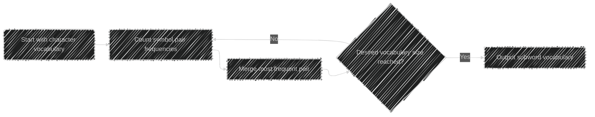
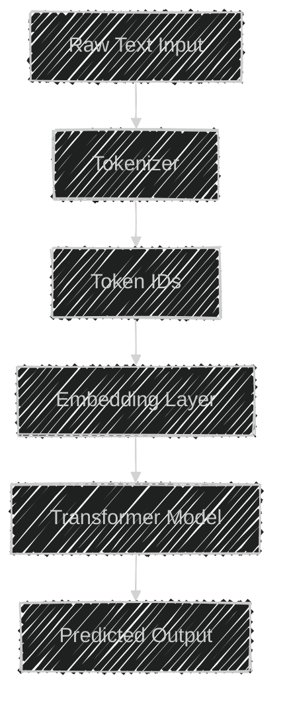
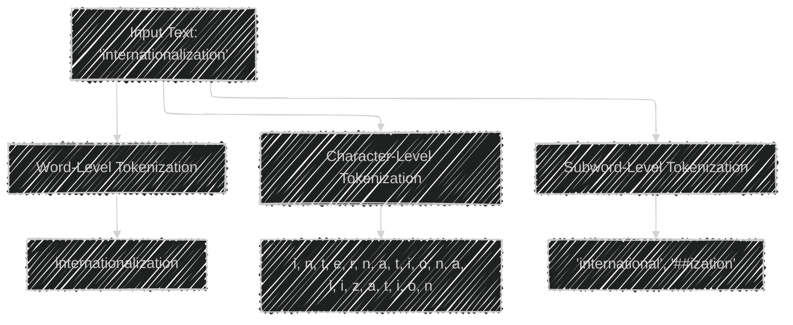
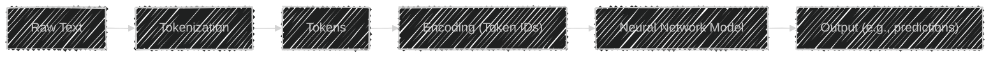
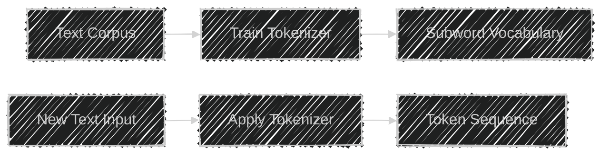

# Understanding Tokenization Algorithms in Natural Language Processing (NLP)
> This content is dual-licensed under your choice of the following licenses:
> 1.  **MIT License:** For the code implementations in Swift and Mermaid provided in this document.
> 2.  **Creative Commons Attribution 4.0 International License (CC BY 4.0):** For all other content, including the text, explanations, and the Mermaid diagrams and illustrations.

---


**Tokenization** is a fundamental step in Natural Language Processing (NLP) that involves breaking down text into smaller units called **tokens**. These tokens can be words, subwords, characters, or symbols and serve as the basic units for further processing and analysis by neural networks and other NLP models.

In this detailed explanation, we'll delve into the complexities and technical concepts of tokenization algorithms, exploring their purposes, applications, and the various methods used in the industry today.

---

## Overview

1. **What is Tokenization?**
2. **Importance of Tokenization in NLP**
3. **Types of Tokenization**
4. **Common Tokenization Algorithms**
5. **Subword Tokenization Techniques**
6. **Challenges in Tokenization**
7. **Industry Practices and Applications**
8. **Conclusion**

---

## 1. What is Tokenization?

Tokenization is the process of converting a sequence of text into a sequence of tokens. Tokens are the minimal units that carry meaning and are used as inputs to NLP models.

### Text to Tokens

```plaintext
Input Text: "Tokenization is essential for NLP."
Tokens: ["Tokenization", "is", "essential", "for", "NLP", "."]
```

---

## 2. Importance of Tokenization in NLP

- **Standardization**: Converts raw text into a standardized format.
- **Facilitates Processing**: Allows models to handle textual data efficiently.
- **Handles Vocabulary**: Manages the vocabulary size for computational tractability.
- **Context Representation**: Helps in capturing the contextual meaning of words or subwords.

---

## 3. Types of Tokenization

### 3.1 Word-Level Tokenization

- **Definition**: Splits text into words based on spaces and punctuation.
- **Example**:

  ```plaintext
  Text: "Natural language processing is fascinating."
  Tokens: ["Natural", "language", "processing", "is", "fascinating", "."]
  ```

- **Pros**:
  - Intuitive and straightforward.
  - Preserves word boundaries.

- **Cons**:
  - Large vocabulary size.
  - Issues with out-of-vocabulary (OOV) words.

### 3.2 Character-Level Tokenization

- **Definition**: Breaks text into individual characters.
- **Example**:

  ```plaintext
  Text: "Hi!"
  Tokens: ["H", "i", "!"]
  ```

- **Pros**:
  - Small vocabulary size.
  - Handles OOV words effectively.

- **Cons**:
  - Longer sequences.
  - May lose semantic meaning.

### 3.3 Subword-Level Tokenization

- **Definition**: Splits words into meaningful subword units.
- **Example**:

  ```plaintext
  Text: "unbelievable"
  Tokens: ["un", "believ", "able"]
  ```

- **Pros**:
  - Balance between word-level and character-level tokenization.
  - Addresses OOV issues.
  - Reduces vocabulary size.

- **Cons**:
  - Complexity in tokenization algorithms.
  - Requires training on corpus data.

---

## 4. Common Tokenization Algorithms

### 4.1 Regular Expression Tokenization

- **Method**: Uses regex patterns to split text.
- **Example**:

  ```plaintext
  Pattern: \w+|\S
  Text: "Hello, world!"
  Tokens: ["Hello", ",", "world", "!"]
  ```

**Mermaid Diagram**: Regex Tokenization Process


### 4.2 N-Gram Tokenization

- **Definition**: Creates tokens that are contiguous sequences of *n* items from the text.
- **Example**:

  - **Unigrams (n=1)**: ["Data", "science", "is", "fun"]
  - **Bigrams (n=2)**: ["Data science", "science is", "is fun"]
  - **Trigrams (n=3)**: ["Data science is", "science is fun"]

**Applications**:

- Captures context.
- Used in language modeling.

[[Step 2 - Tokenization Algorithms in NLP - More details - Common Tokenization Algorithms]]


---

## 5. Subword Tokenization Techniques

Subword tokenization balances vocabulary size and the ability to represent rare words.

### 5.1 Byte Pair Encoding (BPE)

- **Concept**: Merges frequent pairs of characters or character sequences.
- **Process**:

  1. **Initialization**: Start with all characters in the vocabulary.
  2. **Counting**: Count frequency of symbol pairs.
  3. **Merging**: Merge the most frequent pair.
  4. **Repeat**: Continue merging until desired vocabulary size is reached.

- **Example**:

  ```plaintext
  Vocabulary: {"l", "o", "w", "r", "e", "s", "t"}

  Corpus: "lowest lowest lower"

  Iterations:
  1. Merge 'l'+'o' -> 'lo'
  2. Merge 'lo'+'w' -> 'low'
  3. Merge 'e'+'s' -> 'es'
  4. Vocabulary: {"low", "e", "r", "es", "t"}
  ```

**Mermaid Diagram**: BPE Tokenization Process



### 5.2 WordPiece

- **Used In**: BERT models.
- **Concept**: Similar to BPE but uses probabilistic models to decide on merges.
- **Process**:

  1. **Initialization**: Start with character-level vocabulary.
  2. **Candidate Generation**: Generate candidate subwords.
  3. **Selection**: Select candidates that maximize likelihood.

### 5.3 SentencePiece

- **Language Independence**: Works without pre-tokenization.
- **Process**:

  - Treats input as a raw character sequence.
  - Learns subword units directly from text.

---

## 6. Challenges in Tokenization

### 6.1 Out-of-Vocabulary (OOV) Words

- **Issue**: Words not seen during training can't be represented.
- **Solution**: Subword tokenization reduces OOV occurrences.

### 6.2 Language Specificity

- **Issue**: Different languages have different tokenization needs (e.g., Chinese, Japanese).
- **Solution**: Use language-specific tokenizers or methods like SentencePiece.

### 6.3 Handling Compound Words

- **Issue**: Languages like German have compound words that need special handling.
- **Solution**: Subword tokenization can split compounds into meaningful units.

[[Step 2 - Tokenization Algorithms in NLP - More details - Language-Specific Tokenization Challenges and Solutions]]


---

## 7. Industry Practices and Applications

### 7.1 Transformers and Tokenization

Modern NLP models like Transformers utilize tokenization extensively.

**Mermaid Diagram**: Text Processing in Transformers



### 7.2 Examples of Tokenizers in Industry

- **BERT**: Uses WordPiece.
- **GPT Models**: Use BPE.
- **RoBERTa**: Uses BPE with modifications.
- **SentencePiece**: Used in models like T5, handling multilingual corpora.

---

## 8. Conclusion

Tokenization is a critical component in NLP that affects model performance, efficiency, and capability to handle diverse linguistic phenomena. By selecting appropriate tokenization algorithms, practitioners can improve model accuracy, reduce computational costs, and handle a wide range of languages and vocabularies.

---

## Additional Diagrams and Illustrations

### Comparison of Tokenization Methods

**Mermaid Diagram**: Tokenization Comparison



**Explanation**:

- **Word-Level**: Treats the entire word as a single token.
- **Character-Level**: Splits into individual characters.
- **Subword-Level**: Breaks into meaningful subwords, often using '##' to denote continuation.

---

### Tokenization Impact on Neural Networks

**Mermaid Diagram**: Tokenization and Neural Network Input




---

### Subword Tokenization Workflow

**Mermaid Diagram**: Subword Tokenization Workflow



---

## Technical Concepts

- **Vocabulary Size**: The total number of unique tokens in the tokenizer.
- **Granularity**: Level at which text is broken down (word, subword, character).
- **Segmentation Algorithms**: Methods used to determine token boundaries.
- **Frequency Analysis**: Counting occurrences to inform token merges or splits.
- **Contextual Embeddings**: Representations that capture token meaning in context.

---

## Current Practices in the Industry

- **Pretrained Tokenizers**: Utilizing tokenizers that are trained on large corpora.
- **Custom Tokenization**: Fine-tuning tokenizers on domain-specific vocabulary.
- **Language Models as Tokenizers**: Some approaches use models to predict token splits.

### Considerations

- **Speed vs. Accuracy**: More complex tokenization may improve accuracy but reduce speed.
- **Memory Constraints**: Larger vocabularies require more memory.
- **Multi-Language Support**: Tokenizers like SentencePiece are preferred for multilingual models.

---

## Conclusion

Understanding tokenization algorithms is essential for NLP practitioners. It influences model performance, efficiency, and the ability to handle diverse languages and vocabularies. By employing appropriate tokenization strategies, it's possible to optimize models for specific applications and improve the overall effectiveness of NLP solutions.

---

# References

- **Byte Pair Encoding (BPE)**: [Neural Machine Translation of Rare Words with Subword Units](https://arxiv.org/abs/1508.07909)
- **WordPiece**: [Japanese and Korean Voice Search](https://static.googleusercontent.com/media/research.google.com/en//pubs/archive/37842.pdf)
- **SentencePiece**: [SentencePiece: A simple and language independent subword tokenizer](https://github.com/google/sentencepiece)
- **Tokenization in Transformers**: [The Illustrated Transformer](http://jalammar.github.io/illustrated-transformer/)

---

*Note: The diagrams and explanations above are intended to provide a comprehensive understanding of tokenization algorithms, their importance in NLP, and how they are applied in current industry practices.*


---
**Licenses:**

- **MIT License:**  [](LICENSE) - Full text in [LICENSE](LICENSE) file.
- **Creative Commons Attribution 4.0 International:** [](LICENSE-CC-BY) - Legal details in [LICENSE-CC-BY](LICENSE-CC-BY) and at [Creative Commons official site](http://creativecommons.org/licenses/by/4.0/).

---