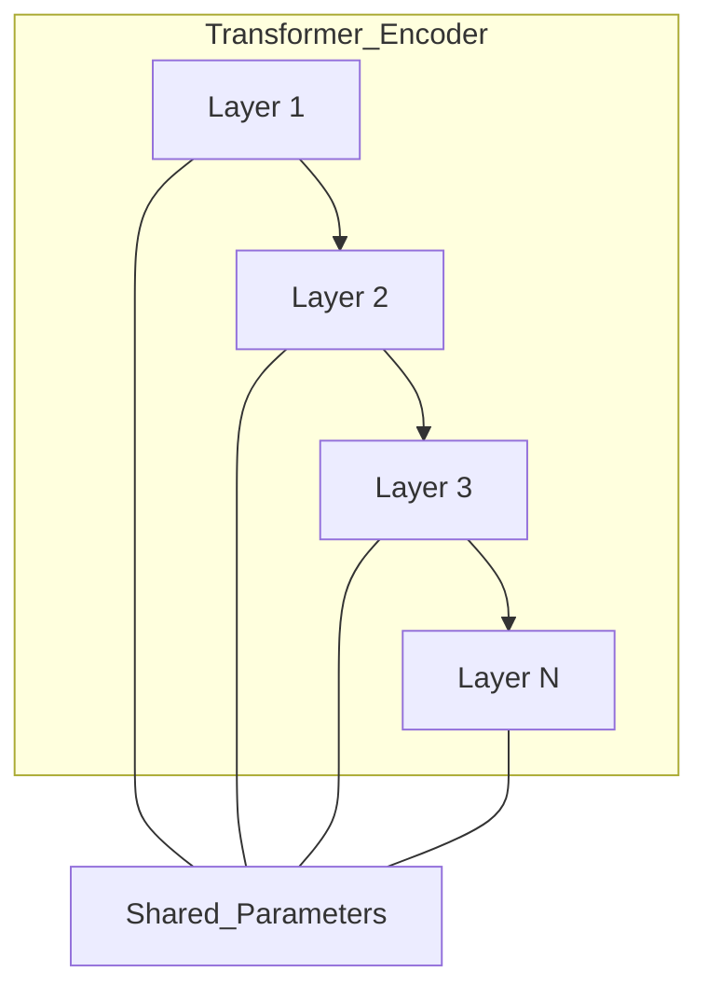
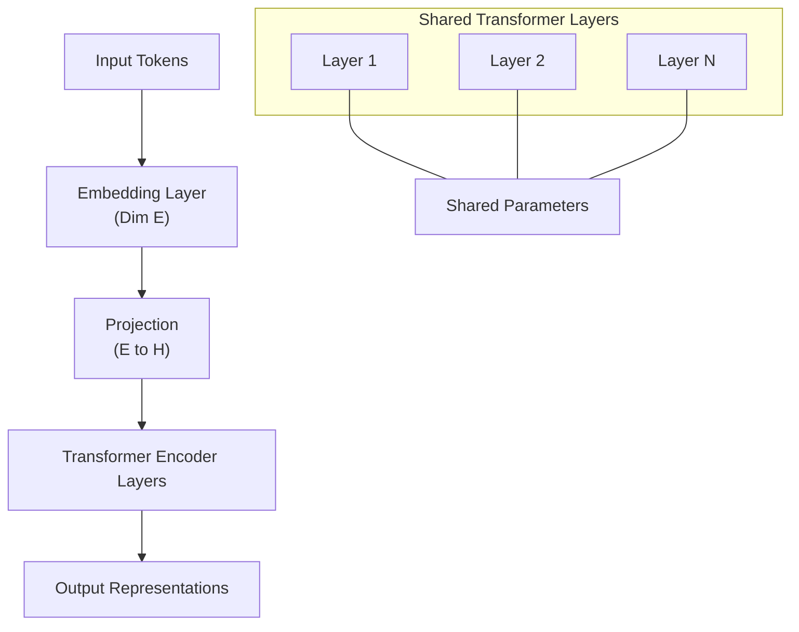

# ALBERT
> This content is dual-licensed under your choice of the following licenses:
> 1.  **MIT License:** For the code implementations in Swift and Mermaid provided in this document.
> 2.  **Creative Commons Attribution 4.0 International License (CC BY 4.0):** For all other content, including the text, explanations, and the Mermaid diagrams and illustrations.

---

## Overview of ALBERT

### Purpose and Motivation

- **ALBERT** stands for **A Lite BERT**.
- Developed to address the limitations of **BERT (Bidirectional Encoder Representations from Transformers)** regarding model size and memory footprint.
- Aims to reduce the number of parameters to make the model more efficient for:

  - **Training Speed**: Faster training with reduced computational resources.
  - **Memory Usage**: Lower memory requirements during training and inference.
  - **Deployment**: Easier to deploy on devices with limited resources.

### Key Contributions

- Introduces **parameter reduction techniques** to decrease the number of parameters without significantly impacting performance.
- Maintains performance comparable to BERT on various natural language processing (NLP) benchmarks.

---

## ALBERT's Parameter Reduction Techniques

ALBERT employs two main techniques for parameter reduction:

1. **Factorized Embedding Parameterization**
2. **Cross-Layer Parameter Sharing**

### 1. Factorized Embedding Parameterization

#### Purpose

- In traditional Transformer models like BERT, the **embedding size** and the **hidden layer size** are the same.
- This leads to a large embedding matrix, contributing significantly to the total number of parameters.

#### Implementation

- **Decouples** the size of the embeddings from the hidden layer size.
- Introduces a **smaller embedding dimension** \( E \) and projects embeddings to the hidden size \( H \) in the first layer.

#### Diagram of Factorized Embedding

- **Embedding Layer**: Embeds input tokens into a lower-dimensional space \( E \).
- **Projection Layer**: Maps embeddings from dimension \( E \) to \( H \).
- **Transformer Layers**: Operate with hidden size \( H \).

#### Mathematical Representation

- **Embedding Matrix** $\mathbf{E} \in \mathbb{R}^{V \times E}$, where $V$ is the vocabulary size.
- **Projection Matrix** $\mathbf{P} \in \mathbb{R}^{E \times H}$.
- **Combined Embedding**:

$$
  \mathbf{X} = \mathbf{E} \times \mathbf{P}
$$

- **Total Parameters in Embeddings**:

$$
  \text{Parameters} = V \times E + E \times H
$$

- By choosing $E \ll H$, the total parameters are significantly reduced.

#### Advantages

- **Reduces the embedding parameters** from $V \times H$ to $V \times E + E \times H$.
- Allows for larger hidden sizes $H$ without excessively increasing the embedding parameters.

### 2. Cross-Layer Parameter Sharing

#### Purpose

- Transformer models have multiple layers with identical architecture but separate parameters.
- This leads to a large number of parameters due to the repetition.

#### Implementation

- **Shares parameters** across layers in the Transformer encoder.
- Types of parameter sharing:

  - **All Parameters Shared**: Both feed-forward and attention parameters are shared.
  - **Sharing Only Feed-Forward Layers**: Share only feed-forward network parameters.
  - **Sharing Only Attention Layers**: Share only attention parameters.

#### Diagram of Cross-Layer Sharing

- **Shared Parameters**: All layers use the same set of parameters.
- **Effect**: Reduces the total number of parameters linearly with the number of layers.

#### Mathematical Representation

- Let \( \theta \) be the shared parameters.
- For each layer \( l \), the computations are:

$$
  \mathbf{H}^{(l)} = \text{Layer}(\mathbf{H}^{(l-1)}; \theta)
$$

- **Total Parameters** remain the same as a single layer, but the network depth is preserved.

#### Advantages

- **Reduces the total number of parameters** without decreasing the depth.
- Encourages the model to generalize patterns across layers.

---

## ALBERT Architecture

### Comparison with BERT

| **Aspect**                | **BERT**                                    | **ALBERT**                                       |
|---------------------------|---------------------------------------------|---------------------------------------------------|
| Embedding Size            | \( H \) (Same as hidden size)               | Smaller \( E \)                                   |
| Hidden Size               | \( H \)                                     | \( H \) (Can be larger due to parameter savings)  |
| Parameter Sharing         | No parameter sharing between layers         | Parameters shared across layers                   |
| Pre-training Tasks        | Masked Language Modeling (MLM), Next Sentence Prediction (NSP) | MLM, **Sentence Order Prediction (SOP)** |
| Total Parameters          | Large (Depends on \( H \), number of layers)| Significantly reduced compared to BERT            |

### Diagram of ALBERT Architecture

- **Embedding Layer**: Uses a reduced dimension \( E \).
- **Projection Layer**: Maps embeddings to the hidden size \( H \).
- **Transformer Layers**: Multiple layers with shared parameters.
- **Shared Parameters**: Parameters are reused across all layers.

---

## Pre-Training Objectives

### Masked Language Modeling (MLM)

- Same as in BERT.
- Predict masked tokens in the input sequence.

### Sentence Order Prediction (SOP)

#### Purpose

- **Replaces BERT's Next Sentence Prediction (NSP)** task.
- Aims to model inter-sentence coherence more effectively.

#### Implementation

- Inputs:

  - **Segment A**: First sentence from the text.
  - **Segment B**:

    - 50% chance: The actual next sentence (as in the original text).
    - 50% chance: A sentence swapped from another text (different from NSP).

- **Objective**:

  - Predict whether **Segment B** is the actual next sentence or not.

#### Advantages over NSP

- **Eliminates Topic Leakage**: NSP can be solved by topic prediction rather than understanding sentence order.
- **Focuses on Sentence Coherence**: SOP requires understanding the logical order of sentences.

---

## Mathematical Formulations

### Factorized Embedding Parameterization Equations

#### Parameter Reduction

- Original embedding parameters:

$$
\text{Parameters}_{\text{BERT}} = V \times H
$$

- ALBERT embedding parameters:

$$
  \text{Parameters}_{\text{ALBERT}} = V \times E + E \times H
$$

- **Reduction Factor**:

$$
  \text{Reduction} = \frac{V \times H}{V \times E + E \times H}
$$

  - Significant when $E \ll H$.

### Cross-Layer Parameter Sharing Equations

- Number of parameters for Transformer layers:

$$
  \text{Parameters}_{\text{BERT}} = L \times \text{Params}_{\text{per layer}}
$$

- With parameter sharing:

$$
  \text{Parameters}_{\text{ALBERT}} = \text{Params}_{\text{per layer}}
$$

- **Reduction Factor**:

$$
  \text{Reduction} = \frac{L \times \text{Params}_{\text{per layer}}}{\text{Params}_{\text{per layer}}} = L
$$

  - The reduction is proportional to the number of layers \( L \).

---

## Performance and Results

### Benchmarks

- Evaluated on **GLUE (General Language Understanding Evaluation)** benchmark.
- Also tested on **SQuAD (Stanford Question Answering Dataset)**.

### Performance Comparison

- Despite having fewer parameters, ALBERT achieves performance comparable or superior to BERT.
- Benefits from deeper networks enabled by parameter reduction.

### Example Results

| **Model**             | **Parameters** | **GLUE Score** |
|-----------------------|----------------|----------------|
| BERT-base             | 110M           | ~79.6          |
| BERT-large            | 340M           | ~82.1          |
| ALBERT-base           | 12M            | ~80.1          |
| ALBERT-large          | 18M            | ~81.0          |
| ALBERT-xxlarge        | 235M           | ~89.4          |

- **Observation**: ALBERT-xxlarge achieves superior performance with fewer parameters compared to BERT-large.

---

## Challenges and Considerations

### Trade-offs

- **Model Depth vs. Parameter Sharing**:

  - Sharing parameters allows for deeper models without increasing parameters.
  - May limit the capacity of the model to learn diverse representations across layers.

- **Embedding Dimension Choice**:

  - Choosing \( E \) too small may affect the model's ability to capture rich semantic information.
  - Requires careful tuning based on the task and dataset.

### Training Complexity

- **Optimization Difficulty**:

  - Shared parameters can make training more challenging due to the increased depth.
  - Requires techniques like careful initialization and learning rate schedules.

- **Computational Resources**:

  - Although the model has fewer parameters, deeper architectures can require more training time.
  - Efficient implementation is necessary to leverage computational savings.

---

## Impact on Industry and Current Practices

### Deployment Advantages

- **Resource-Constrained Environments**:

  - Suitable for deployment on devices with limited memory and computational power.
  - Enables use cases in mobile applications and edge computing.

- **Faster Training and Inference**:

  - Reduced parameters lead to faster model training and inference times.
  - Cost-effective for organizations with limited computational resources.

### Adoption in Applications

- Used in various NLP applications such as:

  - **Text Classification**
  - **Question Answering**
  - **Sentiment Analysis**
  - **Summarization**

- Integration into frameworks and libraries for easier adoption by developers.

### Open Source Contribution

- ALBERT has open-source implementations available, facilitating research and development.
- Encourages experimentation with model compression techniques in the community.

---

## Technical Deep Dive

### Factorized Embedding Parameterization Details

- **Motivation**:

  - In languages with large vocabularies, the embedding matrix contributes significantly to the model size.
  - For example, with \( V = 30,000 \) and \( H = 768 \), embedding parameters are over 23 million.

- **Approach**:

  - Introduce a lower-dimensional embedding space (\( E \)) to capture the **vocabulary-level information**.
  - The projection layer then transforms embeddings into a higher-dimensional hidden space (\( H \)) to capture **contextual information**.

### Cross-Layer Parameter Sharing Variants

- **All Layers Shared (Type 1 Sharing)**:

  - Both attention and feed-forward network parameters are shared.
  - Maximizes parameter reduction.

- **Attention Parameters Shared Only (Type 2 Sharing)**:

  - Only the parameters of the attention sub-layer are shared.
  - Allows feed-forward networks to learn layer-specific transformations.

- **Feed-Forward Parameters Shared Only (Type 3 Sharing)**:

  - Only the feed-forward network parameters are shared.
  - Attention sub-layers can learn different attention patterns at each layer.

### Sentence Order Prediction (SOP) Task Details

- **Difference from NSP**:

  - NSP can be gamed by predicting topic alignment rather than sentence continuity.
  - SOP requires the model to understand the actual order of sentences.

- **Implementation Example**:

  - Given two sentences \( S_1 \) and \( S_2 \):

    - Positive Example: $\text{[CLS]} \, S_1 \, \text{[SEP]} \, S_2 \, \text{[SEP]}$
    - Negative Example: $\text{[CLS]} \, S_2 \, \text{[SEP]} \, S_1 \, \text{[SEP]}$

  - The model predicts whether $S_2$ follows $S_1$.

---

## Mathematical Formulation of ALBERT's Techniques

### Factorized Embedding Parameterization

- **Embedding Lookup**:

$$
\mathbf{e}_i = \mathbf{E}_{\text{token}_i}
$$

- **Projection to Hidden Space**:

$$
  \mathbf{h}_i^{(0)} = \mathbf{e}_i \mathbf{P}
$$

- **Dimension Reduction**:

  - Embedding matrix: $\mathbf{E} \in \mathbb{R}^{V \times E}$
  - Projection matrix: $\mathbf{P} \in \mathbb{R}^{E \times H}$

### Layer Outputs with Shared Parameters

- For layer \( l \):

$$
  \mathbf{H}^{(l)} = \text{TransformerLayer}(\mathbf{H}^{(l-1)}; \theta)
$$

- Since \( \theta \) is shared:

  - All layers apply the same transformation to their inputs.

---

## Conclusion

**ALBERT** showcases how intelligent parameter reduction techniques can lead to efficient models without significant performance degradation. By introducing **factorized embedding parameterization** and **cross-layer parameter sharing**, ALBERT reduces the number of parameters, enabling:

- **Faster Training**: Reduced computational overhead.
- **Efficient Deployment**: Suitable for environments with limited resources.
- **High Performance**: Maintains or improves upon BERT's performance on benchmarks.

This balance between efficiency and effectiveness makes ALBERT a valuable model in the NLP landscape, influencing current practices and guiding future research in model compression and optimization.

---

## References

- **Original Paper**: Lan, Z., Chen, M., Goodman, S., Gimpel, K., Sharma, P., & Soricut, R. (2019). "[ALBERT: A Lite BERT for Self-supervised Learning of Language Representations](https://arxiv.org/abs/1909.11942)". *arXiv preprint arXiv:1909.11942*.
- **BERT Paper**: Devlin, J., Chang, M.-W., Lee, K., & Toutanova, K. (2018). "[BERT: Pre-training of Deep Bidirectional Transformers for Language Understanding](https://arxiv.org/abs/1810.04805)". *arXiv preprint arXiv:1810.04805*.

---
**Licenses:**

- **MIT License:**   - Full text in [LICENSE](LICENSE) file.
- **Creative Commons Attribution 4.0 International:**  - Legal details in [LICENSE-CC-BY](LICENSE-CC-BY) and at [Creative Commons official site](http://creativecommons.org/licenses/by/4.0/).

---