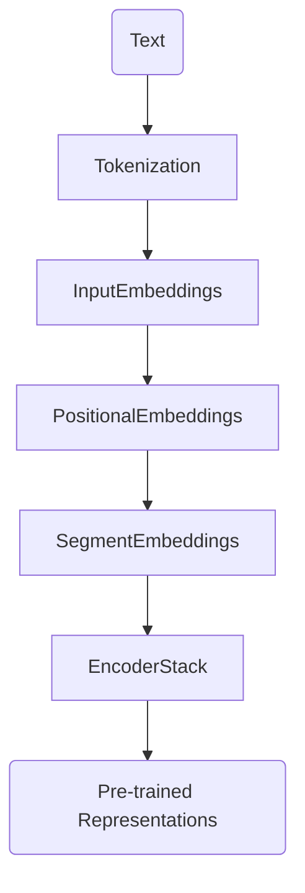
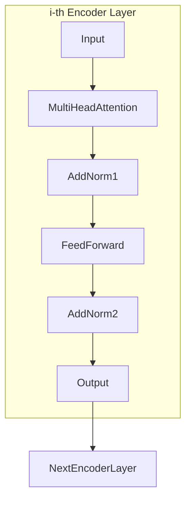

# BERT
> This content is dual-licensed under your choice of the following licenses:
> 1.  **MIT License:** For the code implementations in Swift and Mermaid provided in this document.
> 2.  **Creative Commons Attribution 4.0 International License (CC BY 4.0):** For all other content, including the text, explanations, and the Mermaid diagrams and illustrations.

---


## Overview of BERT

### Purpose

- **BERT** is a **pre-trained deep learning model** designed to understand the context of words in search queries and text.
- It stands for **Bidirectional Encoder Representations from Transformers**.
- Developed by **Google AI Language** in 2018.
- Designed to pre-train deep bidirectional representations by jointly conditioning on both left and right contexts in all layers.

### Key Innovations

- **Bidirectional Training**: Unlike previous models that processed text sequentially (left-to-right or right-to-left), BERT reads text in both directions simultaneously.
- **Contextualized Word Embeddings**: Generates embeddings that consider the context provided by surrounding words.
- **Pre-training and Fine-tuning**: BERT is first pre-trained on a large corpus and then fine-tuned for specific downstream tasks.

---

## BERT Architecture

### High-Level Architecture

- **BERT uses only the Encoder stack** of the Transformer architecture.
- It removes the need for task-specific architectures by using a general-purpose "language understanding" model.



- **Input**: Text data (sentences or paragraphs).
- **Tokenization**: Converts text into tokens using WordPiece embeddings.
- **Input Embeddings**: Maps tokens to vectors.
- **Positional Embeddings**: Adds positional information to embeddings.
- **Segment Embeddings**: Distinguishes segments (useful for sentence pairs).
- **Encoder Stack**: Multiple layers of Transformer encoders.
- **Output**: Contextualized representations for each token.

---

### Detailed BERT Architecture

#### Encoder Stack

- **Stack of 12 (BERT-base) or 24 (BERT-large) Transformer Encoder layers**.
- Each layer consists of:
  - **Multi-Head Self-Attention**
  - **Add & Norm (Residual Connections and Layer Normalization)**
  - **Feed-Forward Networks (FFN)**
  - **Add & Norm**



- This structure is repeated for each layer in the encoder stack.

#### Components Breakdown

1. **Multi-Head Self-Attention**
   - Allows the model to attend to information from different representation subspaces.
2. **Add & Norm**
   - Residual connections help with training deep networks.
   - Layer normalization stabilizes the network.
3. **Feed-Forward Networks (FFN)**
   - Two-layer fully connected network applied to each position separately and identically.

---

## Pre-training Tasks

BERT is pre-trained on two unsupervised prediction tasks:

### 1. Masked Language Modeling (MLM)

- **Objective**: Predict missing words in a sentence.
- **Process**:
  - Randomly mask some tokens in the input.
  - The model predicts the original vocabulary id of the masked word based on its context.

**Example**:

- Input: "The man went to the [MASK] to buy some milk."
- Target: Predict "[MASK]" should be "store".

#### MLM Procedure

1. **Token Masking**:
   - 15% of tokens are selected for masking.
   - Out of these:
     - 80% are replaced with [MASK].
     - 10% are replaced with a random token.
     - 10% remain unchanged.

2. **Loss Function**:
   - Cross-entropy loss on predicting the masked tokens.

**Mathematical Formulation**:

Let $\theta$ be the model parameters, $x = \{ x_1, ..., x_T \}$ the input tokens, and $\hat{x}_t$ the masked token.

$$
\mathcal{L}_{\text{MLM}}(\theta) = - \sum_{t \in M} \log P(x_t | x_{\backslash M}; \theta)
$$

- $M$ is the set of masked token positions.
- $x_{\backslash M}$ is the input sequence with masked tokens.

---

### 2. Next Sentence Prediction (NSP)

- **Objective**: Determine if a given sentence **B** is the actual next sentence that follows sentence **A**.

**Process**:

- Input pairs:
  - **Positive Examples (50%)**: Actual consecutive sentences from the corpus.
  - **Negative Examples (50%)**: Random sentences from the corpus.

- The model predicts a binary label indicating whether **B** is the next sentence after **A**.

#### NSP Procedure

1. **Input Representation**:
   - **[CLS]** token at the beginning.
   - **[SEP]** token separates sentences.
   - Segment embeddings differentiate sentences A and B.

2. **Loss Function**:
   - Binary classification loss (cross-entropy loss).

**Mathematical Formulation**:

Let \( \theta \) be the model parameters, and \( C \) be the output vector corresponding to the [CLS] token.

$$
\mathcal{L}_{\text{NSP}}(\theta) = - [ y \log P_{\text{NSP}}(y=1|C) + (1 - y) \log P_{\text{NSP}}(y=0|C) ]
$$

- \( y \) is the ground truth label (1 if B is the next sentence, 0 otherwise).
- $P_{\text{NSP}}$ is computed using a softmax layer on top of \( C \).

---

## Input Representation

BERT uses a **combined representation** for token embeddings, segment embeddings, and positional embeddings.

```markdown
flowchart LR
    TokenEmbedding + SegmentEmbedding + PositionalEmbedding --> InputEmbedding
```

- **Token Embeddings**: WordPiece embeddings of the tokens.
- **Segment Embeddings**: Indicate Sentence A or Sentence B (useful for NSP).
- **Positional Embeddings**: Learnable embeddings representing token positions.

### WordPiece Tokenization

- Sub-word tokenization method that splits words into smaller pieces.
- Helps in handling rare words and out-of-vocabulary tokens.

**Example**:

- Word: "playing"
- Tokens: "play", "##ing"

---

## Training Process

### Datasets

- **BooksCorpus**: 800 million words from unpublished books.
- **English Wikipedia**: 2,500 million words.

### Training Procedure

- **Unsupervised Pre-training**:
  - Combined MLM and NSP tasks.
  - Optimized using Adam optimizer with weight decay.
- **Hyperparameters**:
  - **BERT-base**:
    - Layers: 12
    - Hidden size: 768
    - Attention heads: 12
    - Parameters: 110 million
  - **BERT-large**:
    - Layers: 24
    - Hidden size: 1024
    - Attention heads: 16
    - Parameters: 340 million

---

## Fine-tuning BERT for Downstream Tasks

### General Approach

- Add a task-specific layer on top of BERT.
- Fine-tune all parameters end-to-end using labeled data for the task.

### Examples of Tasks

1. **Text Classification**
   - Sentiment analysis, topic classification.
   - Use the [CLS] token representation and add a softmax classifier.

2. **Question Answering**
   - SQuAD (Stanford Question Answering Dataset).
   - Predict the start and end positions of the answer span in the text.

3. **Named Entity Recognition**
   - Label each token with entity tags.
   - Use token-level representations from BERT.

4. **Next Sentence Prediction**
   - NLI (Natural Language Inference) tasks.
   - Use the [CLS] token and add a classifier for entailment.

---

## Technical Details

### Attention Mechanism in BERT

- **Self-Attention**: Each token attends to every other token in the sequence.
- **Multi-Head Attention**: Improves the model's ability to focus on different positions.

**Equation**:

$$
\text{Attention}(Q, K, V) = \text{softmax}\left( \frac{Q K^\top}{\sqrt{d_k}} \right) V
$$

- $Q, K, V$: Matrices of queries, keys, and values.
- $d_k$: Dimension of the key vectors.

### Positional Embeddings

- **Learnable Parameters**: Unlike sinusoidal positional embeddings in the original Transformer.
- Allow the model to learn positional relationships in data.

### Segment Embeddings

- Distinguish between sentences A and B in input pairs.
- **Segment A Embedding**: Added to tokens of the first sentence.
- **Segment B Embedding**: Added to tokens of the second sentence.

---

## Advantages of BERT

### Bidirectionality

- Considers context from both left and right simultaneously.
- Allows for deeper understanding than unidirectional models.

### Contextualized Embeddings

- Generates embeddings that capture context-specific meanings.

  **Example**:

  - "He banked the plane."
  - "She went to the bank."

- The word "bank" has different embeddings in each sentence.

### Pre-training and Fine-tuning Paradigm

- Reduces the need for task-specific architectures.
- Empirical success across various NLP tasks.

---

## Variants and Extensions of BERT

### RoBERTa (Robustly Optimized BERT Approach)

- Developed by Facebook AI.
- Improvements:
  - Trained longer with more data.
  - Removed NSP task.
  - Larger byte-level BPE tokenizer.

### ALBERT (A Lite BERT)

- Parameter reduction techniques to lower memory consumption.
- **Factorized Embedding Parameterization**.
- **Cross-layer Parameter Sharing**.

### DistilBERT

- Smaller, faster, cheaper version of BERT.
- Uses knowledge distillation during pre-training.

### Others

- **TinyBERT**, **MobileBERT**, **SpanBERT**, **SciBERT**: Specialized for various domains or efficiency.

---

## Applications of BERT

### Text Classification

- Sentiment analysis, spam detection.

### Question Answering

- Extractive QA systems, chatbots.

### Named Entity Recognition

- Extracting entities like names, organizations, dates.

### Text Summarization

- Generating concise summaries of documents.

### Language Translation

- Though primarily encoder-based, can be adapted with decoders.

### Natural Language Inference

- Recognizing textual entailment.

---

## Impact on NLP and Industry

### State-of-the-Art Results

- BERT set new benchmarks on 11 NLP tasks upon release.
- Significant improvements in accuracy over previous models.

### Adoption

- Widely adopted in academia and industry.
- Integrated into search engines, virtual assistants, and content management systems.

### Open Source

- Google released the pre-trained models and source code.
- Encouraged widespread experimentation and adoption.

---

## Technical and Mathematical Details

### Loss Function

Total loss during pre-training is the sum of MLM and NSP losses:

$$
\mathcal{L} = \mathcal{L}_{\text{MLM}} + \mathcal{L}_{\text{NSP}}
$$

### Optimization

- **Optimizer**: Adam with weight decay.
- **Learning Rate Scheduler**: Warm-up over the first 10,000 steps.
- **Batch Size**: 256 to 512 examples.
- **Dropout**: Applied to prevent overfitting.

### Training Time

- **BERT-base**: Trained on 4 Cloud TPUs for 4 days.
- **BERT-large**: Trained on 16 Cloud TPUs for 4 days.

### Computational Resources

- Requires significant computational power.
- Training involves processing massive amounts of data.

---

## Limitations and Challenges

### Computational Cost

- High computational resources needed for pre-training.
- Not feasible for small organizations to train from scratch.

### Memory Requirements

- Large model size leads to high memory consumption.
- Challenges in deploying on devices with limited resources.

### Fine-tuning Stability

- Fine-tuning can be unstable with small datasets.
- Requires careful hyperparameter tuning.

### Context Length Limitation

- Fixed maximum sequence length (commonly 512 tokens).
- Longer sequences need to be truncated or need special handling.

---

## Innovations Post-BERT

### Transformer-XL

- Addresses context fragmentation with recurrence mechanisms.

### XLNet

- Permutation-based language modeling objective.

### ELECTRA

- Replaces MLM with a more sample-efficient pre-training task.

### Longformer & BigBird

- Models designed to handle longer context windows efficiently.

---

## Conclusion

BERT has revolutionized NLP by introducing a powerful pre-training technique that leverages bidirectional context. Its impact is evident in improved performance across a wide range of tasks. Despite its computational demands, BERT set the foundation for numerous subsequent models and continues to influence advancements in language understanding.

---

## References

1. **BERT: Pre-training of Deep Bidirectional Transformers for Language Understanding**
   - [Original Paper](https://arxiv.org/abs/1810.04805)
2. **Attention is All You Need**
   - [Transformer Paper](https://arxiv.org/abs/1706.03762)
3. **RoBERTa: A Robustly Optimized BERT Pretraining Approach**
   - [Paper](https://arxiv.org/abs/1907.11692)
4. **ALBERT: A Lite BERT for Self-supervised Learning of Language Representations**
   - [Paper](https://arxiv.org/abs/1909.11942)
5. **DistilBERT, a distilled version of BERT: smaller, faster, cheaper and lighter**
   - [Paper](https://arxiv.org/abs/1910.01108)


---
**Licenses:**

- **MIT License:**  [](LICENSE) - Full text in [LICENSE](LICENSE) file.
- **Creative Commons Attribution 4.0 International:** [](LICENSE-CC-BY) - Legal details in [LICENSE-CC-BY](LICENSE-CC-BY) and at [Creative Commons official site](http://creativecommons.org/licenses/by/4.0/).

---