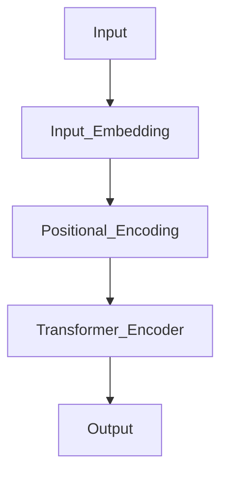
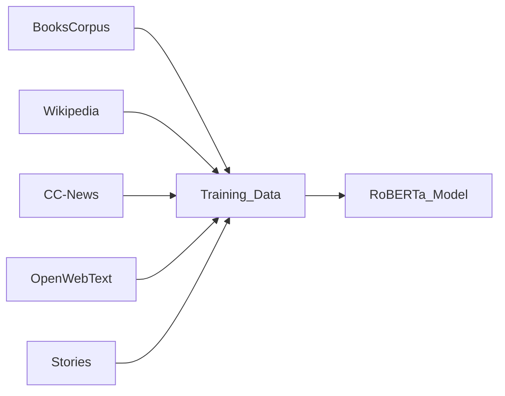

# RoBERTa
> This content is dual-licensed under your choice of the following licenses:
> 1.  **MIT License:** For the code implementations in Swift and Mermaid provided in this document.
> 2.  **Creative Commons Attribution 4.0 International License (CC BY 4.0):** For all other content, including the text, explanations, and the Mermaid diagrams and illustrations.

---


## Overview of RoBERTa

### Purpose

- **RoBERTa** is a variant of **BERT (Bidirectional Encoder Representations from Transformers)** that improves upon BERT's pretraining methodology to enhance performance on downstream tasks.
- The goal is to provide a more robustly trained language model by optimizing the training strategies used in BERT.

### Key Features

- **Optimized Training Techniques**: Implements changes in training procedures to improve performance.
- **Increased Training Data and Duration**: Trained on more data and for longer periods.
- **Removal of Next Sentence Prediction (NSP)**: Excludes the NSP task used in BERT.
- **Dynamic Masking**: Uses a more robust masking strategy during training.
- **Large Mini-Batches**: Utilizes larger batch sizes during training to improve convergence.

---

## Background: BERT Overview

Before diving into RoBERTa, it's helpful to briefly recap **BERT**, as RoBERTa builds upon it.

### BERT Architecture

- **Encoder-Only Transformer**: Uses the Transformer encoder stack without the decoder.
- **Bidirectional Masked Language Modeling (MLM)**: Trained by predicting masked tokens in the input.
- **Next Sentence Prediction (NSP)**: A pretraining task to predict if one sentence follows another.

### Diagram of BERT Architecture



- **Transformer Encoder**: Stacked encoder layers process the input sequence bidirectionally.

---

## RoBERTa Architecture

- **RoBERTa** maintains the same **architectural design** as BERT but modifies the **training methodology** to improve performance.
- It is an **encoder-only Transformer** model.

### Comparison with BERT

| Aspect                   | BERT                                 | RoBERTa                               |
|--------------------------|--------------------------------------|---------------------------------------|
| Model Architecture       | Transformer Encoder                  | Same as BERT                          |
| Pretraining Tasks        | MLM and NSP                          | MLM only (no NSP)                     |
| Masking Strategy         | Static Masking                       | Dynamic Masking                       |
| Training Data Size       | 16 GB                                | 160 GB (10x more data)                |
| Training Steps           | 1 million                            | 500,000 steps (with larger batches)   |
| Batch Size               | 256 sequences                        | Up to 8,000 sequences                 |
| Learning Rate            | Peak at 1e-4                         | Peak at 4e-4                          |
| Optimizer                | Adam                                 | Same as BERT                          |
| Dropout                  | 0.1                                  | Sometimes reduced or removed          |

---

## Key Innovations of RoBERTa

### 1. Removal of Next Sentence Prediction (NSP)

- **BERT** used the **NSP** task to train the model to understand sentence relationships.
- **RoBERTa** removes the NSP task based on findings that it does not improve downstream performance.
- This simplified training objective allows the model to focus solely on the MLM task.

### 2. Dynamic Masking

- **BERT's Static Masking**:
  - Masks are generated once during data preprocessing and remain the same throughout training.
- **RoBERTa's Dynamic Masking**:
  - Masks are generated on-the-fly during training.
  - Provides different masking patterns for each epoch, increasing the model's exposure to varied contexts.
  
### 3. Increased Training Data and Duration

- **Training Data**:
  - RoBERTa is trained on a larger dataset (160 GB) combining multiple corpora:
    - **BooksCorpus (800M words)**
    - **English Wikipedia (2,500M words)**
    - **CC-News (63M articles)**
    - **OpenWebText (38 GB)**
    - **Stories from CommonCrawl (31 GB)**
- **Training Duration**:
  - Trained for more steps with larger batches, simulating longer effective training.

### 4. Larger Mini-Batches and Learning Rates

- **Large Batch Sizes**:
  - RoBERTa uses batch sizes up to 8,000 sequences (compared to BERT's 256).
  - Larger batches help stabilize training with a higher learning rate.
- **Increased Learning Rate**:
  - Peak learning rate increased to \( 4 \times 10^{-4} \).
  
### 5. Longer Sequences

- Trained on longer sequences (up to 512 tokens) for the entire training process.
- Allows the model to learn from more extended contexts.

---

## RoBERTa Training Process

### Training Objective: Masked Language Modeling (MLM)

- **Masked Language Modeling**:
  - Randomly masks tokens in the input sequence.
  - The model predicts the original tokens based on the context.
  
**MLM Objective Function**:

$$
\mathcal{L}_{\text{MLM}} = -\sum_{i=1}^{N} \log P(x_i | x_{\setminus i})
$$

- $x_i$: The masked token at position $i$.
- $x_{\setminus i}$: The input sequence with the token at position $i$ masked.

### Dynamic Masking Implementation

- On each iteration, randomly select tokens to mask according to a specified probability (typically 15%).
- Ensures the model sees varied masking patterns, enhancing its ability to learn representations.

### Training Data Composition

- **Data Sources**:
  - Combines multiple large text corpora to increase diversity.
  


---

## Technical Deep Dive

### Loss Function

- RoBERTa optimizes the standard **Cross-Entropy Loss** over the masked tokens.

$$
\mathcal{L} = -\sum_{i \in M} \log P(x_i | x_{\setminus M})s
$$

- $M$: Set of positions selected for masking.
- $P(x_i | x_{\setminus M})$: Probability assigned to the original token $x_i$ given the masked input.

### Modifications in Training Procedure

- **No NSP Task**:
  - Simplifies the loss function to focus solely on token prediction.
- **Hyperparameters**:
  - Adjusted learning rates, warm-up steps, and schedules to accommodate larger batches.

### Implementation Details

- **Optimizer**:
  - Uses **Adam** optimizer with parameters similar to BERT.
- **Learning Rate Schedule**:
  - Uses a **linear decay schedule** with warm-up.
  
**Learning Rate Schedule Function**:

$$
\eta_t = \eta_{\text{peak}} \times \min\left( t / t_{\text{warmup}}, 1 - (t - t_{\text{warmup}}) / (T - t_{\text{warmup}}) \right)
$$

- \( \eta_t \): Learning rate at step \( t \).
- \( \eta_{\text{peak}} \): Peak learning rate.
- \( t_{\text{warmup}} \): Number of warm-up steps.
- \( T \): Total number of training steps.

---

## Performance and Evaluation

### Generalization Improvements

- RoBERTa achieves better performance on a variety of **Natural Language Understanding (NLU)** benchmarks.
- Outperforms BERT on tasks such as **GLUE**, **RACE**, **SQuAD**.

### GLUE Benchmark Results

- **GLUE (General Language Understanding Evaluation)**: A collection of NLU tasks.
- RoBERTa demonstrates significant improvements in accuracy over BERT.

### Results Summary

| Model            | GLUE Score | SQuAD 1.1 (EM/F1) | RACE Accuracy |
|------------------|------------|-------------------|---------------|
| BERT Large       | 82.1       | 84.1 / 90.9       | 66.4          |
| RoBERTa Large    | 88.5       | 88.9 / 94.6       | 83.2          |

- **EM (Exact Match)**: Measures the exact match between predicted and ground truth answers.
- **F1 Score**: Harmonic mean of precision and recall.

---

## Applications of RoBERTa

- **Text Classification**: Sentiment analysis, spam detection, topic classification.
- **Question Answering**: Extractive QA systems.
- **Named Entity Recognition (NER)**: Identifying entities in text.
- **Language Inference**: Recognizing textual entailment.
- **Summarization**: Generating summaries of documents.
- **Coreference Resolution**: Identifying when different expressions refer to the same entity.

---

## RoBERTa Variants and Extensions

### RoBERTa-Shared

- A version where parameters are shared across layers to reduce model size.

### RoBERTa for Multi-Lingual Tasks

- Extended to **XLM-RoBERTa**, a multilingual variant trained on data in 100 languages.

### Fine-Tuning Strategies

- RoBERTa can be fine-tuned for specific tasks by adding task-specific heads.

---

## Comparative Analysis: BERT vs. RoBERTa

### Impact of Removing NSP

- Studies found that the NSP task did not significantly contribute to BERT's performance.
- Removing NSP simplifies training and allows the model to allocate more capacity to MLM.

### Effect of Dynamic Masking

- Dynamic masking provides the model with a more diverse set of training examples.
- Leads to better generalization as the model doesn't overfit to a fixed masking pattern.

### Training Data and Compute

- RoBERTa benefits from larger training data and compute resources.
- Highlights the importance of scale in pretraining language models.

---

## Mathematical Formulation

### MLM with Dynamic Masking

At each training step:

1. **Random Masking**:

   - For each sequence, select 15% of tokens to mask.
   - For selected tokens:
     - 80% of the time, replace with `[MASK]`.
     - 10% of the time, replace with a random token.
     - 10% of the time, keep the token unchanged.

2. **Objective Function**:

$$
   \mathcal{L}_{\text{MLM}} = -\sum_{i \in M} \log P_{\theta}( x_i | x_{\setminus M} )
$$

   - \( \theta \): Model parameters.

3. **Optimization**:

   - Minimize the loss over the training data using stochastic gradient descent.

---

## Technical Considerations

### Handling Large Batch Sizes

- **Gradient Accumulation**:

  - Simulates large batches on hardware with limited memory by accumulating gradients over multiple steps.

- **Gradient Scaling**:

  - Adjust learning rates when changing batch sizes to maintain training stability.

### Training Efficiency

- **Distributed Training**:

  - Uses multiple GPUs or nodes to parallelize training.

- **Mixed Precision Training**:

  - Reduces memory usage and accelerates training by using lower-precision arithmetic (e.g., FP16).

### Regularization Techniques

- **Dropout**:

  - Applied to embeddings and activation outputs to prevent overfitting.

- **Weight Decay**:

  - L2 regularization applied to weights to prevent large weights.

---

## Implementing RoBERTa

### Open-Source Availability

- RoBERTa models are available through libraries such as **Fairseq** and **Hugging Face Transformers**.

### Code Example (Using Hugging Face Transformers)

```python
from transformers import RobertaTokenizer, RobertaForMaskedLM
import torch

# Load pre-trained RoBERTa tokenizer and model
tokenizer = RobertaTokenizer.from_pretrained('roberta-base')
model = RobertaForMaskedLM.from_pretrained('roberta-base')

# Encode input text with masking
input_text = "The capital of France is <mask>."
input_ids = tokenizer.encode(input_text, return_tensors='pt')

# Predict masked token
with torch.no_grad():
    outputs = model(input_ids)
    predictions = outputs.logits

# Get the predicted token
masked_index = (input_ids[0] == tokenizer.mask_token_id).nonzero(as_tuple=True)[0]
predicted_id = predictions[0, masked_index].argmax(dim=1)
predicted_token = tokenizer.decode(predicted_id)

print(f"Predicted Token: {predicted_token}")
```

**Output:**

```
Predicted Token: Paris
```

---

## Impact on Industry and Research

### Advancements in NLP

- RoBERTa's improvements demonstrate the importance of training methodology over model architecture modifications.
- Influenced subsequent language models to re-evaluate training practices.

### Foundation for Future Models

- RoBERTa's techniques have been adopted and extended in models like **ALBERT**, **ELECTRA**, **Longformer**.

### Practical Applications

- Deployed in various applications requiring language understanding and generation.
- Forms the backbone for many commercial NLP services and tools.

---

## Conclusion

**RoBERTa** significantly improved upon the original BERT model by:

- Optimizing training strategies, such as removing NSP and using dynamic masking.
- Leveraging more data and longer training durations.
- Adjusting hyperparameters to better utilize computational resources.

These changes have led to substantial performance gains on multiple NLP benchmarks without changing the underlying model architecture, highlighting the critical role of training procedures in developing effective language models.


---
**Licenses:**

- **MIT License:**  [](LICENSE) - Full text in [LICENSE](LICENSE) file.
- **Creative Commons Attribution 4.0 International:** [](LICENSE-CC-BY) - Legal details in [LICENSE-CC-BY](LICENSE-CC-BY) and at [Creative Commons official site](http://creativecommons.org/licenses/by/4.0/).

---