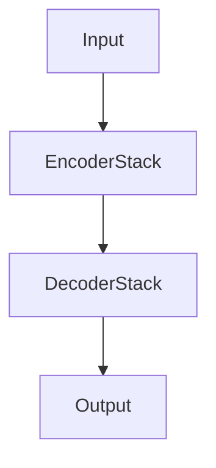
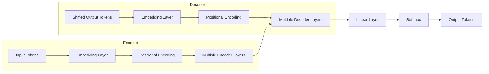
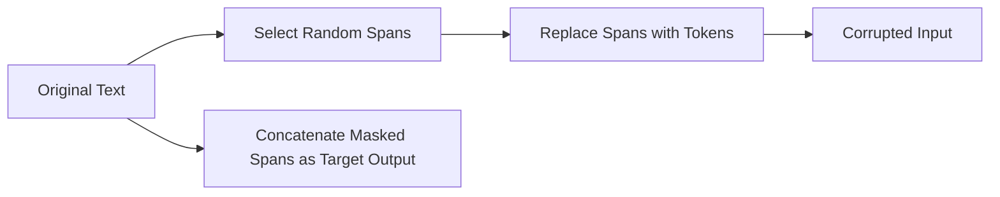
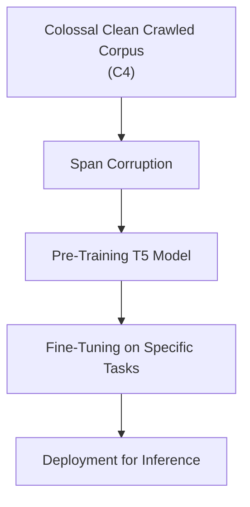

# T5
> This content is dual-licensed under your choice of the following licenses:
> 1.  **MIT License:** For the code implementations in Swift and Mermaid provided in this document.
> 2.  **Creative Commons Attribution 4.0 International License (CC BY 4.0):** For all other content, including the text, explanations, and the Mermaid diagrams and illustrations.

---


## Overview of T5 (Text-to-Text Transfer Transformer)

### Purpose

- **T5** is a Transformer-based model developed by **Google Research**.
- It aims to provide a **unified framework** that can handle a wide range of NLP tasks by framing them all as **text-to-text** problems.
- This approach simplifies the workflow by allowing the same model, objective, training procedure, and decoding process to be used across different tasks.

### Key Idea: Text-to-Text Framework

- **Input**: Text
- **Output**: Text
- By converting all tasks into a text-to-text format, T5 can be trained and fine-tuned on diverse tasks using the same architecture and loss function.

---

## T5 Architecture

T5 builds upon the standard **Transformer** architecture with some modifications to optimize it for large-scale pre-training and fine-tuning.

### High-Level Architecture



- **Encoder Stack**: Processes the input sequence and generates contextualized representations.
- **Decoder Stack**: Generates the output sequence, attending over the encoder's output.
- The model uses **encoder-decoder attention** to allow the decoder to focus on relevant parts of the input.

### Detailed T5 Architecture



- **Input Tokens**: Text input tokenized using SentencePiece with a shared vocabulary.
- **Shifted Output Tokens**: Previous output tokens shifted right for teacher forcing during training.
- **Embedding Layer**: Converts tokens to continuous embeddings.
- **Positional Encoding**: T5 uses **relative positional encodings** instead of absolute ones.
- **Multiple Encoder/Decoder Layers**: Stacked layers consisting of self-attention, cross-attention (in decoder), and feed-forward networks.

---

## Components and Modifications in T5

### 1. Tokenization

- T5 uses a **SentencePiece** model with a **Byte-Pair Encoding (BPE)** or **Unigram** approach.
- It employs a **32,000 subword vocabulary** that's shared between the encoder and decoder.

### 2. Relative Positional Encodings

- Unlike the original Transformer, T5 uses **relative positional encodings** as described in **[Shaw et al., 2018](https://arxiv.org/abs/1803.02155)**.
- This allows the model to generalize better to sequences longer than those seen during training.

### 3. Layer Normalization

- T5 applies **pre-norm** residual connections.
- **Layer normalization** is moved to the **input** of each sub-layer, unlike the original post-norm configuration.

    ```mermaid
    flowchart TB
        Input --> LayerNorm --> SubLayer --> AddResidual[Add Residual] --> Output
    ```

### 4. Simplified Feed-Forward Networks

- Feed-forward networks use a **GeLU** activation function.
- T5 reduces the feed-forward network's inner dimension compared to some other models to manage computational efficiency.

### 5. Dropout Techniques

- T5 employs **Dropout**, **DropConnect**, and **Attention Dropout** to prevent overfitting.

---

## Text-to-Text Framework in T5

### Unified Modeling of NLP Tasks

By framing tasks in a text-to-text format, T5 enables the model to handle various NLP tasks uniformly.

#### Examples:

1. **Machine Translation**

    - **Input**: `"translate English to German: How are you?"`
    - **Output**: `"Wie geht es dir?"`

2. **Summarization**

    - **Input**: `"summarize: The quick brown fox jumps over the lazy dog."`
    - **Output**: `"A fox jumps over a dog."`

3. **Sentiment Analysis**

    - **Input**: `"sst2 sentence: This movie was fantastic!"`
    - **Output**: `"positive"`

4. **Question Answering**

    - **Input**: `"question: What is the capital of France? context: France's capital is Paris."`
    - **Output**: `"Paris"`

### Advantages

- **Flexibility**: Can handle any task that can be expressed with text inputs and outputs.
- **Simplicity**: Eliminates the need for task-specific output layers or architectures.
- **Transfer Learning**: Knowledge learned from one task can benefit others.

---

## Training Objectives

### Pre-training

- T5 is pre-trained on a **massive corpus** called the **Colossal Clean Crawled Corpus (C4)**.
- Uses an **unsupervised objective** called **"Span Corruption"**:

    - Randomly selects spans of tokens and replaces them with a single mask token (e.g., `<X>`).
    - The model's task is to predict the corrupted spans.

#### Span Corruption Process



- **Example**:

    - **Original Text**: `"The quick brown fox jumps over the lazy dog."`
    - **Corrupted Input**: `"The quick brown <X> over the lazy dog."`
    - **Target Output**: `"<X> fox jumps"`

### Fine-tuning

- After pre-training, T5 is fine-tuned on specific tasks by providing task-specific prefixes and examples.
- The model adjusts to the task by learning from task-specific data.

### Loss Function

- Uses **Cross-Entropy Loss** between the predicted and actual tokens.
- Optimizes the **Maximum Likelihood Estimation (MLE)** of the output tokens given the input.

---

## Mathematical Formulations

### Transformer Equations

#### Self-Attention Mechanism

$$
\text{Attention}(Q, K, V) = \text{softmax}\left( \dfrac{Q K^\top}{\sqrt{d_k}} + \text{Bias} \right) V
$$

- $Q = X W^Q$
- $K = X W^K$
- $V = X W^V$
- $\text{Bias}$: Relative positional bias in T5.

#### Relative Positional Encoding

- T5 incorporates a **learned bias** for relative positions.

$$
\text{Bias}_{i,j} = w_{\text{clip}(j - i, -k, k)}
$$

- \( w \): Learnable weights for each relative position within a clipping distance \( k \).

### Feed-Forward Network

$$
\text{FFN}(x) = \text{GeLU}(x W_1 + b_1) W_2 + b_2
$$

- $W_1, W_2$: Weight matrices.
- $b_1, b_2$: Bias vectors.
- **GeLU Activation Function**:

$$
    \text{GeLU}(x) = x \cdot \Phi(x)
$$

    - $\Phi(x)$: Standard Gaussian cumulative distribution function.

### Training Objective

- Minimize the **Cross-Entropy Loss**:

$$
\mathcal{L} = -\sum_{t=1}^{T} \log P(y_t | y_{<t}, X; \theta)
$$

- $y_t$: Target token at position $t$.
- $y_{<t}$: All previous target tokens.
- $X$: Input sequence.
- $\theta$: Model parameters.

---

## Technical Concepts and Complexities

### Scalability and Model Sizes

- T5 is released in multiple sizes to study the effect of scale:

    - **T5-Small** (~60 million parameters)
    - **T5-Base** (~220 million parameters)
    - **T5-Large** (~770 million parameters)
    - **T5-3B** (3 billion parameters)
    - **T5-11B** (11 billion parameters)

- **Scaling Laws**: Performance generally improves with larger models and more data.

### Computational Complexity

- **Time Complexity**:

    - Self-Attention: $O(n^2 \cdot d)$
    - Feed-Forward Networks: $O(n \cdot d^2)$
    - $n$: Sequence length.
    - $d$: Model dimension.

- **Optimization Techniques**:

    - **Model Parallelism**: Distribute model parameters across multiple devices.
    - **TPU Use**: T5 was trained using Tensor Processing Units for efficient computation.

### Training Challenges

- **Data Cleaning**: Ensuring high-quality data in the C4 corpus.
- **Memory Constraints**: Training large models requires significant memory.

#### Solutions

- **Gradient Checkpointing**: Trade computation for memory by recomputing activations during the backward pass.
- **Mixed Precision Training**: Use lower precision (e.g., bfloat16) to reduce memory usage.

### Task-Specific Prefixes

- T5 uses **task-specific prefixes** to inform the model about the desired task.

    - **Examples**:

        - `"translate English to German:"`
        - `"summarize:"`
        - `"sst2 sentence:"` (for sentiment analysis)

- This allows the model to adjust its behavior dynamically based on the input.

---

## Training and Fine-Tuning Process

### Pre-Training Steps

1. **Data Preparation**:

    - Collect the C4 dataset by cleaning web-scraped text.
    - Tokenize the text using the shared vocabulary.

2. **Span Corruption**:

    - Randomly mask spans in the text.
    - Create input-output pairs where the model must predict the masked spans.

3. **Model Training**:

    - Initialize the model parameters.
    - Train using the span-corruption objective.

### Fine-Tuning Steps

1. **Select Task and Data**:

    - Choose an NLP task (e.g., summarization, translation).
    - Prepare a dataset with input-output pairs.

2. **Add Task Prefixes**:

    - Modify the input text to include the task-specific prefix.

3. **Adjust Hyperparameters**:

    - Set learning rates, batch sizes, and other hyperparameters appropriate for fine-tuning.

4. **Train the Model**:

    - Use the pre-trained model as a starting point.
    - Fine-tune on the task-specific data.

---

## Applications of T5

### Diverse NLP Tasks

- **Text Summarization**: Generating concise summaries of longer texts.
- **Machine Translation**: Translating text from one language to another.
- **Question Answering**: Providing answers to questions based on provided context.
- **Sentiment Analysis**: Classifying text based on sentiment.
- **Text Classification**: Assigning categories to texts.
- **Dialogue Generation**: Producing responses in conversational agents.
- **Grammar Correction**: Fixing grammatical errors in text.
- **Closed-Book Question Answering**: Answering questions without external knowledge sources.

### Impact on NLP

- **Unified Approach**: Simplifies model deployment by using a single model for multiple tasks.
- **Transfer Learning**: Knowledge from pre-training can be effectively transferred to downstream tasks.
- **State-of-the-Art Performance**: Achieves competitive results on benchmarks like **GLUE**, **SuperGLUE**, **CNN/Daily Mail Summarization**, etc.

---

## Innovations and Contributions

### Abstractive Summarization

- T5 excels in generating summaries that capture the essence of the source text.
- Capable of producing human-like, coherent summaries.

### Cross-Task Generalization

- The text-to-text framework allows T5 to generalize knowledge across tasks.
- Enables multi-task learning and improves performance on low-resource tasks.

### Model Comparisons

- **BERT vs. T5**:

    - **BERT**: Encoder-only model for tasks requiring text understanding (classification, NER).
    - **T5**: Encoder-decoder model suitable for both understanding and generation tasks.

- **GPT vs. T5**:

    - **GPT**: Decoder-only model primarily for text generation tasks.
    - **T5**: Combines both encoding and decoding capabilities.

---

## Diagram of T5 Training Pipeline



- **Data Preparation**: Collect and clean large-scale text data.
- **Span Corruption**: Create corrupted inputs and targets.
- **Pre-Training**: Train the model on the unsupervised objective.
- **Fine-Tuning**: Adjust the model for specific tasks using labeled data.
- **Deployment**: Use the fine-tuned model for inference in applications.

---

## Technical Deep Dive

### Relative Positional Bias

- T5 introduces **relative positional bias** added to the attention logits.

$$
    l_{i j} = \dfrac{Q_i K_j^\top}{\sqrt{d_k}} + b_{k}
$$

    - $b_{k}$: Bias dependent on the relative distance $k = j - i$.

### Modified Initialization

- Adopts **Xavier Initialization** tailored for Transformer architectures to stabilize training.

### Pre-Norm vs. Post-Norm

- **Pre-Norm Configuration**:

    - Applies layer normalization **before** the sub-layer (attention or feed-forward).
    - Can lead to better training stability, especially for deep models.

### Dropout Strategies

- **Dropout**: Applied to the outputs of sub-layers and embeddings.
- **DropConnect**: Randomly drops weights in the feed-forward networks.
- **Attention Dropout**: Applied to the attention weights.

### Computational Optimizations

- **Sharding**: Distribute training across multiple devices.
- **Reversible Residual Layers**: Not used in T5 but an area of research for reducing memory usage.

---

## Limitations and Considerations

### Computational Resources

- Large models like T5-11B require significant computational power to train and serve.
- Fine-tuning and inference can be resource-intensive for such large models.

### Bias and Fairness

- The model may learn biases present in the training data.
- Requires careful evaluation and mitigation strategies.

### Overfitting Risks

- With powerful models, there's a risk of overfitting to the training data.
- Regularization techniques and validation are essential.

### Data Quality

- The performance depends heavily on the quality of the pre-training data.
- Noise and irrelevant content in web-scraped data can impact the model.

---

## Real-World Applications

### Google Products

- T5 contributes to various Google applications, improving features like:

    - **Search Engine Understanding**: Better comprehension of queries and content.
    - **Smart Compose**: Enhanced suggestions in email and document writing.

### Open Source Community

- T5 is available through libraries like **TensorFlow** and **Hugging Face Transformers**.
- Facilitates research and development in the NLP community.

---

## Mathematical Summary

### Key Equations

1. **Self-Attention with Relative Positional Bias**:

$$
    \text{Attention}(Q, K, V) = \text{softmax}\left( \dfrac{Q K^\top}{\sqrt{d_k}} + \text{Bias} \right) V
$$

2. **Feed-Forward Network**:

$$
    \text{FFN}(x) = \text{GeLU}(x W_1 + b_1) W_2 + b_2
$$

3. **Cross-Entropy Loss**:

$$
    \mathcal{L} = -\sum_{t=1}^{T} \log P(y_t | y_{<t}, X; \theta)
$$

### Parameters and Dimensions

- **Embedding Dimension ($d_{\text{model}}$)**: Size of token embeddings.
- **Feed-Forward Dimension ($d_{\text{ff}}$)**: Inner dimension of the feed-forward networks.
- **Number of Layers**: Depth of the encoder and decoder stacks.
- **Number of Attention Heads (\( h \))**: Parallel attention mechanisms.

---

## Conclusion

**T5** revolutionizes the way NLP tasks are approached by adopting a **text-to-text** paradigm, enabling a single model to handle various tasks with minimal architectural changes. Its design choices, such as relative positional encodings and pre-norm residual connections, contribute to its effectiveness and scalability. By leveraging massive pre-training and fine-tuning on specific tasks, T5 achieves state-of-the-art performance, demonstrating the power of unified models in NLP.


---
**Licenses:**

- **MIT License:**  [](LICENSE) - Full text in [LICENSE](LICENSE) file.
- **Creative Commons Attribution 4.0 International:** [](LICENSE-CC-BY) - Legal details in [LICENSE-CC-BY](LICENSE-CC-BY) and at [Creative Commons official site](http://creativecommons.org/licenses/by/4.0/).

---