# Transformers
> This content is dual-licensed under your choice of the following licenses:
> 1.  **MIT License:** For the code implementations in Swift and Mermaid provided in this document.
> 2.  **Creative Commons Attribution 4.0 International License (CC BY 4.0):** For all other content, including the text, explanations, and the Mermaid diagrams and illustrations.

---

## Overview of Transformers

### Purpose

- **Transformers** are neural network models designed to handle sequential data.
- They learn **context** and **meaning** by capturing relationships between all elements in a sequence.
- They use a mechanism called **self-attention** to weigh the significance of each part of the input data.

### Applications

- They power **Large Language Models (LLMs)** such as:
  - **GPT (Generative Pre-trained Transformer)**
  - **Claude**
  - **LLaMA**
- These models can understand and generate human-like text, translate languages, summarize text, and more.

---

## Transformer Architecture

The Transformer architecture was introduced in the paper ["Attention is All You Need"](https://arxiv.org/abs/1706.03762) by Vaswani et al. in 2017. It relies entirely on **attention mechanisms** to draw global dependencies between input and output.

### High-Level Architecture

The Transformer consists of an **Encoder** and a **Decoder** stack.

- **Input**: Sequence of tokens (words, subwords).
- **Encoder Stack**: Processes the input sequence to generate encodings that contain information about which parts of the inputs are relevant to each other.
- **Decoder Stack**: Uses the encoder's outputs along with its own inputs to generate the output sequence.
- **Output**: Generated sequence, such as translated text.

---

### Detailed Transformer Architecture

```mermaid
---
config:
  layout: elk
  look: handDrawn
  theme: dark
---
flowchart LR
    subgraph Encoder
        style Encoder fill:#121, stroke:#333, stroke-width:2px
        E1[Input Embedding + Positional Encoding]
        E2[Multi-Head Attention]
        E3[Add & Norm]
        E4[Feed-Forward]
        E5[Add & Norm]
    end
    subgraph Decoder
        style Decoder fill:#221, stroke:#333, stroke-width:2px
        D1[Output Embedding + Positional Encoding]
        D2[Masked Multi-Head Attention]
        D3[Add & Norm]
        D4[Encoder-Decoder Attention]
        D5[Add & Norm]
        D6[Feed-Forward]
        D7[Add & Norm]
    end
    E1 --> E2 --> E3 --> E4 --> E5
    D1 --> D2 --> D3 --> D4 --> D5 --> D6 --> D7
    E5 --> D4
    D7 --> Output[Linear + Softmax]
    style Output fill:#521, stroke:#333, stroke-width:2px
    
```

- **Encoder Layer**:
  - **Input Embedding + Positional Encoding**: Converts input tokens into vectors and adds positional information.
  - **Multi-Head Attention**: Allows the model to focus on different positions.
  - **Add & Norm**: Residual connection followed by layer normalization.
  - **Feed-Forward**: Applies a fully connected feed-forward network.
- **Decoder Layer**:
  - **Output Embedding + Positional Encoding**: Similar to the encoder's input embedding.
  - **Masked Multi-Head Attention**: Prevents positions from attending to subsequent positions (future tokens).
  - **Encoder-Decoder Attention**: Allows the decoder to focus on appropriate places in the input sequence.
  - **Linear + Softmax**: Generates probabilities over the output vocabulary.

---

## Components of the Transformer

### 1. Embedding Layer

- Converts discrete tokens into continuous vector representations.
- **Positional Encoding** is added to embeddings to incorporate sequence order.

**Positional Encoding Equations:**

$$
\begin{align*}
PE_{(pos, 2i)} &= \sin\left(\frac{pos}{10000^{2i/d_{model}}}\right) \\
PE_{(pos, 2i+1)} &= \cos\left(\frac{pos}{10000^{2i/d_{model}}}\right)
\end{align*}
$$

- $pos$: Position in the sequence.
- $i$: Dimension index.
- $d_{model}$: Model dimension.

### 2. Multi-Head Attention

Allows the model to attend to information from different representation subspaces.

- **Q (Queries)**, **K (Keys)**, **V (Values)**: Computed from the input.
- **Scaled Dot-Product Attention**:

$$
\text{Attention}(Q, K, V) = \text{softmax}\left( \frac{Q K^\top}{\sqrt{d_k}} \right) V
$$

  - $d_k$: Dimension of the key vectors.

### 3. Feed-Forward Network (FFN)

- Applies two linear transformations with a ReLU activation in between.
- Operates separately and identically on each position.

---

## Self-Attention Mechanism

### Purpose

- To compute a representation of the input sequence where each token incorporates information from the entire sequence.

### Process

1. **Compute Q, K, V**:
   - Apply linear transformations to the input embeddings to obtain queries $Q$, keys $K$, and values $V$.

2. **Compute Attention Scores**:
   - Multiply $Q$ and $K^\top$, scale by $\sqrt{d_k}$.

3. **Apply Softmax**:
   - Normalize the scores to get the attention weights.

4. **Compute Weighted Sum**:
   - Multiply the attention weights by $V$ to get the output.

### Diagram of Self-Attention

---

## Multi-Head Attention

- **Multiple Attention Heads** allow the model to focus on different positions and aspects of the sequence.

**Equation for Multi-Head Attention:**

$$
\text{MultiHead}(Q, K, V) = \text{Concat}(\text{head}_1, \ldots, \text{head}_h) W^O
$$

- $\text{head}_i = \text{Attention}(Q W_i^Q, K W_i^K, V W_i^V)$
- $W_i^Q, W_i^K, W_i^V$: Parameter matrices for the $i$-th head.
- $W^O$: Output weight matrix.

---

## Transformer Models in Practice

### GPT (Generative Pre-trained Transformer)

- Developed by OpenAI.
- Uses a **decoder-only** Transformer architecture.
- Pre-trained on large corpora of text data.
- Fine-tuned for various language tasks.

**Architecture Modifications:**

- **Causal Masking**: Ensures the model only attends to previous positions.
- **Unidirectional Attention**: The model predicts the next token based on past tokens.

### Diagram of GPT Architecture

- **Transformer Decoder**: Stacked decoder layers without the encoder-decoder attention.

---

### Claude and LLaMA

- **Claude**: Developed by Anthropic, focuses on being helpful and safe.
- **LLaMA**: Developed by Meta AI, aims for efficiency and performance with smaller parameter sizes.

**Common Characteristics:**

- Use Transformer-based architectures.
- Trained on large datasets with extensive computational resources.
- Implement various optimization and safety techniques.

---

## Complexities and Technical Concepts

### Computational Complexity

- **Self-Attention Complexity**:

  - **Time Complexity**: $O(n^2 \cdot d)$, where $n$ is the sequence length and $d$ is the embedding dimension.
  - **Space Complexity**: $O(n^2)$ due to the attention matrix.

- **Scaling Challenges**:

  - As sequence length increases, computation becomes expensive.
  - Solutions include efficient attention mechanisms (e.g., sparse attention, approximations).

### Optimization Techniques

- **Efficient Attention Mechanisms**:

  - **Sparse Attention**: Restricts attention to certain positions.
  - **Memory-Efficient Attention**: Reduces memory usage during training.

- **Model Parallelism**:

  - Distributes model computations across multiple GPUs or nodes.

- **Mixed Precision Training**:

  - Uses lower-precision arithmetic (e.g., FP16) to reduce memory usage and increase speed.

---

## Training Transformers

### Pre-Training

- **Objective**: Learn general language representations.
- **Methods**:

  - **Language Modeling**: Predict the next word in a sequence.
  - **Masked Language Modeling**: Predict masked words in a sequence.

### Fine-Tuning

- **Adaptation**: Tailor the pre-trained model to specific tasks.
- **Techniques**:

  - **Supervised Fine-Tuning**: Use labeled data for the target task.
  - **Reinforcement Learning from Human Feedback (RLHF)**: Incorporate human preferences into training.

### Challenges

- **Data Quality**: Training data must be clean and representative.
- **Bias and Fairness**: Models can inherit biases present in the training data.
- **Safety**: Ensuring models do not produce harmful content.

---

## Applications of Transformers

### Language Understanding

- **Sentiment Analysis**
- **Named Entity Recognition**
- **Question Answering**

### Language Generation

- **Text Completion**
- **Story Generation**
- **Dialogue Systems**

### Translation

- **Machine Translation**: Translate text between languages.

### Other Domains

- **Vision Transformers (ViT)**: Apply Transformer architecture to image recognition. 
  [[Step 2 - Detail explanations - Build from the previous response - Vision Transformers (ViT)  - By o1-preview]]
- **Speech Processing**: Transformers for speech recognition and synthesis. 
  [[Step 2 - Detail explanations - Build from the previous response - Speech Processing  - By o1-preview]]
- **Bioinformatics**: Sequence analysis in genomics. 
  [[Step 2 - Detail explanations - Build from the previous response - Bioinformatics  - By o1-preview]]

---

## Innovations and Extensions

### BERT (Bidirectional Encoder Representations from Transformers)
[[Step 2 - Detail explanations - Build from the previous response - BERT - By o1-preview]]

- Developed by Google.
- Uses a **encoder-only** architecture.
- Pre-trained using masked language modeling and next sentence prediction tasks.

### Variants and Enhancements

- **RoBERTa**: Robustly optimized BERT approach. 
  [[Step 2 - Detail explanations - Build from the previous response - RoBERTa  - By o1-preview]]
- **ALBERT**: A Lite BERT with parameter reduction techniques. 
  [[Step 2 - Detail explanations - Build from the previous response - ALBERT  - By o1-preview]]
- **T5 (Text-to-Text Transfer Transformer)**: Frames all NLP tasks as text-to-text.
  [[Step 2 - Detail explanations - Build from the previous response - T5 - By o1-preview]]

### Diagram of BERT Architecture

- **Transformer Encoder**: Stacked encoder layers without the decoder.

---

## Technical Deep Dive

### Scaled Dot-Product Attention

- Computes attention weights based on the dot product of query and key vectors.
- Scaling by $\sqrt{d_k}$ prevents the dot products from growing too large.

### Residual Connections and Layer Normalization

- **Residual Connections**:

  - Helps with training deep networks by addressing the vanishing gradient problem.
  - The output of each sub-layer is added to its input:  $\text{Layer Output} = \text{Sub-layer Output} + \text{Input}$

- **Layer Normalization**:

  - Normalizes the inputs across the feature dimension.
  - Improves training stability and convergence.

### Position-Wise Feed-Forward Networks

- Applied independently to each position.
- Consists of two linear transformations with an activation function in between.

### Masking

- **Padding Mask**:

  - Masks out the padding tokens in the sequence to prevent the model from attending to them.

- **Look-Ahead Mask (Causal Mask)**:

  - Used in the decoder to prevent the model from attending to future positions.

---

## Mathematical Formulation

### Self-Attention Computation

Given input matrix $X$:

1. Compute Queries, Keys, and Values:

$$
 Q = X W^Q, \quad K = X W^K, \quad V = X W^V
$$

   - $W^Q, W^K, W^V$: Learnable weight matrices.

2. Compute Scaled Dot-Product Attention:

$$
   \text{Attention}(Q, K, V) = \text{softmax}\left( \frac{Q K^\top}{\sqrt{d_k}} + \text{Mask} \right) V
$$

   - **Mask**: Adds $-\infty$ (or a very large negative number) to masked positions before softmax.

### Output Generation

- The decoder produces a probability distribution over the vocabulary for each position in the output sequence.
- The model selects the token with the highest probability or uses beam search for more complex decoding.

---

## Impact on Industry and Current Practices

### State-of-the-Art Performance

- Transformers have set new benchmarks on various NLP tasks.
- They enable models to handle long-range dependencies more effectively than RNNs.

### Large Language Models

- **GPT-3**: With 175 billion parameters, GPT-3 can perform tasks it wasn't explicitly trained on, such as zero-shot learning.

### Ethical Considerations

- **AI Safety**: Ensuring models do not produce harmful or unethical content.
- **Responsible AI**: Addressing biases and promoting fairness.

### Open-Source Models

- Models like **LLaMA** and **OpenAI's GPT-2** are available to the community for research and development.

### Industry Adoption

- **Cloud Services**: Companies offer Transformer-based models as part of cloud AI services.
- **API Access**: Businesses can integrate advanced language capabilities into their applications without training models from scratch.

---
**Licenses:**

- **MIT License:**   - Full text in [LICENSE](LICENSE) file.
- **Creative Commons Attribution 4.0 International:**  - Legal details in [LICENSE-CC-BY](LICENSE-CC-BY) and at [Creative Commons official site](http://creativecommons.org/licenses/by/4.0/).

---