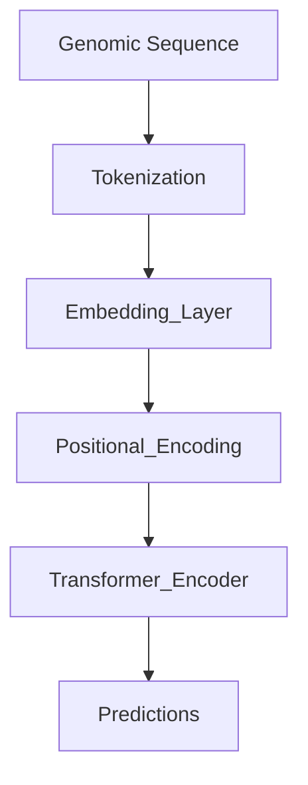
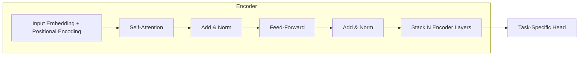
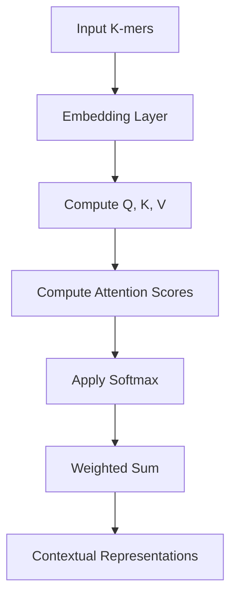
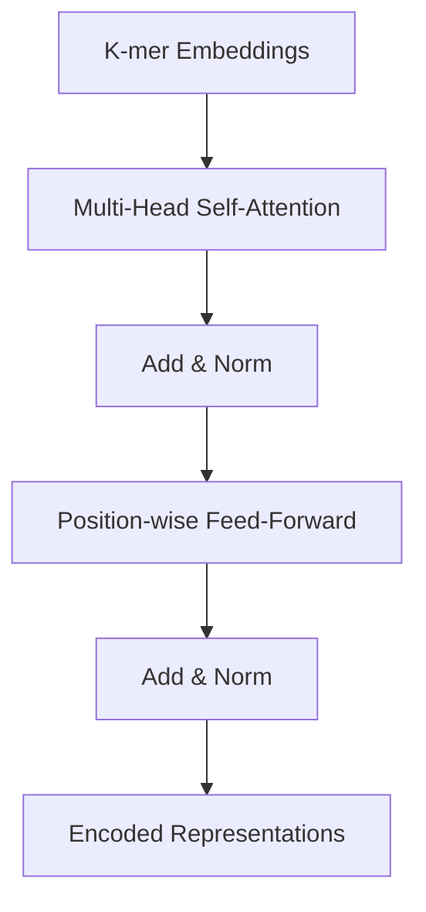

# Transformers in Genomics
> This content is dual-licensed under your choice of the following licenses:
> 1.  **MIT License:** For the code implementations in Swift and Mermaid provided in this document.
> 2.  **Creative Commons Attribution 4.0 International License (CC BY 4.0):** For all other content, including the text, explanations, and the Mermaid diagrams and illustrations.

---


## Overview of Transformers in Genomics

### Purpose

- **Transformers** are powerful neural network architectures that can model long-range dependencies in sequential data.
- In genomics, they are used for **sequence analysis**, which involves understanding and interpreting DNA, RNA, and protein sequences.
- Transformers capture complex patterns in genomic sequences, aiding in tasks like **gene prediction**, **variant detection**, **functional annotation**, and **epigenetic profiling**.

### Applications

- **DNA Sequence Modeling**: Predicting functional regions, transcription factor binding sites, and regulatory elements.
- **RNA Analysis**: Splicing prediction, RNA-binding protein interaction modeling.
- **Protein Sequence Analysis**: Predicting protein structure and function.
- **Variant Effect Prediction**: Assessing the impact of genetic variants on gene function.
- **Epigenomics**: Modeling histone modifications and DNA methylation patterns.

---

## Challenges in Genomic Sequence Analysis

- **High Dimensionality**: Genomic sequences are extremely long (human genome ~3 billion base pairs).
- **Complex Dependencies**: Regulatory elements can be far apart, requiring models to capture long-range interactions.
- **Limited Data**: Labeled data is often scarce due to experimental limitations.
- **Class Imbalance**: Functional elements make up a small fraction of the genome.
- **Sequential Nature**: Traditional models like CNNs have limitations in capturing sequential dependencies over long distances.

---

## Transformer Architecture for Genomics

### Adapting Transformers to Genomic Sequences

- **Input Representation**: Genomic sequences are converted into numerical representations suitable for model input.
- **Sequence Tokenization**: Sequences are split into k-mers (subsequences of length k) to create tokens.
- **Positional Encoding**: Positional information is crucial as the order of nucleotides determines function.

---

### High-Level Architecture



- **Input**: Raw nucleotide sequences (e.g., A, C, G, T).
- **Tokenization**: Dividing the sequence into overlapping k-mers.
- **Embedding Layer**: Converts k-mer tokens into continuous vector representations.
- **Positional Encoding**: Adds positional information to embeddings.
- **Transformer Encoder**: Captures dependencies and patterns.
- **Output**: Task-specific outputs (e.g., classification, regression).

---

### Detailed Transformer Architecture for Genomics



- **Encoder Only**: Most genomic tasks use only the encoder part since the goal is to extract representations from sequences.

---

## Components Specific to Genomics

### 1. Input Representation

- **Nucleotide Encoding**: Representing nucleotides (A, C, G, T) numerically.
- **One-Hot Encoding**: Each nucleotide is represented as a one-hot vector.
  
$$
  \text{A} = [1, 0, 0, 0], \quad \text{C} = [0, 1, 0, 0], \quad \text{G} = [0, 0, 1, 0], \quad \text{T} = [0, 0, 0, 1]
$$
  
- **K-mer Tokenization**: Sequences are split into overlapping k-length substrings.

  Example for k=3 (3-mers):

  ```
  Sequence: ACGTAC
  3-mers: [ACG, CGT, GTA, TAC]
  ```

### 2. Positional Encoding

- Since the order of nucleotides is critical, positional encoding is essential.

- **Learned Positional Embeddings**: Instead of fixed sinusoidal functions, learnable embeddings are often used.

### 3. Self-Attention in Genomics

- **Capturing Long-Range Dependencies**: Self-attention allows the model to consider interactions between distant nucleotides.

### 4. Task-Specific Output Heads

- **Classification Head**: For tasks like promoter prediction, enhancer identification.

- **Regression Head**: For tasks like predicting expression levels.

---

## Self-Attention Mechanism in Genomics

### Purpose

- To model interactions between nucleotides or k-mers across the entire sequence.

### Process

1. **Compute Q, K, V**: From input embeddings of k-mers.

2. **Compute Attention Scores**: Determine the relevance of each k-mer to every other k-mer.

3. **Apply Softmax**: Generate attention weights.

4. **Weighted Sum**: Aggregate information focusing on important positions.

---

## Diagrams and Equations

### Self-Attention Illustration



### Attention Computation

Given input embeddings \( X \):

1. Compute Queries, Keys, and Values:

$$
  Q = X W^Q, \quad K = X W^K, \quad V = X W^V
$$

2. Scaled Dot-Product Attention:

$$
   \text{Attention}(Q, K, V) = \text{softmax}\left( \frac{Q K^\top}{\sqrt{d_k}} \right) V
$$

---

## Technical Concepts and Complexities

### Handling Long Sequences

- **Challenge**: Genomic sequences can be millions of base pairs long.

- **Solution**:

  - **Local Attention**: Restrict attention to a local window.

  - **Efficient Transformers**: Use architectures like **Reformer**, **Longformer**, or **Performer**.

### Data Augmentation

- **Reverse Complement**: Genomic sequences are palindromic; models often augment data by adding reverse complements.

- **Random Masking**: Masking certain positions to improve generalization.

### Transfer Learning

- Pre-training on large unlabeled genomic datasets and fine-tuning on specific tasks.

### Class Imbalance Handling

- **Techniques**:

  - **Weighted Loss Functions**: Assign higher weights to minority classes.

  - **Oversampling**: Duplicate samples from underrepresented classes.

---

## Example Models in Genomics

### DNABERT

- **Architecture**: Adapts BERT model for DNA sequences.

- **Approach**:

  - Uses 6-mers for tokenization.

  - Applies a BERT-like encoder to model the sequences.

- **Applications**:

  - Predicting promoters, enhancers, splice sites.

### DeepSEA

- Early deep learning model using CNNs for chromatin-profile prediction.

- Transformers can enhance such models by capturing long-range dependencies.

### Enformer

- Uses Transformers to predict gene expression from DNA sequences.

---

## Mathematical Formulation

### Loss Functions

- **Binary Cross-Entropy** for classification tasks.

$$
  \mathcal{L} = -\frac{1}{N} \sum_{i=1}^N [ y_i \log p(y_i) + (1 - y_i) \log (1 - p(y_i)) ]
$$

- **Mean Squared Error** for regression tasks.

$$
  \mathcal{L} = \frac{1}{N} \sum_{i=1}^N ( y_i - \hat{y}_i )^2
$$

### Evaluation Metrics

- **Accuracy**, **Precision**, **Recall**, **F1-Score** for classification.

- **Correlation Coefficient**, **RMSE** for regression.

---

## Training Considerations

### Data Preprocessing

- **Quality Control**: Removing low-quality reads or sequences.

- **Normalization**: Adjusting for sequencing depth, GC-content bias.

### Model Training

- **Batch Size**: Limited by memory due to sequence length.

- **Learning Rate Schedules**: Using warm-up and decay strategies.

- **Regularization**: Techniques like dropout to prevent overfitting.

---

## Impact on Genomics Research

### Improved Predictive Performance

- Transformers achieve state-of-the-art results in various genomic tasks.

### Understanding Genetic Regulation

- By modeling long-range interactions, Transformers help in understanding regulatory mechanisms.

### Drug Discovery and Disease Research

- Identifying genetic variants associated with diseases.

- Predicting the impact of mutations on gene function.

---

## Mermaid Diagrams

### Transformer Encoder Layer in Genomics



---

## Advanced Topics

### Incorporating Epigenetic Data

- **Challenge**: Epigenetic modifications add another layer of complexity.

- **Approach**: Integrate additional data channels (e.g., methylation maps) into the model.

### Multi-Modal Transformers

- Combining sequence data with other modalities like **gene expression profiles**, **protein interactions**.

### Interpretability

- **Attention Visualization**: Inspecting attention weights to understand which positions the model focuses on.

- **Attribution Methods**: Techniques like **Integrated Gradients** to attribute predictions to input features.

---

## Adaptations of Transformer Architecture

### Long-Range Transformers

- **Sparse Attention**: Reduces computational burden for long sequences.

- **Segmented Processing**: Breaking sequences into manageable chunks.

### Relative Positional Encoding

- Capturing relative distances between k-mers instead of absolute positions.

### Bidirectional vs. Unidirectional Models

- **Bidirectional**: Context from both upstream and downstream sequences.

- **Unidirectional**: May be useful in certain predictive tasks.

---

## Current Practices in the Industry

### Bioinformatics Companies

- **Deep Genomics**, **NVIDIA's Clara Platform**: Utilize deep learning for genomic analysis.

### Research Direction

- **CRISPR Guide Design**: Predicting off-target effects using sequence models.

- **Personalized Medicine**: Leveraging models to tailor treatments based on genetic profiles.

### Open-Source Frameworks

- **BioTransformers**: Tools for applying Transformers to biological sequences.

- **TensorFlow** and **PyTorch**: Widely used for implementing models.

---

## Ethical Considerations

- **Data Privacy**: Genomic data is highly sensitive; models must ensure privacy.

- **Biases**: Ensuring models are trained on diverse datasets to avoid biases.

- **Clinical Translation**: Regulatory considerations when applying models in healthcare.

---

## Conclusion

Transformers have revolutionized sequence analysis in genomics by effectively modeling complex dependencies and interactions within genetic material. Their ability to process long sequences and learn rich representations makes them invaluable for advancing our understanding of genomics, with significant implications for healthcare, personalized medicine, and biological research.


---
**Licenses:**

- **MIT License:**  [](LICENSE) - Full text in [LICENSE](LICENSE) file.
- **Creative Commons Attribution 4.0 International:** [](LICENSE-CC-BY) - Legal details in [LICENSE-CC-BY](LICENSE-CC-BY) and at [Creative Commons official site](http://creativecommons.org/licenses/by/4.0/).

---