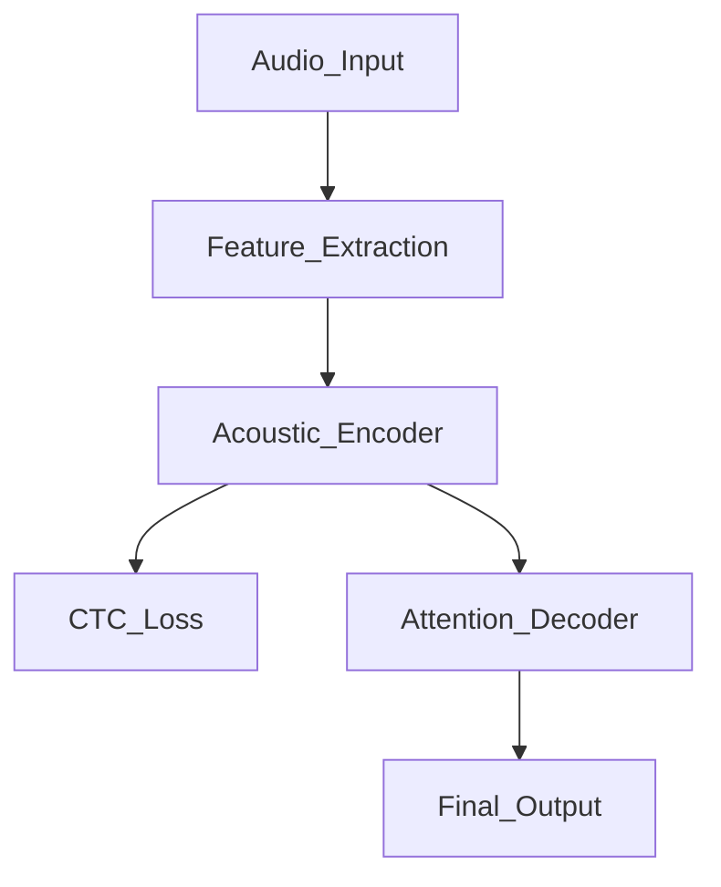
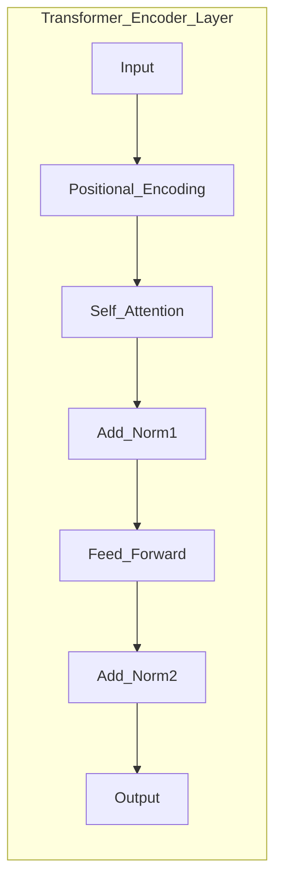
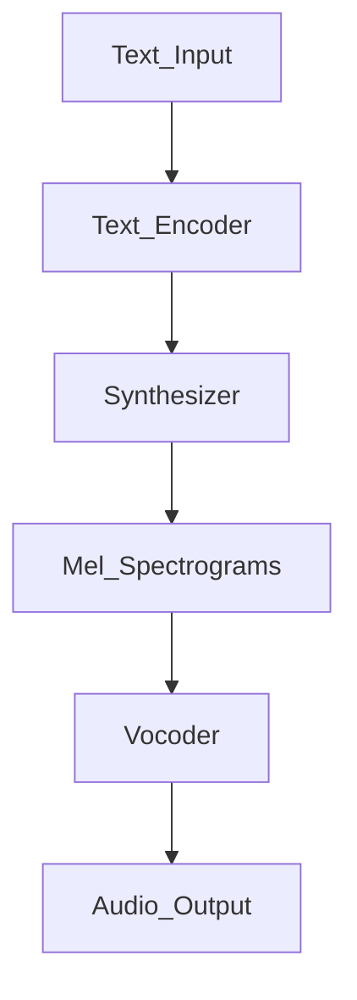
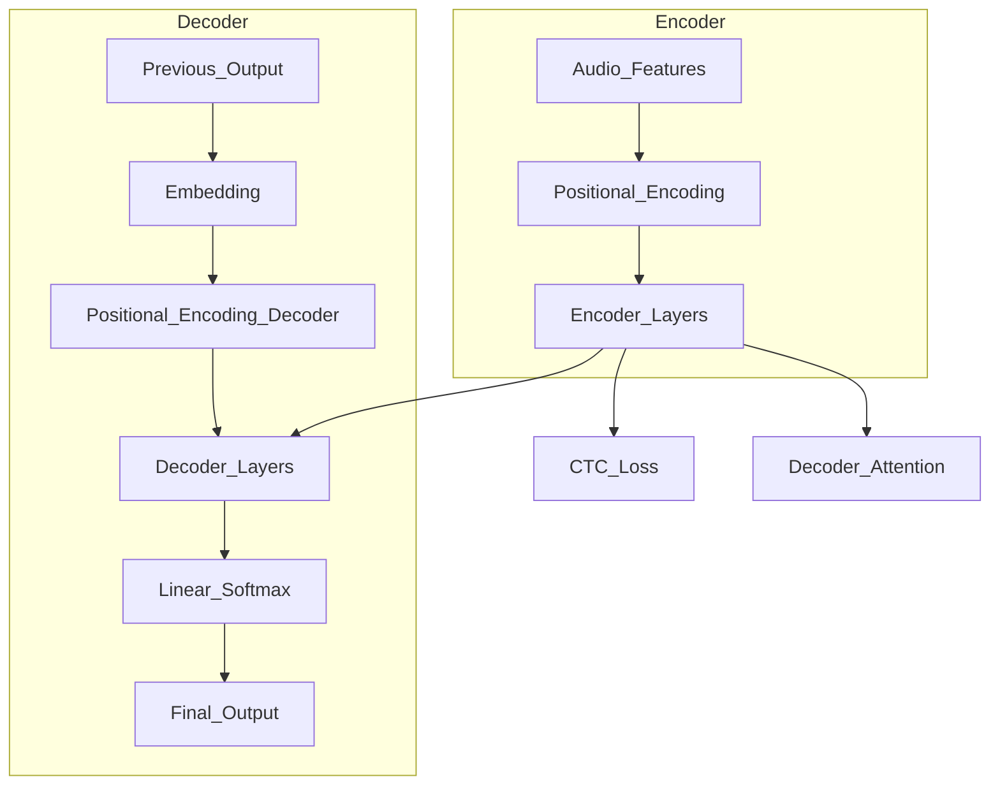
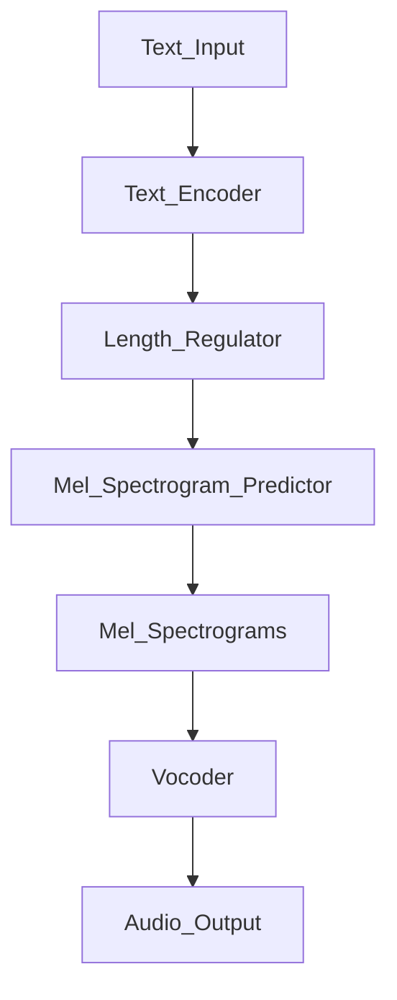

# Transformers in Speech Processing
> This content is dual-licensed under your choice of the following licenses:
> 1.  **MIT License:** For the code implementations in Swift and Mermaid provided in this document.
> 2.  **Creative Commons Attribution 4.0 International License (CC BY 4.0):** For all other content, including the text, explanations, and the Mermaid diagrams and illustrations.

---

## Overview of Transformers in Speech Processing

### Purpose

- **Transformers** have revolutionized speech processing by effectively modeling long-range dependencies in sequential data.
- They leverage **self-attention mechanisms** to capture global context, which is crucial for understanding and generating speech.

### Applications in Speech Processing

- **Speech Recognition**: Converting spoken language into written text.
- **Speech Synthesis**: Generating human-like speech from text (Text-to-Speech).

---

## Speech Recognition Using Transformers

### Introduction

**Automatic Speech Recognition (ASR)** systems aim to transcribe spoken language into text. Traditional ASR systems relied on models like Hidden Markov Models (HMMs) and Recurrent Neural Networks (RNNs). Transformers offer advantages over these models by capturing long-term dependencies more effectively and allowing parallel computation.

---

### Transformer-Based ASR Architecture

#### High-Level Architecture

- **Audio Input**: Raw speech waveform.
- **Feature Extraction**: Converts audio into a sequence of feature vectors (e.g., Mel spectrograms).
- **Acoustic Encoder**: Transformer encoder processes the feature vectors.
- **Connectionist Temporal Classification (CTC) Loss**: Used for alignment between input and output sequences.
- **Attention Decoder**: Generates transcriptions using attention mechanisms.
- **Final Output**: Transcribed text.

---

### Detailed Components

#### 1. Feature Extraction

- Converts raw audio into a time-series of feature vectors.
- Common features:
  - **Mel Frequency Cepstral Coefficients (MFCCs)**
  - **Mel Spectrograms**
  - **Filter Banks**

#### 2. Acoustic Encoder (Transformer Encoder)

- Processes the sequence of feature vectors.
- Captures temporal dependencies in the speech signal.
- **Positional Encoding** is crucial due to the lack of inherent sequence order in Transformers.

#### 3. Connectionist Temporal Classification (CTC) Loss

- **Purpose**: Aligns the variable-length input sequence with output sequences.
- **Why CTC?**: Speech is a continuous signal where the exact timing of words is unknown.
- **CTC Loss Function** calculates the probability of the transcription by summing over all possible alignments.

#### 4. Attention Decoder (Optional)

- Enhances the model's ability to generate accurate transcriptions.
- Uses encoder outputs to focus on relevant parts of the input sequence during decoding.

#### 5. Final Output

- Produces the transcribed text.
- Can utilize **Beam Search** during decoding for better sequence generation.

---

### Self-Attention in Speech Recognition

- **Challenges**:
  - Speech sequences can be very long.
  - Need to capture both local and global dependencies.

- **Self-Attention Advantages**:
  - Allows the model to learn which parts of the input are most relevant.
  - Facilitates the capture of long-range dependencies without recursion.

### Handling Long Sequences

- **Chunking Methods**: Splitting input sequences into manageable chunks.
- **Memory-Efficient Attention**: Reduces computational requirements.
- **Relative Positional Encoding**: Addresses issues with fixed positional encodings.

---

## Speech Synthesis Using Transformers

### Introduction

**Speech synthesis**, or Text-to-Speech (TTS), involves generating human-like speech from text input. Traditional models like Tacotron and WaveNet have been improved upon with Transformers, leading to better quality and coherence.

---

### Transformer-Based TTS Architecture

#### High-Level Architecture

- **Text Input**: Raw text to be converted into speech.
- **Text Encoder**: Transformer encoder that processes text embeddings.
- **Synthesizer**: Generates Mel spectrograms from encoded text.
- **Vocoder**: Converts spectrograms into waveform audio.
- **Audio Output**: The final synthesized speech.

---

### Detailed Components

#### 1. Text Encoder (Transformer Encoder)

- Converts text into meaningful embeddings.
- Captures linguistic features necessary for pronunciation and prosody.
  
#### 2. Synthesizer (Transformer Decoder)

- Uses attention to align text embeddings with audio representations.
  
#### 3. Mel Spectrogram Generation

- Intermediate representation of audio.
- Provides a time-frequency representation used by the vocoder.

#### 4. Vocoder

- Examples: **WaveNet**, **WaveGlow**, **HiFi-GAN**.
- Converts Mel spectrograms into time-domain waveforms.

---

### Aligning Text and Speech

- **Duration Modeling**: Determines how long each phoneme or word should be spoken.
- **Attention Mechanisms**: Aligns text and speech features.

### Transformer TTS Models

- **TransformerTTS**: Extends the Transformer architecture for end-to-end TTS.
- **FastSpeech**: Speeds up TTS by avoiding autoregressive decoding.

---

## Complexities and Technical Concepts

### Challenges in Speech Processing with Transformers

#### 1. Variable Sequence Lengths

- Speech signals vary in length and are generally longer than text sequences.
- **Solution**: Use techniques like **chunking** and **hierarchical models**.

#### 2. High Computational Cost

- Long sequences lead to \( O(n^2) \) complexity in self-attention.
- **Solutions**:
  - **Efficient Attention Mechanisms**: Reduce computation.
  - **Pruning**: Remove less important connections.

#### 3. Alignment Between Sequences

- **CTC Loss**: Helps in aligning input speech frames with output text.
- **Monotonic Attention Mechanisms**: Enforce alignment constraints.

### Technical Innovations

#### Relative Positional Encoding

- Improves upon absolute positional encoding by considering the relative positions of tokens.

**Equation:**

$$
\text{Attention}(Q, K, V) = \text{softmax}\left( \frac{Q K^\top + Q R^\top}{\sqrt{d_k}} \right) V
$$

- \( R \): Relative positional embeddings.

#### Masked Self-Attention

- Masks future positions to prevent the model from using future context.

### Handling Prosody and Intonation

- **Variational Autoencoders (VAEs)**: Capture variations in speech patterns.
- **Style Tokens**: Introduce controllable aspects of speech style.

---

## Mathematical Formulation

### Connectionist Temporal Classification (CTC) Loss

- **Objective**: Maximize the probability of the correct label sequence given the input sequence.

**CTC Loss Function:**

$$
\mathcal{L}_{CTC} = - \ln p(\mathbf{y} | \mathbf{x})
$$

- \( \mathbf{x} \): Input sequence.
- \( \mathbf{y} \): Label sequence.

**CTC Probability Computation:**

$$
p(\mathbf{y} | \mathbf{x}) = \sum_{\mathbf{\pi} \in \mathcal{B}^{-1}(\mathbf{y})} p(\mathbf{\pi} | \mathbf{x})
$$

- \( \mathbf{\pi} \): All possible alignments.
- \( \mathcal{B} \): Mapping function that removes blank tokens and repeats.

### Attention Mechanisms in TTS

**Location-Sensitive Attention:**

- Incorporates previous alignment information to focus on the next speech frame.

**Attention Score Computation:**

$$
e_{ij} = \text{AttentionScore}(s_{i-1}, h_j, a_{i-1})
$$

- \( s_{i-1} \): Decoder state.
- \( h_j \): Encoder output.
- \( a_{i-1} \): Previous attention weights.

---

## Industry Applications and Current Practices

### State-of-the-Art Models

#### Speech Recognition

- **SpeechTransformer**: Utilizes Transformer encoders for end-to-end speech recognition.
- **Conformer**: Combines convolutional layers with Transformers for capturing both local and global dependencies.

#### Speech Synthesis

- **TransformerTTS**: Applies Transformers to the TTS task.
- **FastSpeech 2**: Non-autoregressive model for faster and more stable TTS.

### Use Cases

- **Voice Assistants**: Siri, Alexa, Google Assistant use ASR and TTS technologies.
- **Automated Call Centers**: Convert speech to text and generate responses.
- **Language Learning Apps**: Provide pronunciation feedback.
- **Accessibility Tools**: Assistive technologies for the visually or hearing impaired.

### Current Practices

- **Data Augmentation**: Improves model robustness.
- **Transfer Learning**: Leveraging pre-trained models for specific tasks.
- **Multilingual Models**: Support multiple languages in a single model.

---

## Addressing Challenges in Speech Processing

### Data Scarcity

- **Solution**: Use unsupervised and semi-supervised learning techniques.
- **Pseudo-Labels**: Generate labels from an existing model to augment data.

### Noise and Variability

- **Robust Training**: Incorporate noise into training data.
- **Normalization Techniques**: Use speaker and environment normalization.

### Real-Time Processing

- **Latency Reduction**: Optimize models for faster inference.
- **Edge Computing**: Deploy models on devices to reduce reliance on network connectivity.

---

## Advanced Topics

### Multimodal Transformers

- Combine speech and text modalities.
- Enhance models by providing additional context.

### Discrete Representations

- Use **Vector-Quantized Variational Autoencoders (VQ-VAE)** to learn discrete representations of speech.

### Self-Supervised Learning

- Models like **wav2vec 2.0** leverage unlabeled audio data to learn representations.

### End-to-End Models

- Streamline the pipeline by integrating feature extraction, encoding, and decoding into a single model.

---

## Mermaid Diagrams for Specific Architectures

### Speech Transformer Architecture

- **Encoder**: Processes audio features with positional encoding.
- **Decoder**: Generates text output using attention over encoder outputs.

---

### FastSpeech Architecture for TTS

- **Text Encoder**: Processes input text.
- **Length Regulator**: Aligns text and speech lengths without attention.
- **Mel Spectrogram Predictor**: Generates spectrograms non-autoregressively.
- **Vocoder**: Converts spectrograms to audio.

---

## Conclusion

Transformers have significantly advanced speech processing by providing powerful models for both speech recognition and speech synthesis. By leveraging self-attention mechanisms, they effectively capture long-range dependencies and global context, leading to more accurate and natural results.

**In Speech Recognition**:

- Transformers handle the temporal dynamics of speech better than traditional models.
- They simplify the architecture by enabling end-to-end training.

**In Speech Synthesis**:

- Transformers improve the quality and speed of generating human-like speech.
- Non-autoregressive models like FastSpeech address the latency issues.

---

## Key Takeaways

- **Transformers provide a unified architecture** for various speech processing tasks.
- **Self-attention mechanisms** are crucial for capturing dependencies in speech sequences.
- **Efficient computation and alignment techniques** are essential to handle the complexities of speech data.
- **Industry applications** are vast, impacting personal assistants, accessibility tools, and more.
- **Ongoing research** continues to address challenges like long sequence handling, data scarcity, and real-time processing.

---

## References for Further Reading

- **"Attention Is All You Need"**, Vaswani et al., 2017.
- **"Speech-Transformer: A No-Recurrence Sequence-to-Sequence Model for Speech Recognition"**, Tang et al., 2018.
- **"FastSpeech: Fast, Robust and Controllable Text to Speech"**, Ren et al., 2019.
- **"Conformer: Convolution-augmented Transformer for Speech Recognition"**, Gulati et al., 2020.
- **"wav2vec 2.0: A Framework for Self-Supervised Learning of Speech Representations"**, Baevski et al., 2020.

---
**Licenses:**

- **MIT License:**   - Full text in [LICENSE](LICENSE) file.
- **Creative Commons Attribution 4.0 International:**  - Legal details in [LICENSE-CC-BY](LICENSE-CC-BY) and at [Creative Commons official site](http://creativecommons.org/licenses/by/4.0/).

---