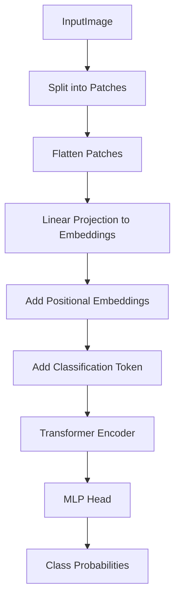

# Vision Transformers (ViT)
> This content is dual-licensed under your choice of the following licenses:
> 1.  **MIT License:** For the code implementations in Swift and Mermaid provided in this document.
> 2.  **Creative Commons Attribution 4.0 International License (CC BY 4.0):** For all other content, including the text, explanations, and the Mermaid diagrams and illustrations.

---


## Overview of Vision Transformers (ViT)

### Purpose

- **Vision Transformers** adapt the Transformer architecture, originally designed for natural language processing (NLP), to computer vision tasks.
- **ViT** aims to perform image classification and recognition by treating images as sequences of patches and applying Transformer models to capture long-range dependencies.

### Key Idea

- Instead of using convolutional neural networks (**CNNs**), ViT splits an image into fixed-size patches, linearly embeds them, adds positional embeddings, and feeds the resulting sequence of vectors to a standard Transformer encoder.

---

## ViT Architecture

### High-Level Architecture


- **Input Image**: An image of size \( H \times W \times C \), where \( H \) and \( W \) are height and width, and \( C \) is the number of channels.
- **Patch Partitioning**: The image is divided into a grid of patches.
- **Linear Projection**: Each patch is flattened and projected into an embedding space.
- **Positional Embedding**: Positional information is added to the patch embeddings.
- **Transformer Encoder**: Processes the sequence of patch embeddings.
- **MLP Head**: A multi-layer perceptron that produces the final class prediction.

---

### Detailed ViT Architecture



- **[Patch Embeddings]**: Each image patch is converted to a vector via linear projection.
- **[Positional Embeddings]**: Learned positional embeddings are added to include spatial information.
- **[Classification Token]**: A special token is prepended to the sequence to aggregate information for classification.
- **[Transformer Encoder]**: A stack of Transformer encoder layers processes the entire sequence.
- **[Classification Head]**: The output corresponding to the classification token is fed into an MLP for final prediction.

---

## Components of ViT

### 1. Patch Embedding

- The image is divided into patches of size \( P \times P \).
- For an image of size \( H \times W \), the number of patches \( N \) is:

$$
  N = \frac{HW}{P^2}
$$

- Each patch is flattened into a vector of size \( P^2 \cdot C \).
- Linear projection (embedding) converts each vector to a latent vector of dimension \( D \).

**Equation:**

$$
\mathbf{z}_0 = [\mathbf{z}_{\text{class}}; \mathbf{E}_{\text{patch}}^1; \mathbf{E}_{\text{patch}}^2; \dots; \mathbf{E}_{\text{patch}}^N] + \mathbf{E}_{\text{pos}}
$$

- $\mathbf{z}_{\text{class}}$: Classification token.
- $\mathbf{E}_{\text{patch}}^i$: Patch embeddings.
- $\mathbf{E}_{\text{pos}}$: Positional embeddings.

### 2. Positional Embedding

- Since Transformer models do not have inherent positional information, positional embeddings are added to the patch embeddings to encode spatial positions.
- Embeddings can be **learned** or **fixed** (e.g., sinusoidal).

### 3. Classification Token

- A learnable embedding (\( \mathbf{z}_{\text{class}} \)) is prepended to the sequence.
- After processing through the Transformer, the output at the classification token position is used for classification.

### 4. Transformer Encoder

- Composed of multiple encoder layers, each consisting of:

  - **Multi-Head Self-Attention (MSA)**
  - **Layer Normalization (LN)**
  - **Feed-Forward Network (FFN)**
  
- **Diagram of a Transformer Encoder Block:**

  ```mermaid
  flowchart TB
    subgraph EncoderLayer
        LN1[Layer Norm] --> MSA[Multi-Head Self-Attention] --> Add1[Add & Norm]
        Add1 --> LN2[Layer Norm] --> FFN[Feed-Forward Network] --> Add2[Add & Norm]
    end
  ```
  
  - **Operation:**

$$
    \begin{align*}
    \mathbf{y} &= \text{MSA}(\text{LN}(\mathbf{z}_{l-1})) + \mathbf{z}_{l-1} \\
    \mathbf{z}_l &= \text{FFN}(\text{LN}(\mathbf{y})) + \mathbf{y}
    \end{align*}
$$

  - $\mathbf{z}_l$: Output of layer $l$.
  - $\text{LN}$: Layer Normalization.

### 5. MLP Head

- After the Transformer encoder, the output corresponding to the classification token is extracted.
- It is passed through an MLP head (possibly with a single hidden layer and an activation function like GELU) to produce class logits.

---

## Self-Attention in ViT

- **Self-Attention** allows each patch to attend to all other patches in the image.
- Captures global context, which is beneficial for understanding spatial relationships in images.

**Calculations:**

Given input sequence $\mathbf{X} \in \mathbb{R}^{(N+1) \times D}$:

1. **Compute Queries, Keys, and Values**:

$$
   Q = \mathbf{X} W^Q, \quad K = \mathbf{X} W^K, \quad V = \mathbf{X} W^V
$$

2. **Compute Attention Scores**:

$$
   \text{Attention}(Q, K, V) = \text{softmax}\left( \frac{Q K^\top}{\sqrt{D}} \right) V
$$

   - \( D \): Dimension of the embeddings.

---

## Differences from Convolutional Neural Networks (CNNs)

### CNNs

- Use convolutional layers that apply local filters to extract features.
- Have inherent inductive biases like **translation invariance** and **locality**.
- Typically process data hierarchically, from low-level edges to high-level features.

### ViT

- Uses **global self-attention** to model relationships between all patches.
- Lacks the local inductive biases of CNNs.
- Requires larger datasets to train effectively due to fewer built-in biases.

---

## Advantages of ViT

- **Global Context**: Self-attention allows ViT to capture long-range dependencies without the limitations of convolutional receptive fields.
- **Scalability**: ViT can be scaled up in model size and benefits from large-scale pre-training.

## Challenges

- **Data Efficiency**: ViT generally requires large amounts of data to perform as well as CNNs.
- **Computationally Intensive**: Self-attention has \( O(N^2) \) complexity with respect to the number of patches.

---

## Mathematical Formulation

### Patch Embedding

Given an image \( x \in \mathbb{R}^{H \times W \times C} \), it's reshaped into a sequence of flattened patches \( x_p \in \mathbb{R}^{N \times (P^2 C)} \).

- $N = \frac{HW}{P^2}$

**Linear projection**:

$$
\mathbf{E}_{\text{patch}}^i = x_p^i W_E
$$

- $W_E \in \mathbb{R}^{(P^2 C) \times D}$: Embedding matrix.
- $D$: Dimension of the embedding space.

### Positional Embedding

Positional embeddings $\mathbf{E}_{\text{pos}} \in \mathbb{R}^{(N+1) \times D}$ are added to include positional information.

### Transformer Encoder Layers

For \( l = 1 \) to \( L \):

$$
\begin{align*}
\mathbf{z}_0 &= [\mathbf{z}_{\text{class}}; \mathbf{E}_{\text{patch}}^1; \dots; \mathbf{E}_{\text{patch}}^N] + \mathbf{E}_{\text{pos}} \\
\mathbf{z}'_{l} &= \text{MSA}(\text{LN}(\mathbf{z}_{l-1})) + \mathbf{z}_{l-1} \\
\mathbf{z}_{l} &= \text{FFN}(\text{LN}(\mathbf{z}'_{l})) + \mathbf{z}'_{l}
\end{align*}
$$

- $\text{MSA}$: Multi-head self-attention.
- $\text{FFN}$: Feed-forward network.

### Classification Head

The final classification is obtained by:

$$
\text{Output} = \text{MLP}(\mathbf{z}_L^{\text{class}})
$$

- \( \mathbf{z}_L^{\text{class}} \): The representation of the classification token after the last layer.

---

## Complexity Analysis

### Computational Complexity

- **Self-Attention**: \( O((N+1)^2 \cdot D) \)
  - Dominated by the matrix multiplication in the attention mechanism.

### Memory Complexity

- **Self-Attention**: Requires storing the attention matrix of size \( (N+1) \times (N+1) \).
  
### Comparison with CNNs

- CNNs have \( O(N \cdot k^2 \cdot D) \) per layer, where \( k \) is the kernel size.
- For large \( N \), ViT's complexity can become significant.

---

## Optimization Techniques

### Reducing Complexity

- **Efficient Transformers**: Use approximations or sparse attention to reduce complexity.
- **Hybrid Models**: Combine CNNs for early feature extraction with Transformers.

### Data Augmentation and Regularization

- Since ViT requires large datasets, techniques like data augmentation, regularization, and pre-training on large-scale datasets (e.g., ImageNet) are important.

### Training Protocols

- **Knowledge Distillation**: Using a pre-trained CNN as a teacher model to guide ViT training.
- **Regularization Techniques**: Such as stochastic depth, random erasing, and mixup.

---

## Applications of Vision Transformers

### Image Classification

- Achieved competitive results on benchmarks like **ImageNet**.

### Object Detection and Segmentation

- Adapted versions of ViT used in detection frameworks (e.g., **DETR** - Detection Transformer).

### Cross-Modal Tasks

- Combining ViT with modalities like text in **Visual Question Answering** and **Image Captioning**.

---

## Variants and Improvements

### Data-efficient Image Transformers (DeiT)

- Introduced by Facebook AI Research.
- Demonstrated that ViT can be trained from scratch on ImageNet without large-scale pre-training.

### Swin Transformer

- Introduces a hierarchical Transformer using shifted windows.
- Efficiently models local and global contexts.

### Pyramid Vision Transformer (PVT)

- Adds a pyramid structure to ViT to process features at multiple scales.

---

## Technical Deep Dive

### Multi-Head Self-Attention in ViT

Each attention head computes:

$$
\text{Attention}(Q, K, V) = \text{softmax}\left( \frac{Q K^\top}{\sqrt{D_{\text{head}}}} \right) V
$$

- $D_{\text{head}} = \frac{D}{h}$: Dimension per head.
- \( h \): Number of attention heads.
- **Total embedding dimension \( D \) is divided across heads**.

### Feed-Forward Network (FFN)

Typically consists of two linear layers with a non-linear activation (e.g., **GELU**):

$$
\text{FFN}(x) = \sigma(x W_1 + b_1) W_2 + b_2
$$

- $W_1 \in \mathbb{R}^{D \times D_{\text{FF}}}$, $W_2 \in \mathbb{R}^{D_{\text{FF}} \times D}$
- $D_{\text{FF}}$: Hidden dimension size, often \( 4D \)
- $\sigma$: Activation function (e.g., GELU)

### Layer Normalization

Applied **before** the MSA and FFN layers to stabilize training:

- Pre-Layer Norm:

$$
  \text{MSA}(\text{LayerNorm}(x)) + x
$$

---

## Training ViT Models

### Pre-training

- **Large-Scale Datasets**: Pre-training on datasets like **ImageNet-21k** or **JFT-300M**.
- **Self-Supervised Learning**: Approaches like **DINO** leverage self-supervised signals.

### Fine-tuning

- After pre-training, the model is fine-tuned on target datasets, possibly with task-specific adjustments.

### Training Challenges

- **Computational Resources**: Requires significant hardware (TPUs, GPUs).
- **Overfitting**: Careful regularization and augmentation strategies needed.

---

## Applications in Industry and Research

### Computer Vision Tasks

- **Image Classification**
- **Object Detection**
- **Semantic Segmentation**
- **Action Recognition in Videos**

### Cross-Domain Applications

- **Medical Imaging**: Analysis of MRI, CT scans.
- **Remote Sensing**: Satellite and aerial imagery processing.
- **Autonomous Vehicles**: Perception systems for object recognition.

---

## Recent Advances

### Hybrid Architectures

- **CNN-Transformer Hybrids**: Combine the strengths of CNNs (local feature extraction) and Transformers (global context).
- **Convolutional Vision Transformers**: Incorporate convolutional layers within the Transformer architecture.

### Efficient ViTs

- **Efficient Attention Mechanisms**: Linformer, Performer, etc., reduce attention complexity to linear time.

### Applications Beyond Classification

- ViTs are being adapted for tasks like **generative modeling**, **super-resolution**, and **video processing**.

---

## Technical Comparisons

### Inductive Biases

- **CNNs**:

  - Strong inductive biases toward locality and translation invariance.
  - Beneficial for data efficiency and generalization on small datasets.

- **ViTs**:

  - Weaker inductive biases.
  - Greater expressiveness and capacity for learning, especially with large datasets.

### Performance Considerations

- **Data Requirements**:

  - ViTs often require more data or pre-training to outperform CNNs.

- **Computational Efficiency**:

  - ViTs can be less efficient due to quadratic complexity in self-attention.

- **Flexibility**:

  - ViTs can be more flexible in capturing global dependencies.

---

## Mathematical Insights

### Self-Attention Complexity

- **Time Complexity** per layer: \( O((N+1)^2 \cdot D) \)
- **Space Complexity** per layer: \( O((N+1)^2) \)

### Approaches to Reduce Complexity

- **Local Attention**:

  - Restrict attention to nearby patches.

- **Hierarchical Models**:

  - Process inputs at different scales.

- **Sparse Attention**:

  - Use sparse matrices to represent attention weights.

---

## Practical Considerations

### Model Scaling

- ViTs can scale in terms of depth (number of layers), width (embedding dimension), and patch size.

### Hyperparameter Tuning

- Important hyperparameters include learning rate, optimizer (e.g., AdamW), weight decay, and dropout rates.

### Data Augmentation

- Techniques like random cropping, flipping, color jittering can improve performance.

---

## Conclusion

Vision Transformers (ViT) represent a significant advancement in applying Transformer architectures to computer vision tasks. By treating images as sequences of patches and leveraging self-attention mechanisms, ViTs can effectively capture global context and long-range dependencies in images.

While ViTs have demonstrated strong performance, especially when pre-trained on large datasets, they also present challenges such as high computational demands and data efficiency. Ongoing research aims to address these challenges through model optimizations, hybrid architectures, and more efficient training strategies.

ViTs have opened new avenues in computer vision research and have the potential to become foundational models, similar to their impact in natural language processing.


---
**Licenses:**

- **MIT License:**  [](LICENSE) - Full text in [LICENSE](LICENSE) file.
- **Creative Commons Attribution 4.0 International:** [](LICENSE-CC-BY) - Legal details in [LICENSE-CC-BY](LICENSE-CC-BY) and at [Creative Commons official site](http://creativecommons.org/licenses/by/4.0/).

---