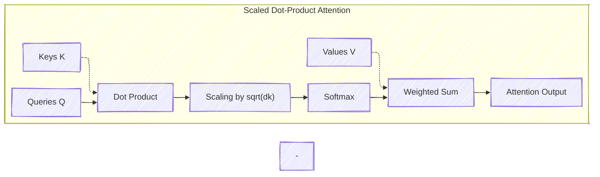
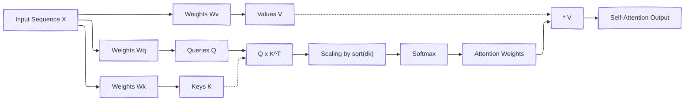

# Understanding the Attention Mechanism in Neural Networks
> This content is dual-licensed under your choice of the following licenses:
> 1.  **MIT License:** For the code implementations in Swift and Mermaid provided in this document.
> 2.  **Creative Commons Attribution 4.0 International License (CC BY 4.0):** For all other content, including the text, explanations, and the Mermaid diagrams and illustrations.

---

The **Attention Mechanism** is a cornerstone of modern neural network architectures, particularly in natural language processing (NLP) and sequence modeling tasks. It allows models to focus on specific parts of the input data when generating each part of the output, enabling them to capture long-range dependencies and nuanced relationships in data.

---

## Table of Contents

1. [Introduction to Attention Mechanisms](#introduction)
2. [The Need for Attention in Sequence Models](#need-for-attention)
3. [Attention Mechanism Explained](#attention-explained)
   - [Mathematical Formulation](#mathematical-formulation)
4. [Types of Attention Mechanisms](#types-of-attention)
   - [Additive (Bahdanau) Attention](#bahdanau-attention)
   - [Multiplicative (Luong) Attention](#luong-attention)
   - [Self-Attention](#self-attention)
5. [Self-Attention in Transformers](#transformers)
   - [Query, Key, and Value Vectors](#qkv)
   - [Scaled Dot-Product Attention](#scaled-dot-product)
   - [Multi-Head Attention](#multi-head-attention)
6. [Positional Encoding](#positional-encoding)
7. [Visualization of Attention](#visualization)
8. [Applications and Industry Practices](#applications)
9. [Conclusion](#conclusion)

---

## 1. Introduction to Attention Mechanisms 

The attention mechanism was introduced to help neural networks focus on the most relevant parts of the input when generating a specific part of the output. Initially applied in machine translation tasks, attention has become integral to various NLP applications, including text summarization, question answering, and more.

## 2. The Need for Attention in Sequence Models 

Traditional sequence-to-sequence models, such as those using recurrent neural networks (RNNs), face challenges in capturing long-range dependencies due to the vanishing gradient problem.

### Limitations of Traditional RNNs:

- **Fixed-length context vectors**: Encoders compress input sequences into fixed-size vectors, which can lose important information.
- **Difficulty with long sequences**: Information from earlier in the sequence can be lost or diminished.

### Attention Addresses These Issues:

- **Dynamic weighting**: Assigns different weights to different parts of the input.
- **Enhanced context representation**: Allows the model to consider all input positions when generating each output element.

## 3. Attention Mechanism Explained 

At its core, the attention mechanism computes a weighted sum of the input representations, allowing the model to focus on relevant parts of the input for each output.

### 3.1. Mathematical Formulation 

Given:

- **Encoder hidden states**: $\mathbf{H} = [\mathbf{h}_1, \mathbf{h}_2, \dots, \mathbf{h}_n]$
- **Decoder hidden state** at time $t$: $\mathbf{s}_t$

The attention mechanism computes:

1. **Alignment scores** \( e_{t,i} \):

   The alignment between the decoder state \( \mathbf{s}_t \) and encoder outputs \( \mathbf{h}_i \):

   $$
   e_{t,i} = \text{score}(\mathbf{s}_t, \mathbf{h}_i)
   $$

2. **Attention weights** \( \alpha_{t,i} \):

   Softmax over alignment scores to get probabilities:

   $$
   \alpha_{t,i} = \frac{\exp(e_{t,i})}{\sum_{k=1}^{n} \exp(e_{t,k})}
   $$

3. **Context vector** \( \mathbf{c}_t \):

   Weighted sum of encoder hidden states:

   $$
   \mathbf{c}_t = \sum_{i=1}^{n} \alpha_{t,i} \mathbf{h}_i
   $$

4. **New decoder state**:

   The context vector \( \mathbf{c}_t \) is combined with the decoder's hidden state to produce the output.

---

## 4. Types of Attention Mechanisms 

### 4.1. Additive (Bahdanau) Attention 

Introduced by Bahdanau et al. (2015), additive attention uses a feedforward network to compute alignment scores.

**Alignment score function**:

$$
e_{t,i} = \mathbf{v}_a^\top \tanh\left(\mathbf{W}_a [\mathbf{s}_{t-1}; \mathbf{h}_i]\right)
$$

### 4.2. Multiplicative (Luong) Attention 

Proposed by Luong et al. (2015), multiplicative attention computes alignment scores using dot products.

**Alignment score functions**:

- **Dot product**:

  $$
  e_{t,i} = \mathbf{s}_t^\top \mathbf{h}_i
  $$

- **General**:

  $$
  e_{t,i} = \mathbf{s}_t^\top \mathbf{W}_a \mathbf{h}_i
  $$

### 4.3. Self-Attention 

Self-attention computes attention weights among elements within the same sequence, allowing the model to capture dependencies without regard to their distance in the sequence.

---

## 5. Self-Attention in Transformers 

The Transformer architecture relies heavily on self-attention mechanisms to model relationships in the input data.

### 5.1. Query, Key, and Value Vectors 

Each input vector is projected into three vectors:

- **Query (\( \mathbf{Q} \))**
- **Key (\( \mathbf{K} \))**
- **Value (\( \mathbf{V} \))**

### 5.2. Scaled Dot-Product Attention 

Calculates attention scores using the query, key, and value matrices.

**Formula**:

$$
\text{Attention}(\mathbf{Q}, \mathbf{K}, \mathbf{V}) = \text{softmax}\left(\frac{\mathbf{Q} \mathbf{K}^\top}{\sqrt{d_k}}\right) \mathbf{V}
$$

- \( d_k \) is the dimension of the key vectors.
  
**Mermaid Diagram**:

### 5.3. Multi-Head Attention 

Instead of performing a single attention function, the model splits the queries, keys, and values into multiple heads, allowing the model to attend to information from different representation subspaces.

**Formula**:

$$
\begin{align*}
\text{MultiHead}(\mathbf{Q}, \mathbf{K}, \mathbf{V}) &= \text{Concat}(\text{head}_1, \dots, \text{head}_h) \mathbf{W}^O \\
\text{where} \quad \text{head}_i &= \text{Attention}(\mathbf{Q} \mathbf{W}_i^Q, \mathbf{K} \mathbf{W}_i^K, \mathbf{V} \mathbf{W}_i^V)
\end{align*}
$$

**Mermaid Diagram**:

---

## 6. Positional Encoding 

Since the Transformer model contains no recurrence or convolution, positional encoding is added to provide information about the position of each token.

**Formula**:

For each position \( pos \) and dimension \( i \):

- **Sinusoidal Functions**:

  $$
  \begin{align*}
  PE_{(pos, 2i)} &= \sin\left(\frac{pos}{10000^{2i/d_{model}}}\right) \\
  PE_{(pos, 2i+1)} &= \cos\left(\frac{pos}{10000^{2i/d_{model}}}\right)
  \end{align*}
  $$

---

## 7. Visualization of Attention 

Attention mechanisms can be visualized to show how the model focuses on different parts of the input.

**Mermaid Diagram Example**:

---

## 8. Applications and Industry Practices 

### 8.1. Machine Translation

- Attention mechanisms allow translation models to refer back to the entire input sentence for each output word.

### 8.2. Text Summarization

- Models can focus on the most important sentences or phrases in a document.

### 8.3. Question Answering

- The model attends to relevant parts of the context to generate accurate answers.

### 8.4. Google's Transformer Architecture

- Transformers, utilizing self-attention, have become the de facto standard for NLP tasks.
- Models like BERT and GPT are based on transformers and attention mechanisms.

---

## 9. Conclusion 

The attention mechanism revolutionized how neural networks handle sequential data by allowing models to focus on relevant parts of the input dynamically. This capability to capture long-range dependencies and contextual relationships has led to significant advancements in NLP and continues to be an area of active research and development in the industry.

---

# Additional Details

## Deep Dive into Self-Attention

### Computation Steps

Given an input sequence of vectors $X = [\mathbf{x}_1, \mathbf{x}_2, \dots, \mathbf{x}_n]$:

1. **Linear Projections**:

   Compute queries ($\mathbf{Q}$), keys ($\mathbf{K}$), and values ($\mathbf{V}$):

   $$
   \mathbf{Q} = X \mathbf{W}^Q, \quad \mathbf{K} = X \mathbf{W}^K, \quad \mathbf{V} = X \mathbf{W}^V
   $$

2. **Compute Attention Scores**:

   $$
   \text{Attention Scores} = \mathbf{Q} \mathbf{K}^\top
   $$

3. **Scale Attention Scores**:

   $$
   \text{Scaled Scores} = \frac{\mathbf{Q} \mathbf{K}^\top}{\sqrt{d_k}}
   $$

4. **Apply Softmax**:

   Normalize the scores to get attention weights:

   $$
   \text{Attention Weights} = \text{softmax}\left(\frac{\mathbf{Q} \mathbf{K}^\top}{\sqrt{d_k}}\right)
   $$

5. **Compute Output**:

   Multiply attention weights by the value vectors:

   $$
   \text{Output} = \text{Attention Weights} \cdot \mathbf{V}
   $$

### Visual Representation

## Multi-Head Attention Details

- **Purpose**: Allows the model to focus on different positions and aspects of the input.

- **Heads**: Each head learns separate attention patterns.

- **Dimensionality**:

  If the model dimension is $d_{model}$ and there are $h$ heads, each head has a dimension of $\frac{d_{model}}{h}$.

---

# Current Practices in the Industry

- **Use of Pretrained Models**: Industries leverage pretrained transformer models like BERT, GPT-3, and RoBERTa, which utilize attention mechanisms extensively.

- **Fine-Tuning**: Models are fine-tuned on specific tasks, benefiting from attention's ability to capture contextual relationships.

- **Efficiency Improvements**:

  - **Sparse Attention**: Reduces computation by focusing on local relationships.
  - **Efficient Transformers**: Models like Reformer and Longformer optimize attention computation for long sequences.

- **Visualization Tools**:

  - Tools to visualize attention weights help in interpreting model decisions and debugging.

- **Integration in Other Domains**:

  - **Computer Vision**: Vision Transformers (ViT) apply attention mechanisms to image data.
  - **Speech Recognition**: Models incorporate attention for aligning input audio with text output.

---

# Conclusion

The attention mechanism has transformed the landscape of deep learning, enabling models to process sequences with unprecedented effectiveness. Its ability to dynamically focus on relevant parts of the input makes it invaluable across various applications. Understanding the intricacies of attention mechanisms is crucial for leveraging their full potential in both research and industry settings.

---

# References

1. Bahdanau, D., Cho, K., & Bengio, Y. (2015). **Neural Machine Translation by Jointly Learning to Align and Translate**. *arXiv preprint arXiv:1409.0473*.

2. Vaswani, A., et al. (2017). **Attention Is All You Need**. *Advances in Neural Information Processing Systems*.

3. Luong, M.-T., Pham, H., & Manning, C. D. (2015). **Effective Approaches to Attention-based Neural Machine Translation**. *arXiv preprint arXiv:1508.04025*.

---

---
**Licenses:**

- **MIT License:**   - Full text in [LICENSE](LICENSE) file.
- **Creative Commons Attribution 4.0 International:**  - Legal details in [LICENSE-CC-BY](LICENSE-CC-BY) and at [Creative Commons official site](http://creativecommons.org/licenses/by/4.0/).

---