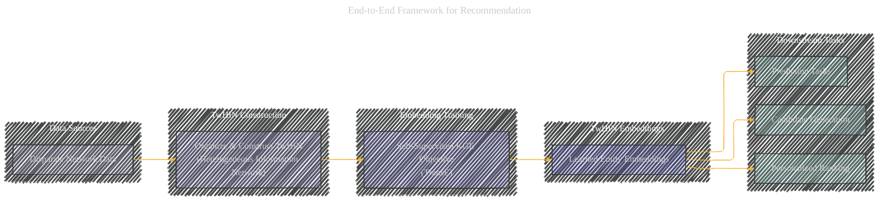
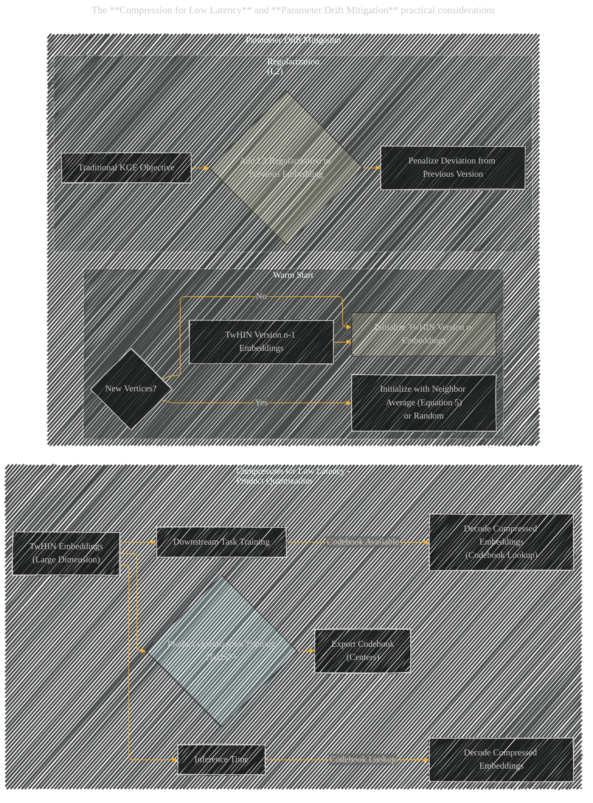

# TwHIN: Embedding the Twitter Heterogeneous Information Network for Personalized Recommendation
> This content is dual-licensed under your choice of the following licenses:
> 1.  **MIT License:** For the code implementations in Swift and Mermaid provided in this document.
> 2.  **Creative Commons Attribution 4.0 International License (CC BY 4.0):** For all other content, including the text, explanations, and the Mermaid diagrams and illustrations.

---

Based on my understanding, I create a series of Mermaid diagrams and illustrations to visually represent the core concepts of the framework from the original white paper at this [link](https://arxiv.org/pdf/2202.05387)

---

Here is a structured breakdown of the paper's content using Mermaid diagrams:

**Explanation of the Mindmap:**

This mind map provides a high-level overview of the entire paper, broken down into key sections and sub-topics. It visually organizes the flow of information from the introduction to the conclusion, highlighting the problem, proposed solution (TwHIN), experimental evaluations, and practical considerations. This format helps to grasp the paper's structure and key arguments at a glance.

---

Next, let's create a diagram to visualize the **Heterogeneous Information Network (HIN) structure** as described in section 3 and illustrated in Figure 2.

```mermaid
erDiagram
    User ||--o{ Tweet : Authors
    User ||--o{ Advertiser : Promotes
    User {
        entity_id UserID PK
        entity_type User
        %%...
    }
    Tweet {
        entity_id TweetID PK
        entity_type Tweet
        text VARCHAR(280)
        %%...
    }
    Advertiser {
        entity_id AdvertiserID PK
        entity_type Advertiser
        name VARCHAR(255)
        %%...
    }
    Ad {
        entity_id AdID PK
        entity_type Ad
        content_type VARCHAR(50)
        %%...
    }
    User ||--o{ User : Follows
    User ||--o{ Tweet : Favorites
    User ||--o{ Tweet : Replies
    User ||--o{ Tweet : Retweets
    User ||--o{ Ad : Clicks
    Advertiser ||--o{ Ad : Promotes
    
```

**Explanation of the ER Diagram (HIN Structure):**

This ER Diagram visualizes the structure of a Heterogeneous Information Network in the context of Twitter (TwHIN).

*   **Entities (Nodes):**  "User", "Tweet", "Advertiser", and "Ad" are represented as entities with their attributes (simplified for clarity). `entity_id` and `entity_type` are key attributes.
*   **Relationships (Edges):** Lines connecting the entities represent relationships. The `||--o{` notation indicates a directed relationship from the first entity to the second, labeled with the relation type (e.g., "Authors", "Follows", "Favorites", "Replies", "Retweets", "Promotes", "Clicks").
*   **Heterogeneity:** The diagram clearly shows different types of entities (User, Tweet, Advertiser, Ad) and different types of relationships between them, illustrating the heterogeneous nature of TwHIN.

This diagram directly corresponds to the conceptual illustration in Figure 2 of the paper and provides a clear and structured view of the TwHIN data model.

---

Now, let's illustrate the **TwHIN Embedding Process** (Section 4.1 and Algorithm 1) using a flowchart:

```mermaid
---
title: "TwHIN Embedding Process"
config:
  layout: elk
  look: handDrawn
  theme: base
---
%%%%%%%% Mermaid version v11.4.1-b.14
%%%%%%%% Available curve styles include the following keywords:
%% basis, bumpX, bumpY, cardinal, catmullRom, linear, monotoneX, monotoneY, natural, step, stepAfter, stepBefore.
%%{
  init: {
    "flowchart": { "htmlLabels": false, 'curve': 'linear' },
    'fontFamily': 'Fantasy',
    'themeVariables': {
      'primaryColor': '#BB28',
      'primaryTextColor': '#299',
      'primaryBorderColor': '#7c2',
      'lineColor': '#F8B229',
      'secondaryColor': '#006100',
      'tertiaryColor': '#fff'
    }
  }
}%%
flowchart TD
    subgraph Data_Preparation["Data Preparation"]
        A["Input HIN:<br>G(V, E, Φ, Ψ)"] --> B{"Triplets (s, r, t) from E"}
    end
    subgraph Embedding_Initialization["Embedding Initialization"]
        C["Initialize Entity &<br>Relation Embeddings<br>(θ)"]
    end
    subgraph Training_Loop_Algorithm_1["Training Loop - Algorithm 1"]
        D["For each epoch"] --> E["For each bucket<br>(i, j)"]
        E --> F{"Load Bucket Bi,j edges to memory"}
        F --> G{"Load Entity Embeddings (θv) for partitions i and j to GPU"}
        G --> H["Train embeddings on edges using Equation 1<br>(TransE Scoring)"]
        H --> I{"Negative Sampling"}
        I --> J["Maximize Negative Sampling Objective (Equation 2) using Adagrad"]
        J --> K["Backpropagation &<br>Update Embeddings<br>(θ)"]
        K --> L["End Bucket Loop"]
        L --> M["End Epoch Loop"]
    end
    subgraph Output
        M --> N["Output:<br>Learned Embeddings<br>(θ)"]
    end
    B --> C
    C --> D
```

**Explanation of the Flowchart (TwHIN Embedding Process):**

This flowchart outlines the steps involved in training TwHIN embeddings using Knowledge Graph Embedding techniques, specifically TransE.

*   **Data Preparation:** Starts with the input Heterogeneous Information Network and extracts triplets (source, relation, target) representing the edges.
*   **Embedding Initialization:**  Initial embeddings (vectors of learnable parameters) are created for all entities and relation types in the HIN.
*   **Training Loop (Algorithm 1):** This is the core embedding learning process, broken down further:
    *   **Epoch and Bucket Iteration:**  The training iterates over epochs and buckets of partitioned edges (due to the large scale).
    *   **Data Loading:** For each bucket, relevant edges and corresponding entity embeddings are loaded into memory and GPU respectively.
    *   **TransE Scoring:**  The TransE scoring function (Equation 1 in the paper) is applied to score triplets.
    *   **Negative Sampling:** Negative samples are generated for each positive triplet to facilitate contrastive learning.
    *   **Objective Maximization:** The negative sampling objective function (Equation 2) is maximized using Adagrad optimizer. This involves differentiating between positive (real) and negative (fake) edges.
    *   **Backpropagation and Update:** Gradients are backpropagated and embeddings ($\theta$) are updated to improve the model.
*   **Output:** The final output is the set of learned embeddings ($\theta$) for entities and relations in the TwHIN.

This diagram clarifies the computational flow and key steps of Algorithm 1 described in the paper, especially emphasizing the large-scale training considerations like bucketing and partitioning via PyTorch-BigGraph.

---

Next, let's visualize the **Inductive Multi-modal Embedding Generation** process (Section 4.4) using a sequence diagram.

**Explanation of the Sequence Diagram (Inductive Multi-modal Embedding Generation):**

This sequence diagram illustrates the post-processing steps to create inductive multi-modal embeddings, addressing the limitations of standard KGE embeddings.

*   **Non-User Entities (T) to K-means Clustering:** The process starts by applying k-means clustering on all non-user entities (Tweets, Ads etc., denoted as 'Targets' or T in the paper).
*   **K-means Clustering to Clusters (C):**  The k-means algorithm generates a set of clusters (C), where each cluster represents a group of similar non-user entities.
*   **User (ui) to Engagement Count:** For a given User (ui), we count their engagements with entities belonging to each cluster in C.
*   **Engagement Count to Probability Distribution P(c|ui):** The engagement counts are used to calculate a probability distribution P(c|ui) for each user over the clusters. Equation 3 in the paper is used for normalization.
*   **Probability Distribution P(c|ui) Normalization:** The counts are normalized to create a proper probability distribution, ensuring the sum of probabilities over clusters equals one.
*   **Probability Distribution P(c|ui) and Clusters (C) to Multi-modal User Embedding:** A multi-modal embedding for the user is constructed as a mixture. This mixture combines the probability distribution P(c|ui) (representing user-cluster engagement weights) with the cluster representations (centroids or medoids of clusters in C).
*   **Multi-modal User Embedding to User (ui):**  Finally, the User (ui) is represented by this multi-modal embedding, which captures multiple aspects of their interests based on engagement with different clusters of non-user entities.

This diagram highlights the steps of clustering, engagement quantification, probability distribution calculation, and the final creation of multi-modal user embeddings. This process allows for capturing complex user behaviors and can be applied inductively to new, unseen entities.

---

Now, let's visualize the **End-to-End Framework for Recommendation** (Figure 3) using a flowchart.

**Explanation of the Flowchart (End-to-End Framework):**

This flowchart illustrates the complete workflow of the TwHIN system for recommendations, from data collection to application in downstream tasks, mirroring Figure 3 from the paper.

*   **Data Sources:** It begins with "Disparate Network Data" representing the various sources of data within Twitter, such as user interactions, follow graphs, content engagements, etc.
*   **TwHIN Construction:**  This data is then organized and processed to construct the TwHIN, the heterogeneous information network that models Twitter's entities and relationships.
*   **Embedding Training:** A self-supervised Knowledge Graph Embedding objective (specifically TransE as described in the paper) is applied to the TwHIN to learn entity embeddings.
*   **TwHIN Embeddings:** The result of the training process are "Learned Entity Embeddings," which capture the structural and relational information from the TwHIN.
*   **Downstream Tasks:** These learned TwHIN embeddings are then utilized in various downstream tasks:
    *   **Candidate Generation:** For retrieving a pool of relevant items.
    *   **Personalized Ranking:** For ranking candidates based on user preferences.
    *   **Prediction Tasks:**  For other predictive tasks like content classification, offensive content detection, etc.

This high-level diagram shows the overall system architecture and data flow, clearly indicating how raw data is transformed into useful embeddings and subsequently used in recommendation and prediction tasks.

---

Finally, let's illustrate the **Compression for Low Latency** and **Parameter Drift Mitigation** practical considerations (Section 7) using a combined diagram.

**Explanation of the Flowchart (Practical Considerations):**

This flowchart illustrates two key practical considerations discussed in Section 7 of the paper: Compression for low latency and Parameter Drift Mitigation.

*   **Compression for Low Latency - Product Quantization:**
    *   **TwHIN Embeddings (Large Dimension):** Starts with the high-dimensional TwHIN embeddings.
    *   **Product Quantization Training (FAISS):** Product Quantization (PQ) is applied as a lossy compression technique, using the FAISS library.
    *   **Export Codebook (Centers):** A "codebook" (set of cluster centers) is generated and exported during PQ training.
    *   **Downstream Task Training & Inference Time:** For both training and inference in downstream tasks, this codebook is used to perform "Codebook Lookup" and "Decode Compressed Embeddings." This effectively uses the compressed embeddings, reducing latency without significant performance loss (as shown in Figure 4).

*   **Parameter Drift Mitigation:** This part illustrates two strategies to address parameter drift when updating TwHIN embeddings over time:
    *   **Warm Start:**
        *   **TwHIN Version n-1 Embeddings:** Embeddings from the previous version of TwHIN are used.
        *   **Initialize TwHIN Version n Embeddings:** These previous embeddings are used to initialize the embeddings for the new version (Version n).
        *   **New Vertices?:** For any new vertices (entities) not present in the previous version, initialization is done either by averaging neighbor embeddings (Equation 5) or randomly.
    *   **Regularization (L2):**
        *   **Traditional KGE Objective:** Standard KGE training objective.
        *   **Add L2 Regularization to Previous Embedding:** An L2 regularization term is added to the objective function to penalize large deviations from embeddings of the previous version.
        *   **Penalize Deviation from Previous Version:** This regularization aims to keep the embeddings stable across versions, mitigating drift.

This combined diagram visualizes the practical techniques employed to make TwHIN embeddings efficient for deployment in online, latency-sensitive systems and to maintain stability across different versions of the embeddings.

---

---
**Licenses:**

- **MIT License:**   - Full text in [LICENSE](LICENSE) file.
- **Creative Commons Attribution 4.0 International:**  - Legal details in [LICENSE-CC-BY](LICENSE-CC-BY) and at [Creative Commons official site](http://creativecommons.org/licenses/by/4.0/).

---