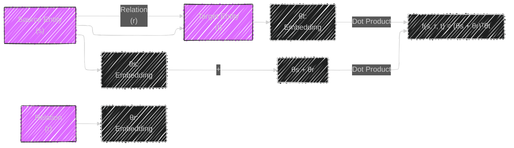
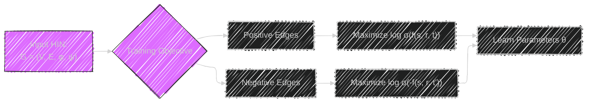
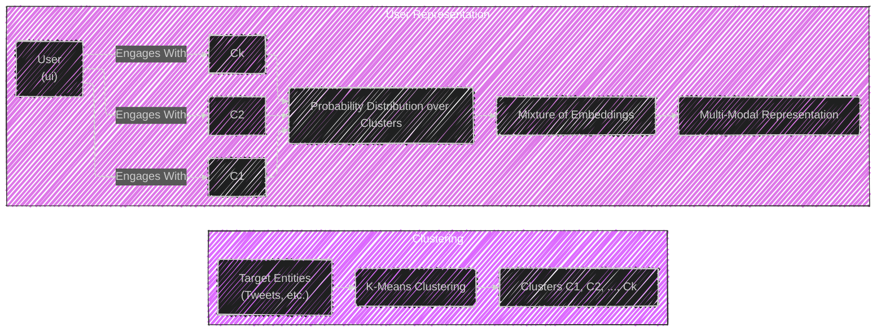
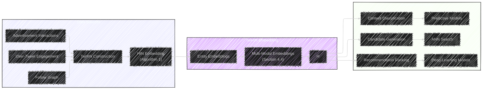
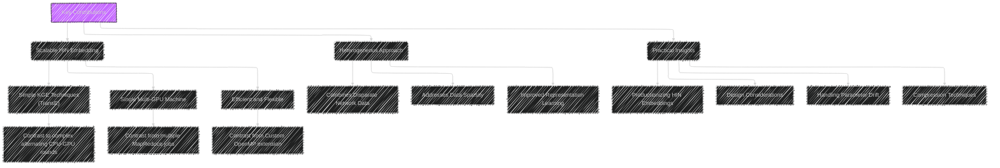

# TwHIN: Embedding the Twitter Heterogeneous Information Network for Personalized Recommendation
> This content is dual-licensed under your choice of the following licenses:
> 1.  **MIT License:** For the code implementations in Swift and Mermaid provided in this document.
> 2.  **Creative Commons Attribution 4.0 International License (CC BY 4.0):** For all other content, including the text, explanations, and the Mermaid diagrams and illustrations.

---

Based on my understanding, I create a series of Mermaid diagrams and illustrations to visually represent the core concepts of the framework from the original white paper at this [link](https://arxiv.org/pdf/2202.05387)

---

Here's a breakdown of the "TwHIN: Embedding the Twitter Heterogeneous Information Network for Personalized Recommendation" paper using Mermaid diagrams and illustrations, presented in Markdown, to capture the technical intricacies:

**Explanation of Diagram and Key Concepts:**

The above Mermaid diagram breaks down the core concepts of the TwHIN whitepaper into smaller, connected sections.

*   **Heterogeneous Information Network (HIN):** TwHIN model's data as a network where nodes and edges represent *different* types of entities, and edges represent all relevant interactions.
*   **Knowledge Graph Embeddings (KGE):** The HIN uses vector representations that capture the relationship between nodes and edges, leveraging the TransE Model is used for simple calculations. *Negative Sampling* is used to optimize the model and create differentiation between actual and "fake" connections.
*    **Computational Considerations:** The size of the Twitter network needs additional steps to be embedded properly. The HIN can be partitioned in buckets by using `PyTorch-Biggraph` to perform embeddings while conserving space, allowing for training on a single GPU.
*   **Inductive Multi-Modal Embeddings:** To address limitations with classical KGE (failing to capture multi-faceted users, and retraining), the HIN can embed *clusters of entities,* using clustering technique as the probability distribution of the engagement of an entity.
*   **Practical Considerations:** *Compression* is used through product quantization for low latency and efficient performance trade-off.
*   **Parameter Drift:** Embeddings need to be updated regularly to accurately represent entities. *Warm start* or *regularization* is used for stability when versioning.

---

## HIN Structure

This diagram visually represents the different entity types (User, Tweet, Advertiser, Ad) and the relationships (Follows, Favorites, Retweets, Replies, Clicks, Promotes, Authors) within the TwHIN.

---

## TransE Model

This diagram illustrates the TransE model's core operation.  It shows how the source entity's embedding is "translated" by the relation embedding, and then a dot product with the target entity's embedding produces a score.

---
## Negative Sampling Objective

This diagram outlines the negative sampling objective.  It shows the contrast between positive (real) edges and negative (sampled) edges, and how the model learns to differentiate between them.

---

## Multi-Modal Embeddings

This diagram explains the process of creating multi-modal embeddings.  It shows how target entities are clustered, and then how a user is represented as a probability distribution over these clusters, reflecting their engagement patterns.

---

## End-to-End Framework

This diagram represents how all entities work together from the raw data, to training and embeddings, to downstream tasks.

## Key Takeaways and Contributions Presented Visually

This diagram summarizes the key takeaways and contributions of with key differences to previous work.

---
**Licenses:**

- **MIT License:**   - Full text in [LICENSE](LICENSE) file.
- **Creative Commons Attribution 4.0 International:**  - Legal details in [LICENSE-CC-BY](LICENSE-CC-BY) and at [Creative Commons official site](http://creativecommons.org/licenses/by/4.0/).

---