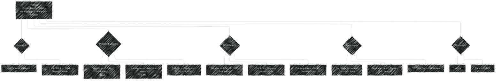
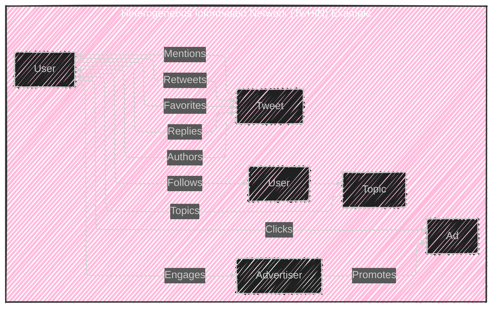
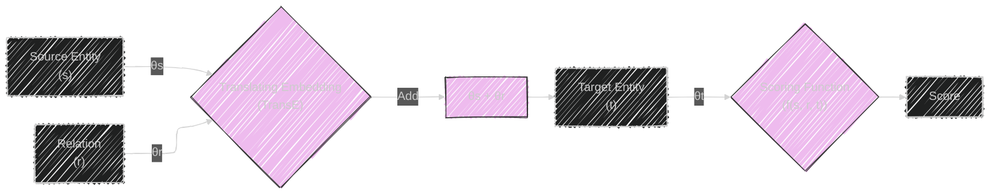
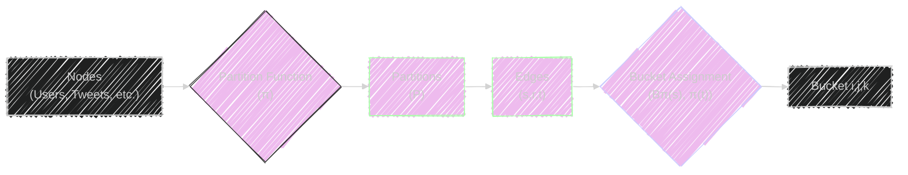
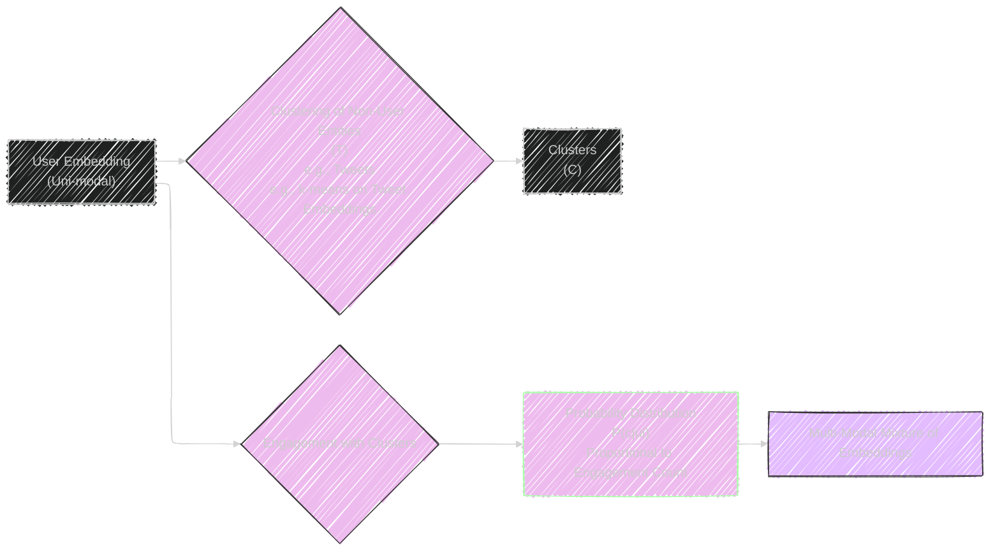
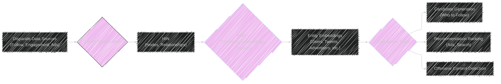
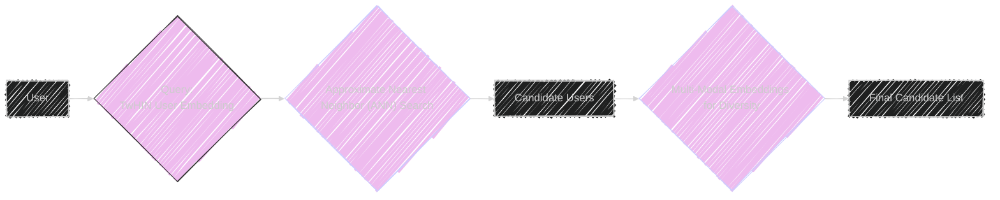
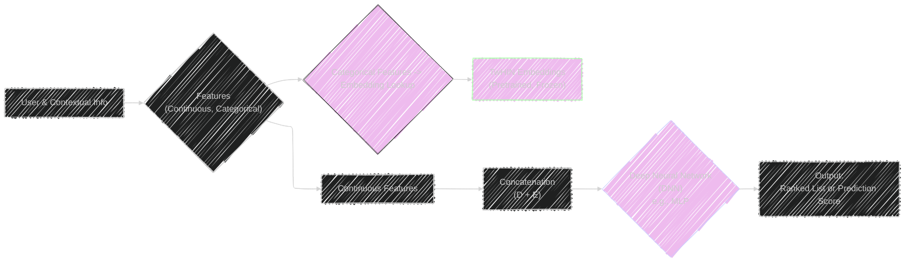
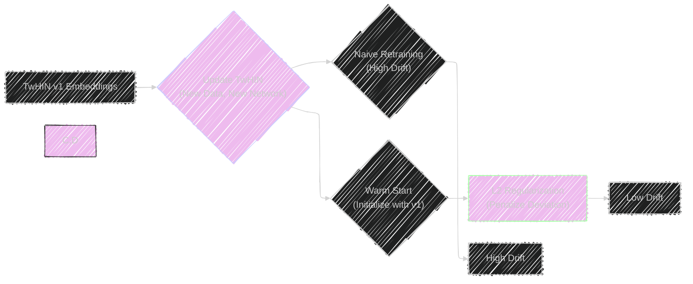

# TwHIN: Embedding the Twitter Heterogeneous Information Network for Personalized Recommendation
> This content is dual-licensed under your choice of the following licenses:
> 1.  **MIT License:** For the code implementations in Swift and Mermaid provided in this document.
> 2.  **Creative Commons Attribution 4.0 International License (CC BY 4.0):** For all other content, including the text, explanations, and the Mermaid diagrams and illustrations.

---

Based on my understanding, I create a series of Mermaid diagrams and illustrations to visually represent the core concepts of the framework from the original white paper at this [link](https://arxiv.org/pdf/2202.05387)

---

## Overview Diagram

**Explanation:** This diagram provides a high-level overview.  It shows the problem being addressed (large-scale data/lack of holistic representation), the proposed solution (KGE on HINs), the key contributions, the applications (where TwHIN is used), and the challenges faced.

## Heterogeneous Information Network (HIN) Diagram

**Explanation:** This diagram visually represents the HIN concept.  It illustrates different entity types (User, Tweet, Advertiser, Ad, Topic) and the various relationship types (Follows, Retweets, Favorites, Replies, Authors, Promotes, Clicks, Topics, Engages) that connect them.  This captures the "heterogeneous" aspect.

## KGE Triplet Scoring Diagram:

**Explanation:**  This diagram describes the core of the KGE approach using TransE. It shows the embedding vectors (θs, θr, θt) for the source, relation, and target entities. The translation step (adding the source and relation embeddings) and the scoring function (e.g., dot product) are visually represented.

## Negative Sampling Objective Diagram

**Explanation:** This diagram explains the negative sampling objective. It outlines the process of scoring positive triplets from the HIN and contrasting them with scores from negative sampled triplets. The log-sigmoid function is applied, and the objective is to maximize the difference between the positive and negative scores.

## PyTorch-BigGraph Partitioning Diagram

**Explanation:** This diagram illustrates how PyTorch-BigGraph handles the scale of the Twitter network. It shows the partitioning of nodes, the assignment of edges to buckets based on the source and target node partitions, and the loading of these buckets for training on GPU.  This shows how the system scales.

## Multi-Modal Embedding Generation

**Explanation:** This diagram outlines the generation of multi-modal embeddings.  It shows how existing embeddings are used with clustering techniques to generate multiple, mixture-based embeddings. This also shows how inductive embedding of new nodes are generated to better represent users with potentially diverse interests.

## End-to-End Framework Diagram

**Explanation:** This diagram summarizes the complete process, from data sources to the final applications. It shows the inputs, the key steps (TwHIN construction, KGE), and the downstream tasks where the embeddings are utilized.

## Candidate Generation Process (Who to Follow)

**Explanation:** This diagram focuses on the "Who to Follow" candidate generation. It demonstrates how the embeddings are used to find similar users, leveraging ANN search and multi-modal mixtures for candidate diversity.

## Recommendation and Prediction Task Diagram

**Explanation:** This diagram demonstrates how the TwHIN embeddings are used as features in recommendation and prediction tasks. It illustrates the DNN model architecture and details the role of the frozen embeddings, which are concatenated with other features and fed into the DNN.

## Compression for Low Latency

**Explanation:**  This diagram provides the compression strategy.  It demonstrates how product quantization is used to compress the embeddings, reducing latency, and how the codebook is utilized during both training and inference. The visual makes this easy to understand.

## Parameter Drift Mitigation

**Explanation:** This diagram illustrates the two methods used to address parameter drift: warm start (initializing the new version with the previous version's embeddings) and L2 regularization (penalizing large deviations).

---
**Licenses:**

- **MIT License:**   - Full text in [LICENSE](LICENSE) file.
- **Creative Commons Attribution 4.0 International:**  - Legal details in [LICENSE-CC-BY](LICENSE-CC-BY) and at [Creative Commons official site](http://creativecommons.org/licenses/by/4.0/).

---